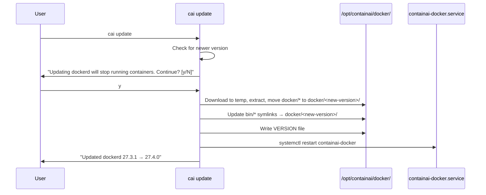

# ContainAI-managed dockerd bundle + update checks

## Overview

Ship a self-contained dockerd binary bundle at `/opt/containai/docker/<version>/` with symlinks from `/opt/containai/bin/` that ContainAI fully controls. The `containai-docker.service` systemd unit always uses the symlinked path—never system Docker or Docker Desktop. Rate-limited pre-command checks warn users about available dockerd bundle updates; `cai update` applies them atomically.

**Why:** Prevents Docker Desktop integration drift, ensures consistent behavior across installations, enables atomic updates with easy rollback, and makes security updates explicit and visible.

## Scope

**In scope:**
- Dockerd bundle download/install in `cai setup` (Linux/WSL2 only)
- Versioned directory structure with symlinks for atomic updates
- Bundle version tracking at `/opt/containai/VERSION`
- Rate-limited update check before every `cai` command (dockerd bundle only, Linux/WSL2 only)
- `cai update` upgrades dockerd bundle when newer exists
- Service restart after bundle update (with container stop warning)
- Systemd unit always references symlinked path with proper PATH env
- Config: `update.check_interval` (hourly/daily/weekly/never)
- Env override: `CAI_UPDATE_CHECK_INTERVAL`

**Out of scope:**
- macOS (uses Lima VM with its own Docker) — update check skipped entirely on macOS
- Fallback to `/usr/bin/dockerd`
- Modifying `docker.service` or `/usr/bin/docker`
- Auto-cron/systemd timers for updates
- ContainAI self-update (git-based update already exists in version.sh)

## Architecture

```
/opt/containai/
├── docker/
│   ├── 27.3.1/                    # Previous version (kept for rollback)
│   │   ├── dockerd
│   │   ├── docker
│   │   ├── containerd
│   │   ├── containerd-shim-runc-v2
│   │   ├── docker-init
│   │   ├── docker-proxy
│   │   ├── runc
│   │   └── ctr
│   └── 27.4.0/                    # Current version
│       ├── dockerd
│       ├── docker
│       ├── containerd
│       └── ...
├── bin/                           # Stable symlinks (systemd uses these)
│   ├── dockerd -> ../docker/27.4.0/dockerd
│   ├── docker -> ../docker/27.4.0/docker
│   ├── containerd -> ../docker/27.4.0/containerd
│   └── ...
└── VERSION                        # Contains "27.4.0"
```

**Note:** Docker static tarballs extract as `docker/` subdirectory. Install process must: extract to temp → move `temp/docker/*` to `/opt/containai/docker/<version>/`.

```
┌─────────────────────────────────────────────────────────────┐
│                      cai command                            │
│  ┌──────────────────────────────────────────────────────┐   │
│  │ _cai_update_check() - rate-limited, non-blocking     │   │
│  │  • Skip if macOS or bundle not installed             │   │
│  │  • Check mtime of ~/.cache/containai/update-check    │   │
│  │  • If interval elapsed:                              │   │
│  │    - Check Docker index for dockerd bundle           │   │
│  │  • Warn (yellow) if updates available                │   │
│  │  • For dockerd: warn that update will restart        │   │
│  │    containers                                        │   │
│  │  • Never block command execution                     │   │
│  └──────────────────────────────────────────────────────┘   │
└─────────────────────────────────────────────────────────────┘

┌─────────────────────────────────────────────────────────────┐
│           containai-docker.service (systemd)                │
│  Environment=PATH=/opt/containai/bin:/usr/local/sbin:...   │
│  ExecStart=/opt/containai/bin/dockerd \                     │
│            --config-file=/etc/containai/docker/daemon.json  │
└─────────────────────────────────────────────────────────────┘
```

### Atomic Update Flow



## Approach

### 1. Bundle constants (docker.sh)
Add path constants following existing pattern at `src/lib/docker.sh:306-317`:
- `_CAI_CONTAINAI_DIR="/opt/containai"`
- `_CAI_DOCKERD_BUNDLE_DIR="$_CAI_CONTAINAI_DIR/docker"` (versioned subdirs)
- `_CAI_DOCKERD_BIN_DIR="$_CAI_CONTAINAI_DIR/bin"` (stable symlinks)
- `_CAI_DOCKERD_BIN="$_CAI_DOCKERD_BIN_DIR/dockerd"`
- `_CAI_DOCKERD_VERSION_FILE="$_CAI_CONTAINAI_DIR/VERSION"`

### 2. Bundle installation (setup.sh)
Follow download pattern at `src/lib/setup.sh:557-601`:
- **Prerequisite:** Ensure `wget` available (already ensured for Sysbox install)
- Resolve latest version by parsing Docker index HTML
- Download `docker-<version>.tgz` with `wget -q --connect-timeout=5 --timeout=120`
- **Extraction:** Extract to temp dir → move `temp/docker/*` to `/opt/containai/docker/<version>/` (Docker tarballs have `docker/` subdir)
- **Note:** Docker does NOT provide official checksums—trust HTTPS only (documented gap)
- Create symlinks in `/opt/containai/bin/` pointing to versioned binaries
- Write version to `/opt/containai/VERSION`

**Preflight change:** Remove requirement for system `dockerd` (`command -v dockerd`) from `_cai_setup_linux()` preflight. The bundle provides `dockerd`.

**Systemd unit:** Update both `setup.sh` AND `update.sh` to use shared unit template referencing `$_CAI_DOCKERD_BIN` with `Environment=PATH=/opt/containai/bin:$PATH`.

### 3. Update check (update.sh)
- **Platform guard:** Return early on macOS or when `_cai_dockerd_bundle_installed` returns false
- **Config discovery:** Use `_containai_find_config "$PWD"` with XDG fallback; default to "daily" on missing/parse error
- Read `update.check_interval` from config via `parse-toml.py` wrapper
- **Rate-limit state:** Use file mtime at `~/.cache/containai/update-check` (NOT config.toml)
  - Touch file after each check
  - Compare mtime to current epoch for interval check
  - Store last result as file content (ok/network_error/parse_error)
- Honor `CAI_UPDATE_CHECK_INTERVAL` env override
- Use epoch seconds for all timestamp comparisons (portable)
- Non-blocking: 5s connect timeout, touch state file on network error (don't re-check immediately)
- **Scope:** Check dockerd bundle version only (ContainAI updates handled by existing git mechanism)
- **For dockerd updates:** warn that containers will be stopped/restarted

### 4. Bundle update (update.sh)
- **Integration:** Call `_cai_update_dockerd_bundle` from `_cai_update_linux_wsl2()` after context/unit updates
- Download new version to temp dir
- Extract and move to `/opt/containai/docker/<new-version>/`
- Prompt user: "Updating dockerd will stop running containers. Continue? [y/N]" (skip with --force)
- Update symlinks atomically (ln -sfn)
- Write new VERSION
- Restart containai-docker.service
- Keep previous version for rollback (cleanup old versions on next update)

**Critical:** Update `_cai_update_expected_unit_content()` in update.sh to match new ExecStart path. Both setup.sh and update.sh must generate identical unit content.

### 5. Systemd unit update
Create shared unit template (or ensure both setup.sh and update.sh use identical content):
- `ExecStart=/opt/containai/bin/dockerd --config-file=/etc/containai/docker/daemon.json`
- `Environment=PATH=/opt/containai/bin:/usr/local/sbin:/usr/local/bin:/usr/sbin:/usr/bin:/sbin:/bin`
- This ensures bundled containerd, runc, docker-init, docker-proxy are used

## Risks & Mitigations

| Risk | Mitigation |
|------|------------|
| No official Docker checksums | Trust HTTPS; document limitation; consider self-hosting checksums later |
| Network failures block CLI | Non-blocking check with short timeout; touch state file on error |
| Running containers during update | Warn user, require confirmation, restart service after symlink update |
| Partial download corruption | Download to temp, verify tarball extracts successfully, atomic move to versioned dir |
| Clock skew breaks rate limit | Use file mtime comparison (filesystem handles time) |
| macOS confusion | Skip bundle and update check entirely on macOS; use Lima VM's Docker |
| Symlink update race | Use `ln -sfn` for atomic symlink replacement |
| Disk space from old versions | Keep only previous version; cleanup older on next update |
| Tarball structure mismatch | Extract to temp, move docker/* contents (not docker/ dir itself) |
| Unit content drift between setup/update | Shared template or verify identical output |
| Update check on non-bundle systems | Guard with platform check and `_cai_dockerd_bundle_installed` |

## Quick commands

```bash
# Verify bundle installed
ls -la /opt/containai/bin/dockerd
readlink /opt/containai/bin/dockerd  # Shows versioned path
cat /opt/containai/VERSION

# Check systemd unit uses symlinked path
grep ExecStart /etc/systemd/system/containai-docker.service
grep Environment /etc/systemd/system/containai-docker.service  # Should have PATH

# Test update check
CAI_UPDATE_CHECK_INTERVAL=hourly cai doctor

# Force update (will restart containers)
cai update --force
```

## Acceptance

- [ ] `cai setup` installs dockerd bundle to `/opt/containai/docker/<version>/` on Linux/WSL2
- [ ] Setup no longer requires system `dockerd` to be installed
- [ ] Symlinks created in `/opt/containai/bin/` pointing to versioned binaries
- [ ] `/opt/containai/VERSION` contains installed version string
- [ ] `containai-docker.service` ExecStart uses `/opt/containai/bin/dockerd`
- [ ] `containai-docker.service` has `Environment=PATH=/opt/containai/bin:...`
- [ ] Pre-command update check runs (rate-limited by mtime)
- [ ] Update check skipped on macOS
- [ ] Update check skipped when bundle not installed
- [ ] Rate-limit state stored in `~/.cache/containai/update-check` (not config.toml)
- [ ] Yellow warning displayed when dockerd updates available
- [ ] **Dockerd update warning includes "will stop running containers"**
- [ ] `cai update` calls `_cai_update_dockerd_bundle` in Linux/WSL2 update flow
- [ ] `cai update` prompts before updating dockerd (unless --force)
- [ ] `cai update` restarts containai-docker.service after bundle update
- [ ] Network failures don't block CLI commands
- [ ] `CAI_UPDATE_CHECK_INTERVAL=never` disables checks
- [ ] macOS skips bundle (uses Lima VM)
- [ ] Previous version kept for potential rollback
- [ ] `update.sh` expected unit content matches `setup.sh` generated content
- [ ] docs/setup-guide.md updated with bundle section
- [ ] docs/configuration.md updated with update.check_interval and CAI_UPDATE_CHECK_INTERVAL
- [ ] docs/troubleshooting.md has "Updates available" entry

## Test notes

- Integration test: `test-bundle-install.sh` - fresh setup, verify paths and symlinks
- Integration test: `test-update-check.sh` - mock responses, verify rate limiting via mtime
- Integration test: `test-bundle-update.sh` - verify atomic symlink update and service restart
- Manual: Run `cai doctor` twice within interval, confirm no duplicate check
- Manual: Disconnect network, run `cai` command, confirm no block
- Manual: Run `cai update` with containers running, verify warning
- Manual: Run on macOS, confirm update check is skipped

## References

- Existing docker constants: `src/lib/docker.sh:306-317`
- Systemd unit creation: `src/lib/setup.sh:970-1048`
- Expected unit content: `src/lib/update.sh:_cai_update_expected_unit_content()`
- Config parsing: `src/lib/config.sh:225-561`
- Config discovery: `_containai_find_config()`
- TOML parser: `src/parse-toml.py`
- Arch detection: `src/lib/setup.sh:528-542`
- Timeout wrapper: `src/lib/docker.sh:49-97`
- Docker static index: https://download.docker.com/linux/static/stable/
- moby/moby#47495: Docker doesn't provide official checksums
- Atomic symlink: `ln -sfn` creates symlink atomically

## Open questions

1. **Checksum verification**: Since Docker doesn't provide checksums, should we maintain our own or accept HTTPS-only? (Current decision: trust HTTPS, document limitation)
2. **Version retention**: Keep only previous version, or allow configurable retention? (Current decision: keep only previous)

## Dependencies

- **fn-14-nm0** (DONE): Provides isolated docker service infrastructure
- **fn-12-css** (soft): Config management for update interval storage
