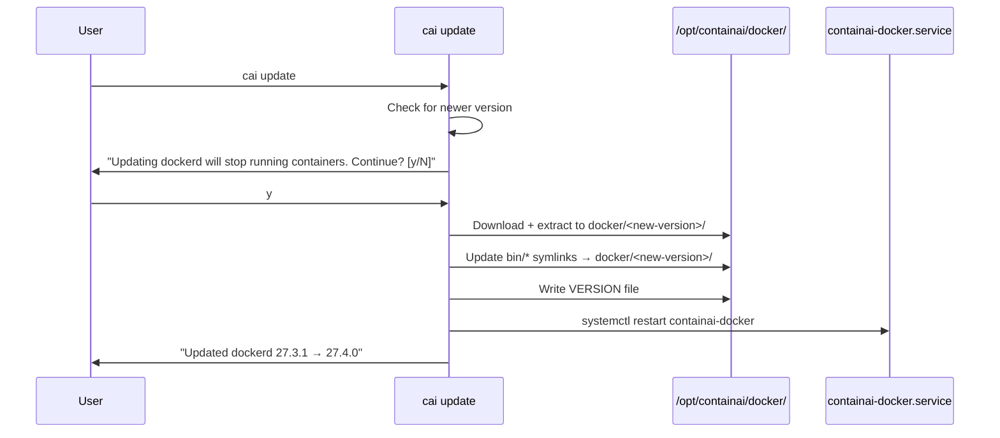

# ContainAI-managed dockerd bundle + update checks

## Overview

Ship a self-contained dockerd binary bundle at `/opt/containai/docker/<version>/` with symlinks from `/opt/containai/bin/` that ContainAI fully controls. The `containai-docker.service` systemd unit always uses the symlinked path—never system Docker or Docker Desktop. Rate-limited pre-command checks warn users about available updates; `cai update` applies them atomically.

**Why:** Prevents Docker Desktop integration drift, ensures consistent behavior across installations, enables atomic updates with easy rollback, and makes security updates explicit and visible.

## Scope

**In scope:**
- Dockerd bundle download/install in `cai setup` (Linux/WSL2 only)
- Versioned directory structure with symlinks for atomic updates
- Bundle version tracking at `/opt/containai/VERSION`
- Rate-limited update check before every `cai` command
- `cai update` upgrades dockerd bundle when newer exists
- Service restart after bundle update (with container stop warning)
- Systemd unit always references symlinked path
- Config: `update.check_interval` (hourly/daily/weekly/never)
- Env override: `CAI_UPDATE_CHECK_INTERVAL`

**Out of scope:**
- macOS (uses Lima VM with its own Docker)
- Fallback to `/usr/bin/dockerd`
- Modifying `docker.service` or `/usr/bin/docker`
- Auto-cron/systemd timers for updates

## Architecture

```
/opt/containai/
├── docker/
│   ├── 27.3.1/                    # Previous version (kept for rollback)
│   │   ├── dockerd
│   │   ├── docker
│   │   ├── containerd
│   │   └── ...
│   └── 27.4.0/                    # Current version
│       ├── dockerd
│       ├── docker
│       ├── containerd
│       └── ...
├── bin/                           # Stable symlinks (systemd uses these)
│   ├── dockerd -> ../docker/27.4.0/dockerd
│   ├── docker -> ../docker/27.4.0/docker
│   ├── containerd -> ../docker/27.4.0/containerd
│   └── ...
└── VERSION                        # Contains "27.4.0"
```

```
┌─────────────────────────────────────────────────────────────┐
│                      cai command                            │
│  ┌──────────────────────────────────────────────────────┐   │
│  │ _cai_update_check() - rate-limited, non-blocking     │   │
│  │  • Read ~/.config/containai/config.toml              │   │
│  │  • If interval elapsed:                              │   │
│  │    - Check GitHub releases for ContainAI             │   │
│  │    - Check Docker index for dockerd bundle           │   │
│  │  • Warn (yellow) if updates available                │   │
│  │  • For dockerd: warn that update will restart        │   │
│  │    containers                                        │   │
│  │  • Never block command execution                     │   │
│  └──────────────────────────────────────────────────────┘   │
└─────────────────────────────────────────────────────────────┘

┌─────────────────────────────────────────────────────────────┐
│           containai-docker.service (systemd)                │
│  ExecStart=/opt/containai/bin/dockerd \                     │
│            --config-file=/etc/containai/docker/daemon.json  │
│  Environment=PATH=/opt/containai/bin:...                    │
└─────────────────────────────────────────────────────────────┘
```

### Atomic Update Flow



## Approach

### 1. Bundle constants (docker.sh)
Add path constants following existing pattern at `src/lib/docker.sh:306-317`:
- `_CAI_CONTAINAI_DIR="/opt/containai"`
- `_CAI_DOCKERD_BUNDLE_DIR="$_CAI_CONTAINAI_DIR/docker"`
- `_CAI_DOCKERD_BIN_DIR="$_CAI_CONTAINAI_DIR/bin"`
- `_CAI_DOCKERD_BIN="$_CAI_DOCKERD_BIN_DIR/dockerd"`
- `_CAI_DOCKERD_VERSION_FILE="$_CAI_CONTAINAI_DIR/VERSION"`

### 2. Bundle installation (setup.sh)
Follow download pattern at `src/lib/setup.sh:557-601`:
- Resolve latest version by parsing Docker index HTML
- Download `docker-<version>.tgz` with `curl -fsSL --connect-timeout 5 --max-time 120`
- **Note:** Docker does NOT provide official checksums—trust HTTPS only (documented gap)
- Extract to `/opt/containai/docker/<version>/`
- Create symlinks in `/opt/containai/bin/` pointing to versioned binaries
- Write version to `/opt/containai/VERSION`

### 3. Update check (update.sh)
- Parse config with existing `_containai_parse_config()` at `src/lib/config.sh:225-561`
- Store state in `~/.config/containai/config.toml`:
  - `update.last_checked` (RFC3339)
  - `update.last_result` (ok/network_error/parse_error)
- Use file mtime comparison for rate limiting (see practice-scout findings)
- Non-blocking: 5s connect timeout, advance timestamp on network error
- **For dockerd updates:** warn that containers will be stopped/restarted

### 4. Bundle update (update.sh)
- Download new version to `/opt/containai/docker/<new-version>/`
- Prompt user: "Updating dockerd will stop running containers. Continue? [y/N]"
- Update symlinks atomically (ln -sfn)
- Write new VERSION
- Restart containai-docker.service
- Keep previous version for rollback (cleanup old versions on next update)

### 5. Systemd unit update
Modify `_cai_create_isolated_docker_service()` at `src/lib/setup.sh:970-1048` to use `$_CAI_DOCKERD_BIN` (symlinked path).

## Risks & Mitigations

| Risk | Mitigation |
|------|------------|
| No official Docker checksums | Trust HTTPS; document limitation; consider self-hosting checksums later |
| Network failures block CLI | Non-blocking check with short timeout; advance timestamp on error |
| Running containers during update | Warn user, require confirmation, restart service after symlink update |
| Partial download corruption | Download to temp, verify size, atomic move to versioned dir |
| Clock skew breaks rate limit | Use epoch seconds, not formatted timestamps |
| macOS confusion | Skip bundle entirely on macOS; use Lima VM's Docker |
| Symlink update race | Use `ln -sfn` for atomic symlink replacement |
| Disk space from old versions | Keep only previous version; cleanup older on next update |

## Quick commands

```bash
# Verify bundle installed
ls -la /opt/containai/bin/dockerd
readlink /opt/containai/bin/dockerd  # Shows versioned path
cat /opt/containai/VERSION

# Check systemd unit uses symlinked path
grep ExecStart /etc/systemd/system/containai-docker.service

# Test update check
CAI_UPDATE_CHECK_INTERVAL=hourly cai doctor

# Force update (will restart containers)
cai update --force
```

## Acceptance

- [ ] `cai setup` installs dockerd bundle to `/opt/containai/docker/<version>/` on Linux/WSL2
- [ ] Symlinks created in `/opt/containai/bin/` pointing to versioned binaries
- [ ] `/opt/containai/VERSION` contains installed version string
- [ ] `containai-docker.service` ExecStart uses `/opt/containai/bin/dockerd`
- [ ] Pre-command update check runs (rate-limited by config)
- [ ] Yellow warning displayed when updates available
- [ ] **Dockerd update warning includes "will stop running containers"**
- [ ] `cai update` prompts before updating dockerd (unless --force)
- [ ] `cai update` restarts containai-docker.service after bundle update
- [ ] Network failures don't block CLI commands
- [ ] `CAI_UPDATE_CHECK_INTERVAL=never` disables checks
- [ ] macOS skips bundle (uses Lima VM)
- [ ] Previous version kept for potential rollback
- [ ] docs/setup-guide.md updated with bundle section
- [ ] docs/troubleshooting.md has "Updates available" entry

## Test notes

- Integration test: `test-bundle-install.sh` - fresh setup, verify paths and symlinks
- Integration test: `test-update-check.sh` - mock responses, verify rate limiting
- Integration test: `test-bundle-update.sh` - verify atomic symlink update and service restart
- Manual: Run `cai doctor` twice within interval, confirm no duplicate check
- Manual: Disconnect network, run `cai` command, confirm no block
- Manual: Run `cai update` with containers running, verify warning

## References

- Existing docker constants: `src/lib/docker.sh:306-317`
- Systemd unit creation: `src/lib/setup.sh:970-1048`
- Config parsing: `src/lib/config.sh:225-561`
- Arch detection: `src/lib/setup.sh:528-542`
- Timeout wrapper: `src/lib/docker.sh:49-97`
- Docker static index: https://download.docker.com/linux/static/stable/
- GitHub releases API: https://api.github.com/repos/OWNER/REPO/releases/latest
- moby/moby#47495: Docker doesn't provide official checksums
- Atomic symlink: `ln -sfn` creates symlink atomically

## Open questions

1. **Checksum verification**: Since Docker doesn't provide checksums, should we maintain our own or accept HTTPS-only? (Current decision: trust HTTPS, document limitation)
2. **Bundle vs ContainAI updates**: Should `cai update` report both separately or combined? (Spec: report both with separate lines)
3. **Version retention**: Keep only previous version, or allow configurable retention? (Current decision: keep only previous)

## Dependencies

- **fn-14-nm0** (DONE): Provides isolated docker service infrastructure
- **fn-12-css** (soft): Config management for update interval storage
