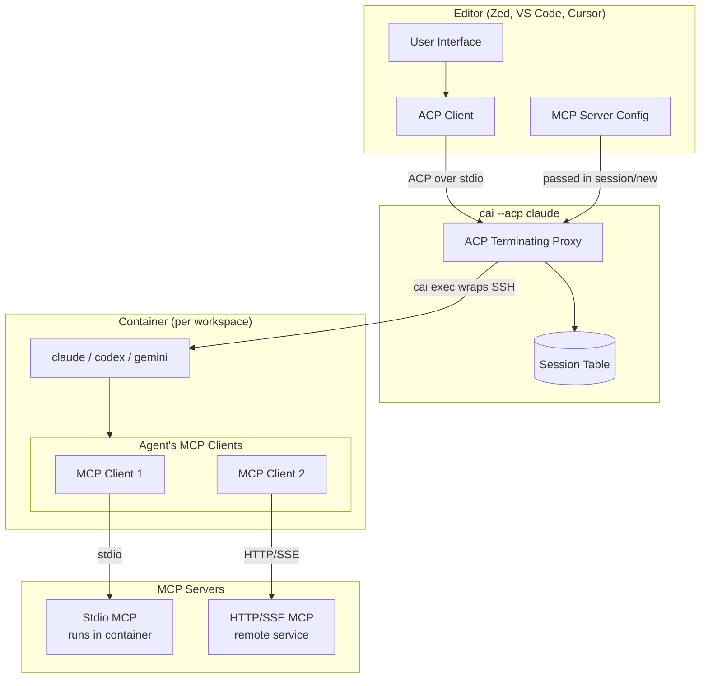

# Epic: Agent Client Protocol (ACP) Integration

## Summary

Add `cai --acp <agent>` command that editors configure as their ACP executable. This is a terminating proxy that:
1. Handles ACP handshake with the editor
2. Supports multiple simultaneous sessions (each with own container/agent)
3. Routes each session to the appropriate container based on workspace root (normalized from `cwd`)
4. Passes MCP server config through to the agent (agent handles MCP)

## Understanding the Protocol Stack



### Protocol Roles

| Component             | Role                  | Protocol                                |
|-----------------------|-----------------------|-----------------------------------------|
| Editor                | ACP Client            | Sends prompts, receives updates         |
| cai --acp             | ACP Proxy             | Routes sessions to containers           |
| Agent (claude, codex) | ACP Server + MCP Host | Handles prompts, spawns/connects to MCP |
| MCP Servers           | MCP Servers           | Provide tools, resources, context       |

**Key insight**: The **agent is the MCP client**. It spawns stdio MCP servers and connects to HTTP/SSE servers. We just pass the config through.

## ACP Message Framing

**Critical specification**: ACP uses **newline-delimited JSON** (NDJSON) framing, not `Content-Length` headers.

- Each JSON-RPC message is a single line terminated by `\n`
- Messages MUST NOT contain embedded newlines (JSON must be compact)
- Reader: `StreamReader.ReadLineAsync()` or equivalent
- Writer: Write JSON + `\n`, flush immediately

This is distinct from LSP which uses `Content-Length` headers. The proxy MUST implement NDJSON framing consistently for both editor and agent connections.

## CLI Integration

### Entry Point in containai.sh

`--acp` MUST be handled as a first-class entry point in `containai()` function:

```bash
containai() {
    # CRITICAL: --acp must be detected BEFORE update checks to avoid stdout pollution
    if [[ "${1:-}" == "--acp" ]]; then
        shift
        _containai_acp_proxy "$@"
        return $?
    fi

    # Normal flow continues...
    _cai_update_check
    # ...
}
```

### Update Check Guard

Add guard to `_cai_update_check` function:

```bash
_cai_update_check() {
    # Skip if explicitly disabled (used by ACP proxy for stdout purity)
    if [[ "${CAI_NO_UPDATE_CHECK:-}" == "1" ]]; then
        return 0
    fi
    # ... existing logic
}
```

**Stdout purity requirement**: When running in ACP mode:
- ALL diagnostic output MUST go to stderr
- stdout is EXCLUSIVELY for ACP protocol messages
- Update checks, warnings, info messages → stderr only
- Set `CAI_NO_UPDATE_CHECK=1` when spawning child processes

### Bash Wrapper and Binary Location

The proxy binary is located in `src/bin/` to avoid conflicts with source directories:

```bash
_containai_acp_proxy() {
    local agent="${1:-claude}"

    # Validate agent (or allow test mode)
    if [[ "${CAI_ACP_TEST_MODE:-}" == "1" ]]; then
        : # Allow any agent in test mode
    else
        case "$agent" in
            claude|gemini) ;;
            *)
                echo "Unsupported agent: $agent" >&2
                return 1
                ;;
        esac
    fi

    # Binary location: src/bin/acp-proxy (avoids conflict with src/acp-proxy/ source dir)
    local proxy_bin="${_CAI_SCRIPT_DIR}/bin/acp-proxy"

    # Must be a regular file and executable
    if [[ ! -f "$proxy_bin" || ! -x "$proxy_bin" ]]; then
        echo "ACP proxy binary not found at $proxy_bin. Run 'cai update' to install." >&2
        return 1
    fi

    exec "$proxy_bin" "$agent"
}
```

**Directory layout**:
```
src/
├── containai.sh           # Main CLI
├── lib/                   # Shell libraries
├── bin/                   # Native binaries (NEW)
│   └── acp-proxy          # ACP proxy binary
└── acp-proxy/             # ACP proxy source code
    ├── Program.cs
    └── ...
```

## Test Mode

For integration testing, the proxy supports a test mode that bypasses container spawning:

```bash
# Environment variables for testing:
CAI_ACP_TEST_MODE=1          # Allow any agent name
CAI_ACP_DIRECT_SPAWN=1       # Spawn agent directly instead of via cai exec
```

When `CAI_ACP_DIRECT_SPAWN=1`:
- Proxy spawns `<agent> --acp` directly as subprocess
- No container, no SSH, no `cai exec`
- Used for testing with mock-acp-server

## Container Management Strategy

### Use `cai exec` as Transport

**Do NOT reimplement container discovery/creation in the proxy.** Instead, spawn `cai exec` as a subprocess for each session:

```csharp
Process SpawnAgentProcess(string workspace, string agent) {
    // Check for direct spawn mode (testing)
    if (Environment.GetEnvironmentVariable("CAI_ACP_DIRECT_SPAWN") == "1") {
        return SpawnDirectProcess(agent);
    }

    var psi = new ProcessStartInfo {
        FileName = "cai",
        Arguments = $"exec --workspace \"{workspace}\" --quiet -- {agent} --acp",
        RedirectStandardInput = true,
        RedirectStandardOutput = true,
        RedirectStandardError = true,
        UseShellExecute = false,
        CreateNoWindow = true,
    };

    // Prevent update checks from polluting stdout
    psi.Environment["CAI_NO_UPDATE_CHECK"] = "1";

    return Process.Start(psi);
}

Process SpawnDirectProcess(string agent) {
    var psi = new ProcessStartInfo {
        FileName = agent,
        Arguments = "--acp",
        RedirectStandardInput = true,
        RedirectStandardOutput = true,
        RedirectStandardError = true,
        UseShellExecute = false,
        CreateNoWindow = true,
    };
    return Process.Start(psi);
}
```

This approach:
- Reuses ALL existing container logic (context selection, FR-4 validation, SSH setup)
- Respects workspace state and configuration
- Handles container creation automatically
- Works with any Docker context configured

### Workspace Resolution

Editors may send subdirectory paths in `cwd`. The proxy MUST normalize to workspace root:

```csharp
string ResolveWorkspaceRoot(string cwd) {
    // Strategy (in order):
    // 1. Find nearest .git root
    // 2. Find nearest .containai/config.toml (per src/lib/config.sh)
    // 3. Use cwd as-is

    var result = await RunAsync("git", "-C", cwd, "rev-parse", "--show-toplevel");
    if (result.ExitCode == 0) {
        return result.Stdout.Trim();
    }

    // Walk up looking for .containai/config.toml
    var dir = new DirectoryInfo(cwd);
    while (dir != null) {
        var configPath = Path.Combine(dir.FullName, ".containai", "config.toml");
        if (File.Exists(configPath)) {
            return dir.FullName;
        }
        dir = dir.Parent;
    }

    return cwd;
}
```

Multiple `session/new` requests with `cwd` values in the same workspace tree MUST map to the same container.

## Session Management

### Session ID Namespacing

**Critical**: Agent session IDs are not globally unique. The proxy MUST namespace them:

```csharp
class Session {
    public string ProxySessionId { get; }      // UUID, globally unique
    public string AgentSessionId { get; set; } // From agent, may collide
    public string Workspace { get; }
    public Process AgentProcess { get; }
}

// On session/new response from agent:
session.AgentSessionId = agentResponse.SessionId;
// Return to editor with proxy ID:
editorResponse.SessionId = session.ProxySessionId;

// On editor request with sessionId:
var session = _sessions[editorSessionId];  // Uses ProxySessionId
// Forward to agent with agent's ID:
request.SessionId = session.AgentSessionId;
```

### Concurrency and Output Serialization

**Critical**: Multiple agent reader tasks write to single stdout. Without serialization, output corrupts:

```csharp
class OutputWriter {
    private readonly Channel<JsonRpcMessage> _channel =
        Channel.CreateUnbounded<JsonRpcMessage>();
    private readonly Stream _stdout;

    public async Task EnqueueAsync(JsonRpcMessage msg) {
        await _channel.Writer.WriteAsync(msg);
    }

    public async Task RunAsync(CancellationToken ct) {
        await foreach (var msg in _channel.Reader.ReadAllAsync(ct)) {
            // Single writer - no interleaving possible
            await WriteNdjsonAsync(_stdout, msg);
        }
    }
}

// Each session reader enqueues:
await _outputWriter.EnqueueAsync(agentResponse);
```

## MCP Server Handling

### How It Works

1. Editor passes `mcpServers` config in `session/new`
2. We forward config to agent in container
3. Agent spawns/connects to MCP servers
4. For stdio servers: agent spawns them **in the container**
5. For HTTP/SSE servers: agent connects **from the container**

### Path Translation

Path translation MUST be path-aware and only apply to absolute paths:

```csharp
string[] TranslateMcpArgs(string[] args, string hostWorkspace) {
    var containerPath = "/home/agent/workspace";
    var normalizedWorkspace = Path.GetFullPath(hostWorkspace).TrimEnd(Path.DirectorySeparatorChar);

    return args.Select(arg => {
        // Only translate absolute paths
        if (!Path.IsPathRooted(arg)) {
            return arg;
        }

        // Normalize the arg
        string normalizedArg;
        try {
            normalizedArg = Path.GetFullPath(arg).TrimEnd(Path.DirectorySeparatorChar);
        } catch {
            return arg; // Invalid path format
        }

        // Exact match
        if (normalizedArg == normalizedWorkspace) {
            return containerPath;
        }

        // Descendant match
        var prefix = normalizedWorkspace + Path.DirectorySeparatorChar;
        if (normalizedArg.StartsWith(prefix)) {
            var relative = normalizedArg.Substring(prefix.Length);
            return containerPath + "/" + relative.Replace(Path.DirectorySeparatorChar, '/');
        }

        // Not a workspace path
        return arg;
    }).ToArray();
}
```

Note: Container creates workspace symlink via `CAI_HOST_WORKSPACE`, so many paths work without translation. Translation is a safety net for edge cases.

### host.docker.internal on Linux

**Out of scope for this epic**: Adding `--add-host=host.docker.internal:host-gateway` to container creation is a separate concern (container security review needed).

**For now**: Document that host-local HTTP/SSE MCP servers require the user to configure their container with `--add-host` manually, or use remote URLs that are reachable from the container.

## Session Lifecycle

### Clean Shutdown

```csharp
async Task HandleSessionEndAsync(string sessionId) {
    if (!_sessions.TryRemove(sessionId, out var session))
        return;

    // Forward session/end to agent
    await WriteRequestAsync(session.AgentProcess.StandardInput,
        new SessionEndRequest { SessionId = session.AgentSessionId });

    // Wait for agent to acknowledge (with timeout)
    using var cts = new CancellationTokenSource(TimeSpan.FromSeconds(5));
    try {
        await session.ReaderTask.WaitAsync(cts.Token);
    } catch (OperationCanceledException) {
        // Agent didn't respond in time
    }

    // Terminate process
    session.AgentProcess.Kill();
    session.AgentProcess.Dispose();
}

async Task HandleStdinEofAsync() {
    // Editor closed connection - end all sessions
    foreach (var session in _sessions.Values.ToList()) {
        await HandleSessionEndAsync(session.ProxySessionId);
    }
}
```

## Editor Configuration

### Zed
```json
{
  "agent_servers": {
    "claude-sandbox": {
      "type": "custom",
      "command": "cai",
      "args": ["--acp", "claude"]
    }
  }
}
```

### VS Code
```json
{
  "acp.executable": "cai",
  "acp.args": ["--acp", "claude"]
}
```

## Supported Agents

Initially supporting agents that are already mapped in `src/lib/container.sh`:

| Agent | Command | Image Tag |
|-------|---------|-----------|
| Claude Code | `cai --acp claude` | (default/claude) |
| Gemini CLI | `cai --acp gemini` | gemini |

`codex` support can be added in a future epic when image mapping is implemented.

## Acceptance Criteria

1. [ ] `--acp` is a first-class entry point in `containai()`, before update checks
2. [ ] `CAI_NO_UPDATE_CHECK=1` guard added to `_cai_update_check`
3. [ ] Native binary compiles and installs to `${_CAI_SCRIPT_DIR}/bin/acp-proxy`
4. [ ] Native binary handles ACP protocol with NDJSON framing
5. [ ] Responds to `initialize`
6. [ ] Supports multiple simultaneous sessions
7. [ ] Session IDs are namespaced to prevent collisions
8. [ ] Stdout writes are serialized (single writer task)
9. [ ] Routes messages by `sessionId`
10. [ ] Uses `cai exec` for container management (no reimplementation)
11. [ ] Workspace resolution finds `.containai/config.toml` or git root
12. [ ] Passes `mcpServers` config to agent (with path-aware translation for absolute paths only)
13. [ ] Test mode: `CAI_ACP_TEST_MODE=1` allows any agent, `CAI_ACP_DIRECT_SPAWN=1` bypasses containers
14. [ ] Sessions cleaned up properly on `session/end`
15. [ ] Handles stdin EOF gracefully
16. [ ] Works with Zed's ACP configuration

## Out of Scope

- HTTP/WebSocket transport for ACP (only stdio)
- Installing MCP server packages in container (separate concern)
- Host-only MCP servers that can't run in container
- `host.docker.internal` configuration (requires container security review)
- `codex` agent support (image mapping not yet implemented)

## References

- [ACP Spec](https://agentclientprotocol.com)
- [ACP Architecture](https://agentclientprotocol.com/overview/architecture)
- [MCP Introduction](https://modelcontextprotocol.io/introduction)
- [MCP Architecture](https://modelcontextprotocol.io/docs/learn/architecture)
- [Zed External Agents](https://zed.dev/docs/ai/external-agents)
- [claude-code-acp](https://github.com/zed-industries/claude-code-acp)
