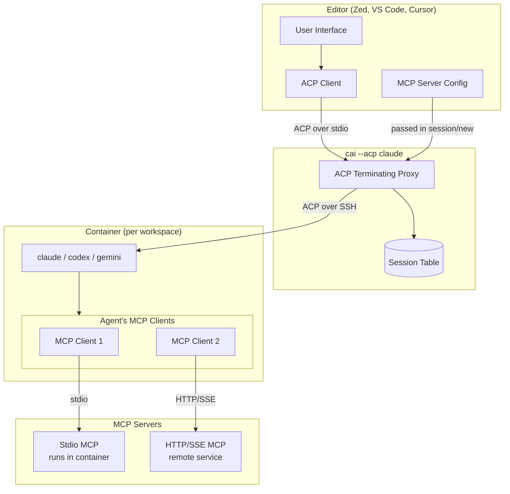
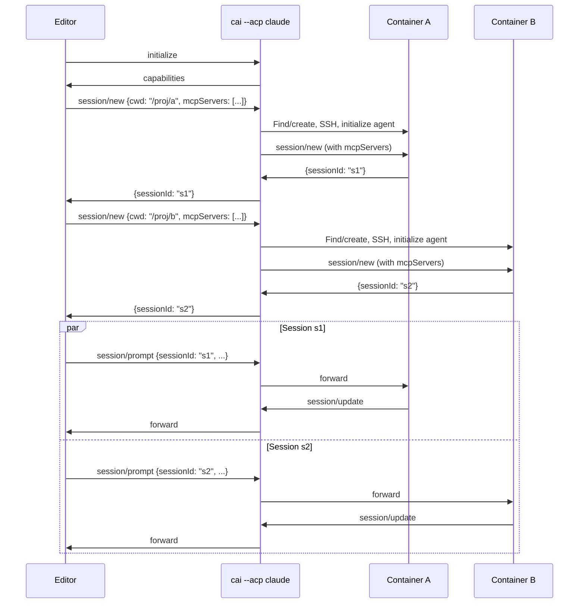

# Epic: Agent Client Protocol (ACP) Integration

## Summary

Add `cai --acp <agent>` command that editors configure as their ACP executable. This is a terminating proxy that:
1. Handles ACP handshake with the editor
2. Supports multiple simultaneous sessions (each with own container/agent)
3. Routes each session to the appropriate container based on `cwd`
4. Passes MCP server config through to the agent (agent handles MCP)

## Understanding the Protocol Stack



### Protocol Roles

| Component             | Role                  | Protocol                                |
|-----------------------|-----------------------|-----------------------------------------|
| Editor                | ACP Client            | Sends prompts, receives updates         |
| cai --acp             | ACP Proxy             | Routes sessions to containers           |
| Agent (claude, codex) | ACP Server + MCP Host | Handles prompts, spawns/connects to MCP |
| MCP Servers           | MCP Servers           | Provide tools, resources, context       |

**Key insight**: The **agent is the MCP client**. It spawns stdio MCP servers and connects to HTTP/SSE servers. We just pass the config through.

## MCP Server Handling

### How It Works

1. Editor passes `mcpServers` config in `session/new`
2. We forward config to agent in container
3. Agent spawns/connects to MCP servers
4. For stdio servers: agent spawns them **in the container**
5. For HTTP/SSE servers: agent connects **from the container**

### Implications for Containerized Agents

| MCP Type  | How It Works                      | Requirements                                            |
|-----------|-----------------------------------|---------------------------------------------------------|
| **Stdio** | Agent spawns process in container | Package must be installed in container (npm, pip, etc.) |
| **HTTP**  | Agent connects from container     | Server reachable from container                         |
| **SSE**   | Agent connects from container     | Server reachable from container                         |

### Container Requirements

For stdio MCP servers to work, their packages need to be in the container:
```bash
# Example: filesystem MCP server
npm install -g @modelcontextprotocol/server-filesystem

# Example: other MCP servers
npm install -g @mcp/fetch @mcp/postgres
```

For HTTP/SSE servers to localhost on host:
```bash
# Container needs host.docker.internal
docker run --add-host=host.docker.internal:host-gateway ...
```

### What We Pass Through

```json
// Editor sends:
{
  "method": "session/new",
  "params": {
    "cwd": "/home/user/project",
    "mcpServers": [
      {"type": "stdio", "name": "fs", "command": "npx", "args": ["@mcp/filesystem", "/home/user/project"]},
      {"type": "sse", "name": "github", "url": "https://mcp.github.com/sse"}
    ]
  }
}

// We forward to agent (with path translation):
{
  "method": "session/new",
  "params": {
    "cwd": "/home/user/project",  // symlink handles this
    "mcpServers": [
      {"type": "stdio", "name": "fs", "command": "npx", "args": ["@mcp/filesystem", "/home/agent/workspace"]},
      {"type": "sse", "name": "github", "url": "https://mcp.github.com/sse"}
    ]
  }
}
```

Note: We may need to translate paths in MCP server args (workspace path → container path).

## Multiple Sessions

ACP supports multiple simultaneous sessions. Each `session/new` can target a different workspace.

### Session Flow



### Session Table

```
sessionId -> {
    workspace: "/home/user/project",
    container: "containai-project-abc",
    agentStdio: SshConnection,
}
```

## CLI Interface

```bash
# Editor configures:
cai --acp <agent>

# Examples:
cai --acp claude
cai --acp codex
cai --acp gemini
```

## Implementation

### Language Choice

C# (.NET 10 Native AOT trimmed) or Rust. Need:
- Async I/O for concurrent sessions
- JSON-RPC parsing
- Process/SSH management

### Core Components

```
src/acp-proxy/
├── Program.cs           # Entry point
├── JsonRpc.cs           # JSON-RPC parsing
├── AcpMessages.cs       # ACP message types
├── SessionManager.cs    # Multi-session tracking
├── ContainerManager.cs  # Find/create containers
└── PathTranslator.cs    # Host ↔ container paths
```

### Message Router

```csharp
async Task RouteAsync(JsonRpcMessage msg) {
    switch (msg.Method) {
        case "initialize":
            // Respond with proxy capabilities
            // Cache for forwarding to agents later
            break;

        case "session/new":
            // Extract cwd, mcpServers
            // Translate paths in mcpServers args
            // Find/create container
            // Connect to agent, initialize, create session
            // Track session in table
            break;

        case "session/prompt":
        case "session/end":
            // Look up session by sessionId
            // Forward to appropriate container
            break;
    }
}
```

### Path Translation for MCP

MCP server configs may contain host paths that need translation:

```csharp
McpServer[] TranslateMcpPaths(McpServer[] servers, string hostWorkspace) {
    return servers.Select(s => {
        if (s.Type != "stdio" || s.Args == null) return s;

        // Replace host workspace path with container path
        var translatedArgs = s.Args.Select(arg =>
            arg.Replace(hostWorkspace, "/home/agent/workspace")
        ).ToArray();

        return s with { Args = translatedArgs };
    }).ToArray();
}
```

## Path Translation

Container has symlink from host path to mount point (fn-10-vep.35):
```
/home/user/project -> /home/agent/workspace
```

For `cwd`: Forward as-is, symlink handles it.

For MCP server args: May need explicit translation if they reference the workspace.

## Editor Configuration

### Zed
```json
{
  "agent_servers": {
    "claude-sandbox": {
      "type": "custom",
      "command": "cai",
      "args": ["--acp", "claude"]
    }
  }
}
```

### VS Code
```json
{
  "acp.executable": "cai",
  "acp.args": ["--acp", "claude"]
}
```

## Acceptance Criteria

1. [ ] `cai --acp claude` handles ACP protocol
2. [ ] Responds to `initialize`
3. [ ] Supports multiple simultaneous sessions
4. [ ] Routes messages by `sessionId`
5. [ ] Passes `mcpServers` config to agent (with path translation)
6. [ ] Agent successfully uses stdio MCP servers (if installed in container)
7. [ ] Agent successfully uses HTTP/SSE MCP servers
8. [ ] Sessions cleaned up properly on `session/end`
9. [ ] Works with Zed's ACP configuration

## Out of Scope

- HTTP/WebSocket transport for ACP (only stdio)
- Installing MCP server packages in container (separate concern)
- Host-only MCP servers that can't run in container

## References

- [ACP Spec](https://agentclientprotocol.com)
- [ACP Architecture](https://agentclientprotocol.com/overview/architecture)
- [MCP Introduction](https://modelcontextprotocol.io/introduction)
- [MCP Architecture](https://modelcontextprotocol.io/docs/learn/architecture)
- [Zed External Agents](https://zed.dev/docs/ai/external-agents)
- [claude-code-acp](https://github.com/zed-industries/claude-code-acp)
- [Codex MCP](https://developers.openai.com/codex/mcp/)
