# Build System & .NET Project Restructuring

## Overview

Fix failing Docker builds, improve local build experience, modernize the .NET project structure, establish unified NBGV versioning, and create a proper release/packaging system that doesn't require repo clones.

**Problems being solved:**
1. Build fails looking for `docker.io/containai/base:latest` (incorrect default prefix)
2. Local builds (build.sh) check local images, but `cai update` always pulls
3. Single monolithic Program.cs (1029 lines) is an anti-pattern
4. No version management (hardcoded `0.1.0`)
5. No central package management
6. Traditional .sln format instead of modern slnx
7. E2E tests don't run in CI (sysbox not installed)
8. Install requires repo clone (fragile, heavy)
9. PR builds can't test install flow (no PR-specific artifact location)
10. No .NET unit tests

## Scope

**In scope:**
- Fix Docker image prefix/registry defaults in build.sh
- Add local image check to `cai update` (not just build.sh)
- Restructure .NET code into ACP library + CLI projects
- Use NuGet packages instead of re-inventing (CliWrap, etc.)
- Add xUnit 3 unit tests for .NET code
- Add NBGV for unified versioning (all builds - .NET, Docker, shell)
- Add Central Package Management (Directory.Packages.props)
- Migrate to slnx solution format
- Enable ArtifactsOutput for cleaner build paths
- Run install.sh in GitHub Actions to install/configure sysbox
- Create flat release tarballs per architecture (runtime only)
- install.sh works both as standalone wget AND from inside tarball
- PR builds publish to PR-specific artifact location for testing
- Ensure all tests run including e2e

**Out of scope:**
- Publishing ACP library to NuGet (future work)
- New ACP features
- Docker image size optimization
- Documentation epic (separate epic, follows this one)

## Architecture

```mermaid
graph TD
    subgraph "GitHub Actions CI"
        A[Push/PR] --> B[NBGV: Set version env vars]
        B --> C[Build acp-proxy multi-arch]
        C --> C2[Run dotnet test xUnit]
        C2 --> D[Create release tarball per arch]
        D --> E{PR or Release?}
        E -->|PR| F[Upload to PR artifacts]
        E -->|Release| G[Publish tarball + install.sh to Releases]
        F --> H["Extract, run ./install.sh --local"]
        G --> H
        H --> I[Run all tests including E2E]
    end

    subgraph "User Install - Path A (curl)"
        J["curl install.sh | bash"] --> K[install.sh detects arch]
        K --> L[Download tarball from Releases]
        L --> M[Extract and install]
    end

    subgraph "User Install - Path B (manual)"
        N[Download tarball manually] --> O[tar xzf ...]
        O --> P[cd containai-*/]
        P --> Q["./install.sh --local"]
    end

    subgraph "Local Dev / cai update"
        R[build.sh or cai update] --> S{Local image exists?}
        S -->|Yes| T[Use local]
        S -->|No| U{Registry pull works?}
        U -->|Yes| V[Use pulled]
        U -->|No| W[Build from scratch]
    end
```



## Release Structure

**install.sh** - Dual-mode script:
```bash
# Path A: Standalone (downloads tarball)
curl -fsSL https://github.com/.../releases/latest/download/install.sh | bash

# Path B: From extracted tarball
tar xzf containai-0.2.0-linux-x64.tar.gz
cd containai-0.2.0-linux-x64
./install.sh --local   # or just ./install.sh (auto-detects)
```

**Per-architecture tarballs** - Runtime only (e.g., `containai-0.2.0-linux-x64.tar.gz`):
```
containai-0.2.0-linux-x64/
├── containai.sh            # Main CLI entry point
├── lib/                    # Shell libraries
├── templates/              # User templates
├── acp-proxy               # Pre-built AOT binary
├── install.sh              # Same script, works locally too
├── VERSION                 # Version file
└── LICENSE
```

**What's NOT in the tarball:**
- Dockerfiles (contributors clone repo)
- Tests (contributors clone repo)
- Build scripts (contributors clone repo)
- Documentation (published separately)

## .NET Project Structure

```
src/
├── ContainAI.Acp/              # Library (publishable)
│   ├── Protocol/               # JSON-RPC types
│   ├── Sessions/               # Session management (uses CliWrap)
│   └── PathTranslation/        # Path mapping
└── acp-proxy/                  # CLI (AOT executable)

tests/
└── ContainAI.Acp.Tests/        # xUnit 3 tests
```

**NuGet packages to use** (don't reinvent):
- `StreamJsonRpc` - JSON-RPC protocol handling
- `CliWrap` - Process execution
- `xunit.v3` - Testing (VSTest v2 native)
- `Nerdbank.GitVersioning` - Versioning
- `Microsoft.SourceLink.GitHub` - Source linking

## NBGV Version Strategy

NBGV sets environment variables that ALL build steps can use:

| Variable | Example | Used By |
|----------|---------|---------|
| `NBGV_SemVer2` | `0.2.0-alpha.5` | Docker image tags, release names, tarball names |
| `NBGV_SimpleVersion` | `0.2.0` | Stable release tags |
| `NBGV_GitCommitId` | `abc1234` | OCI image labels, VERSION file |
| `NBGV_BuildNumber` | `42` | CI build identification |

Shell scripts access via: `$NBGV_SemVer2` after NBGV GitHub Action runs.

## Quick commands

```bash
# Install via curl (most users)
curl -fsSL https://github.com/novotnyllc/containai/releases/latest/download/install.sh | bash

# Install via manual tarball download
tar xzf containai-0.2.0-linux-x64.tar.gz
cd containai-0.2.0-linux-x64 && ./install.sh

# Build Docker images (uses local images if available)
./src/build.sh

# Build .NET projects
dotnet build

# Run .NET unit tests
dotnet test

# Run all integration tests
./tests/integration/test-acp-proxy.sh
./tests/integration/test-sync-integration.sh
./tests/integration/test-dind.sh  # requires sysbox

# Check NBGV version
nbgv get-version
```

## Acceptance

- [ ] `./src/build.sh` uses local images when available
- [ ] `cai update` uses local images when available (not just build.sh)
- [ ] `./src/build.sh` uses correct image prefix (ghcr.io/novotnyllc/containai/)
- [ ] .NET solution uses slnx format
- [ ] ACP functionality split into library (ContainAI.Acp) and CLI (acp-proxy)
- [ ] .NET code uses NuGet packages (CliWrap, etc.) instead of reinventing
- [ ] xUnit 3 unit tests for .NET library pass
- [ ] `dotnet test` runs in CI
- [ ] NBGV provides version env vars for ALL build steps
- [ ] Central Package Management configured
- [ ] ArtifactsOutput enabled with artifacts/ directory
- [ ] All integration tests pass in CI
- [ ] E2E tests run in CI (sysbox installed via install.sh)
- [ ] install.sh works both standalone (curl) AND from inside tarball
- [ ] Release tarballs contain runtime only (no Dockerfiles, tests, build scripts)
- [ ] install.sh included in both release assets AND each tarball
- [ ] PR builds upload artifacts to PR-specific location
- [ ] PR test stage extracts and tests from PR artifacts
- [ ] No binaries checked into repo

## References

- `src/build.sh:349-352` - Current auto-load logic
- `src/lib/update.sh:2248` - Current pull-always logic
- `src/acp-proxy/Program.cs` - Code to refactor
- `tests/integration/test-dind.sh:121-128` - Local image check pattern
- `.github/workflows/docker.yml` - CI workflow
- `.github/workflows/build-sysbox.yml` - Sysbox build workflow
- `install.sh` - Current installer (clones repo)

## Follow-up Epic

Documentation updates will be a separate epic following this one.
