# Build System & .NET Project Restructuring

## Overview

Fix failing Docker builds, improve local build experience, modernize the .NET project structure, establish unified NBGV versioning, and create a proper release/packaging system that doesn't require repo clones.

**Problems being solved:**
1. Build fails looking for `docker.io/containai/base:latest` when default image prefix resolves to wrong registry
2. Local builds (`build.sh`) and `cai refresh` don't skip pulls when local images exist
3. Single monolithic Program.cs (1029 lines) is an anti-pattern
4. No version management (hardcoded `0.1.0`)
5. No central package management
6. Traditional .sln format instead of modern slnx
7. E2E tests don't run in CI (sysbox not installed on GitHub-hosted runners)
8. Install requires repo clone (fragile, heavy)
9. PR builds can't test install flow (no PR-specific artifact location)
10. No .NET unit tests

## Scope

**In scope:**
- Fix Docker image prefix/registry defaults in build.sh (use `agents` layer name consistently)
- Add conditional build-arg passing: only override Dockerfile ARG defaults when local image exists
- Add local image check to `cai refresh` before pulling (with digest comparison for "up-to-date" status)
- Restructure .NET code into ACP library + CLI projects
- Use NuGet packages (CliWrap, etc.) - with AOT viability gate before adopting StreamJsonRpc
- Add xUnit 3 unit tests for .NET code
- Add NBGV for unified versioning (all builds - .NET, Docker, shell)
- Add Central Package Management (Directory.Packages.props)
- Migrate to slnx solution format
- Enable ArtifactsOutput for cleaner build paths
- Create flat release tarballs per architecture (runtime only)
- install.sh works both as standalone wget AND from inside tarball
- PR builds publish to PR-specific artifact location for testing
- Attempt sysbox in GitHub Actions with explicit proof step and self-hosted fallback

**Out of scope:**
- Publishing ACP library to NuGet (future work)
- New ACP features
- Docker image size optimization
- Documentation epic (separate epic, follows this one)

## Architecture

```mermaid
graph TD
    subgraph "GitHub Actions CI"
        A[Push/PR] --> B[NBGV: Set version env vars]
        B --> C[Build acp-proxy multi-arch]
        C --> C2[Run dotnet test xUnit]
        C2 --> D[Create release tarball per arch]
        D --> E{PR or Release?}
        E -->|PR| F[Upload to PR artifacts]
        E -->|Release| G[Publish tarball + install.sh to Releases]
        F --> H["Extract, run ./install.sh --local"]
        G --> H
        H --> I[Run all tests including E2E]
    end

    subgraph "User Install - Path A (curl)"
        J["curl install.sh | bash"] --> K[install.sh detects arch]
        K --> L[Download tarball from Releases]
        L --> M[Extract and install]
    end

    subgraph "User Install - Path B (manual)"
        N[Download tarball manually] --> O[tar xzf ...]
        O --> P[cd containai-*/]
        P --> Q["./install.sh --local"]
    end

    subgraph "Local Dev / cai refresh"
        R[build.sh or cai refresh] --> S{Local image exists in same docker context?}
        S -->|Yes| T[Compare digest with registry]
        T -->|Same| T2[Skip pull - already up-to-date]
        T -->|Different| T3[Pull update]
        S -->|No| U{Default Dockerfile ARG pulls from registry}
        U -->|Yes| V[Use pulled image]
        U -->|No| W[Build from scratch]
    end
```



## Release Structure

**install.sh** - Dual-mode script:
```bash
# Path A: Standalone (downloads tarball)
curl -fsSL https://github.com/.../releases/latest/download/install.sh | bash

# Path B: From extracted tarball
tar xzf containai-0.2.0-linux-x64.tar.gz
cd containai-0.2.0-linux-x64
./install.sh --local   # or just ./install.sh (auto-detects)
```

**Per-architecture tarballs** - Runtime only (e.g., `containai-0.2.0-linux-x64.tar.gz`):
```
containai-0.2.0-linux-x64/
├── containai.sh            # Main CLI entry point
├── lib/                    # Shell libraries
├── scripts/                # Runtime helper scripts
│   └── parse-manifest.sh   # Required by sync.sh
├── sync-manifest.toml      # Required by sync.sh
├── templates/              # User templates
├── acp-proxy               # Pre-built AOT binary
├── install.sh              # Same script, works locally too
├── VERSION                 # Version file
└── LICENSE
```

**What's NOT in the tarball:**
- Dockerfiles (contributors clone repo)
- Tests (contributors clone repo)
- Build scripts (contributors clone repo)
- Documentation (published separately)

**Runtime dependencies INCLUDED** (required by CLI):
- `scripts/parse-manifest.sh` - Required by `src/lib/sync.sh`
- `sync-manifest.toml` - Required by `src/lib/sync.sh`

## .NET Project Structure

```
src/
├── ContainAI.Acp/              # Library (publishable)
│   ├── Protocol/               # JSON-RPC types
│   ├── Sessions/               # Session management (uses CliWrap)
│   └── PathTranslation/        # Path mapping
└── acp-proxy/                  # CLI (AOT executable)

tests/
└── ContainAI.Acp.Tests/        # xUnit 3 tests
```

**NuGet packages to use** (don't reinvent):
- `System.CommandLine` - CLI parsing (AOT-compatible, used by .NET CLI itself)
- `StreamJsonRpc` - JSON-RPC implementation (AOT-compatible with SystemTextJsonFormatter)
- `CliWrap` - Process execution (AOT-compatible)
- `xunit.v3` - Testing framework (no runner packages needed with .NET 10 MTP)
- `Nerdbank.GitVersioning` - Versioning
- `Microsoft.SourceLink.GitHub` - Source linking

**CLI invocation pattern:**
- Users call `cai acp proxy <agent>` (subcommand, not `--acp` flag)
- Shell script delegates to .NET binary: `exec "$proxy_bin" proxy "$agent"`
- Future epic: migrate all of `cai` to C# (acp-proxy is first .NET component)

**.NET 10 TestPlatform v2:**
.NET 10 uses Microsoft Testing Platform (MTP) by default. No legacy runner packages needed:
- ~~`xunit.runner.visualstudio`~~ - NOT needed with MTP
- ~~`Microsoft.NET.Test.Sdk`~~ - NOT needed with MTP

Configure via `global.json`:
```json
{
  "sdk": { "version": "10.0.100" },
  "test": { "runner": "Microsoft.Testing.Platform" }
}
```

Benefits: Lower overhead, trimming/AOT compatible, no external dependencies.

**StreamJsonRpc AOT configuration:**
StreamJsonRpc is AOT-compatible when configured correctly (see https://microsoft.github.io/vs-streamjsonrpc/docs/nativeAOT.html):

- **Use `SystemTextJsonFormatter`** (NOT Newtonsoft, NOT MessagePack) - required for UTF-8 JSON per ACP spec
- **Use source generators everywhere** - annotate interfaces with `[JsonRpcContract]`, data types with `[JsonSerializable]`
- **Enable `EnableStreamJsonRpcInterceptors`** MSBuild property for proxy generation
- **Configure `JsonSerializerContext`** with all RPC message types for AOT serialization
- **Use `RpcTargetMetadata.FromShape<T>()`** when adding local RPC targets

ACP protocol uses NDJSON (newline-delimited JSON-RPC) over stdio, which requires UTF-8 JSON encoding.

## NBGV Version Strategy

NBGV sets environment variables that ALL build steps can use:

| Variable | Example | Used By |
|----------|---------|---------|
| `NBGV_SemVer2` | `0.2.0-dev.5` | Docker image tags, release names, tarball names |
| `NBGV_SimpleVersion` | `0.2.0` | Stable release tags |
| `NBGV_GitCommitId` | `abc1234` | OCI image labels, VERSION file |
| `NBGV_BuildNumber` | `42` | CI build identification |

**Release branching strategy:**
- `main` branch: prerelease tag `-dev` (e.g., `0.2.0-dev.42`)
- `rel/v0.2` branches: stable releases (e.g., `0.2.0`, `0.2.1`)
- NBGV `version.json` on main has `"version": "0.2-dev"`
- Release branches have `"version": "0.2"` (no prerelease suffix)

**Local build script** (`src/acp-proxy/build.sh`):
- Self-contained: invokes NBGV to get version
- Detects .NET SDK: `command -v dotnet`
- Fallback: uses Microsoft's .NET SDK Docker image if SDK not installed locally
- Exports `NBGV_*` vars for downstream use (Docker builds, tarball naming)

**GitHub Actions setup** (use .NET tool, not GitHub Action):
```yaml
- uses: actions/checkout@v4
  with:
    fetch-depth: 0  # CRITICAL for NBGV
- uses: actions/setup-dotnet@v4
  with:
    global-json-file: global.json  # Use SDK version from global.json
- name: Install and run NBGV
  run: |
    dotnet tool restore
    echo "NBGV_SemVer2=$(dotnet nbgv get-version -v SemVer2)" >> "$GITHUB_ENV"
    echo "NBGV_SimpleVersion=$(dotnet nbgv get-version -v SimpleVersion)" >> "$GITHUB_ENV"
    echo "NBGV_GitCommitId=$(dotnet nbgv get-version -v GitCommitId)" >> "$GITHUB_ENV"
```

**Local tool manifest** (`.config/dotnet-tools.json`) - no pinned version:
```json
{
  "version": 1,
  "isRoot": true,
  "tools": {
    "nbgv": {
      "commands": ["nbgv"]
    }
  }
}
```

**Docker fallback for local builds** (when .NET SDK not installed):
```bash
# build.sh detects missing SDK and uses Docker
docker run --rm -v "$PWD:/src" -w /src mcr.microsoft.com/dotnet/sdk:10.0 \
  sh -c "dotnet tool restore && dotnet nbgv get-version -v SemVer2"
```

Shell scripts access via: `$NBGV_SemVer2` after export, or call build.sh helper function.

## Build Layer Naming

**Canonical layer names** (align with CI and Dockerfiles):
- `base` → `ghcr.io/novotnyllc/containai/base:latest`
- `sdks` → `ghcr.io/novotnyllc/containai/sdks:latest`
- `agents` → `ghcr.io/novotnyllc/containai/agents:latest` (NOT `full`)
- (final) → `ghcr.io/novotnyllc/containai:latest`

**build.sh must:**
- Rename `IMAGE_FULL` to `IMAGE_AGENTS`
- Update `--layer` flag to accept `agents` instead of `full`
- Update help text to show `--layer base|sdks|agents|all`
- Update build order text to reference `agents`

## Local Image Fallback Logic

The cascade is about **which build-arg value to pass**, not about pulling:

```bash
# For each layer build (e.g., sdks needs base):
if docker image inspect "${IMAGE_PREFIX}/base:latest" >/dev/null 2>&1; then
    # Local image exists in current context - use it
    build_layer "sdks" "Dockerfile.sdks" --build-arg BASE_IMAGE="${IMAGE_PREFIX}/base:latest"
else
    # No local image - DON'T override the Dockerfile default
    # Let Dockerfile's ARG BASE_IMAGE=ghcr.io/novotnyllc/containai/base:latest handle it
    build_layer "sdks" "Dockerfile.sdks"
fi
```

**Key insight**: Dockerfiles already have correct ghcr defaults. Only override when we KNOW a local image exists.

## Quick commands

```bash
# Install via curl (most users)
curl -fsSL https://github.com/novotnyllc/containai/releases/latest/download/install.sh | bash

# Install via manual tarball download
tar xzf containai-0.2.0-linux-x64.tar.gz
cd containai-0.2.0-linux-x64 && ./install.sh

# Build Docker images (uses local images if available)
./src/build.sh

# Build .NET projects
dotnet build

# Run .NET unit tests
dotnet test

# Run all integration tests
./tests/integration/test-acp-proxy.sh
./tests/integration/test-sync-integration.sh
./tests/integration/test-dind.sh  # requires sysbox

# Check NBGV version
nbgv get-version
```

## Acceptance

- [ ] `./src/build.sh` only passes `--build-arg` when local image exists in same context
- [ ] `./src/build.sh` uses `agents` layer name (not `full`) in variables, CLI, and help
- [ ] `--layer agents` works (not `--layer full`)
- [ ] `cai refresh` compares local digest with registry before pulling
- [ ] `cai refresh` shows "already up-to-date" only when digests match
- [ ] `./src/build.sh` uses correct image prefix (ghcr.io/novotnyllc/containai/)
- [ ] .NET solution uses slnx format
- [ ] ACP functionality split into library (ContainAI.Acp) and CLI (acp-proxy)
- [ ] .NET code uses StreamJsonRpc with SystemTextJsonFormatter (no Newtonsoft)
- [ ] .NET code uses CliWrap for process execution
- [ ] AOT viability gate passed for any new NuGet packages
- [ ] xUnit 3 unit tests for .NET library pass (xunit.v3 with .NET 10 MTP, no legacy runner packages)
- [ ] acp-proxy CLI uses System.CommandLine for argument parsing
- [ ] CLI invocation is `cai acp proxy <agent>` (subcommand pattern)
- [ ] global.json configures Microsoft Testing Platform as test runner
- [ ] `dotnet test` runs in CI
- [ ] NBGV installed as .NET local tool (not GitHub Action)
- [ ] `.config/dotnet-tools.json` manifest exists with nbgv tool (no pinned version)
- [ ] `setup-dotnet` action uses `global-json-file: global.json`
- [ ] NBGV env vars exported to GITHUB_ENV via `dotnet nbgv get-version`
- [ ] Local build script (`src/acp-proxy/build.sh`) invokes NBGV for version
- [ ] Local build script falls back to Docker SDK image when .NET not installed
- [ ] `version.json` on main has `-dev` prerelease suffix
- [ ] Release branches (`rel/v0.x`) have stable version (no prerelease)
- [ ] Central Package Management configured
- [ ] ArtifactsOutput enabled with artifacts/ directory
- [ ] All integration tests pass in CI
- [ ] Sysbox proof step uses correct docker context (`containai-docker`)
- [ ] Sysbox proof step in CI (may fallback to self-hosted if GH-hosted doesn't support)
- [ ] install.sh works both standalone (curl) AND from inside tarball
- [ ] Release tarballs contain: CLI, lib/, scripts/parse-manifest.sh, sync-manifest.toml, templates/, acp-proxy, install.sh, VERSION, LICENSE
- [ ] Release tarballs do NOT contain: Dockerfiles, tests, build scripts, documentation
- [ ] install.sh handles non-interactive mode (`--yes` flag)
- [ ] PR builds upload artifacts to PR-specific location
- [ ] PR test stage extracts and tests from PR artifacts
- [ ] No binaries checked into repo

## References

- `src/build.sh:298-300` - Layer image variables (needs `agents` not `full`)
- `src/build.sh:9,63-65` - Layer flag help and validation (needs `agents` not `full`)
- `src/lib/update.sh:2228-2248` - `cai refresh` uses `_cai_base_image()` (runtime image, not build layers)
- `src/lib/registry.sh:66` - `_cai_base_image()` returns `ghcr.io/novotnyllc/containai:latest`
- `src/lib/sync.sh:22,46-50` - Runtime dependencies on `sync-manifest.toml` and `scripts/parse-manifest.sh`
- `src/acp-proxy/Program.cs` - Code to refactor
- `tests/integration/test-dind.sh:121-128` - Local image check pattern
- `.github/workflows/docker.yml` - CI workflow (uses `agents` layer name)
- `.github/workflows/build-sysbox.yml` - Sysbox build workflow
- `install.sh` - Current installer (clones repo)

## Follow-up Epic

Documentation updates will be a separate epic following this one.
