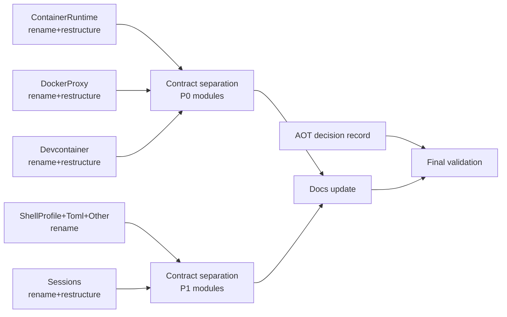

# Architecture Refactor Completion: Naming, Contracts, Layering, AOT Composition

## Overview

Complete the architectural cleanup of `src/cai` to reach a consistent .NET 10 codebase: folder-based organization (no dotted basenames), separated contracts/implementations, explicit module layering, and a documented AOT composition strategy.

**Current baseline (measured):**
- 97 files with dotted basenames across 7 module groups
- 213 files co-locating interface + implementation declarations
- 385/583 files (66%) using flat `ContainAI.Cli.Host` namespace despite deep folder hierarchy
- Manual composition (pure `new` wiring) — already AOT-safe but undocumented

**PRD source:** `specs/cai-architecture-refactor-completion-prd.md`

## Scope

**In scope:**
- WS1: Remove all dotted basenames in hand-written `src/cai` source files (97 files)
- WS2: Separate co-located interfaces/implementations 
- WS3: Establish consistent module layering for P0 modules (Devcontainer, ContainerRuntime, DockerProxy)
- WS4: AOT composition decision record (research + document)
- WS5: Verification and quality gates
- Namespace alignment for restructured modules (companion to file renames)
- Documentation updates for 8 affected docs + 2 new docs

**Out of scope:**
- Behavioral feature changes
- CLI command surface changes
- P1 module layering (Sessions, RuntimeSupport) — tracked separately after P0 completes

## Design Decisions

### Namespace migration strategy
Align namespaces to match folder hierarchy **only for modules being restructured** in WS1/WS3. This avoids creating a worse folder-namespace mismatch while keeping scope bounded. The `RootNamespace` stays as `ContainAI.Cli.Host` — files in subfolders get explicit namespace declarations matching their path.

### WS1/WS3 combined execution
File renames (WS1) and folder restructuring (WS3) execute per-module as a single pass. Separating them would require two rename cycles for the same files. However, **each module uses two commits**: (1) `git mv` only (preserves rename detection), (2) namespace/using fixups + folder structure changes.

### WS2 as separate sweep
Contract separation runs after WS1/WS3 per module. This keeps rename commits clean (no content changes) and allows contract splits to be reviewed as distinct architectural changes.

### WS3/WS4 dependency
WS3 establishes folder structure and module boundaries but **does not change the dual-constructor composition pattern**. WS4 decides whether to keep manual composition or adopt source-generated DI. WS3 creates the module shapes that WS4 can optionally rewire.

### Module layering flexibility
The PRD prescribes Contracts/Models/Services/Orchestration/Infrastructure subfolders. Modules with existing well-structured subfolders (e.g., DockerProxy already has Contracts/, Execution/, Parsing/) keep their current structure if it serves the same purpose. The prescribed shape is a guideline, not a rigid template.

### fn-49 coordination
Devcontainer restructure (task 5) runs last in the rename sequence to minimize conflict with fn-49 (devcontainer integration). If fn-49 is still active, task 5 can be deferred.

## Phases



**Phase 1 — Module renames (WS1+WS3):** Tasks 1-5, can run in parallel per module.
**Phase 2 — Contract separation (WS2):** Tasks 6-7, after Phase 1 per dependency.
**Phase 3 — Composition & validation (WS4+WS5):** Tasks 8-10, research + docs + final gate.

## Risks and Mitigations

| Risk | Likelihood | Impact | Mitigation |
|------|-----------|--------|------------|
| Large rename sets break internal references | High | Medium | Two-commit strategy (git mv first, fixups second); build+test per batch |
| fn-49 merge conflicts with Devcontainer work | Medium | High | Devcontainer task runs last; coordinate with fn-49 status |
| Coverage line mappings break after namespace changes | Medium | Low | Re-baseline coverage after each module restructure; 97% gate stays |
| Analyzer rule churn during broad moves | Medium | Low | Run `-warnaserror` and slopwatch on each batch; fix immediately |
| Dual-constructor pattern creates fragile composition | Low | Medium | Defer to WS4; WS3 only restructures folders, not composition |
| CsToml source-generator breaks on file moves | Low | High | Validate CsToml partial classes compile after each Manifests/Toml rename |
| Scope creep from 213-file contract split | Medium | Medium | Default-split with documented exceptions; size threshold: <15 lines total for adapter exception |

## Non-functional Targets

- Build clean: `dotnet build ContainAI.slnx -c Release -warnaserror`
- Slopwatch clean: `dotnet tool run slopwatch analyze -d . --fail-on warning`
- Coverage: >=97% line coverage for ContainAI.Cli, ContainAI.Cli.Abstractions, AgentClientProtocol.Proxy
- Naming: `dotnet format analyzers --diagnostics IDE1006 --verify-no-changes`
- Zero dotted basenames in hand-written `src/cai` source files
- Zero behavioral regressions (all existing tests pass unchanged)

## Quick commands

```bash
# Build with analyzers as errors
dotnet build ContainAI.slnx -c Release -warnaserror

# Run tests
dotnet test --solution ContainAI.slnx -c Release --xunit-info

# Naming analyzer check
dotnet format analyzers --diagnostics IDE1006 --verify-no-changes

# Slopwatch
dotnet tool run slopwatch analyze -d . --fail-on warning

# Count remaining dotted basenames (portable, macOS-safe)
find src/cai -type f -name "*.cs" | xargs -I{} basename {} | sed "s/\.cs$//" | awk "index(\$0,\".\")>0" | wc -l

# Verify rename detection
git diff --stat --diff-filter=R HEAD~1
```

## Acceptance

- [ ] Zero dotted basenames in hand-written `src/cai` source files
- [ ] Mixed interface/class files reduced to approved exceptions only (documented in `docs/architecture/refactor-exceptions.md`)
- [ ] P0 module folders (ContainerRuntime, DockerProxy, Devcontainer) reflect stable architecture boundaries
- [ ] Namespaces match folder hierarchy for restructured modules
- [ ] AOT composition decision record complete at `specs/cai-aot-composition-decision-record.md`
- [ ] Cross-module dependencies point inward to contracts, not across concrete classes
- [ ] Build + slopwatch + naming analyzer gates pass
- [ ] Coverage >= 97% for CLI libraries
- [ ] 8 existing docs updated + 2 new docs created
- [ ] All existing tests pass without behavioral changes

## References

- PRD: `specs/cai-architecture-refactor-completion-prd.md`
- Architecture assessment: `docs/specs/api-design-and-architecture-refactor-assessment-2026-02-11.md`
- Composition roots: `src/cai/Program.cs`, `src/cai/CommandRuntime/Factory/CaiCommandRuntimeHandlersFactory.cs`
- Central factory: `src/cai/CommandRuntime/Factory/CaiCommandRuntimeHandlersFactory.cs:5-31`
- DockerProxy factory: `src/cai/DockerProxy/ContainAiDockerProxy.cs:29-61`
- Epic dependency: fn-52 (AOT DI strategy — WS4 depends on this)
- Epic coordination: fn-49 (devcontainer integration — task 5 may conflict)
- Conventions: `.flow/memory/conventions.md`
- Pitfalls: `.flow/memory/pitfalls.md`
