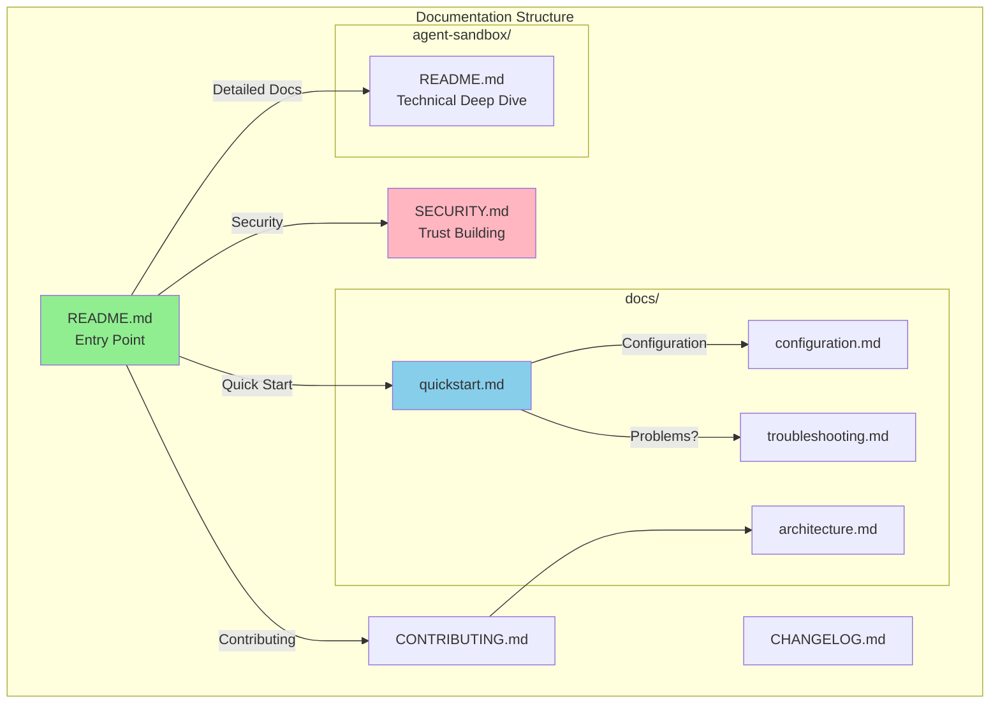

# Comprehensive Documentation Suite

## Overview

ContainAI is a Docker-based sandboxing tool for AI coding agents that currently lacks user-facing documentation. This epic creates a complete documentation suite following the Diataxis framework (tutorials, how-to guides, reference, explanation) to enable user discovery, adoption, and contribution.

**Current state:**
- Main docs buried in `agent-sandbox/README.md` (not at project root)
- No SECURITY.md despite being a security-critical tool
- No quickstart guide (README assumes Docker familiarity)
- No CONTRIBUTING.md (blocks community contributions)
- No architecture overview (security model scattered across code)
- No troubleshooting guide (only 4 scenarios in README)
- No CHANGELOG.md (version history untracked)

**Target state:**
- Root README.md as clear entry point
- Progressive documentation: quickstart → full guide → reference
- Trust-building SECURITY.md for a sandboxing tool
- Community-ready CONTRIBUTING.md
- Comprehensive troubleshooting covering common failure modes

## Scope

### In Scope
- Root README.md with value proposition and quickstart
- SECURITY.md with threat model and vulnerability reporting
- Standalone quickstart guide in docs/
- Config reference (TOML schema documentation)
- Expanded troubleshooting guide (20+ scenarios)
- CONTRIBUTING.md with dev setup and testing
- Architecture overview with Mermaid diagrams
- CHANGELOG.md with retroactive history

### Out of Scope
- Documentation website/generator (future epic)
- Video tutorials
- Localization/translations
- Auto-generated API reference from --help
- Man pages for CLI commands

## Phases

### Phase 1: Discovery & Trust (Tasks 1-2)
Foundation documents that enable users to find and trust the project.
- Root README.md
- SECURITY.md

### Phase 2: Onboarding (Task 3)
Fast path to first successful sandbox run.
- Quickstart guide

### Phase 3: Reference & Troubleshooting (Tasks 4-5)
Detailed documentation for configuration and problem-solving.
- Config reference
- Troubleshooting guide

### Phase 4: Community & History (Tasks 6-8)
Enable contributions and track project evolution.
- CONTRIBUTING.md
- Architecture overview
- CHANGELOG.md

## Architecture



## Alternatives Considered

| Alternative | Decision | Rationale |
|-------------|----------|-----------|
| Move agent-sandbox/README.md to root | **No** | Keep technical depth separate; root README is entry point |
| Use MkDocs for docs site | **Defer** | Markdown files sufficient for now; site generation is future epic |
| Auto-generate config reference | **No** | Manual curation ensures quality; config is stable |
| Generate CHANGELOG from git | **Partial** | Use git history as input but manually curate for clarity |

## Non-Functional Requirements

- **Discoverability**: New user can understand project purpose within 30 seconds of landing on repo
- **Time-to-Hello-World**: Quickstart achieves first sandbox in <5 minutes (assuming Docker installed)
- **Searchability**: All docs are markdown (GitHub-searchable, renders natively)
- **Maintainability**: Docs reference code via file:line links for easy sync
- **Accessibility**: No images required to understand content; alt text where images used

## Risks and Mitigations

| Risk | Likelihood | Impact | Mitigation |
|------|------------|--------|------------|
| Docs drift from code | Medium | High | Include file:line references; update docs in same PR as code |
| Incomplete troubleshooting | Medium | Medium | Start with known issues from README; expand based on real support |
| Security model misrepresentation | Low | High | Have security-focused review of SECURITY.md |
| Overwhelming users | Medium | Low | Progressive disclosure: README → quickstart → detailed docs |

## Rollout Plan

1. **Phase 1 first**: Root README + SECURITY.md enable discovery
2. **Atomic commits**: Each doc is self-contained, can be merged independently
3. **No migration needed**: New files only, no breaking changes
4. **Verification**: Each task includes manual verification steps

## Rollback

- All changes are additive (new files)
- Any doc can be removed without breaking functionality
- No code changes required

## Quick Commands

```bash
# Verify docs structure
ls -la README.md SECURITY.md CONTRIBUTING.md CHANGELOG.md docs/

# Check markdown rendering
gh markdown-preview README.md

# Validate links (requires markdown-link-check)
find . -name "*.md" -exec markdown-link-check {} \;
```

## Acceptance Criteria

- [ ] Root README.md exists with project description, quickstart, and navigation
- [ ] SECURITY.md exists with vulnerability reporting and security model summary
- [ ] docs/quickstart.md achieves first sandbox run in <5 minutes
- [ ] docs/configuration.md documents full config.toml schema
- [ ] docs/troubleshooting.md covers 20+ error scenarios
- [ ] CONTRIBUTING.md enables new contributor to set up dev environment
- [ ] docs/architecture.md includes Mermaid diagrams of system components
- [ ] CHANGELOG.md has retroactive history from git commits
- [ ] All docs render correctly on GitHub

## References

- Current main docs: `agent-sandbox/README.md`
- CLI help source: `agent-sandbox/containai.sh:133-420`
- Config schema source: `agent-sandbox/lib/config.sh`
- Security implementation: `agent-sandbox/lib/eci.sh`, `agent-sandbox/lib/doctor.sh`
- Existing docs directory: `docs/`
- Conventions memory: `.flow/memory/conventions.md`
- Decisions memory: `.flow/memory/decisions.md`
