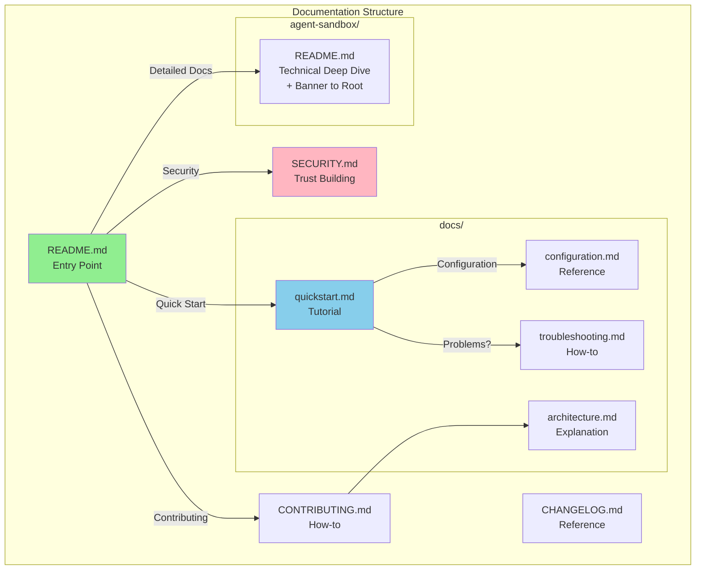

# Comprehensive Documentation Suite

## Overview

ContainAI is a Docker-based sandboxing tool for AI coding agents that currently lacks user-facing documentation. This epic creates a complete documentation suite following the Diataxis framework (tutorials, how-to guides, reference, explanation) to enable user discovery, adoption, and contribution.

**Current state:**
- Main docs buried in `agent-sandbox/README.md` (not at project root)
- No SECURITY.md despite being a security-critical tool
- No quickstart guide (README assumes Docker familiarity)
- No CONTRIBUTING.md (blocks community contributions)
- No architecture overview (security model scattered across code)
- No troubleshooting guide (only 4 scenarios in README)
- No CHANGELOG.md (version history untracked)

**Target state:**
- Root README.md as clear entry point (with banner linking to it from agent-sandbox/README.md)
- Progressive documentation: quickstart → full guide → reference
- Trust-building SECURITY.md for a sandboxing tool
- Community-ready CONTRIBUTING.md
- Comprehensive troubleshooting covering common failure modes

## Diataxis Category Mapping

| Document | Diataxis Category | Intent |
|----------|-------------------|--------|
| `README.md` | Overview | Entry point; what + why + quick navigation |
| `docs/quickstart.md` | Tutorial | Learning-oriented; first successful sandbox run |
| `docs/configuration.md` | Reference | Information-oriented; complete config schema |
| `docs/troubleshooting.md` | How-to | Task-oriented; solve specific problems |
| `docs/architecture.md` | Explanation | Understanding-oriented; design decisions |
| `SECURITY.md` | Reference + Explanation | Trust-building; threat model + reporting |
| `CONTRIBUTING.md` | How-to | Task-oriented; enable contributions |
| `CHANGELOG.md` | Reference | Information-oriented; version history |

## Scope

### In Scope
- Root README.md with value proposition and quickstart
- SECURITY.md with threat model and vulnerability reporting
- Standalone quickstart guide in docs/
- Config reference (TOML schema documentation)
- Expanded troubleshooting guide (20+ scenarios)
- CONTRIBUTING.md with dev setup and testing
- Architecture overview with Mermaid diagrams
- CHANGELOG.md with retroactive history
- Banner in agent-sandbox/README.md pointing to root README

### Out of Scope
- Documentation website/generator (future epic)
- Video tutorials
- Localization/translations
- Auto-generated API reference from --help
- Man pages for CLI commands

## Phases

### Phase 1: Discovery & Trust (Tasks 1-2)
Foundation documents that enable users to find and trust the project.
- Root README.md (with clear relationship to agent-sandbox/README.md)
- SECURITY.md (with explicit security guarantees mapped to code)

### Phase 2: Onboarding (Task 3)
Fast path to first successful sandbox run.
- Quickstart guide with decision tree for runtime modes

### Phase 3: Reference & Troubleshooting (Tasks 4-5)
Detailed documentation for configuration and problem-solving.
- Config reference (schema + semantics + blocked settings)
- Troubleshooting guide (derived from actual error messages)

### Phase 4: Community & History (Tasks 6-8)
Enable contributions and track project evolution.
- CONTRIBUTING.md
- Architecture overview
- CHANGELOG.md (with defined versioning policy)

## Architecture



## Key Design Decisions

### Documentation Reconciliation Strategy
- Root README.md is the canonical entry point for new users
- agent-sandbox/README.md becomes the "image build/test doc" for contributors
- Add prominent banner at top of agent-sandbox/README.md: "👉 Start here: [Root README](../README.md)"
- Root quickstart uses `cai` CLI with pre-built images from `docker/sandbox-templates`
- agent-sandbox/README.md covers building custom images

### Quickstart Runtime Decision Tree
The quickstart MUST include:
1. Run `cai doctor` first to detect environment
2. Branch based on result:
   - **Docker Desktop Sandbox mode** (Desktop 4.50+, sandbox feature enabled)
   - **Sysbox Secure Engine mode** (Linux with sysbox-runc runtime)
3. Platform-specific notes (macOS zsh vs bash sourcing)

### Versioning Policy for CHANGELOG
Since the repo has no tags/releases:
- Use date-based releases: `YYYY-MM-DD` format
- Maintain "Unreleased" section at top for pending changes
- Derive past entries from git commit history, grouped by date
- Categories: Added, Changed, Fixed, Security, Deprecated, Removed

### SECURITY.md Requirements
Must explicitly document:

**Security Guarantees (what IS enforced):**
- Volume mount TOCTOU protection (`entrypoint.sh`)
- Symlink traversal defenses (`entrypoint.sh`)
- Safe `.env` parsing with CRLF handling (`entrypoint.sh`)
- Config refuses `credentials.mode=host` by default (`lib/config.sh`)
- Docker socket access denied by default (`lib/container.sh`)

**Unsafe Opt-ins (what can be disabled):**
- `--allow-host-credentials` - bypasses credential isolation
- `--allow-host-docker-socket` - grants container Docker access
- `--force` - skips safety checks

**Non-goals:**
- Protection against malicious container images
- Network isolation (containers can reach internet)
- Resource exhaustion prevention (no cgroups limits by default)

Code touchpoints: `lib/container.sh`, `entrypoint.sh`, `lib/config.sh`, `lib/eci.sh`, `lib/doctor.sh`

### Configuration Reference Requirements
Must document:
- **Schema**: All TOML keys with types and defaults
- **Semantics**: Workspace keys must be absolute paths
- **Discovery**: Config search stops at git root
- **Scope**: `[env]` is global-only (no workspace overrides)
- **Blocked settings**: `credentials.mode=host` refused (security)
- **Precedence**: CLI flags > config file > defaults

### Troubleshooting Derivation
Scenarios MUST be derived from actual `[ERROR]/[WARN]` messages in:
- `agent-sandbox/lib/doctor.sh` - prerequisite checks
- `agent-sandbox/lib/container.sh` - runtime errors
- `agent-sandbox/lib/config.sh` - config validation
- `agent-sandbox/entrypoint.sh` - startup failures

Groupings:
1. **Install/Prerequisites**: Docker missing, Desktop version, sandbox feature
2. **Configuration**: Invalid TOML, unknown keys, blocked settings
3. **Runtime/Isolation**: Context/runtime missing, image not found
4. **Import/Export**: File not found, permission denied, TOCTOU
5. **Networking/Ports**: Port conflicts, firewall issues

## Alternatives Considered

| Alternative | Decision | Rationale |
|-------------|----------|-----------|
| Move agent-sandbox/README.md to root | **No** | Keep technical depth separate; add banner instead |
| Use MkDocs for docs site | **Defer** | Markdown files sufficient for now; site generation is future epic |
| Auto-generate config reference | **No** | Manual curation ensures quality; need semantic details |
| Generate CHANGELOG from git | **Partial** | Use git history as input but manually curate for clarity |
| SemVer for CHANGELOG | **No** | Date-based simpler without release tags |

## Non-Functional Requirements

- **Discoverability**: New user can understand project purpose within 30 seconds of landing on repo
- **Time-to-Hello-World**: Quickstart achieves first sandbox after `cai doctor` passes (platform-dependent timing)
- **Searchability**: All docs are markdown (GitHub-searchable, renders natively)
- **Maintainability**: Docs reference code via file:line links for easy sync
- **Accessibility**: No images required to understand content; alt text where images used

## Risks and Mitigations

| Risk | Likelihood | Impact | Mitigation |
|------|------------|--------|------------|
| Docs drift from code | Medium | High | Include file:line references; update docs in same PR as code |
| Incomplete troubleshooting | Medium | Medium | Derive from actual error messages in code |
| Security model misrepresentation | Low | High | Map guarantees to specific code; security-focused review |
| Overwhelming users | Medium | Low | Progressive disclosure: README → quickstart → detailed docs |
| README contradiction | Medium | Medium | Explicit reconciliation with banner + clear scope separation |

## Rollout Plan

1. **Phase 1 first**: Root README + SECURITY.md enable discovery
2. **Atomic commits**: Each doc is self-contained, can be merged independently
3. **No migration needed**: New files only (plus banner in agent-sandbox/README.md)
4. **Verification**: Each task includes manual verification steps

## Rollback

- All changes are additive (new files + one banner addition)
- Any doc can be removed without breaking functionality
- No code changes required

## Quick Commands

```bash
# Verify docs structure
ls -la README.md SECURITY.md CONTRIBUTING.md CHANGELOG.md docs/

# Preview markdown locally (portable)
python3 -m http.server 8000
# Then open http://localhost:8000 and click markdown files

# Validate links (requires npm install -g markdown-link-check)
find . -name "*.md" -not -path "./.flow/*" -exec markdown-link-check {} \;

# Check for broken internal links
grep -r '\[.*\](\./' *.md docs/*.md | grep -v node_modules
```

## Acceptance Criteria

- [ ] Root README.md exists with project description, quickstart pointer, and navigation
- [ ] agent-sandbox/README.md has banner pointing to root README
- [ ] SECURITY.md exists with vulnerability reporting, security guarantees, and unsafe opt-ins
- [ ] docs/quickstart.md includes `cai doctor` + runtime decision tree
- [ ] docs/configuration.md documents schema, semantics, precedence, and blocked settings
- [ ] docs/troubleshooting.md covers 20+ scenarios derived from actual error messages
- [ ] CONTRIBUTING.md enables new contributor to set up dev environment
- [ ] docs/architecture.md includes Mermaid diagrams of system components
- [ ] CHANGELOG.md uses date-based versioning with Unreleased section
- [ ] All docs render correctly on GitHub

## References

- Current main docs: `agent-sandbox/README.md`
- CLI help source: `agent-sandbox/containai.sh:133-420`
- Config schema source: `agent-sandbox/lib/config.sh`
- Security implementation: `agent-sandbox/lib/eci.sh`, `agent-sandbox/lib/doctor.sh`, `agent-sandbox/lib/container.sh`, `agent-sandbox/entrypoint.sh`
- Existing docs directory: `docs/`
- Conventions memory: `.flow/memory/conventions.md`
- Decisions memory: `.flow/memory/decisions.md`
