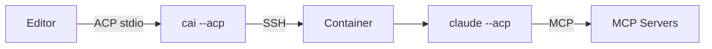

# fn-40-996.3 Documentation

## Description
Document the ACP proxy including multi-session support and MCP server handling.

## Acceptance
- [ ] docs/acp.md with comprehensive usage guide
- [ ] Editor setup guides (Zed, VS Code, Cursor)
- [ ] MCP server explanation (what works, what doesn't)
- [ ] Troubleshooting section

## Implementation Notes

### User Documentation
Create `docs/acp.md`:

```markdown
# ACP Integration

ContainAI supports the [Agent Client Protocol](https://agentclientprotocol.com) (ACP) for editor integration.

## Quick Start

Configure your editor to use `cai --acp <agent>`:

**Zed** (`~/.config/zed/settings.json`):
```json
{
  "agent_servers": {
    "claude-sandbox": {
      "type": "custom",
      "command": "cai",
      "args": ["--acp", "claude"]
    }
  }
}
```

**VS Code** (with ACP extension):
```json
{
  "acp.executable": "cai",
  "acp.args": ["--acp", "claude"]
}
```

## How It Works



1. Editor spawns `cai --acp claude`
2. Editor sends `initialize`, then `session/new` with workspace and MCP config
3. Proxy creates container for workspace, connects to agent
4. Agent handles MCP servers (spawns stdio, connects to HTTP/SSE)
5. All communication proxied through

## Multiple Sessions

One proxy process can handle multiple editor sessions:
- Each `session/new` can target a different workspace
- Different workspaces use different containers
- Messages routed by `sessionId`

## MCP Servers

MCP servers provide tools and context to the agent. The agent (not the proxy) manages MCP connections.

### What Works

| MCP Type | Works? | Notes |
|----------|--------|-------|
| HTTP/SSE | ✅ Yes | Agent connects directly from container |
| Stdio (in container) | ✅ Yes | Package must be installed in container |
| Stdio (host-only) | ❌ No | Can't spawn host processes from container |

### Installing MCP Packages in Container

For stdio MCP servers to work, install their packages in the container image:

```dockerfile
# In Dockerfile.agents
RUN npm install -g @modelcontextprotocol/server-filesystem \
                   @mcp/fetch \
                   @mcp/postgres
```

Or install at runtime:
```bash
cai shell
npm install -g @mcp/whatever
```

### HTTP/SSE to Localhost

For MCP servers running on your host machine:
- Container uses `host.docker.internal` to reach host
- Configure MCP URL as `http://host.docker.internal:PORT/...`

## Path Handling

Your local paths work transparently:
```
/home/user/project -> /home/agent/workspace (symlink in container)
```

MCP server args containing the workspace path are automatically translated.

## Supported Agents

| Agent | Command |
|-------|---------|
| Claude Code | `cai --acp claude` |
| Codex | `cai --acp codex` |
| Gemini CLI | `cai --acp gemini` |
| Goose | `cai --acp goose` |

## Troubleshooting

### Agent not starting
```bash
cai shell
which claude  # Verify agent installed
claude --help | grep -i acp  # Verify ACP support
```

### MCP server not found
```bash
cai shell
which npx  # Verify npm available
npx @mcp/fetch --version  # Verify MCP package works
```

### Can't reach host services
```bash
# From container, verify host.docker.internal works
cai shell
curl http://host.docker.internal:8080/
```

### Multiple sessions not routing
Check that each `session/new` returned a unique `sessionId`.
```

## Dependencies
- fn-40-996.2 (Integration Testing)

## Done summary
TBD

## Evidence
- Commits:
- Tests:
- PRs:
