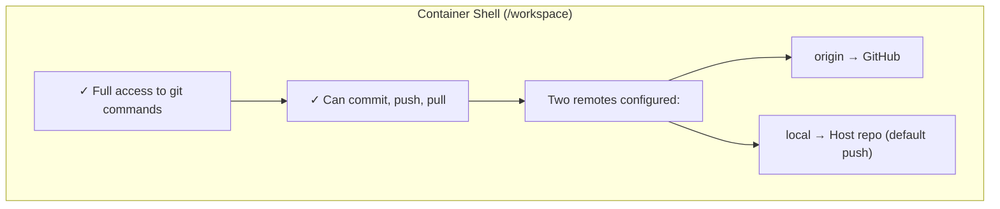
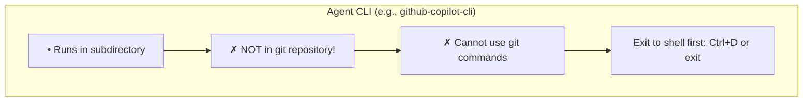
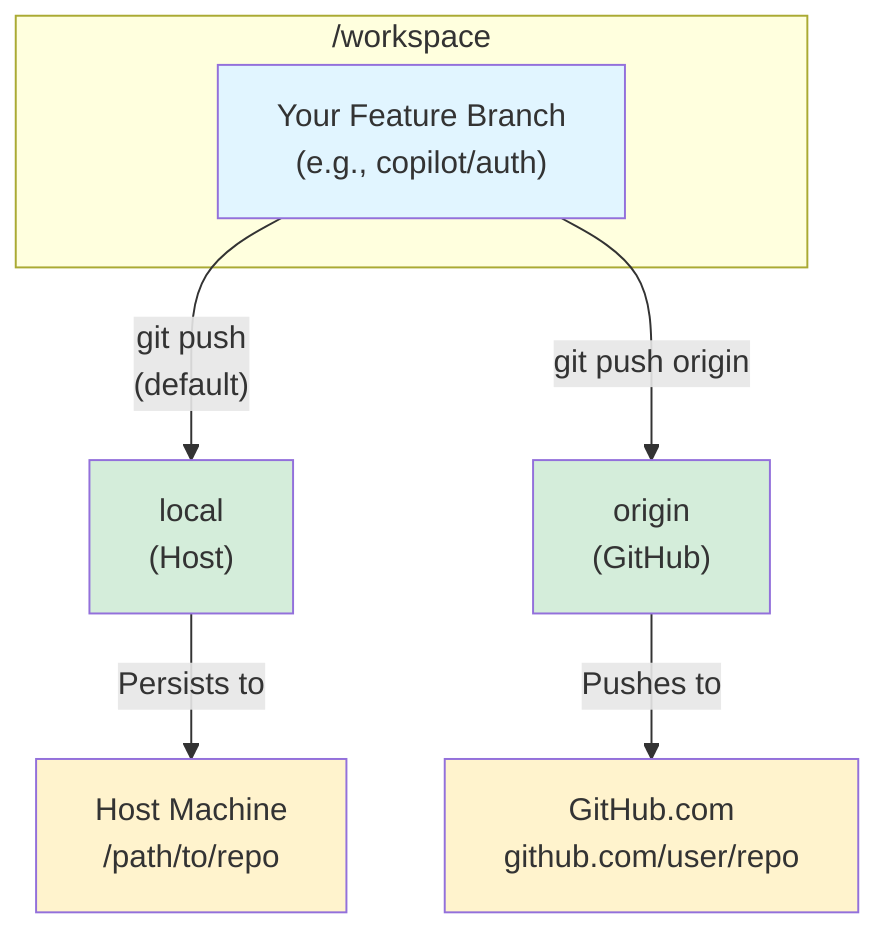

# Usage Guide

Quick guide for running AI coding agents in isolated containers.

## Recommended Approach: Ephemeral Containers

For most use cases, use the **`run-*` scripts** (run-copilot, run-codex, run-claude). These create temporary containers that:
- Launch instantly
- Auto-remove when you exit (no cleanup needed)
- Auto-push changes before exit (safe by default)
- Work like any other CLI tool

Use **`launch-agent`** only when you need:
- Long-running background containers
- Advanced branch management
- Network proxy controls
- Multiple persistent agents on the same repo

## What You Need

### On Your Host Machine

1. **Container Runtime**: Docker or Podman
   - **Docker**: Docker Desktop (with WSL2 on Windows) - [docker.com](https://www.docker.com/products/docker-desktop)
   - **Podman**: Podman Desktop or CLI - [podman.io](https://podman.io/getting-started/installation)
   - Scripts auto-detect which runtime is available
2. **GitHub CLI** authenticated: `gh auth login`
3. **Git configured:**
   ```bash
   git config --global user.name "Your Name"
   git config --global user.email "your@email.com"
   ```

### Optional: Agent Authentication

- **GitHub Copilot**: Already handled by `gh auth login`
- **OpenAI Codex**: Setup OAuth, config at `~/.config/codex/`
- **Anthropic Claude**: Setup OAuth, config at `~/.config/claude/`

### Optional: MCP Server API Keys

If using MCP servers, create `~/.config/coding-agents/mcp-secrets.env`:

```bash
GITHUB_TOKEN=ghp_your_token_here
CONTEXT7_API_KEY=your_key_here
```

## Get the Images

### Option 1: Pull Pre-Built (Recommended)

```bash
docker pull ghcr.io/novotnyllc/coding-agents-copilot:latest
docker pull ghcr.io/novotnyllc/coding-agents-codex:latest
docker pull ghcr.io/novotnyllc/coding-agents-claude:latest
```

### Option 2: Build Locally

```bash
# Get the repository
git clone https://github.com/novotnyllc/coding-agents.git
cd coding-agents

# Build images
./scripts/build.sh  # Linux/Mac
.\scripts\build.ps1 # Windows
```

See [BUILD.md](BUILD.md) for details.

## Container Naming Convention

All containers follow the pattern: `{agent}-{repo}-{branch}`

**Examples:**
- `copilot-myapp-main` - GitHub Copilot on myapp repository, main branch
- `codex-website-feature` - OpenAI Codex on website repository, feature branch
- `claude-api-develop` - Anthropic Claude on api repository, develop branch

**Why this naming?**
- **Easily identifiable:** See what's running at a glance with `docker ps`
- **No conflicts:** Multiple agents can work on the same repo/different branches
- **Management friendly:** Use `list-agents` to see all your agent containers
- **Labeled for filtering:** All containers have labels for agent, repo, and branch

**Container labels** (for filtering and automation):
```bash
coding-agents.type=agent       # Identifies agent containers
coding-agents.agent=copilot    # Which agent (copilot/codex/claude)
coding-agents.repo=myapp       # Repository name
coding-agents.branch=main      # Branch name
```

## Auto-Commit and Auto-Push Safety Features

All containers automatically commit and push uncommitted changes back to your local repository before shutting down. This ensures you never lose work even if a container is accidentally removed.

**How it works:**
1. When you exit a container (Ctrl+D, docker stop, remove-agent)
2. Container checks for uncommitted changes (staged or unstaged)
3. If changes exist, automatically commits them with a generated message
4. Pushes the commit to `local` remote (your host machine)
5. Container shuts down safely

**Example generated commit messages:**
```
feat: add user authentication with JWT tokens
fix: resolve null pointer exception in data loader
refactor: extract validation logic to separate class
chore: auto-commit (2 modified, 1 added)  # fallback if AI unavailable
```

The commit message is generated by asking the AI agent (GitHub Copilot) that was just running to analyze the changes and create a meaningful message. If the AI is unavailable, it falls back to a basic summary.

**Default behavior:** Auto-commit and auto-push are **enabled**

**Disable auto-commit (also disables auto-push):**
```bash
# For ephemeral launchers
AUTO_COMMIT_ON_SHUTDOWN=false run-copilot
AUTO_COMMIT_ON_SHUTDOWN=false run-codex

# PowerShell
$env:AUTO_COMMIT_ON_SHUTDOWN="false"; run-copilot.ps1
```

**Disable only auto-push (keep auto-commit):**
```bash
# For ephemeral launchers
AUTO_PUSH_ON_SHUTDOWN=false run-copilot
run-copilot --no-push

# PowerShell
run-copilot.ps1 -NoPush

# For persistent launchers
launch-agent copilot --no-push
launch-agent.ps1 copilot -NoPush

# When removing containers
remove-agent copilot-myapp-main --no-push
```

**When to disable:**
- Testing/experimental work you don't want to keep
- Temporary containers you plan to discard
- When you prefer manual commit messages

**Safety notes:**
- Auto-commit stages ALL changes (tracked files, untracked files, deletions)
- Auto-push only works if `local` remote is configured (automatically done by launchers)
- Ephemeral containers (`run-*` scripts) auto-remove after exit, so auto-commit/push is critical
- Persistent containers (`launch-agent`) stay running until explicitly removed

## Launcher Scripts

There are two types of launcher scripts. **Start with `run-*` for most tasks.**

### 1. Ephemeral Launchers (`run-*`) - RECOMMENDED

Fast, temporary containers that auto-remove on exit. Perfect for quick tasks.

**Available scripts:**
- `run-copilot` / `run-copilot.ps1` - GitHub Copilot
- `run-codex` / `run-codex.ps1` - OpenAI Codex
- `run-claude` / `run-claude.ps1` - Anthropic Claude

**Usage pattern:**
```bash
# Navigate to your project
cd ~/my-project

# Launch agent (defaults to current directory)
run-copilot
run-codex
run-claude

# PowerShell
run-copilot.ps1
run-codex.ps1
run-claude.ps1
```

**Optional flags:**
- `--no-push` / `-NoPush` - Disable auto-push on exit
- `--help` / `-Help` - Show usage information
- `[directory]` - Specify directory (default: current directory)

**Behavior:**
- Pulls latest image automatically
- Creates container named `{agent}-{repo}-{branch}`
- Auto-removes container on exit
- Auto-pushes changes to local remote before exit (unless --no-push)
- Interactive shell, exit with Ctrl+D

**Example:**
```bash
cd ~/my-project
run-copilot              # Launch on current directory
run-codex --no-push      # Launch without auto-push
run-claude ~/other-proj  # Launch on specific directory
```

### 2. Persistent Launchers (`launch-agent`) - ADVANCED

For long-running tasks or when you need advanced features. Containers run in background and support branch management, network controls, and .NET preview installs.

**When to use launch-agent:**
- Multi-day/week development sessions
- Need to disconnect and reconnect to same workspace
- Working on multiple branches with different agents
- Require network monitoring or restrictions
- Installing custom SDKs (e.g., .NET preview)

**Most users should use `run-*` scripts instead.**

**Basic Usage:**

```bash
# Everyday use - just launch
launch-agent copilot
launch-agent codex

# Work on specific feature
launch-agent copilot --branch refactor-db
launch-agent claude --branch optimize-queries

# Clone and work on GitHub repo
launch-agent copilot https://github.com/user/repo
launch-agent copilot https://github.com/user/repo --branch add-tests
```

**Parameters:**

| Parameter | Description | Example |
|-----------|-------------|---------|
| Agent (required, first) | Agent type: `copilot`, `codex`, `claude` | `copilot`, `codex`, `claude` |
| Source (positional) | Local path or GitHub URL (default: current directory) | `.`, `/path/to/repo`, `https://github.com/user/repo` |
| `-b` or `--branch` | Feature branch name (becomes `<agent>/<branch>`) | `-b auth` creates `copilot/auth` |
| `-y` or `--force` | Auto-replace existing agent branch without prompting | `-y` or `--force` |
| `--no-push` | Disable auto-push on shutdown | `--no-push` |
| `--use-current-branch` | Work directly on current branch instead of creating agent branch | `--use-current-branch` |
| `--dotnet-preview` | Install .NET preview SDK | `--dotnet-preview 11.0` |
| `--network-proxy` | Network mode: `allow-all` (default), `restricted`, `squid` | `--network-proxy restricted` |

**Branch Management:**

Agents work on isolated branches to keep their changes separate:

**Without `--branch` flag:**
- Creates unique session branch: `<agent>/session-1`, `<agent>/session-2`, etc.
- Useful for quick experiments or when you don't want to name a branch
- Example: `copilot/session-1`, `codex/session-2`

**With `--branch` flag:**
- Creates `<agent>/<branch>` from your current commit
- Example: `--branch feature-api` creates `copilot/feature-api`
- Example: `--branch refactor-auth` creates `claude/refactor-auth`

**Already on agent branch:**
- If current branch matches `<agent>/*` pattern, reuses it
- Example: Already on `copilot/session-1` → continues using it

**With `--use-current-branch`:**
- Works directly on whatever branch you're currently on
- No agent-specific branch created

When launching an agent, if its branch already exists:
1. **Prompt for replacement** (default: No)
   - Press `y` to replace the existing branch
   - Press `n` (or Enter) to abort
   - Use `-y` or `--force` flag to auto-replace without prompting

2. **Check for unmerged commits**
   - Lists commits not yet merged into the base branch
   - Shows up to 5 most recent unmerged commits

3. **Archive or delete**
   - **Has unmerged commits**: Archives to `<agent>/<branch>-archived-<timestamp>`
   - **No unmerged commits**: Safely deletes the branch
   - Prevents accidental work loss

When removing an agent container:
- Agent branches are automatically cleaned up
- Branches with unmerged commits are preserved (warning shown)
- Use `--keep-branch` flag to preserve the branch regardless

**Network Proxy Modes:**
- `allow-all` (default): Standard Docker bridge network
- `restricted`: Launch container with `docker --network none` (no outbound network)
- `squid`: Route HTTP/HTTPS through Squid proxy sidecar

Proxy sidecar resources (auto-created when using `squid` mode):
- Container: `{agent}-{repo}-proxy`
- Network: `{agent}-{repo}-net`
- Logs: `docker logs {container}-proxy`

See [NETWORK_PROXY.md](NETWORK_PROXY.md) for network configuration details.

**Behavior:**
- Runs in background (detached mode)
- Persists until explicitly removed
- Auto-pushes changes on `docker stop` or `remove-agent` (unless --no-push)
- Connect with VS Code Dev Containers or `docker exec`

## Examples

### Ephemeral Sessions (Recommended)

Use these for day-to-day development:

```bash
# Navigate to your project
cd ~/my-project

# Quick session with Copilot
run-copilot

# Quick session with Codex, no auto-push
run-codex --no-push

# Quick session on specific directory
run-claude ~/other-project
```

### Persistent Workspaces (Advanced) (Advanced)

For long-running development sessions:

```bash
# Navigate to your project
cd ~/my-project

# Launch with agent (required)
launch-agent copilot

# Launch different agent
launch-agent codex

# Work on feature branch
launch-agent copilot --branch feature-auth

# Clone from GitHub
launch-agent copilot https://github.com/user/repo
```

**Note:** For most tasks, use `run-copilot`, `run-codex`, or `run-claude` instead.

### Install .NET Preview SDK

```bash
cd ~/my-dotnet-project

# Install .NET 9.0 preview
launch-agent copilot --dotnet-preview 9.0

# Install .NET 10.0 preview with Codex
launch-agent codex --dotnet-preview 10.0
```

The preview SDK is installed at container startup and available alongside stable versions.

### Configure Network Access

```bash
cd ~/my-project

# Default (allow-all bridge network)
launch-agent copilot

# Restrict all outbound network traffic
launch-agent copilot --network-proxy restricted

# Proxy with Squid logging
launch-agent copilot --network-proxy squid
```

See [NETWORK_PROXY.md](NETWORK_PROXY.md) for detailed network configuration options.

> **Note:** Restricted mode disables outbound network connectivity; provide a local repository path instead of a Git URL when using this option.

## Multiple Agents, Same Repo

Launch multiple agents working on different features:

```bash
cd ~/my-project

# Launch different agents on different branches
launch-agent copilot --branch api-v2       # copilot-myproject-api-v2
launch-agent codex --branch database       # codex-myproject-database
launch-agent claude --branch frontend      # claude-myproject-frontend
```

Each agent gets:
- Own isolated workspace
- Own branch (`copilot/auth`, `codex/database`, `claude/ui`)
- Own container (`copilot-myproject-auth`, `codex-myproject-database`, `claude-myproject-ui`)

No conflicts!

## Managing Containers

**Note:** If you're using `run-*` scripts, you don't need these commands - containers auto-remove on exit. These are only needed for persistent containers created with `launch-agent`.

### List Active Agent Containers

View all running agent containers with status information:

```bash
list-agents           # Bash
list-agents.ps1       # PowerShell
```

**Example output:**
```
Active Agent Containers:
NAME                      STATUS       AGENT      BRANCH
copilot-myapp-main        Up 2 hours   copilot    main
codex-myapp-feature       Up 1 hour    codex      feature
claude-website-develop    Up 30 min    claude     develop
```

**Features:**
- Filters by `coding-agents.type=agent` label
- Shows container name, status, agent type, and branch
- Color-coded status (green=running, red=stopped)
- Empty list if no agent containers running

### Remove Agent Containers

Safely remove containers with automatic change preservation and branch cleanup:

```bash
# Remove with auto-push and branch cleanup (default)
remove-agent copilot-myapp-main
remove-agent.ps1 copilot-myapp-main

# Remove without auto-push
remove-agent copilot-myapp-main --no-push
remove-agent.ps1 copilot-myapp-main -NoPush

# Remove but keep the agent branch
remove-agent copilot-myapp-main --keep-branch
remove-agent.ps1 copilot-myapp-main -KeepBranch
```

**What it does:**
1. Checks for uncommitted changes
2. Pushes to local remote (unless --no-push)
3. Stops and removes the container
4. Removes proxy sidecar (if using squid mode)
5. Removes network (if empty and no other containers)
6. **Cleans up agent branch** (unless --keep-branch or has unmerged commits)

**Branch cleanup behavior:**
- **No unmerged commits**: Branch is safely deleted
- **Has unmerged commits**: Branch is preserved with a warning
- **--keep-branch flag**: Branch is always preserved
- Only affects local repositories (not remote URLs)

**Safety features:**
- Won't lose uncommitted work (auto-push default)
- Won't lose unmerged commits (preserved with warning)
- Cleans up all associated resources
- Reports what was removed

### Standard Docker Commands

You can also use standard Docker commands:

```bash
# List all containers (not just agents)
docker ps -a

# Stop a container (triggers auto-push trap)
docker stop copilot-myapp-main

# Remove a container (triggers auto-push trap if running)
docker rm -f copilot-myapp-main

# View logs
docker logs copilot-myapp-main

# Execute command in container
docker exec -it copilot-myapp-main bash
```

**Note:** Using `docker stop` or `docker rm -f` will trigger auto-push if the container is configured for it (default behavior).

## Connect from VS Code

Containers run in the background. Connect anytime:

1. Install **Dev Containers** extension
2. Click remote button (bottom-left)
3. Select "Attach to Running Container"
4. Choose your container (e.g., `copilot-app`)

Or via command line:
```bash
docker exec -it copilot-app bash
```

## Inside the Container

### Repository Location

Your code is at `/workspace`:
```bash
cd /workspace
ls -la
```

### Git Workflow: Understanding the Container Environment

The container has **two separate contexts** for working with git:

#### Context 1: Interactive Shell (bash)


#### Context 2: Agent CLI Mode


**Common Error:** Running git commands while in agent CLI:
```bash
copilot> git status
fatal: not a git repository
```

**Solution:** Exit agent CLI first (Ctrl+D), then run git commands:
```bash
copilot> ^D  # Exit agent
$ git status  # Now works!
```

#### Dual Remote Configuration

The container is configured with two git remotes for maximum flexibility:



**Default push target:** `local` (host machine)  
**Why?** Preserves changes on host even if container is deleted.

#### Git Remote Commands

**Check configured remotes:**
```bash
git remote -v
# origin  https://github.com/user/repo.git (fetch)
# origin  https://github.com/user/repo.git (push)
# local   /path/to/host/repo (fetch)
# local   /path/to/host/repo (push)
```

**Push to host (default - RECOMMENDED):**
```bash
git push
# Pushes to local remote (host machine)
# Changes are immediately visible on host
```

**Push to GitHub (for pull requests):**
```bash
git push origin
# Pushes to GitHub
# Use for creating PRs or backing up to remote
```

**Pull from host:**
```bash
git pull local main
# Syncs with host's main branch
```

**Pull from GitHub:**
```bash
git pull origin main
# Syncs with GitHub's main branch
```

#### Common Workflows

**Workflow 1: Quick local development (no PR)**
```bash
# Work in VS Code or shell
# ...make changes...

# Commit and push to host
git add .
git commit -m "Implemented feature"
git push  # Goes to host by default
```

**Workflow 2: Create GitHub PR**
```bash
# Work in VS Code or shell
# ...make changes...

# Commit and push to both remotes
git add .
git commit -m "Implemented feature"
git push         # Save to host first
git push origin  # Then push to GitHub for PR
```

**Workflow 3: Sync with team changes**
```bash
# Pull latest from GitHub
git pull origin main

# Merge into your feature branch
git merge origin/main

# Push updates to host
git push
```

#### Troubleshooting Git Issues

**Problem:** `fatal: not a git repository`
- **Cause:** You're in agent CLI mode, not the shell
- **Solution:** Exit agent (Ctrl+D), then run git commands

**Problem:** `git push` doesn't update GitHub
- **Cause:** Default push goes to `local` remote (host)
- **Solution:** Use `git push origin` for GitHub

**Problem:** Lost changes after deleting container
- **Cause:** Forgot to push before `docker rm`
- **Solution:** Always `git push` (to host) or `git push origin` (to GitHub) before removing containers

**Problem:** Can't push to host from container
- **Cause:** Host repo may not have your feature branch
- **Solution:** Push creates the branch automatically, or use `git push origin` instead

### MCP Configuration

If your workspace has `config.toml`, it's automatically converted to agent-specific JSON on container startup.

**Example config.toml:**
```toml
[mcp_servers.github]
command = "npx"
args = ["-y", "@modelcontextprotocol/server-github"]

[mcp_servers.context7]
command = "npx"
args = ["-y", "@upstash/context7-mcp"]
env = { CONTEXT7_API_KEY = "${CONTEXT7_API_KEY}" }
```

Secrets like `CONTEXT7_API_KEY` are loaded from `~/.config/coding-agents/mcp-secrets.env` (if mounted).

## Container Management

### List Containers

```bash
docker ps              # Running
docker ps -a           # All (including stopped)
```

### Stop Container

```bash
docker stop copilot-app
docker stop copilot-app-proxy    # When launched with --network-proxy squid
```

### Start Existing Container

```bash
docker start copilot-app
# or
.\launch-agent.ps1     # Auto-detects and starts existing
```

### Remove Container

```bash
docker rm -f copilot-app
docker rm -f copilot-app-proxy   # When launched with --network-proxy squid
docker network rm copilot-app-net  # Proxy network (only if no other containers attached)
```

⚠️ **Warning:** This deletes the container's workspace. Push your changes first!

### Container Logs

```bash
docker logs copilot-app
```

## Troubleshooting

### Authentication Warnings

If you see:
```
⚠️ WARNING: GitHub Copilot authentication not found!
```

**Solution:**
1. Run `gh auth login` on your host
2. Restart container: `docker restart copilot-app`

### MCP Servers Not Working

Check secrets file exists:
```bash
ls ~/.config/coding-agents/mcp-secrets.env
```

Verify tokens are valid:
- GitHub: https://github.com/settings/tokens
- Context7: https://context7.ai/

Restart container after adding/updating secrets.

### Container Already Exists

If you see "Container already exists":
```bash
# Remove old container
docker rm -f copilot-app

# Launch again
.\launch-agent.ps1
```

### Git Push Fails

```bash
# Check remotes
git remote -v

# Check which remote is default
git config remote.pushDefault

# Set explicitly
git push local copilot/feature-auth
# or
git push origin copilot/feature-auth
```

### Can't Connect from VS Code

1. Ensure container is running: `docker ps`
2. Install **Dev Containers** extension (ms-vscode-remote.remote-containers)
3. Try attaching with Docker extension instead

## Advanced Usage

### Force Specific Container Runtime

By default, scripts auto-detect Docker or Podman. To force a specific runtime:

```bash
# Force Podman
export CONTAINER_RUNTIME=podman
./run-copilot

# Force Docker
export CONTAINER_RUNTIME=docker
launch-agent copilot
```

```powershell
# Force Podman
$env:CONTAINER_RUNTIME = "podman"
.\run-copilot.ps1

# Force Docker  
$env:CONTAINER_RUNTIME = "docker"
.\launch-agent.ps1 copilot
```

### Custom Container Name

```powershell
.\launch-agent.ps1 copilot . --name experiment-1
# Creates: copilot-experiment-1
```

### Specify Git Remote Manually

Edit inside container:
```bash
git remote add upstream https://github.com/upstream/repo.git
git fetch upstream
```

### Use docker-compose (Advanced)

```bash
# Create .env
cp .env.example .env

# Start services
REPO_PATH=/path/to/repo docker-compose up -d

# Connect
docker exec -it coding-agent bash
```

Most users should use `launch-agent` instead.

## What Happens Behind the Scenes

When you run `launch-agent`:

1. **Detects source:**
   - Local path: Copies entire repo into container
   - GitHub URL: Clones repo into container

2. **Creates container:**
   - Mounts OAuth configs from host (read-only)
   - Runs in background (persistent)
   - Creates workspace at `/workspace`

3. **Setups git:**
   - Sets `origin` remote (GitHub)
   - Sets `local` remote (host path, if applicable)
   - Sets `local` as default push target
   - Configures gh CLI for credentials

4. **Creates branch:**
   - Checks out `<agent>/<branch-name>`
   - Example: `copilot/feature-auth`

5. **Loads MCP config:**
   - Looks for `/workspace/config.toml`
   - Converts to agent-specific JSON
   - Loads secrets from `~/.mcp-secrets.env`

6. **Ready:**
   - Container runs in background
   - Connect via VS Code or shell

## Security Notes

✅ **Safe:**
- OAuth authentication (no hardcoded API keys)
- Read-only mounts from host
- Non-root user in container
- No secrets in repository
- No secrets in container images
- Isolated filesystem per container

⚠️ **Keep secure:**
- `~/.config/coding-agents/mcp-secrets.env` (outside any git repo)
- Don't commit `.env` files with real tokens

## Command Reference

### Run Agent (Recommended)
```bash
# Bash
run-copilot [directory] [--no-push] [--help]
run-codex [directory] [--no-push] [--help]
run-claude [directory] [--no-push] [--help]

# PowerShell
run-copilot.ps1 [directory] [-NoPush] [-Help]
run-codex.ps1 [directory] [-NoPush] [-Help]
run-claude.ps1 [directory] [-NoPush] [-Help]
```

**Parameters:**
- `directory`: Local path (default: current directory)
- `-NoPush`/`--no-push`: Disable auto-push on exit
- `-Help`/`--help`: Show usage information

### Launch Agent (Advanced)
```powershell
# PowerShell
.\launch-agent.ps1 <agent> [source] [-Branch name] [-Name custom]

# Bash
./launch-agent <agent> [source] [-b name] [--name custom]
```

**Parameters:**
- `agent`: Agent type (required): copilot, codex, or claude
- `source`: Directory path or GitHub URL (default: current dir)
- `-Branch`/`-b`: Branch name (default: current branch or "main")
- `-Name`/`--name`: Custom container name (default: auto-generated)

For container management (stop, start, remove), see the [Container Management](#container-management) section.

## Examples

### Single agent, quick task

```powershell
.\launch-agent.ps1 copilot
# Work in container
# Push changes
docker rm -f copilot-myrepo
```

### Long-term development

```powershell
.\launch-agent.ps1 copilot C:\projects\app -b feature-api
# Connect from VS Code
# Work over days/weeks
# Container persists until you remove it
```

### Multiple features, multiple agents

```powershell
.\launch-agent.ps1 copilot . -b backend-api
.\launch-agent.ps1 claude . -b frontend-redesign
.\launch-agent.ps1 codex . -b tests
```

### Experiment with open source

```powershell
.\launch-agent.ps1 copilot https://github.com/microsoft/vscode -b explore
# Explore in isolated environment
# No impact on host
docker rm -f copilot-vscode  # Clean up when done
```

## FAQ

**Q: Do I need to build the images myself?**  
A: No if using published images. Yes if making custom changes.

**Q: Where are my changes stored?**  
A: Inside the container at `/workspace`. They're persistent until you remove the container.

**Q: How do I get my changes out?**  
A: Use `git push` (pushes to `local` remote on host by default) or `git push origin` (pushes to GitHub).

**Q: Can I edit files from host while container is running?**  
A: No, the workspace is isolated inside the container. Use VS Code Remote to edit.

**Q: What if I accidentally delete the container?**  
A: If you pushed your changes to git, you can recover. Otherwise, they're lost. Always push!

**Q: Do all agents see the same code?**  
A: No, each container has its own isolated copy of the repository.

**Q: How much disk space do containers use?**  
A: Images: ~4GB base + 100MB per agent. Containers: depends on your code size.

**Q: Can I use this without VS Code?**  
A: Yes, use `docker exec -it <container> bash` for a terminal.

---

**Next Steps:**
- See [docs/BUILD.md](docs/BUILD.md) if building images yourself
- See [docs/ARCHITECTURE.md](docs/ARCHITECTURE.md) for system design
- See [docs/NETWORK_PROXY.md](docs/NETWORK_PROXY.md) for network configuration
- See [docs/TEST_PLAN.md](docs/TEST_PLAN.md) for comprehensive testing procedures
