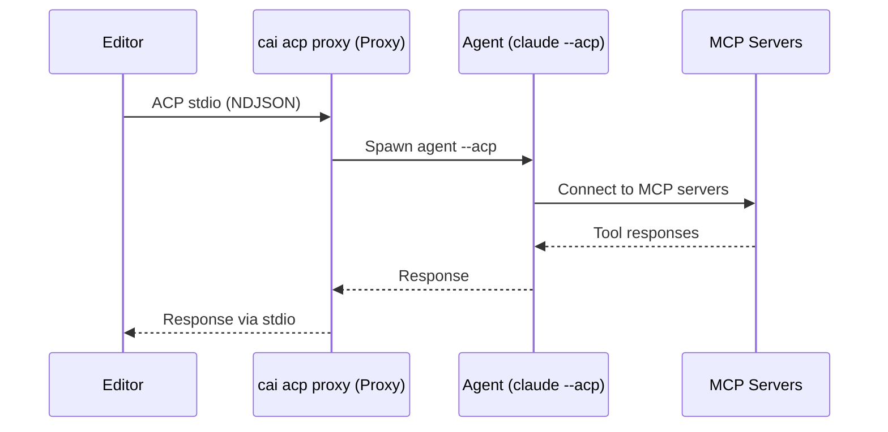

# ACP Integration

ContainAI supports the [Agent Client Protocol](https://agentclientprotocol.com) (ACP) for editor integration. This allows editors like Zed and VS Code to run AI agents in isolated environments.

## Quick Start

Configure your editor to use `cai acp proxy <agent>`:

**Zed** (`~/.config/zed/settings.json`):
```json
{
  "agent_servers": {
    "claude-sandbox": {
      "type": "custom",
      "command": "cai",
      "args": ["acp", "proxy", "claude"]
    }
  }
}
```

**VS Code** (with ACP extension):
```json
{
  "acp.executable": "cai",
  "acp.args": ["acp", "proxy", "claude"]
}
```

## How It Works



1. Editor spawns `cai acp proxy claude`
2. Editor sends `initialize`, then `session/new` with workspace and MCP config
3. Proxy resolves workspace root (git root or `.containai/config.toml` parent)
4. Proxy spawns `<agent> --acp` through `CliWrap`
5. Agent handles MCP servers (spawns stdio, connects to HTTP/SSE)
6. All communication proxied through

### Protocol Details

- **Framing**: NDJSON (newline-delimited JSON), not `Content-Length` headers like LSP
- **Session IDs**: Proxy namespaces session IDs to prevent collisions between agents
- **Output**: Serialized through single writer to prevent interleaved output
- **Transport runtime**: Agent processes are launched through `CliWrap` and bridged with channel-based stdin/stdout forwarding (no direct `Process.Start` calls in production ACP code)
- **Protocol model**: JSON-RPC contracts are strongly typed (`JsonRpcEnvelope`, `JsonRpcId`, `JsonRpcData`) and source-generated for AOT safety.

## Multiple Sessions

One proxy process can handle multiple editor sessions:

- Each `session/new` can target a different workspace
- Different workspaces use different agent sessions
- Subdirectories map to their workspace root
- Messages routed by `sessionId`

### Workspace Resolution

When the editor sends a `cwd` in `session/new`, the proxy resolves it to a workspace root:

1. Find nearest `.git` directory (git repository root)
2. Find nearest `.containai/config.toml` (ContainAI project root)
3. Use `cwd` as-is (fallback)

Multiple sessions with paths in the same workspace tree share the same workspace mapping context.

## MCP Servers

MCP (Model Context Protocol) servers provide tools and context to the agent. The agent (not the proxy) manages MCP connections.

### What Works

| MCP Type | Works? | Notes |
|----------|--------|-------|
| HTTP/SSE (remote) | Yes | Agent connects directly from the runtime environment |
| Stdio (local) | Yes | Package must be installed where `cai acp proxy` runs |
| HTTP/SSE (`localhost`) | Yes | Works when the service is reachable from the runtime environment |
| Stdio (remote-only) | No | Process must be launchable from the local runtime environment |

### Installing MCP Packages

For stdio MCP servers to work, their packages must be installed in the same environment as `cai acp proxy`:

```bash
npm install -g @modelcontextprotocol/server-filesystem \
               @mcp/fetch \
               @mcp/postgres
```

### Host-Local Services

If `cai acp proxy` runs inside an isolated runtime and you need host-local services:

1. Ensure your runtime can resolve host networking:
   ```bash
   docker run --add-host=host.docker.internal:host-gateway ...
   ```

2. Configure MCP URL as `http://host.docker.internal:PORT/...`

**Note**: In isolated/containerized runtimes this often requires explicit `--add-host` configuration.

### Path Translation

Your local paths work transparently:
```
/home/user/project -> /home/agent/workspace
```

MCP server args containing workspace paths are translated automatically:

| Host Path | Runtime Path |
|-----------|----------------|
| `/home/user/project` | `/home/agent/workspace` |
| `/home/user/project/src` | `/home/agent/workspace/src` |
| `/other/path` | `/other/path` (unchanged) |

The translation is path-aware and only applies to absolute paths that are descendants of the workspace.

## Supported Agents

ContainAI supports **any agent** that implements the ACP protocol. The agent binary must be available in `PATH` and support the `--acp` flag.

### Built-in Agents

| Agent | Command | Notes |
|-------|---------|-------|
| Claude Code | `cai acp proxy claude` | Pre-installed in default images |
| Gemini CLI | `cai acp proxy gemini` | Pre-installed in default images |

### Custom Agents

Any ACP-compatible agent can be used:

```bash
# Use a custom agent
cai acp proxy myagent

# The agent must:
# 1. Be installed and available on PATH
# 2. Support the --acp flag for ACP protocol mode
```

**Installing custom agents:** Add them to your template Dockerfile:

```dockerfile
# In your custom template Dockerfile
RUN npm install -g @mycompany/myagent
# or
RUN pip install myagent
```

Or install at runtime via shell:
```bash
cai shell
npm install -g @mycompany/myagent
```

## Editor Configuration

### Zed

Add to `~/.config/zed/settings.json`:

```json
{
  "agent_servers": {
    "claude-sandbox": {
      "type": "custom",
      "command": "cai",
      "args": ["acp", "proxy", "claude"]
    }
  }
}
```

For multiple agents:

```json
{
  "agent_servers": {
    "claude-sandbox": {
      "type": "custom",
      "command": "cai",
      "args": ["acp", "proxy", "claude"]
    },
    "gemini-sandbox": {
      "type": "custom",
      "command": "cai",
      "args": ["acp", "proxy", "gemini"]
    }
  }
}
```

See [Zed External Agents documentation](https://zed.dev/docs/ai/external-agents) for more details.

### VS Code

With an ACP-compatible extension, add to `settings.json`:

```json
{
  "acp.executable": "cai",
  "acp.args": ["acp", "proxy", "claude"]
}
```

## Troubleshooting

### Agent not starting

Verify the agent is installed and available on PATH:
```bash
cai shell
command -v <agent>  # e.g., command -v claude or command -v myagent
<agent> --help | grep -i acp  # Verify ACP support
```

If the agent is not found, you'll see an error like:
`Agent '<agent>' not found. Ensure the agent binary is installed and in PATH.`

**Solutions:**
- Check the agent name spelling matches the binary name
- Install the agent so it is available on PATH

### MCP server not found

```bash
which npx  # Verify npm available
npx @mcp/fetch --version  # Verify MCP package works
```

If the package is not found, install it in the runtime environment where ACP is running.

### Can't reach host services

From the runtime environment, verify `host.docker.internal` resolves (when applicable):
```bash
ping host.docker.internal  # Should resolve to host IP
curl http://host.docker.internal:8080/  # Test connectivity
```

If this fails in an isolated runtime, add `--add-host=host.docker.internal:host-gateway` to the runtime/container launch configuration.

### Multiple sessions not routing

Check that each `session/new` returned a unique `sessionId`. The proxy uses these IDs to route messages to the correct agent process.

### Protocol errors

The proxy uses NDJSON (newline-delimited JSON) framing. If you see parsing errors:

- Ensure each message is a single line
- Messages must end with newline
- No embedded newlines in JSON values

### Stdout pollution

ACP requires stdout purity - only protocol messages should appear. If you see diagnostic output:

- All ContainAI diagnostic output goes to stderr in ACP mode
- Check for shell initialization scripts that may print to stdout

### Session timeout

The proxy waits up to 30 seconds for agent responses to `initialize` and `session/new`. If timeouts occur:

- Verify agent is responsive: `claude --version`
- Check for errors in stderr output

## Environment Variables

For testing and debugging:

| Variable | Description |
|----------|-------------|
| `CAI_ACP_TEST_MODE=1` | Allow any agent name (for testing) |
| `CAI_NO_UPDATE_CHECK=1` | Skip update checks |

## Limitations

- **Stdio transport only**: HTTP/WebSocket ACP transport not supported
- **Host MCP servers**: Stdio servers that only exist on another host cannot run without host access
- **host.docker.internal**: Requires explicit runtime/container networking configuration for host-local HTTP services
- **Agent availability**: Agents must be installed and available on PATH

## References

- [ACP Specification](https://agentclientprotocol.com)
- [ACP Architecture](https://agentclientprotocol.com/overview/architecture)
- [MCP Introduction](https://modelcontextprotocol.io/introduction)
- [MCP Architecture](https://modelcontextprotocol.io/docs/learn/architecture)
- [Zed External Agents](https://zed.dev/docs/ai/external-agents)
