# Adding a New Agent to ContainAI

This guide explains how to add support for a new AI coding agent to ContainAI.

> **User looking to add a custom tool?** This guide is for contributors adding built-in agents to ContainAI. If you want to sync your own tool's config files, see [Custom Tools Guide](custom-tools.md) instead.

## Overview

Adding an agent involves five steps:

```mermaid
%%{init: {'theme': 'base', 'themeVariables': {
  'primaryColor': '#1a1a2e',
  'primaryTextColor': '#ffffff',
  'primaryBorderColor': '#16213e',
  'secondaryColor': '#0f3460',
  'tertiaryColor': '#1a1a2e',
  'lineColor': '#a0a0a0',
  'textColor': '#ffffff',
  'background': '#0d1117'
}}}%%
flowchart LR
    S1["1. Research<br/>Installation & config"]
    S2["2. Dockerfile<br/>Add to Dockerfile.agents"]
    S3["3. Manifest<br/>Create per-agent file"]
    S4["4. Generators<br/>Run & check consistency"]
    S5["5. Test<br/>Verify in container"]

    S1 --> S2
    S2 --> S3
    S3 --> S4
    S4 --> S5

    style S1 fill:#1a1a2e,stroke:#16213e,color:#fff
    style S2 fill:#0f3460,stroke:#16213e,color:#fff
    style S3 fill:#1a1a2e,stroke:#16213e,color:#fff
    style S4 fill:#0f3460,stroke:#16213e,color:#fff
    style S5 fill:#1a1a2e,stroke:#16213e,color:#fff
```



1. **Research** - Understand the agent's installation and configuration
2. **Dockerfile** - Add installation to `Dockerfile.agents`
3. **Manifest** - Create per-agent manifest file in `src/manifests/`
4. **Generators** - Run generators and consistency check
5. **Test** - Verify in container

## Conventions

This section documents the patterns and practices for agent configuration. Follow these conventions to ensure consistency with existing agents.

### Flag Usage Guidelines

Choose flags based on the entry's purpose:

| Scenario | Flags | Rationale |
|----------|-------|-----------|
| JSON config file | `fj` | Creates `{}` if file doesn't exist |
| JSON config with API keys | `fjs` | Adds secret permissions (600) |
| Plain config file | `f` | No special initialization |
| Credential file (OAuth, API key) | `fs` | Secret flag for restrictive permissions |
| Config directory | `d` | Basic directory sync |
| Skills/plugins directory | `dR` | `R` removes stale content before linking |
| Skills with `.system/` subdir | `dxR` | `x` excludes agent-managed `.system/` |
| Non-primary agent entry | add `o` | Skips sync if host path doesn't exist |

### Path Pattern Conventions

The three path fields serve distinct purposes:

```toml
[[entries]]
source = ".agent/config.json"         # 1. Host path (relative to $HOME)
target = "agent/config.json"          # 2. Volume path (relative to /mnt/agent-data)
container_link = ".agent/config.json" # 3. Container symlink (relative to ~)
```

**Guidelines:**

- **source**: Always includes the leading dot (e.g., `.claude/settings.json`)
- **target**: Drops the leading dot for visibility in volume (e.g., `claude/settings.json`)
- **container_link**: Matches `source` exactly in most cases (the symlink recreates the expected path)

**Exceptions:**

- **No symlink needed**: Set `container_link = ""` when the file is accessed via a parent directory symlink
- **Renamed symlink**: Use a different name when the container should have a distinct file (e.g., `.bash_aliases_imported` vs `.bash_aliases`)

### Optional Sync (`o` flag)

Use the `o` flag to distinguish primary agents from optional ones:

**Primary agents** (Claude, Codex, OpenCode):
- Omit the `o` flag
- Configs are always synced from host
- Directories are pre-created in the container image
- These are agents ContainAI explicitly supports

**Optional agents** (Gemini, Pi, Copilot, Kimi, Aider, Continue, Cursor):
- Include the `o` flag on all entries
- Configs only sync if the user has them on the host
- No empty directories created for unused agents
- Prevents clutter for agents users haven't configured

```toml
# Primary agent - no 'o' flag
[[entries]]
source = ".claude/settings.json"
target = "claude/settings.json"
container_link = ".claude/settings.json"
flags = "fj"

# Optional agent - has 'o' flag
[[entries]]
source = ".gemini/settings.json"
target = "gemini/settings.json"
container_link = ".gemini/settings.json"
flags = "fjo"  # 'o' makes this optional
```

### Credential Handling (`s` flag)

The `s` flag marks files containing sensitive data:

**When to use `s`:**
- OAuth tokens (e.g., `.claude/.credentials.json`, `.codex/auth.json`)
- API keys in config files (e.g., `.claude.json`, `.kimi/config.toml`)
- Account files (e.g., `.gemini/google_accounts.json`, `.gemini/oauth_creds.json`)

**What `s` does:**
- Files get 600 permissions (owner read/write only)
- Directories get 700 permissions
- Entries are skipped with `cai import --no-secrets`

**When NOT to use `s`:**
- User preference files (settings, keybindings)
- Skills and plugins directories
- Public config like `.gitconfig` (even though it's filtered)

```toml
# Credential file - use 's'
[[entries]]
source = ".codex/auth.json"
target = "codex/auth.json"
container_link = ".codex/auth.json"
flags = "fs"  # file + secret

# Settings file - no 's' needed
[[entries]]
source = ".codex/config.toml"
target = "codex/config.toml"
container_link = ".codex/config.toml"
flags = "f"  # file only
```

### Directory Flags

Special flags for directory entries:

| Flag | Use Case | Example |
|------|----------|---------|
| `d` | Basic directory | `.config/opencode/agents` |
| `dR` | Pre-populated directory | `.claude/skills` (may have defaults) |
| `dxR` | Has `.system/` subdir | `.codex/skills` (agent manages `.system/`) |
| `dm` | Mirror sync | When deletions should propagate |
| `dp` | Privacy filter | `.bashrc.d` (excludes `*.priv.*` files) |

The `R` flag is important for directories that may be pre-populated in the container image. Without it, the symlink creation can fail if the directory already exists.

## Step 1: Research the Agent

Before adding a new agent, understand:

- **Installation method**: npm/bun, pip/uv, curl installer, apt package?
- **Configuration location**: `~/.config/agent/`, `~/.agent/`, `~/.agentrc`?
- **Credential storage**: Which files contain API keys or OAuth tokens?
- **Startup requirements**: Environment variables, symlinks, services?

Example research for a hypothetical agent:

```bash
# Check where agent stores config
ls -la ~/.myagent/
# Check if there's a version command
myagent --version
# Check installation method docs
```

## Step 2: Add to Dockerfile.agents

Add installation after the SDK layers in `src/container/Dockerfile.agents`.

### Required Agents (Fail-Fast)

For agents that must be present in the image (like Claude, Codex):

```dockerfile
# =============================================================================
# AGENT NAME
# =============================================================================
RUN <installation-command> && \
    # Verify agent installed correctly
    agent --version
```

The `&& agent --version` ensures the build fails immediately if installation breaks.

### Optional Components (Soft-Fail)

For truly optional components where absence is acceptable:

```dockerfile
# Optional: Agent Name (soft-fail if unavailable)
RUN ( <installation-command> && agent --version ) \
    || echo "[WARN] Agent installation failed - continuing without it"
```

**Guidelines:**

- **Required agents**: Use fail-fast pattern with `&& agent --version`
- **Optional components**: Use explicit grouping `( cmd ) || warn` with clear justification
- Group related commands with `&&`
- Document any special requirements in comments

### Simplified Examples

The examples below show the general pattern. For the canonical source, see `src/container/Dockerfile.agents`.

**Note**: The `o` flag in the manifest refers to whether host configs are *synced*, not whether the CLI is installed. All these CLIs are installed with fail-fast verification.

**Claude Code** (configs always synced):

```dockerfile
# Install Claude Code via official installer
RUN curl -fsSL https://claude.ai/install.sh | bash && \
    /home/agent/.local/bin/claude --version
```

**Gemini CLI** (configs synced only if present on host):

```dockerfile
# Simplified - see Dockerfile.agents for full install with browser deps
RUN . /home/agent/.nvm/nvm.sh && \
    bun install -g --trust @google/gemini-cli && \
    gemini --version
```

**Kimi CLI** (configs synced only if present on host):

```dockerfile
RUN uv tool install --python 3.13 kimi-cli && \
    kimi --version
```

## Step 3: Create Per-Agent Manifest File

Create a new manifest file in `src/manifests/` for your agent.

### Directory Structure

Manifests are organized with numeric prefixes for deterministic processing order:

```
src/manifests/
├── 00-common.toml    # Shared entries (fonts, agents directory)
├── 01-shell.toml     # Shell configuration
├── 02-git.toml       # Git configuration
├── ...
├── 10-claude.toml    # Claude Code agent
├── 11-codex.toml     # Codex agent
├── 12-gemini.toml    # Gemini agent
└── XX-myagent.toml   # Your new agent
```

Choose a numeric prefix that places your agent in the correct order. Agents typically start at 10+.

### Manifest File Format

Each agent has its own TOML file with optional `[agent]` section and `[[entries]]`:

```toml
# src/manifests/XX-myagent.toml
# =============================================================================
# MY AGENT
# Description of what agent does
# Docs: https://agent.example.com
# =============================================================================

# [agent] section is ONLY needed if the agent needs a launch wrapper
# (for autonomous mode flags like --dangerously-skip-permissions or --yolo)
[agent]
name = "myagent"
binary = "myagent"                     # Command name in PATH
default_args = ["--auto-mode"]         # Wrapper only generated if non-empty
aliases = []                           # Additional command aliases (optional)
optional = true                        # If true, wrapper guarded by command -v check

[[entries]]
source = ".agent/config.json"         # Path on host (relative to $HOME)
target = "agent/config.json"          # Path in data volume (/mnt/agent-data)
container_link = ".agent/config.json" # Symlink in container home
flags = "fjos"                        # Flags (see reference below)
```

### The `[agent]` Section

The `[agent]` section defines launch wrapper generation for agents that need default arguments (typically autonomous mode flags).

| Field | Type | Required | Description |
|-------|------|----------|-------------|
| `name` | string | Yes | Agent name (used for function name) |
| `binary` | string | Yes | Binary name in PATH |
| `default_args` | array | Yes | Arguments prepended to all invocations (use `[]` if none) |
| `aliases` | array | No | Additional command names to wrap |
| `optional` | boolean | No | If true, wrapper guarded by `command -v` check |

**When to include `[agent]` section:**
- Agent has an autonomous/yolo mode flag you want as default
- Example: Claude uses `--dangerously-skip-permissions`, Gemini uses `--yolo`

**When to omit `[agent]` section:**
- Config-only tools (editors, shell configs, VS Code)
- Agents without autonomous mode flags (OpenCode)
- Tools that don't need a launch wrapper

### Entry Format

```toml
[[entries]]
source = ".agent/config.json"         # Path on host (relative to $HOME)
target = "agent/config.json"          # Path in data volume (/mnt/agent-data)
container_link = ".agent/config.json" # Symlink in container home
flags = "fjos"                        # Flags (see reference below)
```

### Flags Reference

| Flag | Meaning | Example Use |
|------|---------|-------------|
| `f` | File (not directory) | Single config files |
| `d` | Directory | Config directories, plugins |
| `j` | JSON init (create `{}` if empty) | JSON config files |
| `s` | Secret (600 for files, 700 for dirs; skipped with `--no-secrets`) | API keys, OAuth tokens |
| `o` | Optional (skip if source doesn't exist; don't pre-create in Dockerfile/init) | Agents user may not have installed |
| `m` | Mirror mode (`--delete` removes extras) | Strict directory sync |
| `x` | Exclude `.system/` subdirectory | Skills directories with system-managed files |
| `R` | Remove existing path first (`rm -rf` before `ln -sfn`) | Directories that may be pre-populated |
| `g` | Git filter (strip credential.helper and signing config) | `.gitconfig` special handling |
| `G` | Glob/dynamic pattern (discovered at runtime, not synced directly) | SSH key patterns like `id_*` |
| `p` | Privacy filter (exclude `*.priv.*` files) | Directories with private scripts |

### Always-Sync vs Optional-Sync Agents

This distinction is about **config syncing**, not installation. Agent CLIs that ContainAI ships are installed via `Dockerfile.agents`; some manifest entries are for editor/integration configs (e.g., Continue, Cursor) and do not imply an installed CLI. The `o` flag controls whether host configs are synced.

**Always-sync agents** (Claude, Codex): Omit the `o` flag. Host configs are always synced and their directories are pre-created in the container image.

```toml
# Claude - always synced, no 'o' flag
[[entries]]
source = ".claude/settings.json"
target = "claude/settings.json"
container_link = ".claude/settings.json"
flags = "fj"  # file, json-init (no 'o')
```

**Optional-sync agents** (Gemini, Pi, Copilot, Kimi): Use the `o` flag. Host configs are only synced if the user has them configured on the host, preventing empty directories in the container for agents the user doesn't use. The agent CLIs are still installed in the image.

```toml
# Gemini - optional sync, has 'o' flag
[[entries]]
source = ".gemini/settings.json"
target = "gemini/settings.json"
container_link = ".gemini/settings.json"
flags = "fjo"  # file, json-init, OPTIONAL sync
```

### Secret Files

Files containing API keys, OAuth tokens, or credentials should have the `s` flag:

```toml
[[entries]]
source = ".agent/auth.json"
target = "agent/auth.json"
container_link = ".agent/auth.json"
flags = "fs"  # file, SECRET
```

Secret files are:
- Created with restrictive permissions (600 for files, 700 for directories)
- Skipped when `cai import --no-secrets` is used

### Container-Only Symlinks

For entries that exist only in the container (not imported from host):

```toml
[[container_symlinks]]
target = "some/path/file.json"        # Path in volume
container_link = ".config/file.json"  # Symlink in container home
flags = "fj"                          # flags for structure
```

Use this for files that are created inside the container but should persist on the data volume.

### Disabled Entries

For entries that should generate symlinks/init but not be synced by default:

```toml
[[entries]]
source = ".agent/config"
target = "agent/config"
container_link = ".agent/config"
flags = "ds"
disabled = true  # Excluded from _IMPORT_SYNC_MAP
```

Disabled entries:
- Still generate container symlinks and init directories
- Are not synced during normal `cai import`
- Can be included via `[import].additional_paths` in ContainAI's `config.toml` (see [Configuration](configuration.md))

SSH is a common example - disabled by default for security, but users can opt-in.

## Step 4: Run Generators

The generators create container artifacts from the per-agent manifest files.

### Generator Commands

```bash
# Generate import map (creates _IMPORT_SYNC_MAP)
./src/scripts/gen-import-map.sh src/manifests/ src/lib/import-sync-map.sh

# Generate Dockerfile symlink script
./src/scripts/gen-dockerfile-symlinks.sh src/manifests/ artifacts/container-generated/symlinks.sh

# Generate init directory script
./src/scripts/gen-init-dirs.sh src/manifests/ artifacts/container-generated/init-dirs.sh

# Generate link spec JSON for runtime repair
./src/scripts/gen-container-link-spec.sh src/manifests/ artifacts/container-generated/link-spec.json

# Generate agent wrapper functions
./src/scripts/gen-agent-wrappers.sh src/manifests/ artifacts/container-generated/containai-agents.sh
```

**Note**: The build script `./src/build.sh` runs these generators automatically before building the image. Manual execution is only needed for development/testing.

### Consistency Check

After creating your manifest, run the consistency check:

```bash
./scripts/check-manifest-consistency.sh
```

This script:
- Parses all entries from `src/manifests/*.toml`
- Compares against the generated `src/lib/import-sync-map.sh`
- Reports any mismatches

CI enforces this check - builds will fail if manifests and generated code diverge.

### What the Generators Create

- **import-sync-map.sh**: Generated `_IMPORT_SYNC_MAP` array from manifest entries
- **symlinks.sh**: Shell script run during Docker build to create symlinks from container home to data volume paths
- **init-dirs.sh**: Shell script run on container first boot to create directory structure with correct permissions
- **link-spec.json**: JSON specification for runtime link verification and repair
- **containai-agents.sh**: Shell functions for agent launch wrappers (prepend autonomous flags)

## Step 5: Test

Testing follows the tiered strategy documented in [docs/testing.md](testing.md).

### Tier 1: Linting (Host-Side)

```bash
# Shell script linting
shellcheck -x src/*.sh src/lib/*.sh

# Manifest consistency
./scripts/check-manifest-consistency.sh
```

### Tier 2: Integration Tests

```bash
# Run sync integration tests
./tests/integration/test-sync-integration.sh
```

### Tier 3: E2E Tests (Requires Sysbox + Container)

These tests require a Linux host with sysbox installed.

**1. Build and start container (on host):**

```bash
# Build image with new agent
./src/build.sh

# Create and start container
cai run --container test-agent
```

**2. Verify agent installed (from host, via SSH):**

Note: Direct `ssh <container-name>` works after `cai run` sets up SSH config. Alternatively, use `cai exec --container test-agent -- <cmd>`.

```bash
# Replace 'newagent' with actual agent binary name
ssh test-agent 'newagent --version'
# Or using cai exec:
cai exec --container test-agent -- newagent --version
```

**3. Import configs (from host):**

```bash
cai import
```

**4. Verify configs synced (from host, via SSH):**

```bash
# Replace .newagent with actual agent config directory
ssh test-agent 'ls -la ~/.newagent/'
```

**5. Verify no empty dirs for optional agents (from host, via SSH):**

```bash
# Check specific optional agent directories
ssh test-agent 'for d in .copilot .gemini .pi .kimi; do [ -d ~/"$d" ] && echo "WARNING: $d exists unexpectedly"; done'
```

**6. Test fresh container behavior:**

```bash
# Remove and recreate container
cai run --container test-agent --fresh

# Verify agent configs are restored after import
cai import
ssh test-agent 'ls -la ~/.newagent/'
```

## Examples from Existing Agents

### Always-Sync Agents (no `o` flag)

**Claude Code** (`src/manifests/10-claude.toml`) - Primary supported agent with launch wrapper:

```toml
# src/manifests/10-claude.toml
# =============================================================================
# CLAUDE CODE
# =============================================================================

[agent]
name = "claude"
binary = "claude"
default_args = ["--dangerously-skip-permissions"]
aliases = []
optional = false

[[entries]]
source = ".claude.json"
target = "claude/claude.json"
container_link = ".claude.json"
flags = "fjs"  # file, json-init, secret

[[entries]]
source = ".claude/.credentials.json"
target = "claude/credentials.json"
container_link = ".claude/.credentials.json"
flags = "fs"  # file, secret

[[entries]]
source = ".claude/settings.json"
target = "claude/settings.json"
container_link = ".claude/settings.json"
flags = "fj"  # file, json-init
```

**Codex** (`src/manifests/11-codex.toml`) - Primary supported agent:

```toml
# src/manifests/11-codex.toml

[agent]
name = "codex"
binary = "codex"
default_args = ["--dangerously-bypass-approvals-and-sandbox"]
aliases = []
optional = false

[[entries]]
source = ".codex/config.toml"
target = "codex/config.toml"
container_link = ".codex/config.toml"
flags = "f"  # file

[[entries]]
source = ".codex/auth.json"
target = "codex/auth.json"
container_link = ".codex/auth.json"
flags = "fs"  # file, secret

[[entries]]
source = ".codex/skills"
target = "codex/skills"
container_link = ".codex/skills"
flags = "dxR"  # directory, exclude .system/, remove existing first
```

### Optional-Sync Agents (with `o` flag)

**Gemini** (`src/manifests/12-gemini.toml`) - Optional sync with launch wrapper:

```toml
# src/manifests/12-gemini.toml

[agent]
name = "gemini"
binary = "gemini"
default_args = ["--yolo"]
aliases = []
optional = true

[[entries]]
source = ".gemini/google_accounts.json"
target = "gemini/google_accounts.json"
container_link = ".gemini/google_accounts.json"
flags = "fso"  # file, secret, OPTIONAL

[[entries]]
source = ".gemini/oauth_creds.json"
target = "gemini/oauth_creds.json"
container_link = ".gemini/oauth_creds.json"
flags = "fso"  # file, secret, OPTIONAL

[[entries]]
source = ".gemini/settings.json"
target = "gemini/settings.json"
container_link = ".gemini/settings.json"
flags = "fjo"  # file, json-init, OPTIONAL
```

### Config-Only Manifests (no `[agent]` section)

**OpenCode** (`src/manifests/14-opencode.toml`) - No launch wrapper needed:

```toml
# src/manifests/14-opencode.toml
# OpenCode has no known autonomous flag, so no [agent] section
# Selective sync: config files only, skip caches

[[entries]]
source = ".config/opencode/opencode.json"
target = "config/opencode/opencode.json"
container_link = ".config/opencode/opencode.json"
flags = "fjs"  # file, JSON init, secret

[[entries]]
source = ".config/opencode/agents"
target = "config/opencode/agents"
container_link = ".config/opencode/agents"
flags = "d"  # directory

[[entries]]
source = ".local/share/opencode/auth.json"
target = "local/share/opencode/auth.json"
container_link = ".local/share/opencode/auth.json"
flags = "fs"  # file, secret
```

## Quick Reference

### View Existing Agent Patterns

```bash
# List all per-agent manifests
ls src/manifests/

# View a specific agent manifest
cat src/manifests/10-claude.toml

# Search for patterns across all manifests
rg '\[agent\]' src/manifests/

# View Dockerfile.agents installation patterns
cat src/container/Dockerfile.agents

# Check manifest/import map consistency
./scripts/check-manifest-consistency.sh
```

### File Locations

| File | Purpose |
|------|---------|
| `src/manifests/*.toml` | Per-agent manifest files (authoritative source) |
| `src/lib/import-sync-map.sh` | Generated `_IMPORT_SYNC_MAP` from manifests |
| `src/lib/import.sh` | Import implementation (uses `_IMPORT_SYNC_MAP`) |
| `src/container/Dockerfile.agents` | Agent installation instructions |
| `src/scripts/gen-*.sh` | Generator scripts for container artifacts |
| `scripts/check-manifest-consistency.sh` | Manifest/import map consistency check |
| `docs/testing.md` | Testing tier documentation |
| `docs/custom-tools.md` | User guide for adding custom tools |

## Related Documentation

- [Testing Guide](testing.md) - Test tier details and CI workflow
- [Sync Architecture](sync-architecture.md) - Deep dive into sync mechanics
- [Configuration](configuration.md) - `config.toml` options including `additional_paths`
