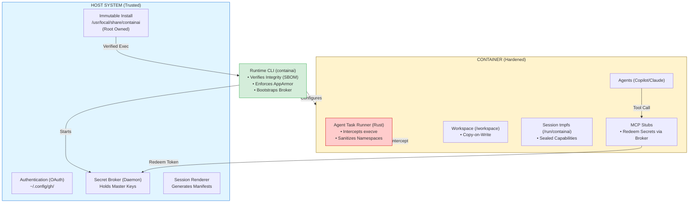
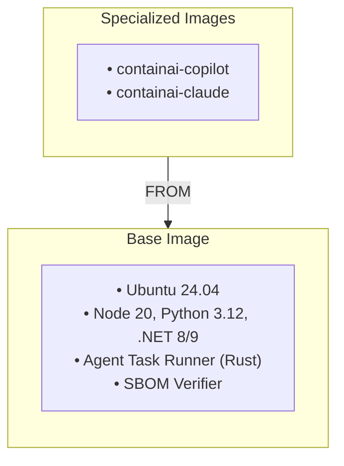
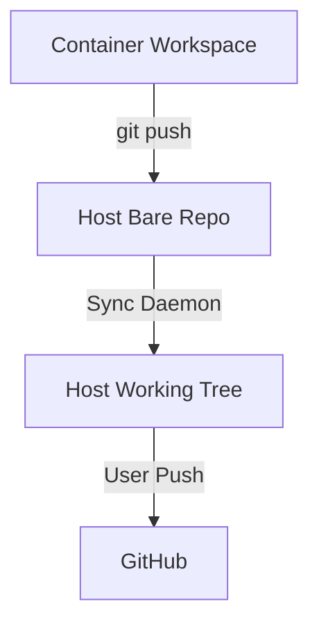

# Initial Architecture & Product Definition: ContainAI

## 1\. Strategic Vision

**"The Safe Runtime for Autonomous Workloads."**

ContainAI is a local-first infrastructure platform designed to host autonomous AI agents (GitHub Copilot, Codex, Claude) with **"Unrestricted" agency**—granting them shell access, network tools, and compiler toolchains—while maintaining **"Air-Gapped" security** for the host system.

It addresses the "Agency vs. Security" paradox by moving the security boundary from the *Model* (non-deterministic) to the *Kernel* and *Network* (deterministic). It provides a hardware-grade security boundary using software-defined controls, enabling agents to be capable inside the box while remaining impotent to the host.

## 2\. Design Principles

1.  **Immutable Infrastructure:** The runtime installation is system-owned (Root/Admin) and read-only to users/agents to prevent persistence attacks.
2.  **Software-Defined Isolation:** We rely on Native Docker with strict Kernel hardening (AppArmor, Seccomp) rather than heavy VMs, ensuring broad developer compatibility without sacrificing security.
3.  **Identity Airlock:** Secrets never touch the container disk. They are brokered JIT into RAM (`tmpfs`) only when needed.
4.  **Verified Integrity:** The runtime verifies its own binary integrity against a signed SBOM before every execution.
5.  **Stateless Images:** Container images contain tools but zero configuration or secrets.

-----

## 3\. System Overview

-----

## 4\. Security Architecture

### 4.1 The "Agent Airlock" Model

We implement a **Defense-in-Depth** strategy using **Software-Defined Isolation**.

#### Layer 1: Kernel Surface Reduction

We strip the container of ability to attack the host kernel.

  * **Seccomp:** Custom filter (`seccomp-containai.json`) blocks dangerous syscalls (`ptrace`, `mount`, `keyctl`, `bpf`).
  * **AppArmor:** Mandatory Access Control (`apparmor-containai.profile`) restricts the container process. Even if the agent gains root, it cannot write to `/proc`, `/sys`, or load kernel modules.
  * **Capabilities:** All Linux capabilities dropped (`--cap-drop=ALL`); privilege escalation disabled (`no-new-privileges`).

#### Layer 2: Active Process Supervision (The Semantic Firewall)

Standard containers are passive. We inject an active supervisor: the **Agent Task Runner** (Rust).

  * **Mechanism:** Uses `SECCOMP_RET_USER_NOTIF` to intercept every `execve` call at the kernel level.
  * **Why this beats gVisor:** gVisor provides "Blind Isolation" (containing the blast). Our Task Runner provides **Semantic Mediation** (preventing the blast). It validates arguments (e.g., blocking `rm -rf /`) *before* execution and injects credentials JIT—capabilities gVisor lacks due to missing user-notification support.
  * **Sanitization:** Spawns approved commands in a **Sanitized Namespace**, unmounting sensitive paths so tools cannot see secrets.

#### Layer 3: Identity Brokerage (The Wallet)

  * **The Broker:** A host daemon (`secret-broker.py`) holds master keys.
  * **The Protocol:** The container holds only a short-lived "Capability Token."
  * **The Handshake:** When a tool needs a key, a stub binary exchanges the token for the real key, injects it into **RAM** (`tmpfs`) for milliseconds, executes the request, and wipes memory.

#### Layer 4: Network Governance

  * **Sidecar Proxy:** Traffic routed through a transparent **Squid Proxy** container.
  * **Allowlisting:** Traffic denied by default. Policies enable developer domains (`github.com`, `pypi.org`) while blocking private LAN ranges.

-----

## 5\. Distribution & Integrity Architecture

### 5.1 Immutable Infrastructure (System-Only Install)

To prevent **Persistence Attacks** (where an agent modifies its own launcher), we mandate **System-Wide Installation**.

| Platform | **Install Location** | **Owner** |
| :--- | :--- | :--- |
| **Linux/macOS** | `/usr/local/share/containai` | `root` |
| **Windows** | `%ProgramFiles%\ContainAI` | `Administrators` |

### 5.2 The "Glass Box" Integrity Chain

We enforce supply chain security using standard artifacts.

1.  **Transport:** `containai.tar.gz` (Signed via Sigstore). SHA-256 is the **Trust Anchor**.
2.  **Inventory:** The tarball contains a **Compliance SBOM** (`sbom.json`) generated by `syft`.
3.  **Verification:** The tarball includes the **Microsoft `sbom-tool`** (or Kubernetes `bom`) static binary.
4.  **Runtime Check:** On every launch, the CLI invokes the verified SBOM tool to cryptographically validate that every script on disk matches the SBOM.

### 5.3 Atomic Updates

Updates use a "Blue/Green" directory strategy (`v1.0` → `v1.1`) with a `current` symlink, ensuring zero downtime and atomic rollbacks.

-----

## 6\. Platform Support Strategy

### 6.1 Linux (Native)

  * **Requirement:** **AppArmor is Mandatory.** The launcher aborts if the module is not active.
  * **Constraint:** **No Podman.** Default Rootless Podman maps container root to the Host User UID. A breakout would compromise `~/.ssh`. We require the system-level isolation of Docker Engine + AppArmor.

### 6.2 Windows (WSL 2)

  * **Security Gap:** WSL 2 disables AppArmor by default.
  * **Remediation:** We provide a "Fixer" script that reconfigures the WSL kernel (`kernelCommandLine = apparmor=1 security=apparmor`) and mounts `securityfs` via `fstab`.

### 6.3 macOS

  * **Benefit:** Docker Desktop runs in a hidden Linux VM (LinuxKit), providing a **Hardware Sandbox** by default. AppArmor works natively inside the VM.

-----

## 7\. Container Architecture

### 7.1 Image Layers (`images.lock`)

We enforce **Lockstep Versioning**. The CLI `v1.2.0` is pinned to Image `v1.2.0` via a hash lockfile.

### 7.2 Launch Flow

1.  **Preflight:** `check-health` verifies Docker, AppArmor, and Root ownership.
2.  **Integrity:** `sbom-tool validate` confirms runtime script integrity.
3.  **Rendering:** `render-session-config.py` generates the session manifest.
4.  **Brokerage:** Host daemon stages secrets in memory.
5.  **Container:** Docker container starts with Read-Only root and `tmpfs` secret mounts.

-----

## 8\. Data Flow & Sync

### 8.1 Git Workflow (Local Remote)

  * **Safety:** Agents push to a local bare repo (`/tmp/local-remote`). They cannot force-push to `origin` or access GitHub credentials directly.
  * **Sync:** A host daemon fast-forwards the user's working tree from the bare repo.

-----

## 9\. Architectural Decision Records (ADR)

### ADR 1: Exclusion of Podman Support

**Decision:** We do not support Podman on Linux.
**Reasoning:** Rootless Podman maps the container root to the User's UID (1000). A breakout allows immediate access to `~/.ssh` and `~/.aws`. We require the stricter isolation of Docker Desktop (VM) or Native Docker + AppArmor.

### ADR 2: Rejection of gVisor

**Decision:** We rely on Native Linux security (AppArmor/Seccomp) instead of gVisor (`runsc`).
**Reasoning:** Our core security feature, the **Agent Task Runner**, relies on `SECCOMP_RET_USER_NOTIF` to intercept commands. gVisor's Sentry kernel does not support this notification mechanism, rendering our active governance layer non-functional. Furthermore, gVisor introduces unacceptable I/O overhead for filesystem-heavy dev tasks.

### ADR 3: System-Wide Installation

**Decision:** The tool must be installed by Root/Admin.
**Reasoning:** To prevent "Evil Maid" persistence attacks, the runtime artifacts must be owned by Root/Admin so the Agent cannot overwrite the integrity verifier or launcher scripts.

### ADR 4: SBOM-Based Verification

**Decision:** Use `sbom-tool` binary.
**Reasoning:** We reject fragile shell/Python checksum scripts. We ship a standard SBOM tool inside the signed release artifact to perform cryptographic verification of the installation directory on every launch.