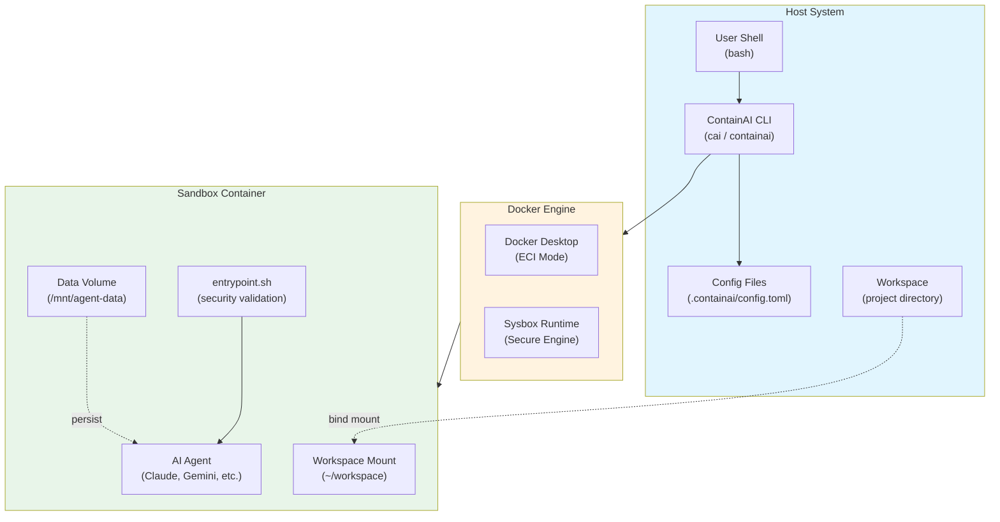
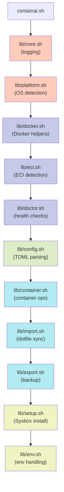
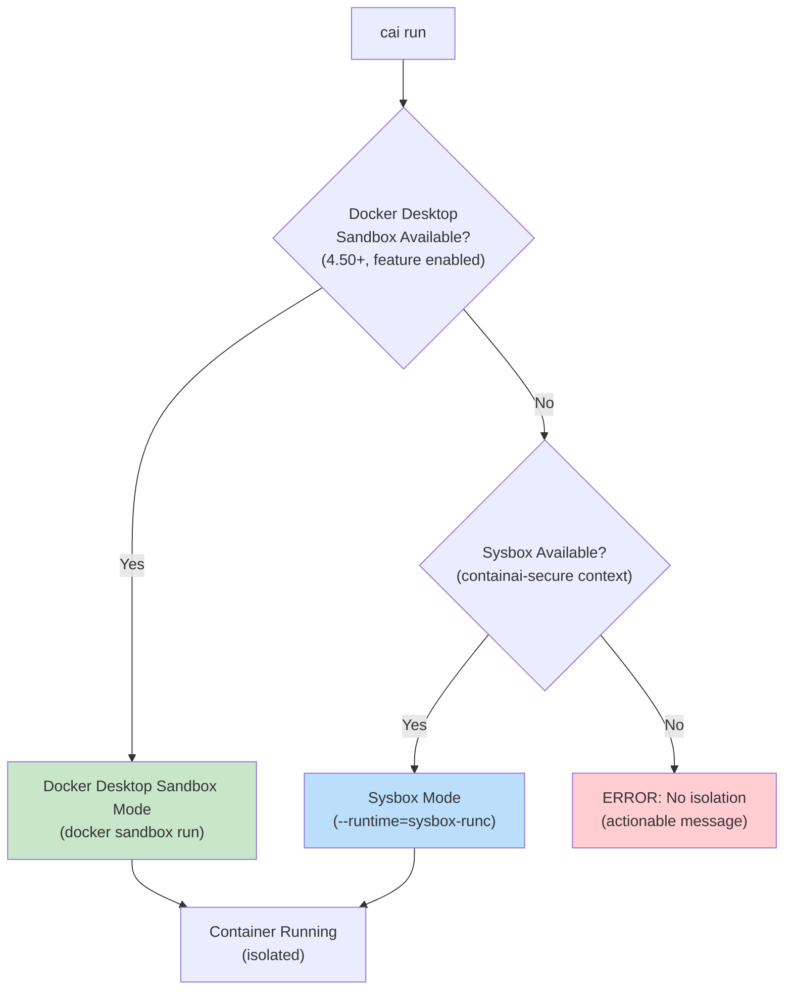
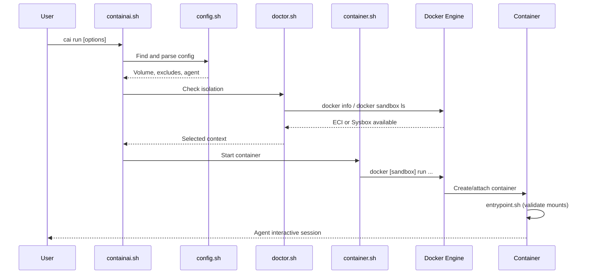
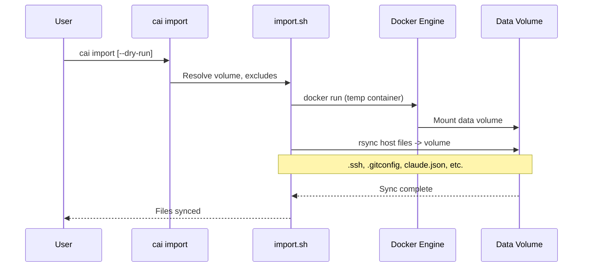
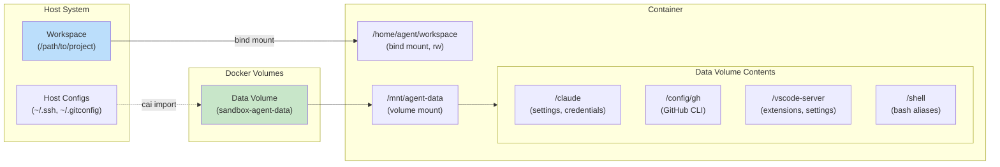
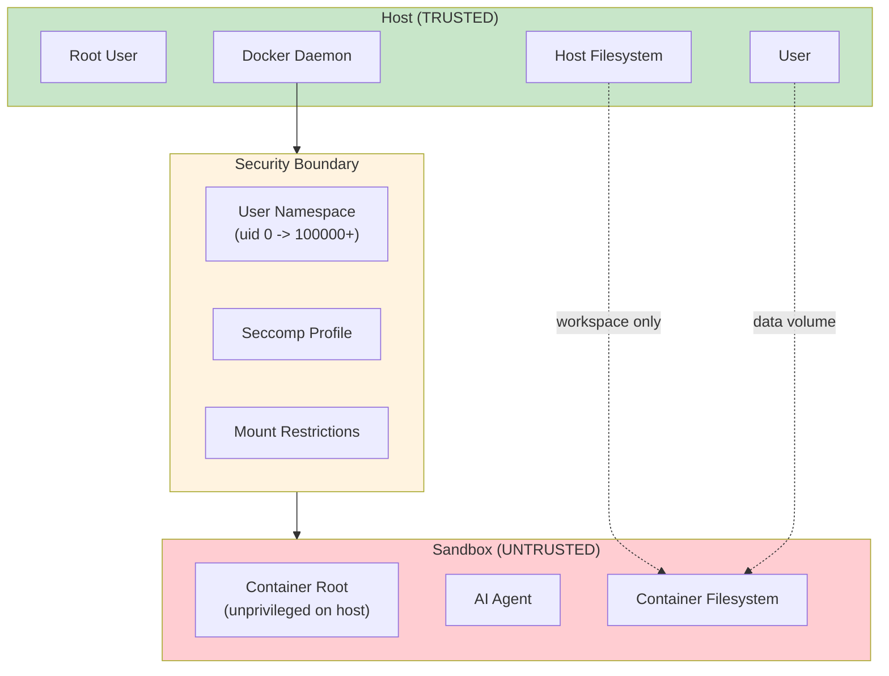

# ContainAI Architecture

This document provides a comprehensive overview of ContainAI's architecture, including system components, data flow, security boundaries, and design decisions.

## Table of Contents

- [System Context](#system-context)
- [Component Architecture](#component-architecture)
- [Modular Library Structure](#modular-library-structure)
- [Execution Paths](#execution-paths)
- [Data Flow](#data-flow)
- [Volume Architecture](#volume-architecture)
- [Security Boundaries](#security-boundaries)
- [Design Decisions](#design-decisions)

## System Context

ContainAI sits between the user's shell and Docker, providing secure sandbox orchestration for AI coding agents.



## Component Architecture

The ContainAI system consists of three main layers.

```mermaid
flowchart LR
    subgraph CLI["CLI Layer"]
        direction TB
        Main["agent-sandbox/containai.sh<br/>(entry point, sourced)"]
        Cmds["Subcommands<br/>(run, shell, doctor, import, export, stop)"]
    end

    subgraph Lib["Library Layer"]
        direction TB
        Core["core.sh<br/>(logging)"]
        Platform["platform.sh<br/>(OS detection)"]
        Docker["docker.sh<br/>(Docker helpers)"]
        ECI["eci.sh<br/>(ECI detection)"]
        Doctor["doctor.sh<br/>(health checks)"]
        Config["config.sh<br/>(TOML parsing)"]
        Container["container.sh<br/>(container ops)"]
        Import["import.sh<br/>(dotfile sync)"]
        Export["export.sh<br/>(backup)"]
        Setup["setup.sh<br/>(Sysbox install)"]
        Env["env.sh<br/>(env var handling)"]
    end

    subgraph Runtime["Container Runtime"]
        direction TB
        Entry["entrypoint.sh<br/>(startup validation)"]
        Image["Dockerfile<br/>(container image)"]
    end

    CLI --> Lib
    Lib --> Runtime

    style CLI fill:#bbdefb
    style Lib fill:#c8e6c9
    style Runtime fill:#ffe0b2
```



## Modular Library Structure

ContainAI uses a modular shell library design where `agent-sandbox/containai.sh` sources individual `agent-sandbox/lib/*.sh` modules. This provides:

- **Separation of concerns**: Each module handles one aspect
- **Testability**: Modules can be tested independently
- **Maintainability**: Changes are isolated to specific modules

### Module Dependency Order

The libraries must be sourced in a specific order due to dependencies. All paths below are relative to `agent-sandbox/`:



### Module Responsibilities

All modules are located in `agent-sandbox/lib/`:

| Module | Purpose | Key Functions |
|--------|---------|---------------|
| `core.sh` | Logging and utilities | `_cai_info`, `_cai_error`, `_cai_warn`, `_cai_debug` |
| `platform.sh` | OS/platform detection | `_cai_detect_platform`, `_cai_is_wsl`, `_cai_is_macos` |
| `docker.sh` | Docker availability/version | `_cai_docker_available`, `_cai_sandbox_feature_enabled`, `_cai_timeout` |
| `eci.sh` | Enhanced Container Isolation | `_cai_eci_available`, `_cai_eci_enabled`, `_cai_eci_check_uid_map` |
| `doctor.sh` | System health checks | `_cai_doctor`, `_cai_select_context`, `_cai_sysbox_available_for_context` |
| `config.sh` | TOML config parsing | `_containai_find_config`, `_containai_parse_config`, `_containai_resolve_volume` |
| `container.sh` | Container lifecycle | `_containai_start_container`, `_containai_stop_all`, `_containai_check_isolation` |
| `import.sh` | Dotfile synchronization | `_containai_import` (sync host configs to data volume) |
| `export.sh` | Volume backup | `_containai_export` (export data volume to .tgz) |
| `setup.sh` | Sysbox installation | `_cai_setup` (install Sysbox Secure Engine) |
| `env.sh` | Environment variables | `_containai_import_env` (allowlist-based env import) |

## Execution Paths

ContainAI supports two isolation mechanisms, automatically selected based on availability.



### Docker Desktop Sandbox Mode

**Requirements**: Docker Desktop 4.50+ with sandbox feature enabled

- Uses `docker sandbox run` command
- Provides isolated execution environment
- When Enhanced Container Isolation (ECI) is additionally enabled:
  - Automatic user namespace remapping (uid 0 -> 100000+)
  - sysbox-runc runtime for stronger isolation
- ECI requires Docker Business subscription and admin enablement

### Sysbox Mode (Linux/WSL)

**Requirements**: Sysbox runtime installed, `containai-secure` Docker context

- Uses standard `docker run` with `--runtime=sysbox-runc`
- Requires manual Sysbox installation via `cai setup`
- Creates dedicated Docker context pointing to Sysbox-enabled daemon
- Available on WSL2 and native Linux

## Data Flow

### CLI to Container Flow



### Import Flow (Dotfile Sync)



## Volume Architecture

ContainAI uses two types of volumes to separate concerns.



### Volume Types

| Volume Type | Purpose | Lifecycle | Example |
|-------------|---------|-----------|---------|
| **Workspace Mount** | Project files | Per-session (bind mount) | `/home/agent/workspace` |
| **Data Volume** | Agent configs, credentials | Persistent (named volume) | `sandbox-agent-data` |

### Data Volume Structure

The data volume (`/mnt/agent-data`) contains:

```
/mnt/agent-data/
├── claude/              # Claude Code configs
│   ├── claude.json      # Settings (600)
│   ├── credentials.json # Auth tokens (600)
│   └── settings.json    # User preferences
├── config/
│   ├── gh/              # GitHub CLI (700)
│   ├── opencode/        # OpenCode config
│   └── tmux/            # tmux config
├── gemini/              # Gemini CLI configs
├── codex/               # Codex configs
├── copilot/             # Copilot configs
├── shell/
│   ├── .bash_aliases    # Custom aliases
│   └── .bashrc.d/       # Shell extensions
└── vscode-server/       # VS Code Server state
    ├── extensions/      # Installed extensions
    └── data/            # Settings, MCP config
```

### Volume Selection

Volume selection follows this precedence:

1. `--data-volume` CLI flag (explicit)
2. Config file `[workspace."/path"].data_volume`
3. Default: `sandbox-agent-data`

Workspace-specific volumes enable isolated agent state per project.

## Security Boundaries

ContainAI enforces strict security boundaries between host and sandbox.



### Security Guarantees

These protections are **always enforced**:

| Protection | Implementation | Code Reference |
|------------|----------------|----------------|
| **Volume mount TOCTOU** | Path validation in entrypoint | `agent-sandbox/entrypoint.sh:verify_path_under_data_dir()` |
| **Symlink traversal** | Reject symlinks, realpath validation | `agent-sandbox/entrypoint.sh:reject_symlink()` |
| **Safe .env parsing** | CRLF handling, quote validation | `agent-sandbox/lib/env.sh` |
| **Credential isolation** | Default `credentials.mode=none` | `agent-sandbox/lib/config.sh`, `agent-sandbox/lib/container.sh` |
| **Docker socket denied** | No socket mount by default | `agent-sandbox/lib/container.sh` |

### Unsafe Opt-ins (FR-5)

These can be enabled with explicit flags (require acknowledgment):

| Opt-in | Risk | Required Flag |
|--------|------|---------------|
| `--allow-host-credentials` | Exposes ~/.ssh, ~/.gitconfig, API tokens | `--i-understand-this-exposes-host-credentials` |
| `--allow-host-docker-socket` | Full root access, sandbox escape | `--i-understand-this-grants-root-access` |
| `--force` | Skips isolation checks | (standalone) |

### What ContainAI Does NOT Protect Against

- **Malicious container images**: Use trusted base images only
- **Network isolation**: Containers can reach the internet by default
- **Resource exhaustion**: No cgroup limits by default
- **Kernel vulnerabilities**: Depends on Docker/Sysbox security

## Design Decisions

Key architectural decisions (see also [.flow/memory/decisions.md](../.flow/memory/decisions.md)):

### Safe Defaults (FR-4)

**Decision**: Default to the safest configuration; dangerous options require explicit CLI flags with acknowledgment.

**Rationale**: For a security tool, unsafe defaults with opt-out are worse than safe defaults with opt-in. Users must explicitly request dangerous operations via CLI flags.

**Examples**:
- `credentials.mode=host` in config is **never** honored; CLI `--allow-host-credentials` is required
- Docker socket access requires `--allow-host-docker-socket` flag
- Config-only options cannot enable dangerous behaviors

### Modular Shell Architecture

**Decision**: Split CLI into sourced `agent-sandbox/lib/*.sh` modules rather than monolithic script.

**Rationale**:
- Enables unit testing of individual functions
- Reduces cognitive load per file
- Allows parallel development
- Makes dependencies explicit via source order

### Dual Isolation Paths

**Decision**: Support both Docker Desktop sandbox and Sysbox modes with automatic selection.

**Rationale**:
- Docker Desktop sandbox: Best for macOS/Windows users (Docker Desktop integration)
- Sysbox: Best for Linux/WSL users (native performance)
- Auto-detection reduces user friction

### Workspace-Scoped Configuration

**Decision**: Config files use workspace path keys for per-project settings.

**Rationale**:
- Different projects may need different volumes
- Enables isolated agent state per project
- Config discovery stops at git root (security)

## References

- [Quickstart Guide](quickstart.md) - Getting started
- [Configuration Reference](configuration.md) - Full config schema
- [Troubleshooting Guide](troubleshooting.md) - Common issues
- [SECURITY.md](../SECURITY.md) - Security model details
- [Technical README](../agent-sandbox/README.md) - Image building and internals
