# ContainAI Architecture

This document provides a comprehensive overview of ContainAI's architecture, including the system container model, Sysbox runtime, SSH-based access, and security boundaries.

## Table of Contents

- [System Container Overview](#system-container-overview)
- [Why Sysbox?](#why-sysbox)
- [Architecture Layers](#architecture-layers)
- [Container Lifecycle](#container-lifecycle)
- [SSH Connection Flow](#ssh-connection-flow)
- [Systemd Service Dependencies](#systemd-service-dependencies)
- [Docker-in-Docker Architecture](#docker-in-docker-architecture)
- [Component Architecture](#component-architecture)
- [Modular Library Structure](#modular-library-structure)
- [Data Flow](#data-flow)
- [Volume Architecture](#volume-architecture)
- [Security Model](#security-model)
- [Design Decisions](#design-decisions)
- [References](#references)

## System Container Overview

ContainAI uses **system containers** - VM-like Docker containers that run systemd as PID 1 and can host multiple services. Unlike traditional application containers that run a single process, system containers provide:

| Capability | Application Container | System Container |
|------------|----------------------|------------------|
| Init system | None (process as PID 1) | systemd as PID 1 |
| Multiple services | No | Yes (sshd, dockerd, etc.) |
| Docker-in-Docker | Requires `--privileged` | Works unprivileged via Sysbox |
| User namespace isolation | Manual configuration | Automatic via Sysbox |
| SSH access | Port mapping only | VS Code Remote-SSH compatible |
| Service management | Not available | `systemctl` commands work |

This makes system containers ideal for AI coding agents that need to:
- Build and run containers (Docker-in-Docker)
- Connect via SSH for VS Code Remote-SSH and agent forwarding
- Run background services
- Access a full Linux environment

## Why Sysbox?

[Sysbox](https://github.com/nestybox/sysbox) is a container runtime that enables system containers with enhanced isolation:

### Automatic User Namespace Mapping

Sysbox automatically maps container root (UID 0) to an unprivileged host user. No manual `/etc/subuid` or `/etc/subgid` configuration required.

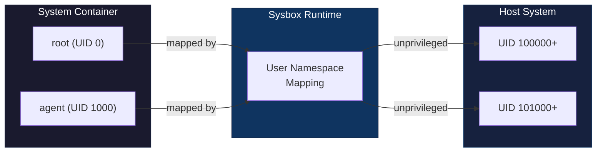

### Procfs/Sysfs Virtualization

Sysbox virtualizes `/proc` and `/sys` so containers see only their own resources, not the host's. This enables:
- `systemctl` commands to work correctly
- Accurate resource reporting inside containers
- Isolation from host process information

### Secure Docker-in-Docker

With Sysbox, containers can run Docker without `--privileged`:
- The inner Docker daemon runs with its own isolated filesystem
- No access to host Docker socket
- No capability escalation to host

## Architecture Layers

ContainAI uses a dedicated Docker installation separate from Docker Desktop:

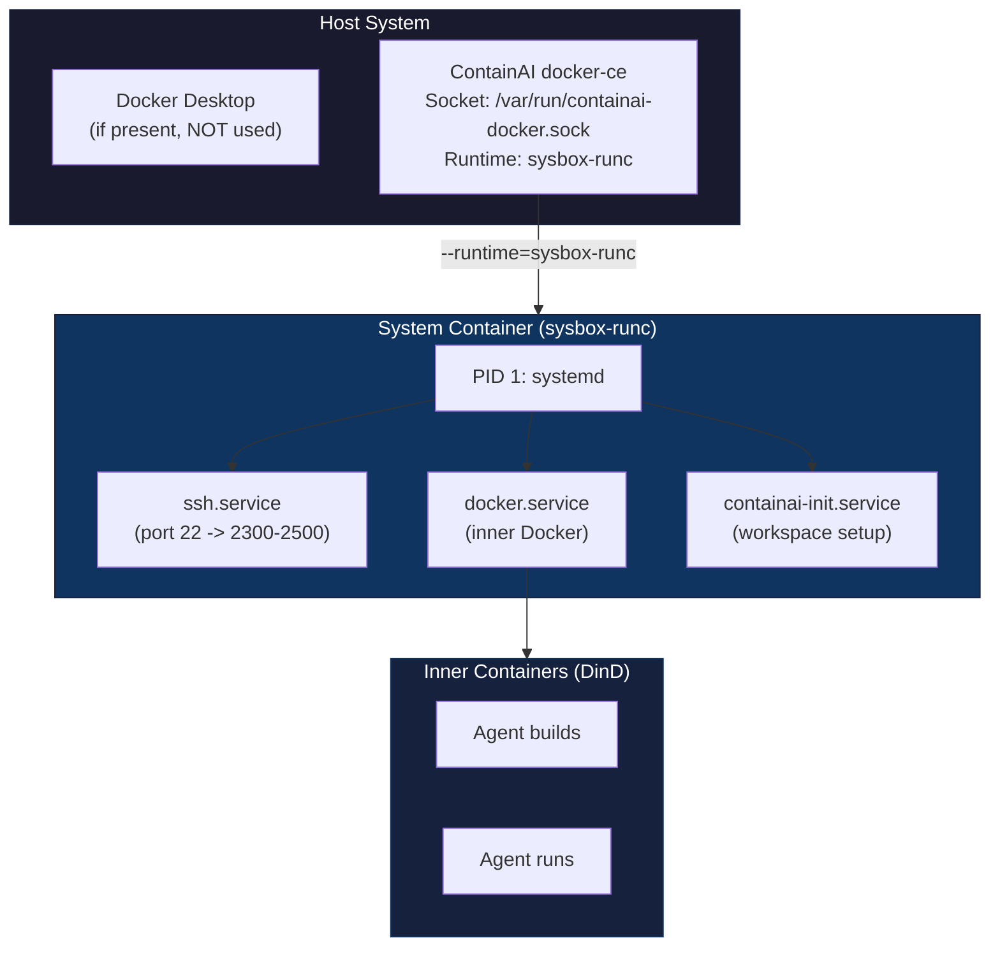

### Why Separate docker-ce?

1. **Docker Desktop does not support Sysbox** - The `sysbox-runc` runtime is not available in Docker Desktop
2. **System containers need Sysbox** - For systemd, DinD without `--privileged`, and VM-like behavior
3. **No conflicts** - ContainAI uses its own socket (`/var/run/containai-docker.sock`) and data directory

### ContainAI Docker Configuration

The dedicated docker-ce instance (`/etc/containai/docker/daemon.json`):

```json
{
  "runtimes": {
    "sysbox-runc": {
      "path": "/usr/bin/sysbox-runc"
    }
  },
  "default-runtime": "sysbox-runc",
  "hosts": ["unix:///var/run/containai-docker.sock"],
  "data-root": "/var/lib/containai-docker"
}
```

## Container Lifecycle

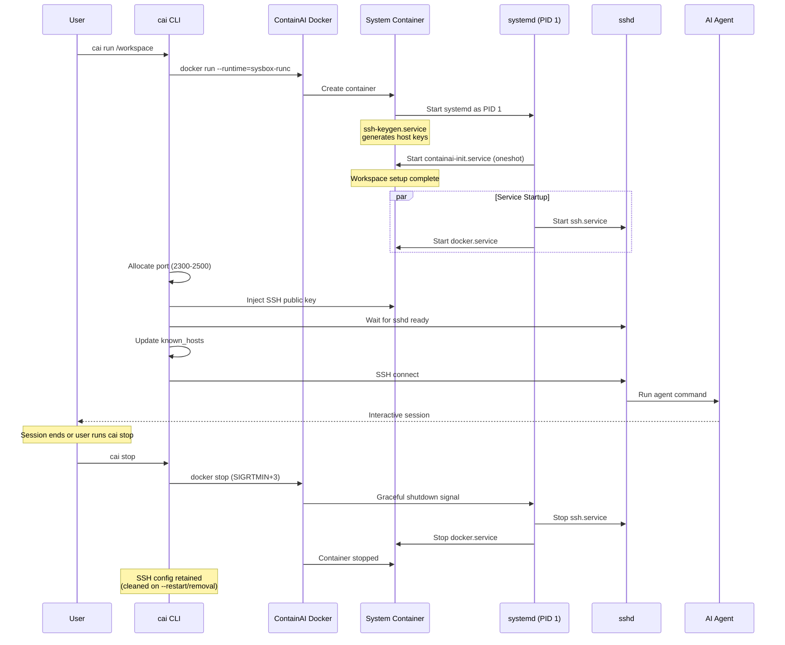

### Container Startup Sequence

1. **Container Creation**: `docker run --runtime=sysbox-runc` creates the system container
2. **Systemd Boot**: systemd starts as PID 1, initializes the service manager
3. **SSH Key Generation**: `ssh-keygen.service` generates host keys on first boot (not baked into image)
4. **Workspace Setup**: `containai-init.service` (oneshot) runs first, creating symlinks and loading environment
5. **Service Startup**: `ssh.service` and `docker.service` start after init completes
6. **SSH Connection**: CLI allocates port, injects key, waits for sshd, then connects

### Container Naming and Hostname

Each container receives a short name in the format `{repo}-{branch_leaf}` (max 24 characters) and an RFC 1123 compliant hostname that matches a sanitized version of its name.

**Hostname Sanitization Rules:**

The `_cai_sanitize_hostname()` function ensures hostnames comply with RFC 1123:

| Rule | Example |
|------|---------|
| Convert to lowercase | `MyProject` → `myproject` |
| Replace underscores with hyphens | `my_workspace` → `my-workspace` |
| Remove invalid characters | `app@v2.0` → `appv20` |
| Collapse multiple hyphens | `app--test` → `app-test` |
| Remove leading/trailing hyphens | `-app-` → `app` |
| Truncate to 63 characters | Long names are shortened |
| Fallback if empty | Empty result becomes `container` |

**Why This Matters:**

- For broad DNS and network compatibility, ContainAI enforces RFC 1123-style hostnames
- Container names can include underscores and special characters that aren't valid hostnames
- The hostname is set via Docker's `--hostname` flag during container creation
- Inside the container, `hostname` returns this sanitized value

**Example Transformations:**

| Container Name | Hostname |
|----------------|----------|
| `my_workspace-main` | `my-workspace-main` |
| `MyProject-Feature` | `myproject-feature` |
| `test__app` | `test-app` |

## SSH Connection Flow

All container access uses SSH instead of `docker attach` or direct execution. This enables:
- VS Code Remote-SSH integration
- SSH agent forwarding
- Port tunneling for development
- Standard SSH tooling (scp, rsync)

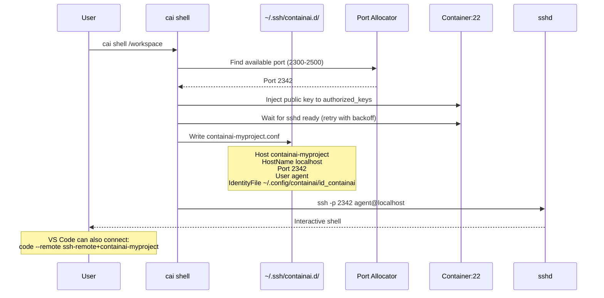

### SSH Infrastructure Components

| Component | Path | Purpose |
|-----------|------|---------|
| Private Key | `~/.config/containai/id_containai` | ed25519 key for authentication |
| Public Key | `~/.config/containai/id_containai.pub` | Injected into containers |
| Config Directory | `~/.ssh/containai.d/` | Per-container SSH configs |
| Known Hosts | `~/.config/containai/known_hosts` | Container host key verification |
| Port Range | 2300-2500 (configurable) | SSH port allocation range |

### SSH Security

- **Key-only authentication**: Password auth disabled in sshd
- **Host key verification**: Each container generates unique host keys on first boot
- **Automatic cleanup**: Stale known_hosts entries removed on `--fresh` restart
- **Port isolation**: Each container gets a unique port from the configured range

## Systemd Service Dependencies

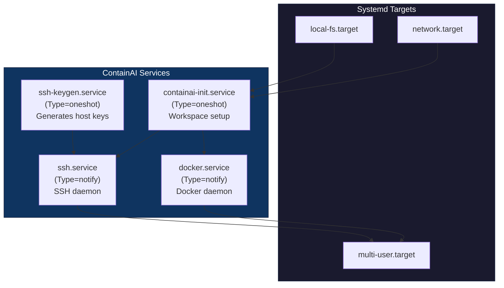

### Service Details

| Service | Type | Purpose |
|---------|------|---------|
| `ssh-keygen.service` | oneshot | Generate SSH host keys if missing (security: not baked into image) |
| `ssh.service` | notify | OpenSSH daemon for remote access |
| `docker.service` | notify | Inner Docker daemon for DinD |
| `containai-init.service` | oneshot | Volume structure, workspace symlinks, git config |

### Service Files Location

- Image: `/etc/systemd/system/` (installed from `src/services/`)
- Drop-ins: `/etc/systemd/system/<service>.service.d/`

## Docker-in-Docker Architecture

Sysbox enables secure Docker-in-Docker without `--privileged`:

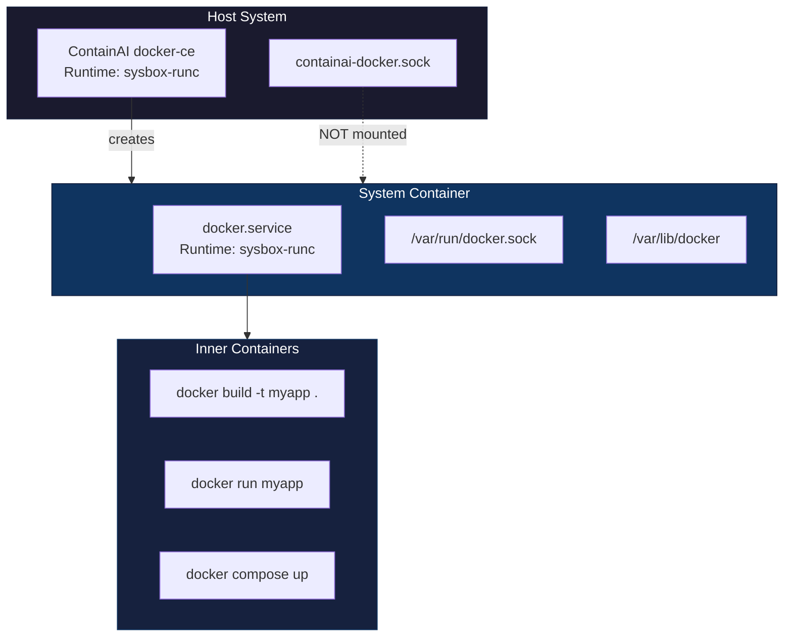

### How DinD Works with Sysbox

1. **Isolated Docker Daemon**: The inner Docker runs with its own socket and storage
2. **No Host Socket**: The host Docker socket is NOT mounted into containers
3. **Sysbox Runtime**: Both outer and inner Docker use sysbox-runc for consistent isolation
4. **Nested User Namespaces**: Each layer has its own UID mapping

### Inner Docker Configuration

Inside the system container (`/etc/docker/daemon.json`):

```json
{
  "runtimes": {
    "sysbox-runc": {
      "path": "/usr/bin/sysbox-runc"
    }
  },
  "default-runtime": "sysbox-runc"
}
```

## Component Architecture

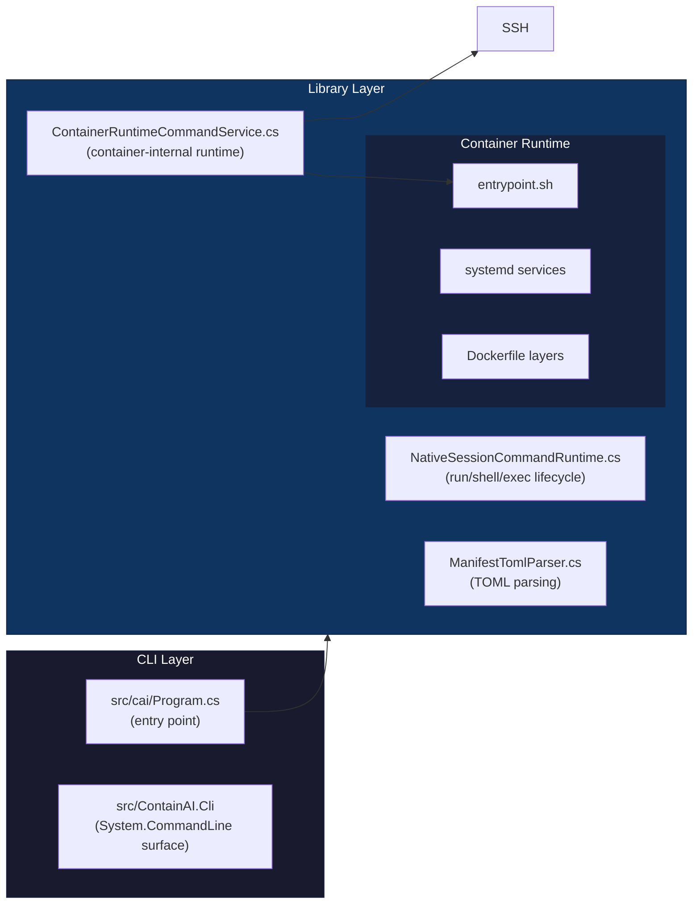

### CLI Command Surface

ContainAI's CLI command surface is **statically declared** in `src/ContainAI.Cli/RootCommandBuilder.cs` and related command builder files. There is no runtime discovery or plugin-based command loading; the compiled command model is the source of truth for parsing and completion.

Shell completion uses the built-in `cai completion suggest` path implemented by the CLI itself. This removes any dependency on external completion helpers such as `dotnet-suggest`.

## Modular Library Structure

The CLI is split into native C# runtime components:

| Module | Purpose | Key Types |
|--------|---------|-----------|
| `src/cai/Program.cs` | Native host entrypoint | `Program` |
| `src/ContainAI.Cli/` | Command parser/routing | `CaiCli`, `RootCommandBuilder` |
| `src/cai/NativeLifecycleCommandRuntime.cs` | Host command orchestration | `NativeLifecycleCommandRuntime` |
| `src/cai/NativeSessionCommandRuntime.cs` | Session lifecycle and SSH flow | `NativeSessionCommandRuntime` |
| `src/cai/ContainerRuntimeCommandService.cs` | Container-side init/link/runtime commands | `ContainerRuntimeCommandService` |
| `src/cai/ManifestTomlParser.cs` | TOML manifest parsing | `ManifestTomlParser` |
| `src/cai/ManifestGenerators.cs` | Derived artifact generation | `ManifestGenerators` |
| `src/cai/DevcontainerFeatureRuntime.cs` | Devcontainer feature/system integration | `DevcontainerFeatureRuntime` |
| `src/cai/ContainAiDockerProxy.cs` | Docker context mediation and setup helpers | `ContainAiDockerProxy` |
| `src/cai/AcpProxyRunner.cs` | ACP proxy process lifecycle | `AcpProxyRunner` |
| `src/AgentClientProtocol.Proxy/` | ACP transport/proxy library | `AcpProxy`, `AcpSession`, `PathTranslator` |

### Module Dependencies

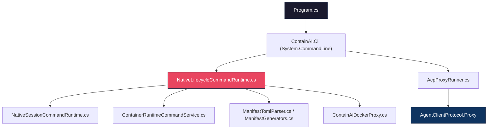

## Data Flow

### CLI to Container via SSH

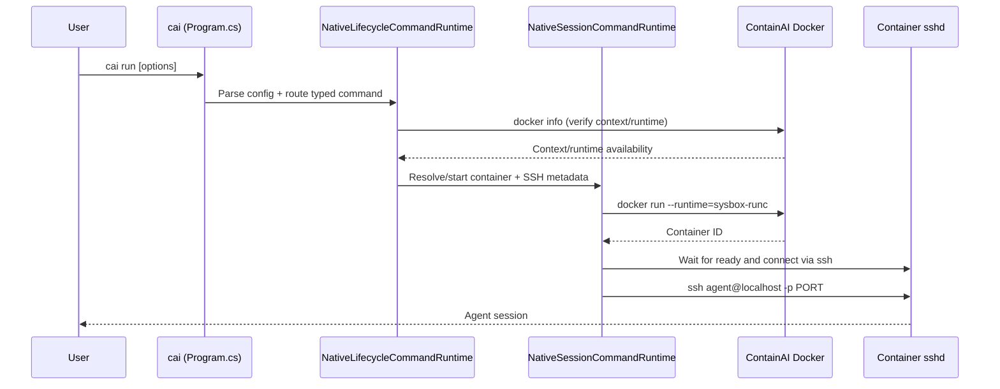

## Volume Architecture

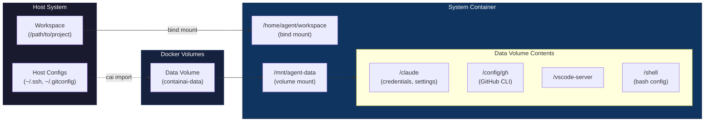

### Volume Types

| Volume | Mount Point | Purpose | Lifecycle |
|--------|-------------|---------|-----------|
| Workspace | `/home/agent/workspace` | Project files | Bind mount per session |
| Data Volume | `/mnt/agent-data` | Agent configs, credentials | Persistent named volume |

### Data Volume Structure

```
/mnt/agent-data/
├── claude/              # Claude Code
│   ├── credentials.json
│   ├── settings.json
│   └── plugins/
├── config/
│   ├── gh/              # GitHub CLI
│   ├── git/             # Git config
│   └── tmux/
├── gemini/              # Gemini CLI
├── copilot/             # Copilot CLI
├── codex/               # Codex CLI
├── shell/
│   └── .bashrc.d/       # Shell extensions
└── vscode-server/       # VS Code Server state
```

## Security Model

### Sysbox Isolation

Sysbox provides multiple isolation layers:

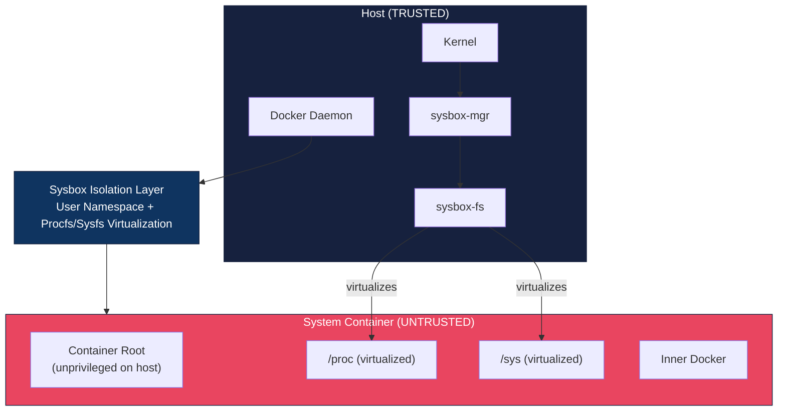

### Security Guarantees

| Protection | Implementation |
|------------|----------------|
| User namespace isolation | Sysbox auto-maps UIDs (container root = unprivileged host user) |
| Procfs virtualization | Container sees only its own processes |
| Sysfs virtualization | Container sees only its own devices |
| No host Docker socket | Socket is NOT mounted; inner Docker is isolated |
| SSH key-only auth | Password authentication disabled |
| Resource limits | cgroup limits (memory, CPU) enforced |

### Resource Limits

By default, containers receive 50% of host resources:

| Resource | Default | Configuration |
|----------|---------|---------------|
| Memory | 50% of host RAM | `[resources].memory_limit` or `--memory` |
| CPU | 50% of host cores | `[resources].cpu_limit` or `--cpus` |
| Memory swap | Same as memory limit | Prevents OOM via swap |

### What ContainAI Does NOT Protect Against

- **Malicious container images**: Use trusted base images only
- **Network isolation**: Containers can reach the internet by default
- **Kernel vulnerabilities**: Depends on Sysbox/Docker security
- **Supply chain attacks**: Verify agent CLI installations

## Design Decisions

### SSH-Based Access

**Decision**: Use SSH for all container access instead of `docker attach`.

**Rationale**:
- VS Code Remote-SSH compatibility
- SSH agent forwarding for git operations
- Port tunneling for development servers
- Standard tooling (scp, rsync) works out of the box
- More robust than PTY via Docker API

### Dedicated Docker Installation

**Decision**: Install separate docker-ce instead of using Docker Desktop.

**Rationale**:
- Docker Desktop does not support Sysbox runtime
- Avoids conflicts with existing Docker setup
- Full control over runtime configuration
- Dedicated socket prevents accidental cross-usage

### System Containers with systemd

**Decision**: Run systemd as PID 1 in containers.

**Rationale**:
- Enables real service management
- SSH daemon runs as proper service
- Docker daemon managed by systemd
- Init system handles cleanup on shutdown
- Matches production Linux environments

### Layered Dockerfile Build

**Decision**: Split Dockerfile into base/sdks/full layers.

**Rationale**:
- Faster iteration during development
- Smaller images for minimal use cases
- Clear separation of concerns
- Easier updates to individual layers

## References

- [Sysbox Documentation](https://github.com/nestybox/sysbox)
- [Sysbox Systemd Guide](https://github.com/nestybox/sysbox/blob/master/docs/user-guide/systemd.md)
- [Sysbox DinD Guide](https://github.com/nestybox/sysbox/blob/master/docs/user-guide/dind.md)
- [SSH Include Directive](https://man.openbsd.org/ssh_config)
- [Docker Contexts](https://docs.docker.com/engine/manage-resources/contexts/)
- [Configuration Reference](configuration.md)
- [Troubleshooting Guide](troubleshooting.md)
- [Security Model](../SECURITY.md)
