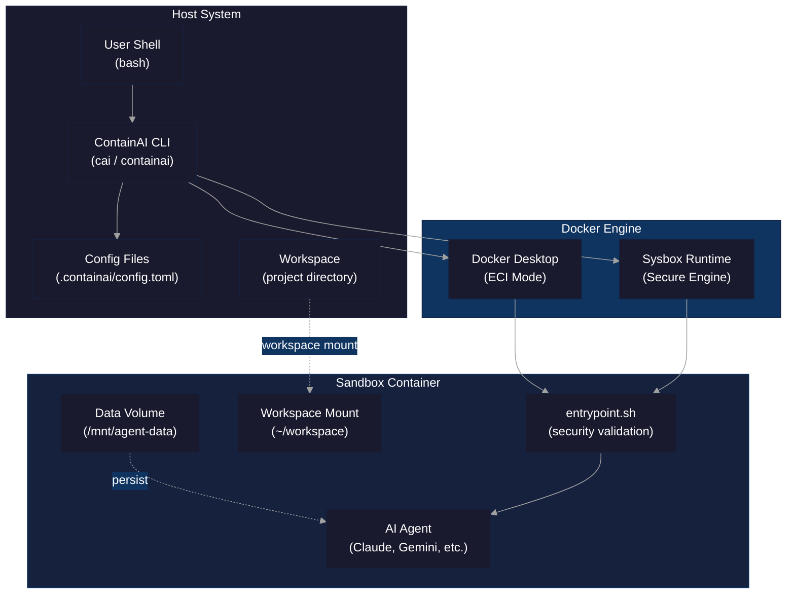
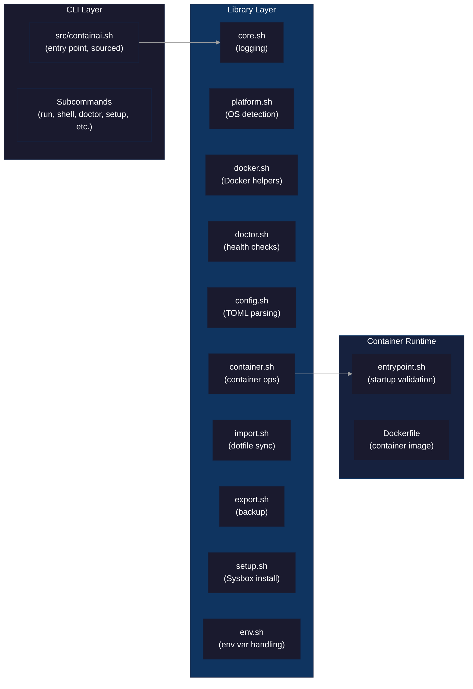
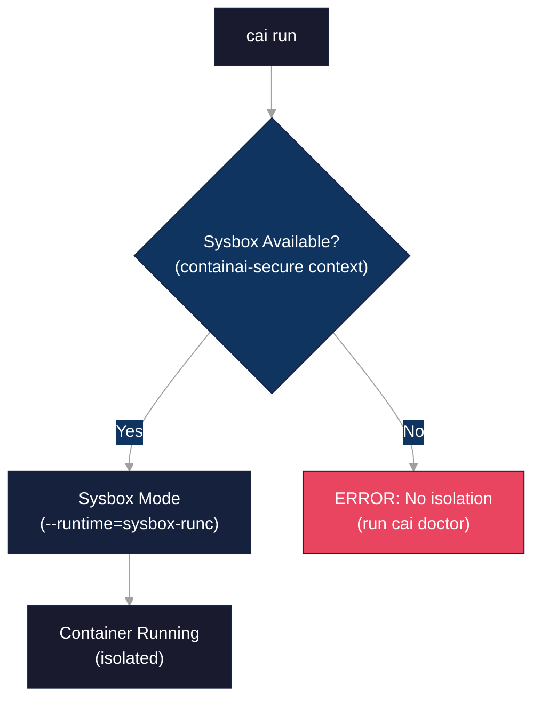
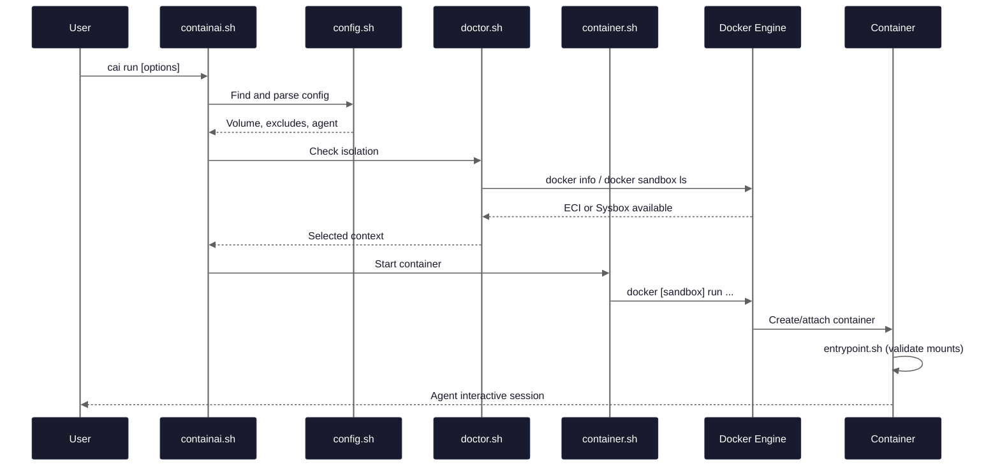
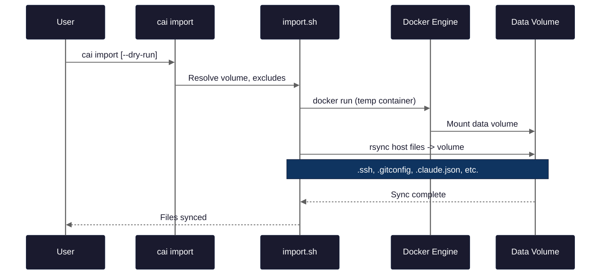
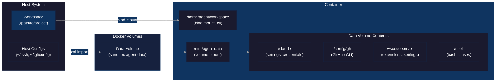
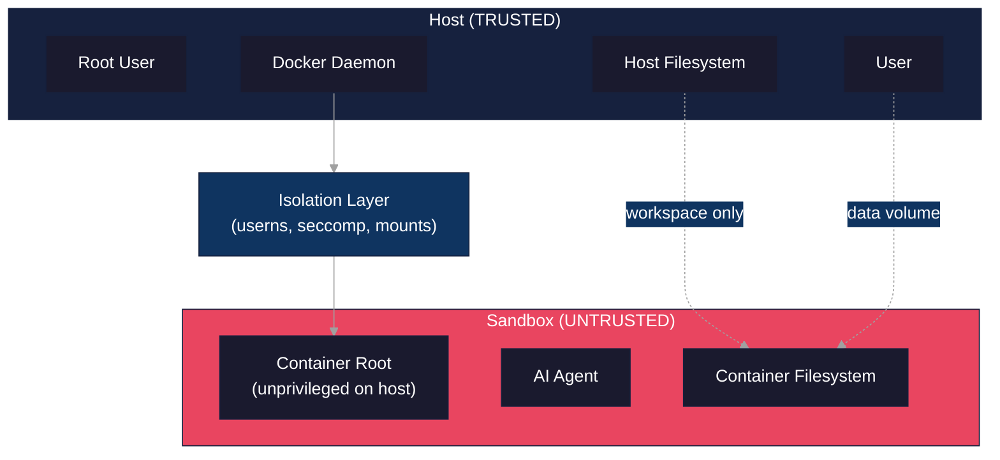

# ContainAI Architecture

This document provides a comprehensive overview of ContainAI's architecture, including system components, data flow, security boundaries, and design decisions.

## Table of Contents

- [System Context](#system-context)
- [Component Architecture](#component-architecture)
- [Modular Library Structure](#modular-library-structure)
- [Execution Paths](#execution-paths)
- [Data Flow](#data-flow)
- [Volume Architecture](#volume-architecture)
- [Security Boundaries](#security-boundaries)
- [Design Decisions](#design-decisions)

## System Context

ContainAI sits between the user's shell and Docker, providing secure sandbox orchestration for AI coding agents.



> **Note**: Workspace mounting differs by mode: Sysbox uses a bind mount; ECI uses Docker Desktop's mirrored workspace mount with entrypoint symlink logic.

## Component Architecture

The ContainAI system consists of three main layers.



## Modular Library Structure

ContainAI uses a modular shell library design where `src/containai.sh` sources individual `src/lib/*.sh` modules. This provides:

- **Separation of concerns**: Each module handles one aspect
- **Testability**: Modules can be tested independently
- **Maintainability**: Changes are isolated to specific modules

### Module Dependency Order

The libraries must be sourced in a specific order due to dependencies. All paths below are relative to `src/`:

```mermaid
%%{init: {'theme': 'base', 'themeVariables': {
  'primaryColor': '#1a1a2e',
  'primaryTextColor': '#ffffff',
  'primaryBorderColor': '#16213e',
  'secondaryColor': '#0f3460',
  'tertiaryColor': '#1a1a2e',
  'lineColor': '#a0a0a0',
  'textColor': '#ffffff',
  'background': '#0d1117'
}}}%%
flowchart TD
    Main["containai.sh"] --> Core["lib/core.sh<br/>(logging)"]
    Core --> Platform["lib/platform.sh<br/>(OS detection)"]
    Platform --> Docker["lib/docker.sh<br/>(Docker helpers)"]
    Docker --> Doctor["lib/doctor.sh<br/>(health checks)"]
    Doctor --> Config["lib/config.sh<br/>(TOML parsing)"]
    Config --> Container["lib/container.sh<br/>(container ops)"]
    Container --> Import["lib/import.sh<br/>(dotfile sync)"]
    Import --> Export["lib/export.sh<br/>(backup)"]
    Export --> Setup["lib/setup.sh<br/>(Sysbox install)"]
    Setup --> Env["lib/env.sh<br/>(env handling)"]

    style Main fill:#1a1a2e,stroke:#16213e,color:#fff
    style Core fill:#e94560,stroke:#16213e,color:#fff
    style Platform fill:#e94560,stroke:#16213e,color:#fff
    style Docker fill:#0f3460,stroke:#16213e,color:#fff
    style Doctor fill:#0f3460,stroke:#16213e,color:#fff
    style Config fill:#1a1a2e,stroke:#16213e,color:#fff
    style Container fill:#16213e,stroke:#0f3460,color:#fff
    style Import fill:#16213e,stroke:#0f3460,color:#fff
    style Export fill:#16213e,stroke:#0f3460,color:#fff
    style Setup fill:#0f3460,stroke:#e94560,color:#fff
    style Env fill:#0f3460,stroke:#e94560,color:#fff
```



### Module Responsibilities

All modules are located in `src/lib/`:

| Module | Purpose | Example Functions |
|--------|---------|-------------------|
| `core.sh` | Logging and utilities | `_cai_info`, `_cai_error`, `_cai_warn`, `_cai_ok`, `_cai_debug` |
| `platform.sh` | OS/platform detection | `_cai_detect_platform`, `_cai_is_wsl`, `_cai_is_macos` |
| `docker.sh` | Docker availability/version | `_cai_docker_available`, `_cai_docker_version`, `_cai_timeout` |
| `doctor.sh` | System health checks | `_cai_doctor`, `_cai_select_context`, `_cai_sysbox_available_for_context` |
| `config.sh` | TOML config parsing | `_containai_find_config`, `_containai_parse_config`, `_containai_resolve_volume` |
| `container.sh` | Container lifecycle | `_containai_start_container`, `_containai_stop_all`, `_containai_check_isolation` |
| `import.sh` | Dotfile synchronization | `_containai_import` (sync host configs to data volume) |
| `export.sh` | Volume backup | `_containai_export` (export data volume to .tgz) |
| `setup.sh` | Sysbox installation | `_cai_setup` (install Sysbox Secure Engine) |
| `env.sh` | Environment variables | `_containai_import_env` (allowlist-based env import) |

## Execution Path

ContainAI uses Sysbox for container isolation.



### Sysbox Mode (WSL2/macOS)

**Requirements**: Sysbox runtime installed, `containai-secure` Docker context

- Uses standard `docker run` with `--runtime=sysbox-runc`
- `cai setup` installs Sysbox on WSL2 and macOS (via Lima)
- Creates dedicated Docker context pointing to Sysbox-enabled daemon
- Native Linux requires manual Sysbox installation (see Sysbox docs)

## Data Flow

### CLI to Container Flow



### Import Flow (Dotfile Sync)



## Volume Architecture

ContainAI uses two types of volumes to separate concerns.



### Volume Types

| Volume Type | Purpose | Lifecycle | Example |
|-------------|---------|-----------|---------|
| **Workspace Mount** | Project files | Per-session (bind mount) | `/home/agent/workspace` |
| **Data Volume** | Agent configs, credentials | Persistent (named volume) | `sandbox-agent-data` |

### Data Volume Structure

The data volume (`/mnt/agent-data`) contains:

```
/mnt/agent-data/
├── claude/              # Claude Code configs
│   ├── claude.json      # Settings (600)
│   ├── credentials.json # Auth tokens (600)
│   └── settings.json    # User preferences
├── config/
│   ├── gh/              # GitHub CLI (700)
│   ├── opencode/        # OpenCode config
│   └── tmux/            # tmux config
├── gemini/              # Gemini CLI configs
├── codex/               # Codex configs
├── copilot/             # Copilot configs
├── shell/
│   ├── .bash_aliases    # Custom aliases
│   └── .bashrc.d/       # Shell extensions
└── vscode-server/       # VS Code Server state
    ├── extensions/      # Installed extensions
    └── data/            # Settings, MCP config
```

### Volume Selection

Volume selection follows this precedence (see `_containai_resolve_volume` in `src/lib/config.sh`):

1. `--data-volume` CLI flag (skips config parsing)
2. `CONTAINAI_DATA_VOLUME` env var (skips config parsing)
3. Config file `[workspace."/path"].data_volume` (workspace match)
4. Config file `[agent].data_volume` (global)
5. Default: `sandbox-agent-data`

Workspace-specific volumes enable isolated agent state per project.

### Volume Lifecycle

1. **Creation**: Data volumes are created implicitly on first `cai run` if they don't exist
2. **Reuse**: Volumes persist across container restarts; `cai` reattaches to existing containers
3. **Import prerequisite**: `cai import` creates the volume if it doesn't exist, then syncs files
4. **Export**: `cai export` creates a `.tgz` backup of the volume contents
5. **Cleanup**: Remove with `docker volume rm <volume-name>` (ensure no containers reference it)
6. **Reset**: For Docker Desktop sandboxes, use `cai sandbox reset` to remove the sandbox; for Sysbox, use `cai stop` then recreate

## Security Boundaries

ContainAI enforces strict security boundaries between host and sandbox.



### Security Guarantees

**Always enforced hardening** (cannot be disabled):

| Protection | Implementation | Code Reference |
|------------|----------------|----------------|
| **Volume mount TOCTOU** | Path validation in entrypoint | `src/entrypoint.sh:verify_path_under_data_dir()` |
| **Symlink traversal** | Reject symlinks, realpath validation | `src/entrypoint.sh:reject_symlink()` |
| **Config refuses dangerous modes** | `credentials.mode=host` in config is never honored | `src/lib/config.sh` |

**Safe defaults** (active unless explicitly overridden via CLI):

| Default | Override Flag | Code Reference |
|---------|--------------|----------------|
| **Credential isolation** | `--allow-host-credentials` | `src/lib/container.sh` |
| **Docker socket denied** | `--allow-host-docker-socket` | `src/lib/container.sh` |
| **Safe .env parsing** | (always on when env imported) | `src/lib/env.sh` |

### Unsafe Opt-ins (FR-5)

These can be enabled with explicit flags (require acknowledgment):

| Opt-in | Risk | Required Flag |
|--------|------|---------------|
| `--allow-host-credentials` | Exposes ~/.ssh, ~/.gitconfig, API tokens | `--i-understand-this-exposes-host-credentials` |
| `--allow-host-docker-socket` | Full root access, sandbox escape | `--i-understand-this-grants-root-access` |
| `--force` | Skips isolation checks | (standalone) |

### What ContainAI Does NOT Protect Against

- **Malicious container images**: Use trusted base images only
- **Network isolation**: Containers can reach the internet by default
- **Resource exhaustion**: No cgroup limits by default
- **Kernel vulnerabilities**: Depends on Docker/Sysbox security

## Design Decisions

Key architectural decisions (see also [.flow/memory/decisions.md](../.flow/memory/decisions.md)):

### Safe Defaults (FR-4)

**Decision**: Dangerous config options are rejected/ignored; only explicit CLI flags can enable unsafe behavior.

**Rationale**: For a security tool, config files should not be able to weaken security. Unsafe operations require explicit CLI flags (some with FR-5 acknowledgment flags).

**Examples**:
- `credentials.mode=host` in config is **ignored**; CLI `--allow-host-credentials` is required
- Docker socket access requires `--allow-host-docker-socket` flag
- Config files control convenience options (volume names, agent defaults), not security boundaries

### Modular Shell Architecture

**Decision**: Split CLI into sourced `src/lib/*.sh` modules rather than monolithic script.

**Rationale**:
- Enables unit testing of individual functions
- Reduces cognitive load per file
- Allows parallel development
- Makes dependencies explicit via source order

### Dual Isolation Paths

**Decision**: Support both Docker Desktop sandbox and Sysbox modes with automatic selection.

**Rationale**:
- Docker Desktop sandbox: Best for macOS/Windows users (Docker Desktop integration)
- Sysbox: Best for Linux/WSL users (native performance)
- Auto-detection reduces user friction

### Workspace-Scoped Configuration

**Decision**: Config files use workspace path keys for per-project settings.

**Rationale**:
- Different projects may need different volumes
- Enables isolated agent state per project
- Config discovery stops at git root (security)

## References

- [Quickstart Guide](quickstart.md) - Getting started
- [Configuration Reference](configuration.md) - Full config schema
- [Troubleshooting Guide](troubleshooting.md) - Common issues
- [SECURITY.md](../SECURITY.md) - Security model details
- [Technical README](../src/README.md) - Image building and internals
