# Architecture

High-level design of the AI coding agents container system.

## Design Principles

1. **OAuth over API Keys**: All agent authentication uses OAuth from host
2. **Isolation**: Each agent runs in its own container with independent workspace
3. **No Secrets in Repo**: All authentication mounted from host at runtime
4. **Stateless Images**: Container images contain no secrets or user data
5. **Persistent Workspaces**: Containers run in background, connectable from VS Code

## System Overview

```mermaid
flowchart TB
    subgraph host["HOST SYSTEM"]
        direction TB
        auth["Authentication (OAuth)<br/>• ~/.config/gh/ (GitHub CLI)<br/>• ~/.config/github-copilot/ (Copilot)<br/>• ~/.config/codex/ (Codex)<br/>• ~/.config/claude/ (Claude)"]
        secrets["MCP Secrets (Optional)<br/>• ~/.config/coding-agents/<br/>  └── mcp-secrets.env (API keys)"]
        repo["Source Repository<br/>• /path/to/repo/"]
    end
    
    launcher["launch-agent.ps1 / launch-agent<br/>(copies repo, mounts auth)"]
    
    subgraph container["CONTAINER (isolated)"]
        direction TB
        workspace["Workspace<br/>• /workspace/ (repo copy)<br/>  ├── config.toml (MCP config)<br/>  └── &lt;your code&gt;"]
        
        container_auth["Authentication (read-only mounts from host)<br/>• ~/.config/gh/ ────> (ro)<br/>• ~/.config/github-copilot/ ────> (ro)<br/>• ~/.config/codex/ ────> (ro)<br/>• ~/.config/claude/ ────> (ro)<br/>• ~/.mcp-secrets.env ────> (ro)"]
        
        git["Git Remotes<br/>• origin → GitHub<br/>• local → Host repo (default push)"]
        
        agents["Agents<br/>• GitHub Copilot CLI<br/>• OpenAI Codex<br/>• Anthropic Claude"]
        
        mcp["MCP Servers<br/>• GitHub<br/>• Microsoft Docs<br/>• Playwright<br/>• Context7<br/>• Serena<br/>• Sequential Thinking"]
    end
    
    host --> launcher
    launcher --> container
    
    style host fill:#e1f5ff,stroke:#0366d6
    style container fill:#fff3cd,stroke:#856404
    style launcher fill:#d4edda,stroke:#28a745
```



## Container Architecture

### Image Layers

```mermaid
flowchart TB
    subgraph specialized["Specialized Images (Optional)"]
        direction TB
        spec_content["• coding-agents-copilot:local<br/>• coding-agents-codex:local<br/>• coding-agents-claude:local<br/>+ Auth validation<br/>+ Agent-specific CMD"]
    end
    
    subgraph allagents["All-Agents Image"]
        direction TB
        all_content["• coding-agents:local<br/>+ entrypoint.sh<br/>+ setup-mcp-configs.sh<br/>+ convert-toml-to-mcp.py"]
    end
    
    subgraph base["Base Image"]
        direction TB
        base_content["• coding-agents-base:local<br/>• Ubuntu 22.04<br/>• Node.js 20.x<br/>• Python 3.11<br/>• .NET SDK 8.0<br/>• GitHub CLI<br/>• Playwright<br/>• MCP servers<br/>• Non-root user (UID 1000)"]
    end
    
    specialized -->|FROM| allagents
    allagents -->|FROM| base
    
    style specialized fill:#e1f5ff,stroke:#0366d6
    style allagents fill:#fff3cd,stroke:#856404
    style base fill:#d4edda,stroke:#28a745
```



### Base Image (coding-agents-base:local)

**Purpose:** Reusable foundation with all language runtimes and tools

**Key components:**
- Ubuntu 22.04 LTS
- Node.js 20.x, Python 3.11, .NET SDK 8.0, Rust
- GitHub CLI (`gh`)
- Playwright with Chromium
- Pre-installed MCP servers
- Non-root user: `agentuser` (UID 1000)

**Build time:** ~10-15 minutes  
**Size:** ~3-4 GB

**No authentication:** Image contains no secrets, can be published publicly.

### All-Agents Image (coding-agents:local)

**Purpose:** Production-ready image with runtime scripts

**Adds:**
- `entrypoint.sh` - Container startup logic
- `setup-mcp-configs.sh` - MCP config wrapper
- `convert-toml-to-mcp.py` - TOML to JSON converter

**Build time:** ~1 minute  
**Size:** +50 MB

**Usage:** Can run any agent (Copilot, Codex, Claude)

### Specialized Images

**coding-agents-copilot:local:**
- Validates `~/.config/github-copilot/` or `~/.config/gh/` mounted
- Default CMD: `github-copilot-cli`

**coding-agents-codex:local:**
- Validates `~/.config/codex/` mounted
- Default CMD: `codex`

**coding-agents-claude:local:**
- Validates `~/.config/claude/` mounted
- Default CMD: `claude`

**Build time:** ~30 seconds each  
**Size:** +10 MB each

## Launch Flow

### 1. User Runs launch-agent

```powershell
.\launch-agent.ps1 copilot C:\projects\myapp -b feature-x
```

### 2. Script Detects Source Type

- **Local path:** Copies entire repo into container
- **GitHub URL:** Clones repo into container

### 3. Container Created with Mounts

```
docker run -d \
  --name copilot-myapp \
  -e SOURCE_TYPE=local \
  -e AGENT_BRANCH=copilot/feature-x \
  -v ~/.config/gh:/home/agentuser/.config/gh:ro \
  -v ~/.config/github-copilot:/home/agentuser/.config/github-copilot:ro \
  -v ~/.config/coding-agents/mcp-secrets.env:/home/agentuser/.mcp-secrets.env:ro \
  -v /tmp/source-repo:/tmp/source-repo:ro \
  coding-agents-copilot:local \
  sleep infinity
```

### 4. Entrypoint Runs Setup

Inside container:

```bash
#!/bin/bash
# entrypoint.sh

# Copy repo to workspace
cp -r /tmp/source-repo /home/agentuser/workspace
cd /home/agentuser/workspace

# Setup git remotes
git remote add origin <github-url>
git remote add local <host-path>
git config remote.pushDefault local

# Create agent branch
git checkout -b copilot/feature-x

# Configure git credentials (gh CLI)
git config --global credential.helper '!gh auth git-credential'

# Convert MCP config if exists
if [ -f config.toml ]; then
    /usr/local/bin/setup-mcp-configs.sh
fi

# Load MCP secrets
if [ -f ~/.mcp-secrets.env ]; then
    source ~/.mcp-secrets.env
fi

# Start agent
exec "$@"
```

### 5. Container Ready

- Running in background
- Workspace at `/workspace`
- Git configured with dual remotes
- MCP servers configured
- Connectable from VS Code

## Authentication Flow

### GitHub/Copilot (OAuth)

```
Host: gh auth login
  ↓
Host: ~/.config/gh/hosts.yml
  ↓ (mounted read-only)
Container: ~/.config/gh/hosts.yml
  ↓
Container: git config --global credential.helper '!gh auth git-credential'
  ↓
Container: git operations use gh CLI for auth
```

### Codex/Claude (OAuth)

```
Host: Setup OAuth (agent-specific process)
  ↓
Host: ~/.config/codex/ or ~/.config/claude/
  ↓ (mounted read-only)
Container: ~/.config/codex/ or ~/.config/claude/
  ↓
Container: Agent CLI reads auth config
```

### MCP Secrets (API Keys)

```
Host: Create ~/.config/coding-agents/mcp-secrets.env
  ↓
Host: Add GITHUB_TOKEN, CONTEXT7_API_KEY, etc.
  ↓ (mounted read-only as ~/.mcp-secrets.env)
Container: source ~/.mcp-secrets.env
  ↓
Container: Environment variables available to MCP servers
```

## Git Workflow

### Dual Remote Setup

```
Container Workspace
  ├── origin → https://github.com/user/repo.git
  └── local → /mnt/e/path/to/host/repo
              (default push target)
```

**Benefits:**
- Push to `local` syncs back to host immediately
- Push to `origin` creates pull request
- Pull from either to get updates

### Branch Naming

Pattern: `<agent>/<feature>`

**Examples:**
- `copilot/feature-auth`
- `codex/database-migration`
- `claude/ui-redesign`

**Purpose:**
- Identifies which agent created the branch
- Prevents branch naming conflicts
- Easy to see agent's work in git history

## MCP Configuration

### Config Flow

```
Workspace
└── config.toml (single source of truth)
    ↓ (container startup)
setup-mcp-configs.sh
    ↓
convert-toml-to-mcp.py
    ↓ (generates JSON for each agent)
├── ~/.config/github-copilot/mcp/config.json
├── ~/.config/codex/mcp/config.json
└── ~/.config/claude/mcp/config.json
```

### Example config.toml

```toml
[mcp_servers.github]
command = "npx"
args = ["-y", "@modelcontextprotocol/server-github"]
env = { GITHUB_TOKEN = "${GITHUB_TOKEN}" }

[mcp_servers.context7]
command = "npx"
args = ["-y", "@upstash/context7-mcp"]
env = { CONTEXT7_API_KEY = "${CONTEXT7_API_KEY}" }

[mcp_servers.playwright]
command = "npx"
args = ["-y", "@playwright/mcp@latest"]

[mcp_servers.msftdocs]
command = "npx"
args = ["-y", "@modelcontextprotocol/server-microsoft-docs"]

[mcp_servers.serena]
command = "uvx"
args = ["--from", "git+https://github.com/oraios/serena", "serena"]

[mcp_servers.sequential-thinking]
command = "npx"
args = ["-y", "@modelcontextprotocol/server-sequential-thinking"]
```

### Generated JSON (example)

```json
{
  "mcpServers": {
    "github": {
      "command": "npx",
      "args": ["-y", "@modelcontextprotocol/server-github"],
      "env": {
        "GITHUB_TOKEN": "${GITHUB_TOKEN}"
      }
    }
  }
}
```

## Multi-Agent Workflow

### Same Repository, Multiple Agents


**No conflicts** because each container has independent:
- Filesystem
- Git branch
- Process space

## VS Code Integration

### Dev Containers Extension


**Features:**
- Full language server support
- Integrated terminal
- Git integration
- Extension host runs in container

## Security Model

### Least Privilege

- Container runs as non-root user (UID 1000)
- `--security-opt no-new-privileges:true`
- Read-only mounts for authentication
- No capabilities added

### Secret Management

**✅ Secure:**
- OAuth configs on host only
- Read-only mounts prevent modification
- MCP secrets outside any git repo
- No secrets in container images

**❌ Never:**
- Commit `.env` with real tokens
- Store secrets in workspace
- Push `mcp-secrets.env` to git

### Network Isolation

Containers use default bridge network:
- Can access internet (for git, npm, etc.)
- Cannot access host services by default
- No port exposure (unless explicitly added)

## Data Flow

### Code Changes


### Authentication


### MCP Configuration


## Comparison to Alternatives

### vs. Direct Install

| Aspect | This System | Direct Install |
|--------|-------------|----------------|
| Isolation | ✅ Full | ❌ Shared system |
| Multi-agent | ✅ Yes | ⚠️ Conflicts |
| Clean up | ✅ Delete container | ❌ Manual uninstall |
| Reproducible | ✅ Always | ⚠️ Varies by machine |

### vs. VM

| Aspect | This System | VM |
|--------|-------------|-----|
| Startup | ✅ Seconds | ❌ Minutes |
| Resources | ✅ Lightweight | ❌ Heavy |
| Integration | ✅ VS Code native | ⚠️ Remote desktop |
| Sharing images | ✅ Docker Hub | ❌ Large VM files |

### vs. Remote SSH

| Aspect | This System | Remote SSH |
|--------|-------------|------------|
| Setup | ✅ Automated | ❌ Manual server |
| Cost | ✅ Free | 💰 Server costs |
| Isolation | ✅ Per agent | ⚠️ Shared server |
| Local dev | ✅ Yes | ❌ Network required |

## Design Decisions

### Why OAuth over API Keys?

**Rationale:**
- Users already have GitHub/Copilot subscriptions
- No need to manage separate API keys
- More secure (token rotation handled by provider)
- Respects user's existing plans and quotas

### Why Copy Instead of Mount?

**Rationale:**
- Multiple agents can work on same repo without conflicts
- Changes isolated until explicitly pushed
- No risk of concurrent writes to same files
- Each agent gets clean starting state

### Why Dual Remotes?

**Rationale:**
- `local` remote: Quick sync back to host for testing
- `origin` remote: Create PRs on GitHub
- Default to `local`: Safe, changes appear on host immediately
- Explicit `origin`: Intentional publish to team

### Why TOML for MCP Config?

**Rationale:**
- Human-readable and writable
- Better than JSON for config (comments, trailing commas)
- Single source of truth
- Converts to agent-specific JSON automatically

### Why Non-Root User?

**Rationale:**
- Security best practice
- UID 1000 matches most Linux/WSL2 systems
- Prevents permission issues with mounted volumes
- Required by some tools (npm, cargo)

## Limitations

### Current

- **No port forwarding by default:** Add `-p` flags if needed
- **No GPU access:** For ML workloads, add `--gpus all`
- **WSL2 required on Windows:** Native Windows Docker not tested
- **Large base image:** ~4 GB (future: consider distroless)

### Future Improvements

- Pre-built images on GitHub Container Registry
- Smaller images with multi-stage builds
- Support for more agents (e.g., Cursor, Aider)
- Web-based UI for container management
- Integrated backup/restore for workspaces

---

**For more details:**
- [BUILD.md](BUILD.md) - Building and publishing images
- [USAGE.md](USAGE.md) - Using the agents
