# Architecture

High-level design of the AI coding agents container system.

## Design Principles

1. **OAuth over API Keys**: All agent authentication uses OAuth from host
2. **Isolation**: Each agent runs in its own container with independent workspace
3. **No Secrets in Repo**: All authentication mounted from host at runtime
4. **Stateless Images**: Container images contain no secrets or user data
5. **Secret Scanning**: Every image build and publish step runs a container-aware secret scanner so leaked tokens never ship inside layers
6. **Persistent Workspaces**: Containers run in background, connectable from VS Code

## System Overview

```mermaid
flowchart TB
    subgraph host["HOST SYSTEM"]
        direction TB
        auth["Authentication (OAuth)<br/>• ~/.config/gh/<br/>• ~/.config/github-copilot/<br/>• ~/.config/codex/<br/>• ~/.config/claude/"]
        secrets["Secret Inputs<br/>• ~/.config/coding-agents/mcp-secrets.env<br/>• env overrides"]
        repo["Source Repository<br/>• /path/to/repo"]
        renderer["Session Renderer<br/>• render-session-config.py<br/>• hashes trusted trees<br/>• encodes stub manifests"]
        broker["Secret Broker<br/>• per-stub shared keys<br/>• issues + redeems capabilities"]
    end

    launcher["launch-agent / run-agent<br/>• security preflight<br/>• capability issuance<br/>• tmpfs + mount orchestration"]

    subgraph container["CONTAINER (isolated)"]
        direction TB
        workspace["Workspace (/workspace)<br/>• git clone/copy<br/>• user code only"]
        tmpfs["Session tmpfs (/run/coding-agents)<br/>• stub specs<br/>• sealed capabilities<br/>• decrypted secrets"]
        mcpstub["mcp-stub wrappers<br/>• broker-only secret redemption<br/>• launches MCP processes"]
        agents["Agents (Copilot/Codex/Claude)"]
    end

    auth --> renderer
    secrets --> renderer
    repo --> renderer
    renderer --> launcher
    launcher --> broker
    broker --> launcher
    launcher --> container
    container -->|uses read-only mounts| auth
    tmpfs --> mcpstub --> agents

    style host fill:#e1f5ff,stroke:#0366d6
    style container fill:#fff3cd,stroke:#856404
    style launcher fill:#d4edda,stroke:#28a745
    style broker fill:#d4edda,stroke:#28a745
```



Launchers refuse to proceed if seccomp, AppArmor, ptrace scope, or tmpfs protections cannot be enforced. After the host passes all checks, `render-session-config.py` emits a signed manifest, stub specs, and capability requests. The secret broker produces sealed capability bundles for each MCP stub; those bundles are copied into the container’s private tmpfs before any untrusted workload starts. MCP binaries can only access secrets by invoking the trusted `mcp-stub` helper, which redeems a capability against the broker and injects decrypted values into stub-owned tmpfs.

Prompt (`--prompt`) sessions reuse the exact same trust chain. When you launch them from inside a Git repository, the host still copies the repo root, generates an agent branch, and mounts the same trusted manifests; the only change is that the launcher auto-runs the agent CLI and then powers the container off. If no repository exists, the launcher falls back to a synthetic empty workspace so prompts remain available anywhere.

### Threat Boundaries

| Zone | Examples | Trust Level | Guarantees |
| --- | --- | --- | --- |
| Host enclave | launchers, `render-session-config.py`, secret broker, audit logs | **Trusted** | Hash-verified scripts, seccomp/AppArmor enforced, never runs user code |
| Session tmpfs | `/run/coding-agents`, capability directories, decrypted secrets | **Constrained** | Mounted `nosuid,nodev,noexec`, owned by stub-specific UIDs, cleared on exit |
| Agent workspace | `/workspace`, user shells, MCP child processes | **Untrusted** | Read-only view of auth configs, cannot access tmpfs or broker sockets |

Only the launcher can talk directly to the broker. Agent processes must call `mcp-stub`, which checks that the manifest hash, capability scope, and PID namespace match the session before opening a memfd with decrypted data. If any layer fails integrity checks, the broker refuses to stream secrets and the MCP launch aborts.

## Container Architecture

### Image Layers

```mermaid
flowchart TB
    subgraph specialized["Specialized Images (Optional)"]
        direction TB
        spec_content["• coding-agents-copilot:local<br/>• coding-agents-codex:local<br/>• coding-agents-claude:local<br/>+ Auth validation<br/>+ Agent-specific CMD"]
    end
    
    subgraph allagents["All-Agents Image"]
        direction TB
        all_content["• coding-agents:local<br/>+ entrypoint.sh (session bootstrap)<br/>+ mcp-stub helper<br/>+ legacy setup-mcp-configs shim"]
    end
    
    subgraph base["Base Image"]
        direction TB
        base_content["• coding-agents-base:local<br/>• Ubuntu 24.04<br/>• Node.js 20.x<br/>• Python 3.12<br/>• .NET SDK 8.0, 9.0, 10.0<br/>• .NET workloads (Aspire, MAUI, WASM)<br/>• PowerShell<br/>• GitHub CLI<br/>• Playwright<br/>• MCP servers<br/>• Non-root user (UID 1000)"]
    end
    
    specialized -->|FROM| allagents
    allagents -->|FROM| base
    
    style specialized fill:#e1f5ff,stroke:#0366d6
    style allagents fill:#fff3cd,stroke:#856404
    style base fill:#d4edda,stroke:#28a745
```



### Base Image (coding-agents-base:local)

**Purpose:** Reusable foundation with all language runtimes and tools

**Key components:**
- Ubuntu 22.04 LTS
- Node.js 20.x, Python 3.12, .NET SDK 8.0/9.0/10.0, PowerShell
- .NET workloads (Aspire, MAUI, WASM, iOS, Android, etc.)
- GitHub CLI (gh)
- Playwright with Chromium
- Pre-installed MCP servers
- Non-root user: `agentuser` (UID 1000)
- Dedicated CLI user: `agentcli` (owns `/run/agent-*` tmpfs and executes vendor CLIs)

**Build time:** ~10-15 minutes  
**Size:** ~3-4 GB (Ubuntu 24.04 ~80MB, Node.js ~200MB, .NET SDKs + workloads ~2GB, Playwright ~500MB, PowerShell ~100MB, build tools ~500MB)

**No authentication:** Image contains no secrets, can be published publicly.

During container startup the entrypoint mounts `/run/agent-secrets`, `/run/agent-data`, and `/run/agent-data-export` as tmpfs volumes owned by `agentcli` with `nosuid,nodev,noexec,private,unbindable` semantics. This keeps vendor CLI material entirely inside memory-backed storage that the workspace user (`agentuser`) can only reach via the shared `agentcli` group, preventing accidental host bind-mounts or namespace leaks.

The base image also ships a small setuid helper (`/usr/local/bin/agentcli-exec`) and rewrites the vendor binaries (`github-copilot-cli`, `codex`, `claude`) to wrappers that export `AGENT_TASK_RUNNER_SOCKET`/helper metadata before invoking the real binary as `agentcli`. This ensures every CLI session automatically runs inside the locked-down UID split without asking operators to change workflows.

### All-Agents Image (coding-agents:local)

**Purpose:** Production-ready image with runtime scripts

**Adds:**
- `entrypoint.sh` – Container startup logic (enforces host-rendered manifest hashes, prepares tmpfs mounts)
- `mcp-stub` – Broker-aware wrapper that redeems sealed capabilities before launching any MCP server
- `setup-mcp-configs.sh` – Legacy converter kept for compatibility; new sessions rely on the host-rendered manifest but the shim remains while older images are phased out

**Build time:** ~1 minute  
**Size:** +50 MB

**Usage:** Can run any agent (Copilot, Codex, Claude)

### Specialized Images

**coding-agents-copilot:local:**
- Validates `~/.config/github-copilot/` or `~/.config/gh/` mounted
- Default CMD: `github-copilot-cli`

**coding-agents-codex:local:**
- Validates `~/.config/codex/` mounted
- Default CMD: `codex`

**coding-agents-claude:local:**
- Validates `~/.config/claude/` mounted
- Default CMD: `claude`

**Build time:** ~30 seconds each  
**Size:** +10 MB each

### Image Secret Scanning

To keep the "stateless image" guarantee enforceable, every build (local or CI) must finish with a container secret scan before the image is tagged or published. We currently use [Trivy](https://aquasecurity.github.io/trivy) with its secret scanner enabled:

```bash
trivy image --scanners secret --exit-code 1 --severity HIGH,CRITICAL coding-agents-base:local
trivy image --scanners secret --exit-code 1 --severity HIGH,CRITICAL coding-agents:local
```

Integrate the same check into CI for all agent variants so every published artifact proves it passed the scanner. If any token-shaped string or committed credential is detected, the build should fail and the image must not be pushed. Combined with host-rendered manifests and broker-enforced runtime secrets, this keeps secrets out of layers and intermediate build cache.

## Launch Flow

### 0. Security Preflight

Each launcher refuses to touch secrets until the host proves it can enforce the required guardrails:

1. `verify_host_security_prereqs` confirms seccomp/AppArmor profiles exist, ptrace scope can be hardened, tmpfs enforcement is enabled, and the trusted file set (`scripts/launchers`, `scripts/runtime`, `docker/profiles`) matches `HEAD`.
2. `verify_container_security_support` inspects `docker info` / `podman info` to ensure the runtime enforces the requested profiles.


### 1. Session Rendering & Capability Issuance

Before any container spins up, `render-session-config.py` runs on the host:

- Reads repo-level `config.toml`, agent-specific overrides, and CLI flags.
- Collects secrets from `~/.config/coding-agents/mcp-secrets.env` (plus overrides) without exposing them to the workspace.
- Emits a session manifest with the session ID, network policy, trusted tree hashes, and per-stub wiring (servers, command lines, env placeholders).
- Writes `servers.txt` and `stub-secrets.txt` so launchers know which MCP stubs need credentials.

The launcher then:

1. Stores required secret values inside the broker (`secret-broker.py store`).
2. Requests sealed capabilities for every stub declared in the manifest.
3. Records the manifest SHA256 and capability IDs in the audit log.

### 2. Container Creation

With secrets staged, the launcher creates the container:

- Exposes repo/branch metadata via environment variables (`HOST_SESSION_ID`, `HOST_SESSION_CONFIG_ROOT`, `HOST_CAPABILITY_ROOT`).
- Mounts `/run/coding-agents` as a dedicated tmpfs (`nosuid,nodev,noexec,mode=750`).
- Copies the rendered manifest, per-agent MCP config JSON, and sealed capabilities into that tmpfs **before** any user code runs.
- Mounts OAuth configs (`~/.config/gh`, `~/.config/github-copilot`, etc.) read-only, along with credential/GPG proxy sockets when available.

### 3. Entrypoint & Stub Initialization

`entrypoint.sh` executes inside the container with the following responsibilities:

1. Re-enforces ptrace scope, `/proc` hardening, and tmpfs ownership under `agentuser` while mounting CLI-sensitive tmpfs as `agentcli` with `nosuid,nodev,noexec` guardrails.
2. Verifies and installs the host-provided manifest + MCP configs under `~/.config/<agent>/mcp/`.
3. Copies sealed capabilities into `/home/agentuser/.config/coding-agents/capabilities` (also tmpfs).
4. Falls back to `setup-mcp-configs.sh` **only** if the host did not provide a manifest (legacy mode).
5. Configures git credential + GPG proxies, strips upstream remotes, and wires the managed local remote plus auto-commit hooks.

Actual MCP servers never see raw secrets. When Copilot/Codex/Claude launches a server, it invokes `/usr/local/bin/mcp-stub`. The stub selects the correct capability, asks the host broker to redeem it, receives the decrypted secret through a memfd, writes it inside its private tmpfs, and finally `exec`s the true MCP command.

### 4. Container Ready

- Workspace initialized at `/workspace` with isolated branch.
- Agent session (tmux) started and ready for CLI or VS Code attachments.
- `HOST_*` metadata allows runtime scripts to prove provenance back to the manifest hash.
- Secrets remain inside tmpfs and disappear when the container stops.

### Prompt Sessions

```mermaid
sequenceDiagram
    autonumber
    participant User
    participant Launcher
    participant Broker
    participant Container
    participant AgentCLI as Agent CLI

    User->>Launcher: run-<agent> --prompt "Prompt"
    Launcher->>Launcher: Validate flag (force --no-push, detect repo root)
    Launcher->>Broker: Stage secrets + capabilities (same as repo flow)
    Launcher->>Container: docker run (repo copy or empty fallback)
    Container->>AgentCLI: Invoke agent-specific CLI (copilot/codex/claude)
    AgentCLI-->>User: Stream response
    Container-->>Launcher: Exit immediately, remove tmpfs + volumes

    Note over Launcher,Container: Auto-push disabled; git remotes configured only when a repo exists
```

Properties:

- When a Git repository is available, the workspace is prepared exactly like a normal session (clone/copy, isolated branch, host remotes stripped). If no repo exists, the launcher falls back to an empty workspace to keep prompts usable anywhere.
- Secrets, manifests, and MCP configs still route through `render-session-config.py` and the broker, preserving the same security envelope as repo-backed sessions.
- Source arguments plus `--branch`/`--use-current-branch` are allowed, but the launcher always flips on `--no-push` so prompt runs remain read-only.
- Because the container shuts down as soon as the CLI returns, no tmux reattach or cleanup is necessary.

## Authentication Flow

### GitHub/Copilot (OAuth)


### Codex/Claude (OAuth)


### MCP Secrets (API Keys)


Secrets remain on the host and are never mounted into `/home/agentuser`. The manifest contains only encrypted placeholders; a compromised workspace cannot scrape plaintext API keys, and each stub only redeems the secrets it is scoped for.

## Git Workflow

### Managed Local Remote

```mermaid
flowchart TB
    workspace["Container Workspace"]
    local["local → /tmp/local-remote<br/>(host bare repo)"]
    host["Host repository"]
    github["GitHub or other origin"]

    workspace -->|"git push (default)"| local
    local -->|"sync via launcher"| host
    host -->|"manual git push origin"| github

    style workspace fill:#d4edda,stroke:#28a745
    style local fill:#fff3cd,stroke:#856404
    style host fill:#fff3cd,stroke:#856404
    style github fill:#ffe8cc,stroke:#b45f06
```



**Benefits:**
- Containers stay isolated from GitHub credentials and cannot accidentally force-push.
- Host bare repo captures every commit even if the container is deleted.
- A background daemon (`scripts/runtime/sync-local-remote.{sh,ps1}`) watches the bare repo and fast-forwards the host working tree after every push unless `CODING_AGENTS_DISABLE_AUTO_SYNC=1`.
- You choose when (or if) agent output is published upstream.
- Users can still add their own remotes inside the container, but only after an explicit opt-in.

### Branch Naming

Pattern: `<agent>/<feature>`

**Examples:**
- `copilot/feature-auth`
- `codex/database-migration`
- `claude/ui-redesign`

**Purpose:**
- Identifies which agent created the branch
- Prevents branch naming conflicts
- Easy to see agent's work in git history

## MCP Configuration

### Config Flow


`render-session-config.py` now runs entirely on the host. It parses `config.toml`, expands `${VAR}` placeholders using secrets loaded from `~/.config/coding-agents/mcp-secrets.env`, and writes fully-resolved JSON configs for each agent into the session tmpfs. The container no longer needs to read your plaintext secrets file; only the manifest and sealed capabilities cross the boundary.

### Example config.toml

```toml
[mcp_servers.github]
command = "npx"
args = ["-y", "@modelcontextprotocol/server-github"]
env = { GITHUB_TOKEN = "${GITHUB_TOKEN}" }

[mcp_servers.context7]
command = "npx"
args = ["-y", "@upstash/context7-mcp"]
env = { CONTEXT7_API_KEY = "${CONTEXT7_API_KEY}" }

[mcp_servers.context7]
command = "npx"
args = ["-y", "@playwright/mcp@latest"]

[mcp_servers.msftdocs]
command = "npx"
args = ["-y", "@modelcontextprotocol/server-microsoft-docs"]

[mcp_servers.serena]
command = "uvx"
args = ["--from", "git+https://github.com/oraios/serena", "serena"]

[mcp_servers.sequential-thinking]
command = "npx"
args = ["-y", "@modelcontextprotocol/server-sequential-thinking"]
```

The renderer substitutes `${VAR}` placeholders before the configs enter the container. Secrets therefore exist only in two places: your encrypted host broker store and the stub-specific tmpfs mounted at `/run/coding-agents`. When an MCP server launches, `mcp-stub` injects the decrypted values into its private tmpfs and removes them as soon as the process exits.

## Multi-Agent Workflow

### Same Repository, Multiple Agents


**No conflicts** because each container has independent:
- Filesystem
- Git branch
- Process space

## VS Code Integration

### Dev Containers Extension


**Features:**
- Full language server support
- Integrated terminal
- Git integration
- Extension host runs in container

## Security Model

### Least Privilege

- Container runs as non-root user (UID 1000)
- `--security-opt no-new-privileges:true`
- Seccomp: `docker/profiles/seccomp-coding-agents.json` blocks `ptrace`, `clone3`, `mount`, `setns`, `process_vm_*`, etc.
- AppArmor: `coding-agents` profile denies writes to `/proc`, `/sys`, and prevents `mount`
- Root filesystem mounted read-only with tmpfs overlays only for `/tmp`, `/var/tmp`, `/run`, apt/dpkg paths
- Package managers (pip/pipx, npm/yarn/pnpm, Playwright, uv, cargo/rustup, bun, NuGet/dotnet) write inside the shared `/toolcache` volume
- Read-only mounts for authentication
- No capabilities added

### Agent Task Runner Daemon

- `agentcli-exec` installs a libseccomp filter so that every `execve`/`execveat` inside the `agentcli` namespace is paused and inspected by `agent-task-runnerd` before it runs.
- Both helpers ship from the Rust crate at `scripts/runtime/agent-task-runner`, eliminating the previous C implementations per the secure-language requirement.
- `agent-task-runnerd` (shipped in `/usr/local/bin/agent-task-runnerd`) listens on `/run/agent-task-runner.sock`, receives the seccomp notification FD over SCM_RIGHTS, reconstructs the target command from the paused task’s memory, and appends a JSON log line to `/run/agent-task-runner/events.log`.
- Operators choose `CODING_AGENTS_RUNNER_POLICY=observe|enforce` at runtime. Observe mode resumes the syscall after logging; enforce mode denies any exec whose binary lives under `/run/agent-secrets` or `/run/agent-data`, preventing helper processes from inheriting sensitive tmpfs mounts even if wrappers are bypassed.
- Because the filter is attached inside the container rather than via Docker’s seccomp profile, the interception works for every vendor CLI (Copilot, Codex, Claude) regardless of future runtime changes.

### Secret Management

**✅ Secure:**
- OAuth configs on host only
- Read-only mounts prevent modification
- MCP secrets outside any git repo
- No secrets in container images

**❌ Never:**
- Commit `.env` with real tokens
- Store secrets in workspace
- Push `mcp-secrets.env` to git

### Network Isolation

Containers use default bridge network:
- Can access internet (for git, npm, etc.)
- Cannot access host services by default
- No port exposure (unless explicitly added)

## Data Flow

### Code Changes


### Authentication


### MCP Configuration


## Comparison to Alternatives

### vs. Direct Install

| Aspect | This System | Direct Install |
|--------|-------------|----------------|
| Isolation | ✅ Full | ❌ Shared system |
| Multi-agent | ✅ Yes | ⚠️ Conflicts |
| Clean up | ✅ Delete container | ❌ Manual uninstall |
| Reproducible | ✅ Always | ⚠️ Varies by machine |

### vs. VM

| Aspect | This System | VM |
|--------|-------------|-----|
| Startup | ✅ Seconds | ❌ Minutes |
| Resources | ✅ Lightweight | ❌ Heavy |
| Integration | ✅ VS Code native | ⚠️ Remote desktop |
| Sharing images | ✅ Docker Hub | ❌ Large VM files |

### vs. Remote SSH

| Aspect | This System | Remote SSH |
|--------|-------------|------------|
| Setup | ✅ Automated | ❌ Manual server |
| Cost | ✅ Free | 💰 Server costs |
| Isolation | ✅ Per agent | ⚠️ Shared server |
| Local dev | ✅ Yes | ❌ Network required |

## Design Decisions

### Why OAuth over API Keys?

**Rationale:**
- Users already have GitHub/Copilot subscriptions
- No need to manage separate API keys
- More secure (token rotation handled by provider)
- Respects user's existing plans and quotas

### Why Copy Instead of Mount?

**Rationale:**
- Multiple agents can work on same repo without conflicts
- Changes isolated until explicitly pushed
- No risk of concurrent writes to same files
- Each agent gets clean starting state

### Why Remove Upstream Remotes?

**Rationale:**
- Eliminates accidental pushes to sensitive GitHub branches from within the container.
- Keeps the container useful even when offline—only the host repo needs network access.
- Forces a deliberate review step on the host before anything leaves the secure bare repo.
- Still allows power users to add remotes manually when they intentionally want that capability.

### Why TOML for MCP Config?

**Rationale:**
- Human-readable and writable
- Better than JSON for config (comments, trailing commas)
- Single source of truth
- Converts to agent-specific JSON automatically

### Why Non-Root User?

**Rationale:**
- Security best practice
- UID 1000 matches most Linux/WSL2 systems
- Prevents permission issues with mounted volumes
- Required by some tools (npm, cargo)

## Limitations

### Current

- **No port forwarding by default:** Add `-p` flags if needed
- **No GPU access:** For ML workloads, add `--gpus all`
- **WSL2 required on Windows:** Native Windows Docker not tested
- **Large base image:** ~3-4 GB due to .NET workloads and Playwright (future: consider distroless or split images)

### Future Improvements

- Pre-built images on GitHub Container Registry
- Smaller images with multi-stage builds
- Support for more agents (e.g., Cursor, Aider)
- Web-based UI for container management
- Integrated backup/restore for workspaces

---

**For more details:**
- [build.md](build.md) - Building and publishing images
- [../USAGE.md](../USAGE.md) - Using the agents
- [network-proxy.md](network-proxy.md) - Network configuration
