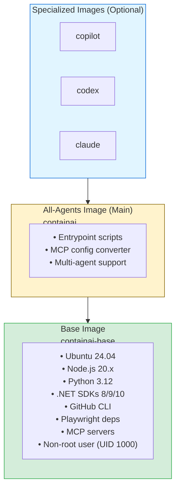

# Build Guide for Container Authors

This guide is for developers who want to build and publish the agent container images. CI owns publishing to GHCR; local builds should mirror the same graph (base → containai → variants) and prefer digests over `--load`.

## Prerequisites

- **Container Runtime**: Docker 20.10+ (Desktop or Engine) with BuildKit enabled (default in recent versions)
- Git
- (Optional) GitHub Container Registry access for publishing

## Architecture Overview

The container system uses a **layered architecture**:



## Image Details

### Base Image (Dockerfile.base)

**Key decisions:**
- Ubuntu 24.04: Latest LTS base
- UID 1000: Matches first user on most Linux/WSL2 systems
- Non-root: Security best practice
- Multi-language: Node.js, Python, .NET for MCP servers and building code
- Full .NET workloads: Enables building MAUI, Blazor, WASM, mobile apps

**No secrets or authentication:**
- All auth comes from runtime mounts
- Image can be published publicly

**Package installations (high level):**
- System packages: curl, git, build-essential, sudo, zsh, jq, unzip, tmux, gosu, seccomp headers
- Language runtimes: Node.js 20.x, Python 3.12, .NET SDK 8/9/10, PowerShell
- Tools: GitHub CLI (gh), Playwright dependencies, MCP servers
- Python packages: tomli, pipx, uv

### All-Agents Image (Dockerfile)

**Scripts copied:**
- `/usr/local/bin/entrypoint.sh` - Startup logic
- `/usr/local/bin/setup-mcp-configs.sh` - MCP wrapper
- `/usr/local/bin/convert-toml-to-mcp.py` - TOML parser

**Behavior:**
- Checks for `/workspace/config.toml`
- Converts TOML to JSON for each agent
- Loads optional `~/.mcp-secrets.env`
- Validates git/gh authentication
- Runs user command

### Specialized Images (Dockerfile.*)

Each adds:
- Validation script in `/usr/local/bin/validate-<agent>-auth.sh`
- Checks for `~/.config/<agent>/` mount
- Warns if missing (doesn't fail)
- Changes CMD to launch agent directly

## Publishing to Registry (CI-driven)

- CI workflow `.github/workflows/build-runtime-images.yml` builds base → containai → variants, pushes immutable `sha-<commit>` tags, then re-tags `dev`/`nightly`/`prod`/release only after all images succeed. Trivy scans run by digest; no `--load` tarballs.
- Payload + SBOM publish as a public OCI artifact (`containai-payload:<tag>`), attested in CI.
- Channel metadata publishes as a public OCI artifact (`containai-metadata:<channel>` and `:channels`) for installer resolution.
- GHCR packages are forced public and pruned (keep recent digests) in the workflow.
- Local pushes are discouraged; for local testing use `docker buildx build --output=type=oci` and avoid tagging `latest` in GHCR.

## Script Files

### entrypoint.sh

**Location:** `scripts/entrypoint.sh` → `/usr/local/bin/entrypoint.sh`

**Purpose:**
- Display repository info
- Configure git credential helper (gh CLI)
- Run MCP config conversion
- Load MCP secrets
- Validate authentication
- Execute user command

**Called by:** Docker ENTRYPOINT

### setup-mcp-configs.sh

**Location:** `scripts/setup-mcp-configs.sh` → `/usr/local/bin/setup-mcp-configs.sh`

**Purpose:**
- Check for `/workspace/config.toml`
- Call Python converter script
- Exit cleanly if no config found

**Called by:** `entrypoint.sh`

### convert-toml-to-mcp.py

**Location:** `scripts/convert-toml-to-mcp.py` → `/usr/local/bin/convert-toml-to-mcp.py`

**Purpose:**
- Parse TOML config
- Extract `[mcp_servers]` section
- Generate JSON for each agent:
  - `~/.config/github-copilot/mcp/config.json`
  - `~/.config/codex/mcp/config.json`
  - `~/.config/claude/mcp/config.json`

**Called by:** `setup-mcp-configs.sh`

**Dependencies:** `tomli` package (installed in base image)

## Image Size Optimization

Current approximate sizes:
- Base: ~3-4 GB (Ubuntu 24.04 ~80MB, Node.js ~200MB, .NET SDKs + workloads ~2GB, Playwright ~500MB, PowerShell ~100MB, build tools ~500MB)
- All-agents: +50 MB
- Specialized: +10 MB each

**Optimization tips:**

1. **Multi-stage builds** (future improvement):
   ```dockerfile
   FROM base as builder
   RUN npm install -g large-package
   
   FROM base
   COPY --from=builder /usr/local/lib/node_modules /usr/local/lib/node_modules
   ```

2. **Combine RUN commands:**
   ```dockerfile
   RUN apt-get update && \
       apt-get install -y package1 package2 && \
       rm -rf /var/lib/apt/lists/*
   ```

3. **Remove build dependencies:**
   ```dockerfile
   RUN apt-get install -y build-essential && \
       # build something && \
       apt-get remove -y build-essential && \
       apt-get autoremove -y
   ```

## Security Considerations

### Image Security

✅ **Implemented:**
- Non-root user (agentuser)
- No secrets in images
- Security opt: `no-new-privileges:true`
- Read-only mounts for auth
- Seccomp profile: `host/profiles/seccomp-containai-agent.json` blocks ptrace/clone3/mount/setns
- AppArmor profile: `host/profiles/apparmor-containai-agent.profile` denies `/proc` and `/sys` writes
- Image secret scanning with Trivy (`--scanners secret`) on base/all-agents/specialized variants

⚠️ **Future improvements:**
- Use distroless images for smaller attack surface
- Implement resource limits in Dockerfiles

#### Secret Scanning Workflow

The bash and PowerShell build scripts automatically invoke Trivy after every successful `docker build`. Install the CLI ahead of time (or set `CONTAINAI_TRIVY_BIN` to a custom path) so the scan can run locally; CI pipelines must do the same. The manual commands are documented below if you need to re-run a scan or double-check a specific tag:

```bash
# Base image
trivy image --scanners secret --exit-code 1 --severity HIGH,CRITICAL containai-base:local

# All-agents wrapper
trivy image --scanners secret --exit-code 1 --severity HIGH,CRITICAL containai:local

# Specialized images
for image in containai-copilot containai-codex containai-claude; do
  trivy image --scanners secret --exit-code 1 --severity HIGH,CRITICAL "${image}:local"
done
```

`--exit-code 1` enforces a failing build when potential secrets are detected. Run the scan before tagging/publishing so flagged layers can be rebuilt without leaking artifacts.

### Build Security

✅ **Best practices:**
- Pin package versions for reproducibility
- Verify GPG signatures (GitHub CLI)
- Use official package repositories
- Clear apt cache after installs

### Publishing Security

⚠️ **Before publishing publicly:**
- Review all Dockerfiles for hardcoded secrets
- Scan images for vulnerabilities
- Test images thoroughly
- Use semantic versioning (not just `latest`)

### Host Security Profiles

Launchers automatically pass both security profiles:

- **Seccomp:** No additional setup—Docker reads `host/profiles/seccomp-containai-agent.json` directly.
- **AppArmor:** Ensure the profile is loaded on Linux hosts:

```bash
sudo apparmor_parser -r host/profiles/apparmor-containai-agent.profile
```

Environment overrides:
None. The built-in profiles under `host/profiles/` are mandatory; rerun `scripts/setup-local-dev.sh` to reinstall them if they are missing.

## Maintenance

### Updating Dependencies

**Node.js version:**
```dockerfile
# In Dockerfile.base
RUN curl -fsSL https://deb.nodesource.com/setup_22.x | bash -
```

**Python version:**
```dockerfile
# In Dockerfile.base
# Python comes from Ubuntu 24.04 (currently 3.12)
# To use a different version, add deadsnakes PPA:
RUN add-apt-repository ppa:deadsnakes/ppa && \
    apt-get update && \
    apt-get install -y python3.13
```

**MCP servers:**
```dockerfile
# In Dockerfile.base
RUN npm install -g @modelcontextprotocol/server-sequential-thinking@latest
```

### Monitoring Image Health

```bash
# Check image details
docker images containai-base:local

# Inspect layers
docker history containai-base:local

# Check for vulnerabilities (if tool installed)
trivy image containai-base:local
```

## Troubleshooting

### Build fails on apt-get

**Issue:** Package not found or network error

**Solution:**
```bash
# Update package lists
docker build --no-cache -f Dockerfile.base -t containai-base:local .
```

### Python package installation fails

**Issue:** pip install fails

**Solution:**
```bash
# Upgrade pip in Dockerfile
RUN python3 -m pip install --upgrade pip
```

### Permission errors during build

**Issue:** Files owned by root

**Solution:**
```dockerfile
# Use COPY with --chown
COPY --chown=agentuser:agentuser script.sh /usr/local/bin/
```

### Script not executable

**Issue:** Permission denied

**Solution:**
```dockerfile
RUN chmod +x /usr/local/bin/script.sh
```

## CI/CD Integration

### GitHub Actions Example

```yaml
name: Build and Push Images

on:
  push:
    branches: [main]
    tags: ['v*']

jobs:
  build:
    runs-on: ubuntu-latest
    steps:
      - uses: actions/checkout@v3
      
      - name: Set up Docker Buildx
        uses: docker/setup-buildx-action@v2
      
      - name: Login to GitHub Container Registry
        uses: docker/login-action@v2
        with:
          registry: ghcr.io
          username: ${{ github.actor }}
          password: ${{ secrets.GITHUB_TOKEN }}
      
      - name: Build and push base
        uses: docker/build-push-action@v4
        with:
          context: .
          file: Dockerfile.base
          push: true
          # We push immutable tags (sha) first, then promote to channel tags (dev/prod)
          # We avoid 'latest' to ensure launchers always use pinned versions
          tags: |
            ghcr.io/${{ github.repository }}-base:sha-${{ github.sha }}
            ghcr.io/${{ github.repository }}-base:dev
          cache-from: type=registry,ref=ghcr.io/${{ github.repository }}-base:buildcache
          cache-to: type=registry,ref=ghcr.io/${{ github.repository }}-base:buildcache,mode=max
      
      - name: Build and push all-agents
        uses: docker/build-push-action@v4
        with:
          context: .
          file: Dockerfile
          push: true
          # We push immutable tags (sha) first, then promote to channel tags (dev/prod)
          # We avoid 'latest' to ensure launchers always use pinned versions
          tags: |
            ghcr.io/${{ github.repository }}:sha-${{ github.sha }}
            ghcr.io/${{ github.repository }}:dev
          build-args: BASE_IMAGE=ghcr.io/${{ github.repository }}-base:latest
```

## FAQ

**Q: Why separate base and derived images?**  
A: Base image is large (~4GB) and changes rarely. Derived images are small and change frequently during development.

**Q: Can I use a different base image?**  
A: Yes, but ensure it has all required packages. Ubuntu 24.04 LTS is recommended for latest tooling and long-term support.

**Q: Why UID 1000?**  
A: Matches the first user on most Linux/WSL2 systems, preventing permission issues with mounted volumes.

**Q: Do I need all specialized images?**  
A: No. The `containai:local` all-agents image can run any agent. Specialized images are convenience wrappers.

**Q: Can I add more MCP servers to the base image?**  
A: Yes, but consider if they should be pre-installed (bloats image) or installed at runtime (slower startup).

---

**Next Steps:**
- See [../USAGE.md](../USAGE.md) for end-user guide
- See [architecture.md](architecture.md) for system design
