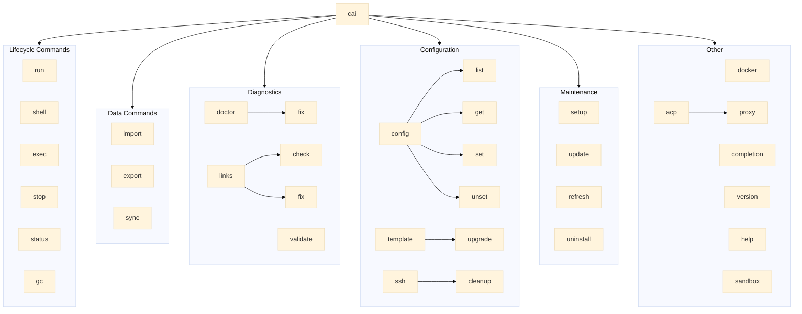

# CLI Reference

Complete reference for the ContainAI CLI (`cai`/`containai` commands).

## Maintenance Policy

**Source of truth**: The CLI implementation (`src/containai.sh`) is the authoritative source. The `cai --help` output shows commonly-used options; this documentation is comprehensive and includes advanced flags not shown in help output (e.g., `-D/--debug`, `--credentials`).

**Scope**: This document covers ALL implemented commands and flags, including those intentionally omitted from help for brevity (e.g., `template`). Shell completion scripts also support these advanced flags.

**When to update this document:**
- After adding or removing CLI commands or subcommands
- After adding, removing, or changing flags
- After changing environment variable behavior
- After modifying exit codes

**Verification**: Check `src/containai.sh` for the canonical flag definitions. The completion flags (search for `run_flags=`, `shell_flags=`, etc.) list all supported options.

## Quick Reference

| Command | Description | Subcommands |
|---------|-------------|-------------|
| [`cai run`](#cai-run) | Start/attach to container (default) | - |
| [`cai shell`](#cai-shell) | Open interactive shell via SSH | - |
| [`cai exec`](#cai-exec) | Run command in container | - |
| [`cai doctor`](#cai-doctor) | Check system capabilities | `fix` |
| [`cai setup`](#cai-setup) | Configure secure isolation | - |
| [`cai validate`](#cai-validate) | Validate Sysbox configuration | - |
| [`cai docker`](#cai-docker) | Docker with ContainAI context | - |
| [`cai import`](#cai-import) | Sync host configs to volume | - |
| [`cai export`](#cai-export) | Export volume to archive | - |
| [`cai sync`](#cai-sync) | In-container config sync | - |
| [`cai stop`](#cai-stop) | Stop containers | - |
| [`cai status`](#cai-status) | Show container status | - |
| [`cai gc`](#cai-gc) | Garbage collection | - |
| [`cai ssh`](#cai-ssh) | Manage SSH configuration | `cleanup` |
| [`cai links`](#cai-links) | Verify/repair symlinks | `check`, `fix` |
| [`cai config`](#cai-config) | Manage settings | `list`, `get`, `set`, `unset` |
| [`cai template`](#cai-template) | Manage templates | `upgrade` |
| [`cai acp`](#cai-acp) | ACP proxy for editors | `proxy` |
| [`cai completion`](#cai-completion) | Generate completions | - |
| [`cai version`](#cai-version) | Show version | - |
| [`cai update`](#cai-update) | Update installation | - |
| [`cai refresh`](#cai-refresh) | Pull latest base image | - |
| [`cai uninstall`](#cai-uninstall) | Remove system components | - |
| [`cai help`](#cai-help) | Show help message | - |
| [`cai sandbox`](#cai-sandbox) | **DEPRECATED** | - |

## Command Hierarchy



## Commands

### cai

Main entry point. Running `cai` without arguments is equivalent to `cai run`.

**Synopsis:**
```bash
cai [subcommand] [options]
containai [subcommand] [options]
```

**Global Options:**

| Option | Description |
|--------|-------------|
| `-h`, `--help` | Show help (use with subcommand for subcommand help) |

**Notes:**
- `cai` and `containai` are aliases
- **Installed usage:** The `install.sh` script creates a wrapper at `~/.local/bin/cai` that sources automatically
- **Development usage:** Source directly with `source src/containai.sh`
- Requires Bash 4.0+

---

### cai run

Start or attach to a sandbox container. This is the default command when `cai` is run without arguments.

**Synopsis:**
```bash
cai run [path] [options] [-- <agent-args>]
cai [path] [options] [-- <agent-args>]
```

**Options:**

| Option | Description |
|--------|-------------|
| `<path>` | Workspace path (positional, alternative to --workspace) |
| `-w`, `--workspace <path>` | Workspace path (default: current directory) |
| `--data-volume <vol>` | Data volume name (overrides config) |
| `--config <path>` | Config file path (overrides auto-discovery) |
| `--container <name>` | Use or create container with specified name |
| `--template <name>` | Template name (default: "default") |
| `--channel <channel>` | Release channel: `stable` or `nightly` (default: stable) |
| `--image-tag <tag>` | Image tag (advanced/debugging, ignored with --template) |
| `--memory <size>` | Memory limit (e.g., "4g", "8g") |
| `--cpus <count>` | CPU limit (e.g., 2, 4) |
| `--fresh` | Remove and recreate container (preserves volume) |
| `--restart` | Alias for `--fresh` |
| `--reset` | Reset workspace state (new unique volume name) |
| `--force` | Skip isolation checks (testing only) |
| `-d`, `--detached` | Run in background |
| `-q`, `--quiet` | Suppress verbose output |
| `--verbose` | Enable verbose output |
| `-D`, `--debug` | Enable debug output |
| `--dry-run` | Show what would happen without executing |
| `-e`, `--env <VAR=val>` | Set environment variable (repeatable) |
| `--credentials <mode>` | Credential mode (only `none` supported with Sysbox isolation) |
| `-- <args>` | Pass arguments to agent |

**Deprecated/Unsupported flags:**

| Flag | Behavior |
|------|----------|
| `--allow-host-credentials` | Errors at runtime (unsupported with Sysbox) |
| `--allow-host-docker-socket` | Errors at runtime (unsupported with Sysbox) |
| `--mount-docker-socket` | Errors at runtime (unsupported with Sysbox) |
| `--i-understand-this-exposes-host-credentials` | Parsed but ignored (acknowledgment for `--allow-host-credentials`) |
| `--i-understand-this-grants-root-access` | Parsed but ignored (acknowledgment for `--allow-host-docker-socket`) |
| `--please-root-my-host` | Parsed but ignored (legacy flag) |
| `--acknowledge-credential-risk` | Parsed but ignored (legacy flag) |

**Note:** Host credential sharing and Docker socket mounting are not available with Sysbox isolation. Use `cai import` for credentials and the built-in Docker-in-Docker for container operations.

**Examples:**
```bash
# Start container for current directory
cai

# Start container for specific workspace
cai /path/to/project

# Recreate container with fresh state
cai --fresh /path/to/project

# Preview actions without executing
cai --dry-run

# Pass arguments to agent
cai -- --print

# Set environment variables
cai -e API_KEY=secret -e DEBUG=true
```

**Related:** [Configuration Reference](configuration.md), [Container Lifecycle](lifecycle.md)

---

### cai shell

Open an interactive shell in the container via SSH.

**Synopsis:**
```bash
cai shell [path] [options]
```

**Options:**

| Option | Description |
|--------|-------------|
| `<path>` | Workspace path (positional) |
| `-w`, `--workspace <path>` | Workspace path (default: current directory) |
| `--data-volume <vol>` | Data volume name |
| `--config <path>` | Config file path |
| `--container <name>` | Container name |
| `--template <name>` | Template name (default: "default") |
| `--channel <channel>` | Release channel: `stable` or `nightly` |
| `--image-tag <tag>` | Image tag (advanced/debugging) |
| `--memory <size>` | Memory limit |
| `--cpus <count>` | CPU limit |
| `--fresh` | Remove and recreate container |
| `--restart` | Alias for `--fresh` |
| `--reset` | Reset workspace state |
| `--force` | Skip isolation checks |
| `--dry-run` | Show what would happen |
| `-q`, `--quiet` | Suppress verbose output |
| `-D`, `--debug` | Enable debug output |
| `--verbose` | Print container and volume names to stderr |

**Exit Codes:**

| Code | Meaning |
|------|---------|
| 0 | Success (SSH session completed normally) |
| 1 | Container creation failed |
| 11 | Container failed to start |
| 12 | SSH setup failed |
| 13 | SSH connection failed after retries |
| 14 | Host key mismatch could not be auto-recovered |
| 15 | Container exists but not owned by ContainAI |
| * | Exit status from remote shell command |

**Examples:**
```bash
# Open shell in container for current directory
cai shell

# Open shell for specific workspace
cai shell /path/to/project

# Use or create named container
cai shell --container foo

# Recreate container with fresh SSH keys
cai shell --fresh
```

**Connection Handling:**
- Automatic retry on transient failures (connection refused, timeout)
- Max 3 retries with exponential backoff
- Auto-regenerates missing SSH config
- Clear error messages with remediation steps

---

### cai exec

Run a command in the container via SSH.

**Synopsis:**
```bash
cai exec [options] [--] <command> [args...]
```

**Options:**

| Option | Description |
|--------|-------------|
| `-w`, `--workspace <path>` | Workspace path (default: current directory) |
| `--container <name>` | Container name |
| `--template <name>` | Template name (default: "default") |
| `--channel <channel>` | Release channel |
| `--data-volume <vol>` | Data volume name |
| `--config <path>` | Config file path |
| `--fresh` | Remove and recreate container |
| `--force` | Skip isolation checks |
| `-q`, `--quiet` | Suppress verbose output |
| `--verbose` | Enable verbose output |
| `-D`, `--debug` | Enable debug output |
| `--` | Separator between cai options and command |

**Exit Codes:**

| Code | Meaning |
|------|---------|
| 0 | Command completed successfully |
| 1 | General error |
| 11 | Container failed to start |
| 12 | SSH setup failed |
| 13 | SSH connection failed |
| 14 | Host key mismatch |
| 15 | Container not owned by ContainAI |
| * | Exit code from remote command |

**Examples:**
```bash
# List files in workspace
cai exec ls -la

# Run simple command
cai exec echo hello

# Use -- separator for commands starting with dash
cai exec -- --help

# Execute in specific workspace
cai exec -w /path/to/project pwd

# Execute in named container
cai exec --container foo ls
```

**Notes:**
- Command runs in a login shell (`bash -lc`)
- Automatically allocates PTY if stdin is a TTY
- Streams stdout/stderr in real-time

---

### cai doctor

Check system capabilities and show diagnostics.

**Synopsis:**
```bash
cai doctor [options]
cai doctor fix [--all | <target> [--all|<name>]]
```

**Options:**

| Option | Description |
|--------|-------------|
| `--json` | Output machine-parseable JSON |
| `--build-templates` | Run heavy template validation (actual docker build) |
| `--reset-lima` | Delete Lima VM and Docker context (macOS only) |

**Fix Targets:**

| Target | Description |
|--------|-------------|
| `fix` | Show available fix targets |
| `fix --all` | Fix everything fixable |
| `fix volume` | List volumes, offer to fix |
| `fix volume --all` | Fix all volumes |
| `fix volume <name>` | Fix specific volume |
| `fix container` | List containers, offer to fix |
| `fix container --all` | Fix all containers |
| `fix container <name>` | Fix specific container |
| `fix template` | Restore default template |
| `fix template <name>` | Restore specific template |
| `fix template --all` | Restore all repo-shipped templates |

**Exit Codes:**

| Code | Meaning |
|------|---------|
| 0 | All checks pass |
| 1 | Checks failed (run `cai setup` to configure) |

**Examples:**
```bash
# Run all checks
cai doctor

# Output JSON for scripts
cai doctor --json

# Show fix targets
cai doctor fix

# Fix everything
cai doctor fix --all

# Fix specific container
cai doctor fix container myname
```

**What 'fix' can remediate:**
- Missing SSH key (regenerates)
- Missing SSH config directory
- Missing Include directive
- Stale SSH configs
- Wrong file permissions
- Container SSH configuration
- Missing/corrupted templates

**What requires manual action:**
- Sysbox not installed
- Docker context not configured
- Kernel version incompatible
- Docker daemon not running

---

### cai setup

Configure secure container isolation with Sysbox runtime.

**Synopsis:**
```bash
cai setup [options]
```

**Options:**

| Option | Description |
|--------|-------------|
| `--force` | Bypass seccomp compatibility warning (WSL2 only) |
| `--dry-run` | Show what would be done |
| `--skip-templates` | Skip installing template files |
| `--verbose` | Show detailed progress |

**Platform Behavior:**

| Platform | Action |
|----------|--------|
| Linux (Ubuntu/Debian) | Installs Sysbox, creates isolated Docker daemon |
| Linux (other distros) | Manual setup required |
| WSL2 | Same as Linux, with seccomp warning |
| macOS | Creates Lima VM with Docker + Sysbox |

**What It Does (Linux):**
1. Detects distribution
2. Cleans up legacy ContainAI paths
3. Downloads and installs Sysbox
4. Creates isolated Docker daemon:
   - Config: `/etc/containai/docker/daemon.json`
   - Socket: `/var/run/containai-docker.sock`
   - Data: `/var/lib/containai-docker/`
   - Service: `containai-docker.service`
5. Creates `containai-docker` Docker context
6. Verifies installation with test container
7. Installs shell completions

**Examples:**
```bash
# Standard setup
cai setup

# Preview what would be done
cai setup --dry-run

# Setup with verbose output
cai setup --verbose
```

**Related:** [Setup Guide](setup-guide.md)

---

### cai validate

Validate that Sysbox Secure Engine is correctly configured.

**Synopsis:**
```bash
cai validate [options]
```

**Options:**

| Option | Description |
|--------|-------------|
| `--verbose` | Show detailed information |

**Validation Checks:**
1. Context exists with correct endpoint
2. Engine is reachable via the context
3. Sysbox runtime (sysbox-runc) is available
4. User namespace isolation is enabled
5. Test container runs successfully

**Examples:**
```bash
# Run validation
cai validate

# Verbose output
cai validate --verbose
```

---

### cai docker

Run docker commands with the ContainAI context.

**Synopsis:**
```bash
cai docker [docker-args...]
```

**Behavior:**
- Automatically uses the `containai-docker` context
- If `--context` is explicitly provided, uses that context instead
- Inside containers, runs without context override
- Auto-repairs context if endpoint is wrong

**Examples:**
```bash
# List containers in ContainAI context
cai docker ps

# Inspect a container
cai docker inspect my-container

# Build an image
cai docker build -t myimage .

# Use explicit context (overrides default)
cai docker --context default ps
```

---

### cai import

Sync host configs to data volume or hot-reload into running container.

**Synopsis:**
```bash
cai import [path] [options]
```

**Options:**

| Option | Description |
|--------|-------------|
| `<path>` | Workspace path (enables hot-reload mode) |
| `--workspace <path>` | Alternative to positional path |
| `--container <name>` | Target specific container |
| `--data-volume <vol>` | Data volume name |
| `--from <path>` | Import source (directory or .tgz archive) |
| `--config <path>` | Config file path |
| `--dry-run` | Preview changes |
| `--no-excludes` | Skip exclude patterns from config |
| `--no-secrets` | Skip syncing secrets (OAuth tokens, API keys) |
| `--verbose` | Show verbose output |

**Modes:**

| Mode | Trigger | Behavior |
|------|---------|----------|
| Hot-Reload | Workspace path or `--container` | Syncs to volume AND reloads into running container |
| Volume-Only | No path or container | Syncs to volume only |

**What Gets Synced:**
- Environment variables (via `[env]` config)
- Git config (user.name, user.email)
- API tokens/credentials (to data volume paths)
- Shell configs, editor configs, prompt themes

**Examples:**
```bash
# Hot-reload into running container
cai import /path/to/workspace

# Hot-reload into named container
cai import --container my-project

# Sync to auto-resolved volume only
cai import

# Preview what would be synced
cai import --dry-run

# Sync without secrets
cai import --no-secrets

# Restore from archive
cai import --from backup.tgz
```

**Security Notes:**
- `~/.claude/.credentials.json` and `~/.codex/auth.json` are NOT imported by default
- `~/.ssh` is NOT imported by default (use agent forwarding instead)
- Use `--dry-run` to preview what will be synced

**`--no-secrets` Caveats:**
- Only affects built-in sync entries (OAuth tokens, API keys from known paths)
- Does NOT affect user-specified `[import].additional_paths` - those are always synced
- Has no effect with `--from archive.tgz` (archive restore bypasses sync filtering)
- Does NOT affect the `--credentials` flag behavior
- Use `--dry-run --no-secrets` to preview which secrets would be skipped

**Related:** [Configuration Reference](configuration.md#import-section), [Sync Architecture](sync-architecture.md)

---

### cai export

Export data volume to a `.tgz` archive.

**Synopsis:**
```bash
cai export [options]
```

**Options:**

| Option | Description |
|--------|-------------|
| `-o`, `--output <path>` | Output path (file or directory) |
| `--container <name>` | Target specific container |
| `--data-volume <vol>` | Data volume name |
| `--workspace <path>` | Workspace path for config resolution |
| `--config <path>` | Config file path |
| `--no-excludes` | Skip exclude patterns |
| `--verbose` | Enable verbose output |

**Output Path:**
- Default: `containai-export-YYYYMMDD-HHMMSS.tgz` in current directory
- If path is a directory, appends default filename
- Output directory must exist

**Examples:**
```bash
# Export to current directory
cai export

# Export to specific file
cai export -o ~/backup.tgz

# Export to directory with auto-name
cai export -o ~/backups/

# Export from specific container
cai export --container my-project
```

---

### cai sync

Move local configs to data volume with symlinks (in-container command).

**Synopsis:**
```bash
cai sync [options]
```

**Options:**

| Option | Description |
|--------|-------------|
| `--dry-run` | Show what would happen |
| `--verbose` | Show detailed output |

**Security:**
- Only runs inside ContainAI containers
- Validates all paths with realpath
- Rejects paths containing symlinks
- Verifies targets are under `/mnt/agent-data`

**Examples:**
```bash
# Sync all eligible configs
cai sync

# Preview what would be synced
cai sync --dry-run
```

**Note:** This command is intended to run inside containers, not on the host.

---

### cai stop

Stop ContainAI containers.

**Synopsis:**
```bash
cai stop [options]
```

**Options:**

| Option | Description |
|--------|-------------|
| `--container <name>` | Stop specific container |
| `--all` | Stop all containers without prompting |
| `--export` | Export data volume before stopping |
| `--remove` | Also remove containers (not just stop) |
| `--force` | Skip session warning prompt |
| `--verbose` | Enable verbose output |

**Session Warning:**
When stopping a container with active sessions, you'll be prompted to confirm. Use `--force` to skip this prompt.

**Examples:**
```bash
# Interactive selection
cai stop

# Stop specific container
cai stop --container my-proj

# Stop all containers
cai stop --all

# Export before stopping
cai stop --export

# Remove containers (cleans SSH configs)
cai stop --remove

# Stop without prompts
cai stop --force
```

**Related:** [Container Lifecycle](lifecycle.md#container-stopping)

---

### cai status

Show container status and resource usage.

**Synopsis:**
```bash
cai status [options]
```

**Options:**

| Option | Description |
|--------|-------------|
| `--workspace <path>` | Show status for workspace container |
| `--container <name>` | Show status for specific container |
| `--json` | Output in JSON format |
| `--verbose` | Enable verbose output |

**Output Fields:**
- **Required:** container name, status, image
- **Best-effort (5s timeout):** uptime, sessions, memory, cpu

**Examples:**
```bash
# Status for current workspace
cai status

# Status for specific container
cai status --container my-proj

# JSON output
cai status --json
```

---

### cai gc

Garbage collection for stale containers and images.

**Synopsis:**
```bash
cai gc [options]
```

**Options:**

| Option | Description |
|--------|-------------|
| `--dry-run` | Preview what would be removed |
| `--force` | Skip confirmation prompt |
| `--age <duration>` | Minimum age for pruning (default: 30d) |
| `--images` | Also prune unused ContainAI images |
| `--verbose` | Enable verbose output |

**Age Format:**
- `Nd` - days (e.g., `7d`, `30d`)
- `Nh` - hours (e.g., `24h`)

**Protection Rules:**
- Never prunes running containers
- Never prunes containers with `containai.keep=true` label
- Only prunes containers with `containai.managed=true` label
- Operates on current Docker context only

**Image Pruning:**
Prunes unused images matching:
- `containai:*` (local builds)
- `ghcr.io/containai/*` (official registry)

**Examples:**
```bash
# Interactive: list candidates and confirm
cai gc

# Preview without removing
cai gc --dry-run

# Skip confirmation
cai gc --force

# Prune containers older than 7 days
cai gc --age 7d

# Also prune images
cai gc --images
```

---

### cai ssh

Manage SSH configuration for containers.

**Synopsis:**
```bash
cai ssh <subcommand> [options]
```

#### cai ssh cleanup

Remove stale SSH configs for non-existent containers.

**Synopsis:**
```bash
cai ssh cleanup [options]
```

**Options:**

| Option | Description |
|--------|-------------|
| `--dry-run` | Show what would be cleaned |
| `--verbose` | Enable verbose output |

**What Gets Cleaned:**
- SSH host config files in `~/.ssh/containai.d/*.conf`
- Corresponding known_hosts entries in `~/.config/containai/known_hosts`

**Examples:**
```bash
# Remove stale configs
cai ssh cleanup

# Preview what would be removed
cai ssh cleanup --dry-run
```

---

### cai links

Verify and repair container symlinks.

**Synopsis:**
```bash
cai links <subcommand> [options]
```

#### cai links check

Verify symlinks match `link-spec.json`.

#### cai links fix

Repair broken or missing symlinks.

**Options:**

| Option | Description |
|--------|-------------|
| `<path>` | Workspace path |
| `--workspace <path>` | Alternative to positional path |
| `--name <name>` | Container name |
| `--config <path>` | Config file path |
| `-q`, `--quiet` | Suppress output |
| `--verbose` | Enable verbose output |
| `--dry-run` | Show what would be fixed (fix only) |

**Exit Codes:**

| Code | Meaning |
|------|---------|
| 0 | Success |
| 1 | Issues found (check) or errors occurred |

**Examples:**
```bash
# Verify symlinks
cai links check

# Verify for specific workspace
cai links check /path/to/project

# Repair broken symlinks
cai links fix

# Preview fixes
cai links fix --dry-run
```

---

### cai config

Manage settings with workspace-aware scope.

**Synopsis:**
```bash
cai config <subcommand> [options]
```

#### cai config list

Show all settings with source.

#### cai config get <key>

Get effective value with source.

#### cai config set <key> <value>

Set value (workspace if in one, else global).

#### cai config unset <key>

Remove setting.

**Scoping Options:**

| Option | Description |
|--------|-------------|
| `-g`, `--global` | Force global scope for set/unset |
| `--workspace <path>` | Apply to specific workspace |
| `--verbose` | Enable verbose output |

**Workspace-scoped keys:**
- `data_volume` - Data volume name

**Global keys:**
- `agent.default` - Default agent (also accepts "agent" as alias)
- `ssh.forward_agent` - Enable SSH agent forwarding
- `ssh.port_range_start` - SSH port range start
- `ssh.port_range_end` - SSH port range end
- `import.auto_prompt` - Prompt for import on new volume
- `import.exclude_priv` - Filter out `*.priv.*` files from `.bashrc.d/` (default: true)

**Source Column Values:**

| Source | Meaning |
|--------|---------|
| `cli` | From command-line flag |
| `env` | From environment variable |
| `workspace:<path>` | From workspace state |
| `repo-local` | From `.containai/config.toml` |
| `user-global` | From `~/.config/containai/config.toml` |
| `default` | Built-in default |

**Examples:**
```bash
# Show all settings
cai config list

# Get effective agent
cai config get agent

# Set global default agent
cai config set agent.default claude

# Set workspace data_volume
cai config set data_volume my-vol

# Remove workspace setting
cai config unset data_volume

# Remove global setting
cai config unset -g ssh.forward_agent
```

**Related:** [Configuration Reference](configuration.md)

---

### cai template

Manage container templates.

**Synopsis:**
```bash
cai template <subcommand> [options]
```

#### cai template upgrade [name]

Upgrade template(s) to use `ARG BASE_IMAGE` pattern for channel selection.

**Options:**

| Option | Description |
|--------|-------------|
| `--dry-run` | Show what would change |

**What It Does:**
- Scans template Dockerfiles for hardcoded FROM lines
- Adds `ARG BASE_IMAGE=<current-image>` before FROM
- Rewrites FROM to use `${BASE_IMAGE}`
- Preserves all other template content

**Examples:**
```bash
# Upgrade all templates
cai template upgrade

# Upgrade specific template
cai template upgrade default

# Preview changes
cai template upgrade --dry-run
```

**Related:** [Configuration Reference](configuration.md#template-section)

---

### cai acp

ACP (Agent Communication Protocol) proxy for editor integration.

**Synopsis:**
```bash
cai acp proxy <agent>
```

#### cai acp proxy

Start ACP proxy for editor integration.

**Arguments:**
- `<agent>` - Agent name: `claude`, `gemini`

**Examples:**
```bash
# Start proxy for Claude
cai acp proxy claude

# Start proxy for Gemini
cai acp proxy gemini
```

**Notes:**
- Requires the ACP proxy binary to be built and installed
- Build with: `src/acp-proxy/build.sh --install`

**Related:** [ACP Documentation](acp.md)

---

### cai completion

Generate shell completion scripts.

**Synopsis:**
```bash
cai completion <shell>
```

**Shells:**
- `bash` - Bash completion script
- `zsh` - Zsh completion script

**Installation:**

**Bash (add to ~/.bashrc):**
```bash
source <(cai completion bash)
# Or save to a file:
cai completion bash > ~/.local/share/bash-completion/completions/cai
```

**Zsh (add to ~/.zshrc):**
```bash
source <(cai completion zsh)
# Or save to a file (ensure fpath includes the directory):
cai completion zsh > ~/.zfunc/_cai
```

**Notes:**
- Completion scripts are static and can be saved for faster loading
- Dynamic completion uses cached Docker lookups (500ms timeout)
- Results cached for 5 seconds

---

### cai version

Show current version.

**Synopsis:**
```bash
cai version [options]
```

**Options:**

| Option | Description |
|--------|-------------|
| `--json` | Output machine-parseable JSON |

**Examples:**
```bash
# Show version
cai version

# JSON output
cai version --json
```

---

### cai update

Update ContainAI installation.

**Synopsis:**
```bash
cai update [options]
```

**Options:**

| Option | Description |
|--------|-------------|
| `--dry-run` | Show what would be done |
| `--stop-containers` | Stop running containers before update (Linux/WSL2) |
| `--force` | Skip all confirmation prompts |
| `--lima-recreate` | Force Lima VM recreation (macOS only) |
| `--verbose` | Show verbose output |

**What Gets Updated:**

**CLI Code (git-based installations):**
- `CAI_BRANCH` env var: explicit branch override (highest precedence)
- `CAI_CHANNEL=nightly` or `[image].channel=nightly`: pulls latest main
- `CAI_CHANNEL=stable` (default): checks out latest v* tag

**Linux/WSL2:**
- Systemd unit file (if template changed)
- Docker service restart
- Docker context verification
- Dockerd bundle version
- Sysbox version
- Legacy path cleanup

**macOS Lima:**
- If template unchanged: apt update/upgrade in VM
- If template changed: VM recreation (prompts unless `--force`)

**Examples:**
```bash
# Standard update
cai update

# Preview changes
cai update --dry-run

# Update without prompts
cai update --force

# Force Lima VM recreation (macOS)
cai update --lima-recreate
```

---

### cai refresh

Pull latest base image and optionally rebuild template.

**Synopsis:**
```bash
cai refresh [options]
cai --refresh [options]
```

**Options:**

| Option | Description |
|--------|-------------|
| `--rebuild` | Rebuild default template after pulling |
| `--verbose` | Show verbose output |

**What Gets Refreshed:**
- **Base Image:** Pulls latest based on channel (stable/nightly)
- **Template Image (--rebuild):** Rebuilds default template
- **Registry Cache:** Clears cached metadata

**Examples:**
```bash
# Pull latest base image
cai refresh

# Pull and rebuild template
cai refresh --rebuild
```

---

### cai uninstall

Clean removal of system-level components.

**Synopsis:**
```bash
cai uninstall [options]
```

**Options:**

| Option | Description |
|--------|-------------|
| `--dry-run` | Show what would be removed |
| `--containers` | Stop and remove all ContainAI containers |
| `--volumes` | Also remove volumes (requires `--containers`) |
| `--force` | Skip confirmation prompts |
| `--verbose` | Enable verbose output |

**What Gets Removed:**
- `containai-docker.service` (systemd unit)
- Docker contexts: `containai-docker`, `containai-secure`, `docker-containai`
- Network security iptables rules

**With `--containers`:**
- All containers with `containai.managed=true` label

**With `--volumes`:**
- Container data volumes

**What is PRESERVED:**
- `~/.config/containai/` - SSH keys, config.toml
- `~/.ssh/containai.d/` - SSH host configs
- `/etc/containai/docker/` - daemon.json
- `/var/lib/containai-docker/` - Docker data, images
- Sysbox packages
- Lima VM (macOS)

**Examples:**
```bash
# Preview removal
cai uninstall --dry-run

# Remove system components
cai uninstall

# Also remove containers
cai uninstall --containers

# Remove everything including volumes
cai uninstall --containers --volumes --force
```

---

### cai help

Show help message.

**Synopsis:**
```bash
cai help
cai -h
cai --help
```

---

### cai sandbox

**DEPRECATED** - Use `cai stop && cai --restart` instead.

**Migration:**

| Old Command | New Command |
|-------------|-------------|
| `cai sandbox reset` | `cai stop && cai --restart` |
| `cai sandbox clear-credentials` | `docker volume rm <volume-name>` |

**Why Deprecated:**
ContainAI now uses Sysbox for container isolation instead of Docker Desktop sandboxes.

---

## Environment Variables

Environment variables that affect CLI behavior.

### Configuration Overrides

| Variable | Description | Default |
|----------|-------------|---------|
| `CONTAINAI_VERBOSE` | Enable verbose output | `0` (disabled) |
| `CONTAINAI_DATA_VOLUME` | Override data volume name | (from config) |
| `CONTAINAI_AGENT` | Override default agent | `claude` |
| `CONTAINAI_AGENT_TAG` | Override agent image tag | (agent-specific) |
| `CONTAINAI_CREDENTIALS` | Credential mode (only `none` supported with Sysbox) | `none` |
| `CONTAINAI_SECURE_ENGINE_CONTEXT` | Docker context for secure engine | (auto-detected) |
| `CONTAINAI_REQUIRE_ISOLATION` | Fail if isolation unavailable (`1` to enable) | `0` |

### Update and Channel

| Variable | Description | Default |
|----------|-------------|---------|
| `CAI_UPDATE_CHECK_INTERVAL` | Update check interval: `hourly`, `daily`, `weekly`, `never` | `daily` |
| `CAI_CHANNEL` | Release channel: `stable` or `nightly` | `stable` |
| `CONTAINAI_CHANNEL` | Alias for `CAI_CHANNEL` | `stable` |
| `CAI_BRANCH` | Explicit git branch override (for development) | (none) |
| `CAI_NO_UPDATE_CHECK` | Disable update checks | `0` |

### Installation and Paths

| Variable | Description | Default |
|----------|-------------|---------|
| `CAI_INSTALL_DIR` | Override installation directory detection | (auto-detected) |

### Setup (Advanced)

These variables are used during `cai setup` for advanced configuration.

| Variable | Description | Default |
|----------|-------------|---------|
| `CAI_SYSBOX_URL` | Override Sysbox download URL | (ContainAI release) |
| `CAI_SYSBOX_TAG` | Pin ContainAI Sysbox release tag | (bundled tag) |
| `CAI_SYSBOX_VERSION` | Pin ContainAI Sysbox package version | (bundled version) |
| `CAI_WSL_SSH_PORT` | SSH port for WSL2 setup | `2222` |

### Debugging and Testing

| Variable | Description | Default |
|----------|-------------|---------|
| `CONTAINAI_DEBUG` | Enable debug logging to stderr | `0` |
| `CAI_YES` | Auto-confirm prompts (for scripts) | `0` |
| `CAI_ACP_TEST_MODE` | Allow any agent name in ACP (testing) | `0` |
| `CAI_ACP_DIRECT_SPAWN` | Bypass containers in ACP (testing) | `0` |

**Precedence:**
1. CLI flags (highest)
2. Environment variables
3. Workspace config
4. Global config
5. Built-in defaults (lowest)

**Note on `CONTAINAI_CREDENTIALS`:** Only `none` is supported with Sysbox isolation. Host credential sharing is not available - use `cai import` to copy credentials into containers.

**Related:** [Configuration Reference](configuration.md#environment-variables)

---

## Exit Codes

Common exit codes across commands.

| Code | Meaning |
|------|---------|
| 0 | Success |
| 1 | General error |
| 11 | Container failed to start |
| 12 | SSH setup failed |
| 13 | SSH connection failed |
| 14 | Host key mismatch |
| 15 | Container exists but not owned by ContainAI |

**Note:** Commands that run remote operations may return the exit code from the remote command.

---

## Deprecated Commands

The following commands have been deprecated and will be removed in future versions.

| Command | Status | Migration |
|---------|--------|-----------|
| `cai sandbox` | DEPRECATED | See [`cai sandbox`](#cai-sandbox) section above |

---

## See Also

- [Quickstart Guide](quickstart.md) - Getting started
- [Configuration Reference](configuration.md) - Config file options
- [Container Lifecycle](lifecycle.md) - Container management
- [Setup Guide](setup-guide.md) - Installation details
- [SECURITY.md](../SECURITY.md) - Security model
