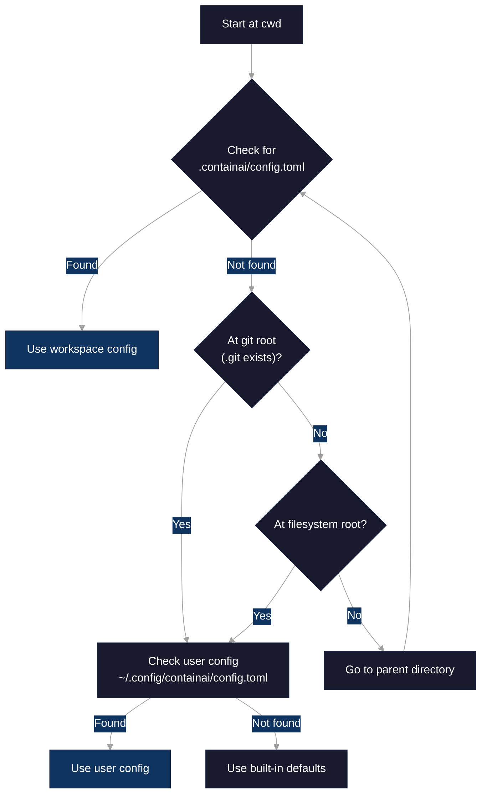
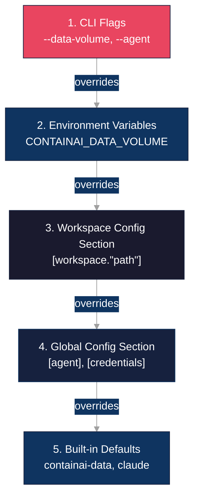

# Configuration Reference

Complete reference for ContainAI's TOML configuration system.

> **Looking for examples?** See [Configuration Examples](examples/README.md) for copy-paste configs covering multi-agent setups, custom sync, isolated workspaces, VS Code Remote-SSH, CI/CD, and team shared configs.

## Config File Locations

ContainAI searches for configuration in this order:

| Location | Scope | Example |
|----------|-------|---------|
| `.containai/config.toml` | Workspace (checked in with repo) | `/project/.containai/config.toml` |
| `~/.config/containai/config.toml` | User (XDG default) | `/home/user/.config/containai/config.toml` |

**Discovery behavior:**

1. Starting from the workspace directory, walk up the directory tree
2. At each directory, check for `.containai/config.toml`
3. **Stop at git root** - if in a git repo, config search does not traverse above the repository boundary
4. If not in a git repo, discovery walks up to filesystem root (but never checks `/.containai/config.toml`)
5. If no workspace config found, check user config at `XDG_CONFIG_HOME/containai/config.toml`
6. If `XDG_CONFIG_HOME` is not set, defaults to `~/.config`



```
/home/user/projects/myapp/src/  <- workspace (cwd)
/home/user/projects/myapp/.containai/config.toml  <- found first (wins)
/home/user/projects/myapp/.git  <- git root (stops search)
/home/user/.config/containai/config.toml  <- fallback (not checked if above found)
```

**Note:** Root filesystem config (`/.containai/config.toml`) is never checked for security reasons.

## Precedence

Configuration values are resolved with this precedence (highest to lowest):



1. **CLI flags** - `--data-volume`, `--agent`, `--credentials`, `--config`
2. **Environment variables** - `CONTAINAI_DATA_VOLUME`, `CONTAINAI_AGENT`, etc.
3. **Workspace config section** - `[workspace."<path>"]` matching current workspace
4. **Global config section** - `[agent]`, `[credentials]`, etc.
5. **Built-in defaults** - `containai-data`, `claude`, `none`

When a CLI flag or environment variable is provided, config file parsing is **skipped entirely** for that value.

## Schema Reference

### `[agent]` Section

Global agent configuration.

| Key | Type | Default | Description |
|-----|------|---------|-------------|
| `default` | string | `"claude"` | Default agent to use (`claude`, `gemini`, etc.) |
| `data_volume` | string | `"containai-data"` | Docker volume for agent data and credentials |

```toml
[agent]
default = "claude"
data_volume = "containai-data"
```

**Volume name rules:**
- 1-255 characters
- Must start with alphanumeric (`a-z`, `A-Z`, `0-9`)
- May contain alphanumeric, underscore (`_`), dot (`.`), or dash (`-`)
- Invalid names cause an error

### `[credentials]` Section

Credential handling configuration.

| Key | Type | Default | Description |
|-----|------|---------|-------------|
| `mode` | string | `"none"` | Credential mode: `none` (safe) |

```toml
[credentials]
mode = "none"
```

**Security restriction:** Setting `credentials.mode = "host"` in config is **ignored**. Host credentials require explicit CLI opt-in via `--allow-host-credentials` (or legacy `--credentials=host`). This prevents config files from escalating privileges without user awareness.

### `[secure_engine]` Section

Secure container engine configuration (Sysbox/ECI).

| Key | Type | Default | Description |
|-----|------|---------|-------------|
| `context_name` | string | `""` | Docker context name for secure engine |

```toml
[secure_engine]
context_name = "desktop-linux"
```

**Context name rules:**
- Max 64 characters
- Alphanumeric, underscore (`_`), or dash (`-`) only
- No control characters (newlines, tabs)
- Empty string means use default context

**Environment override:** `CONTAINAI_SECURE_ENGINE_CONTEXT`

### `[ssh]` Section

SSH connection configuration for containers. Controls port allocation, agent forwarding, and port tunneling.

| Key | Type | Default | Description |
|-----|------|---------|-------------|
| `port_range_start` | integer | `2300` | Start of SSH port range for container allocation |
| `port_range_end` | integer | `2500` | End of SSH port range for container allocation |
| `forward_agent` | boolean | `false` | Enable SSH agent forwarding to container |
| `local_forward` | array of strings | `[]` | Local port forwarding entries |

```toml
[ssh]
port_range_start = 2300
port_range_end = 2500
forward_agent = true
local_forward = ["8080:localhost:8080", "3000:localhost:3000"]
```

**Port range rules:**
- Values must be between 1024 and 65535
- Range should be large enough for concurrent containers
- Ports are allocated dynamically on container start

**Forward agent:**
- When `true`, adds `ForwardAgent yes` to SSH config
- Allows the container to use your local SSH agent for authentication
- **SECURITY WARNING:** An attacker with root access on the container could hijack the forwarded agent to authenticate to other hosts. Only enable if you trust the container environment.

**Local forward format:**
- Each entry: `"localport:remotehost:remoteport"`
- Example: `"8080:localhost:8080"` forwards local port 8080 to container's localhost:8080
- Useful for accessing web servers or databases running in the container
- Invalid entries are skipped with a warning

**VS Code Remote-SSH compatibility:**
- The generated SSH config is fully compatible with VS Code Remote-SSH extension
- After running `cai shell` or `cai run`, the container name is shown in output
- SSH host configs are written to `~/.ssh/containai.d/<container-name>.conf`
- Use the container name as the Remote-SSH host (e.g., `containai-a1b2c3d4`)
- Port forwarding configured here will be available in VS Code sessions

### `[env]` Section

Environment variable import configuration. This section is **global-only** (no workspace overrides).

| Key | Type | Default | Description |
|-----|------|---------|-------------|
| `import` | array of strings | `[]` | Environment variable names to import (explicit names only, no wildcards) |
| `from_host` | boolean | `false` | Import from host environment |
| `env_file` | string | `null` | Workspace-relative path to `.env` file to load |

```toml
[env]
import = ["GITHUB_TOKEN", "AWS_ACCESS_KEY_ID", "AWS_SECRET_ACCESS_KEY"]
from_host = true
env_file = ".env.local"
```

**Import list rules:**
- Each entry must be a valid POSIX environment variable name
- Pattern: `^[A-Za-z_][A-Za-z0-9_]*$`
- **No wildcards** - each variable must be listed explicitly
- Invalid names are skipped with a warning

**env_file rules:**
- Must be workspace-relative (no absolute paths)
- Cannot escape workspace directory (e.g., `../secrets.env` is rejected)
- Symlinks are rejected for security
- File must exist and be readable

**Behavior:**
- If `[env]` section is missing, no environment variables are imported (silent)
- If `import` is missing or invalid, treated as empty list with a warning

### `[import]` Section

Configuration for additional files and directories to sync via `cai import`. This allows users to specify custom dotfiles or tool configurations beyond the built-in sync map.

> **Need a launch wrapper with default args?** For tools that need shell wrappers (like autonomous mode flags), create a user manifest instead. See [Custom Tools Guide](custom-tools.md).

| Key | Type | Default | Description |
|-----|------|---------|-------------|
| `additional_paths` | array of strings | `[]` | Additional files/directories to sync from host |
| `exclude_priv` | boolean | `true` | Filter out `*.priv.*` files from `.bashrc.d/` |

```toml
[import]
additional_paths = [
    "~/.my-tool/config.json",
    "~/.my-other-tool/",
]
exclude_priv = true  # default, filters ~/.bashrc.d/*.priv.* files
```

**Privacy filtering (`exclude_priv`):**

When `true` (default), files matching `*.priv.*` in `~/.bashrc.d/` are excluded from import. This prevents accidental sync of files like:
- `~/.bashrc.d/secrets.priv.sh` - API keys or tokens
- `~/.bashrc.d/work.priv.sh` - Work-specific environment variables

**Security note:** The `--no-excludes` CLI flag does NOT disable this filtering. Only the config option can disable it, ensuring secrets aren't accidentally leaked by CLI flags. This filtering also applies to `--from <tgz>` restore operations.

**Path rules:**
- Must start with `~/` (tilde expansion) or be an absolute path under `$HOME`
- Cannot reference other users' home directories (`~user/` is rejected)
- Must not escape `$HOME` after path normalization (e.g., `~/../etc` is rejected)
- Cannot contain colons (reserved for sync map format)
- Symlinks are rejected (both symlink components in path and symlink targets)
- Paths are validated to be under `$HOME` after lexical normalization (no symlink following)

**Target path mapping:**
- Leading dots are stripped for visibility in the volume
- `~/.my-tool/config.json` becomes `/target/my-tool/config.json`
- `~/.my-other-tool/` becomes `/target/my-other-tool/`

**Behavior:**
- If `[import]` section is missing, no additional paths are synced (silent)
- If `additional_paths` is missing, treated as empty list (silent)
- If `additional_paths` has invalid type or entries, treated as empty with a warning
- Paths that don't exist on the host are silently skipped
- Files and directories are detected automatically
- Works with workspace-specific config (`.containai/config.toml`) and user config (`~/.config/containai/config.toml`)

**Note on `--no-secrets`:** The `--no-secrets` flag only affects built-in sync entries (like OAuth tokens and SSH keys). User-specified `additional_paths` are always synced regardless of `--no-secrets`, since users explicitly choose to include these paths. If you need to skip sensitive additional paths, remove them from the config.

**Security note:** When using workspace-specific config (`.containai/config.toml`), review `additional_paths` before syncing - a malicious repository could add sensitive paths. Use `cai import --dry-run` to preview what will be synced.

**Viewing what will be synced:**
```bash
cai import --dry-run   # Shows additional paths from config
```

### `[danger]` Section

Optional audit trail for dangerous features. **This section is informational only - CLI flags are the actual gates.**

| Key | Type | Default | Description |
|-----|------|---------|-------------|
| `allow_host_credentials` | boolean | `false` | Audit marker for host credential access |
| `allow_host_docker_socket` | boolean | `false` | Audit marker for Docker socket access |

```toml
[danger]
allow_host_credentials = true
allow_host_docker_socket = true
```

**Important:** The `[danger]` section does **not** enable dangerous features. CLI flags are the only gates:

| Feature | CLI Flag Required |
|---------|-------------------|
| Host credentials | `--allow-host-credentials` |
| Docker socket | `--allow-host-docker-socket` |

The `[danger]` config keys do not enable or bypass safety gates - CLI flags are still required. These keys are parsed and available for audit purposes but currently have no effect on runtime behavior. See `cai --help` for CLI flag details.

### `[update]` Section

Configuration for dockerd bundle update checks. These checks warn you when a newer version of the managed dockerd bundle is available (Linux/WSL2 only).

| Key | Type | Default | Description |
|-----|------|---------|-------------|
| `check_interval` | string | `"daily"` | How often to check for updates: `hourly`, `daily`, `weekly`, or `never` |

```toml
[update]
check_interval = "daily"
```

**Valid intervals:**
- `hourly` - Check at most once per hour
- `daily` - Check at most once per day (default)
- `weekly` - Check at most once per week
- `never` - Disable update checks entirely

**Environment override:** `CAI_UPDATE_CHECK_INTERVAL`

The environment variable takes precedence over the config file setting. For example:
```bash
# Disable update checks for this session
CAI_UPDATE_CHECK_INTERVAL=never cai doctor

# Force hourly checks
CAI_UPDATE_CHECK_INTERVAL=hourly cai shell /workspace
```

**Rate-limit state:**

Update check state is stored in `~/.cache/containai/update-check`. This file tracks when the last check occurred (via file mtime) to enforce the rate limit. The file content stores the result of the last check.

**Platform notes:**
- Update checks only run on Linux/WSL2 where the managed dockerd bundle is installed
- On macOS, update checks are skipped (Lima VM manages its own Docker)

### `[template]` Section

Template system configuration for customizing container images.

| Key | Type | Default | Description |
|-----|------|---------|-------------|
| `suppress_base_warning` | boolean | `false` | Suppress warning when template is not based on ContainAI images |

```toml
[template]
suppress_base_warning = true
```

**Warning suppression:**
- When `false` (default), ContainAI warns if your template Dockerfile uses a base image that doesn't appear to be a ContainAI image
- This warning helps catch configuration mistakes where the template might not work correctly (missing systemd, agents, init scripts)
- Set to `true` if you intentionally use a non-ContainAI base image and understand the implications

**Accepted values:**
- Boolean: `true` or `false`
- Integer: `1` (true) or `0` (false)

#### Template Directory Structure

Templates are stored in `~/.config/containai/templates/`:

```
~/.config/containai/templates/
├── default/
│   └── Dockerfile     # Default template (installed from repo)
└── my-custom/
    └── Dockerfile     # User-created template
```

#### Using Templates

The `--template` parameter controls which template is used for container creation:

```bash
# Use default template (automatic if not specified)
cai

# Use a specific template
cai --template my-custom

# Rebuild container with updated template
cai --fresh
```

**Template vs image-tag:**
- `--template <name>` builds a user-customized Dockerfile before container creation
- `--image-tag <tag>` overrides the base image (advanced/debugging use)
- If both are specified, `--template` takes priority and `--image-tag` is ignored
- `--image-tag` without `--template` bypasses template Dockerfile build, but default template hooks and network.conf are still mounted if present

#### Template Container Labels

When a container is created from a template, ContainAI stores the template name as a Docker label (`ai.containai.template`). This enables:
- Template mismatch detection when reconnecting to existing containers
- Guidance to use `--fresh` when switching templates

#### Startup Hooks (Runtime Mounts)

The easiest way to run scripts at container startup is using startup hooks. These are shell scripts that run during container initialization - no Dockerfile modification or rebuild required.

**Hook locations (both executed in order):**

| Level | Location | Container Path |
|-------|----------|----------------|
| Template | `~/.config/containai/templates/<name>/hooks/startup.d/` | `/etc/containai/template-hooks/startup.d/` |
| Workspace | `.containai/hooks/startup.d/` | `/home/agent/workspace/.containai/hooks/startup.d/` |

**Execution order:**
1. Template hooks first (shared across all workspaces using the template)
2. Workspace hooks second (project-specific)

Within each directory, scripts run in sorted order (LC_ALL=C sort). Use numeric prefixes for ordering:

```bash
# Template-level hooks (shared across projects)
mkdir -p ~/.config/containai/templates/default/hooks/startup.d
cat > ~/.config/containai/templates/default/hooks/startup.d/10-common.sh << 'HOOK'
#!/bin/bash
echo "Common setup for all projects"
HOOK
chmod +x ~/.config/containai/templates/default/hooks/startup.d/10-common.sh

# Workspace-level hooks (project-specific)
mkdir -p .containai/hooks/startup.d
cat > .containai/hooks/startup.d/10-setup.sh << 'SCRIPT'
#!/bin/bash
npm install
redis-server --daemonize yes
SCRIPT
chmod +x .containai/hooks/startup.d/10-setup.sh
```

**Hook requirements:**
- Files must have `.sh` extension
- Files must be executable (`chmod +x`)
- Non-executable files are skipped with a warning
- Non-zero exit code fails container startup

**Execution context:**
- Hooks run as the `agent` user (UID 1000)
- Working directory: `/home/agent/workspace`
- `sudo` is available for operations requiring root privileges

**Benefits over systemd services:**
- No rebuild needed - just restart the container
- Simple shell scripts - no service file syntax
- Clear ordering with numeric prefixes
- Template hooks shared across workspaces

#### Network Policy Files (Runtime Mounts)

Network policy configuration controls egress traffic from containers. This is an opt-in feature - without a config file, all egress is allowed (except hard-blocked ranges).

**Policy locations (merged at runtime):**

| Level | Location | Container Path |
|-------|----------|----------------|
| Template | `~/.config/containai/templates/<name>/network.conf` | `/etc/containai/template-network.conf` |
| Workspace | `.containai/network.conf` | `/home/agent/workspace/.containai/network.conf` |

**Config format (INI, one value per line):**

```ini
# .containai/network.conf
[egress]
preset = package-managers
preset = git-hosts
allow = github.com
allow = api.anthropic.com
default_deny = true
```

**Important:** Use one preset/allow per line. Comma-separated values are not supported.

**Config semantics:**

| Setting | Behavior |
|---------|----------|
| No `network.conf` | Allow all egress (default) |
| `network.conf` without `default_deny` | Informational only, no blocking |
| `default_deny = true` | Enforce allowlist, block everything else |

**Available presets:**

| Preset | Domains |
|--------|---------|
| `package-managers` | registry.npmjs.org, pypi.org, files.pythonhosted.org, crates.io, rubygems.org |
| `git-hosts` | github.com, api.github.com, gitlab.com, bitbucket.org |
| `ai-apis` | api.anthropic.com, api.openai.com |

**Merge behavior:** Template config provides base policy, workspace config extends it.

**Hard blocks (always applied):**
- Private ranges (RFC 1918): 10.0.0.0/8, 172.16.0.0/12, 192.168.0.0/16
- Link-local: 169.254.0.0/16
- Cloud metadata endpoints (e.g., 169.254.169.254)

These ranges cannot be overridden via `allow` entries.

**Example configurations:**

Allow package managers only:
```ini
[egress]
preset = package-managers
default_deny = true
```

Allow specific domains:
```ini
[egress]
allow = api.mycompany.com
allow = auth.mycompany.com
default_deny = true
```

Development mode (allow all, log allowed):
```ini
[egress]
preset = package-managers
preset = git-hosts
# default_deny omitted = allow all, informational only
```

#### Creating Startup Scripts in Templates (systemd services)

For more complex startup requirements (long-running daemons, dependencies, restart policies), create a systemd service in your template Dockerfile.

**Important:** Use the symlink pattern, NOT `systemctl enable`. The `systemctl` command fails during docker build because systemd is not running as PID 1.

```dockerfile
# Create startup script
COPY my-startup.sh /opt/containai/startup/my-startup.sh
RUN chmod +x /opt/containai/startup/my-startup.sh

# Create service file (place my-startup.service alongside your Dockerfile)
COPY my-startup.service /etc/systemd/system/my-startup.service

# Enable using symlink (NOT systemctl enable)
RUN ln -sf /etc/systemd/system/my-startup.service \
    /etc/systemd/system/multi-user.target.wants/my-startup.service
```

Example `my-startup.service` file:
```ini
[Unit]
Description=My Custom Startup Script
After=containai-init.service

[Service]
Type=oneshot
ExecStart=/opt/containai/startup/my-startup.sh
User=agent

[Install]
WantedBy=multi-user.target
```

**Note:** If you prefer inline heredocs (`COPY <<'EOF' ...`), add `# syntax=docker/dockerfile:1.4` as the first line of your Dockerfile to enable BuildKit heredoc support.

#### Template Restrictions

ContainAI containers require specific configuration to function correctly:

| Restriction | Reason |
|-------------|--------|
| Do NOT override ENTRYPOINT | systemd must be PID 1 for services and init to work |
| Do NOT override CMD | Required for proper systemd startup sequence |
| Do NOT change the final USER away from root | systemd (`/sbin/init`) must start as root (PID 1) |

**Note:** You can temporarily switch to `USER agent` for unprivileged installs, but the final `USER` directive in your Dockerfile must be `root`.

If you override these, ContainAI features (SSH, agent startup, import/export) will not work correctly.

#### Troubleshooting Templates

**Check template status:**
```bash
cai doctor
```

**Recover a broken default template:**
```bash
cai doctor fix template
```

**Recover all repo-shipped templates:**
```bash
cai doctor fix template --all
```

**Recover a specific repo-shipped template:**
```bash
cai doctor fix template <name>
```

**Note:** Only repo-shipped templates (`default`, `example-ml`) can be restored. For user-created templates, the command backs up the file but cannot restore from repo.

The `fix template` command:
1. Backs up your existing template to `Dockerfile.backup.<timestamp>`
2. Restores the template from the ContainAI repo (for repo-shipped templates like `default` and `example-ml`)
3. For user-created templates, only creates a backup and exits with an error (cannot restore from repo)

**View template examples:**
```bash
# Default template (mostly blank with extensive comments)
cat ~/.config/containai/templates/default/Dockerfile

# ML development example (shows real-world patterns)
cat ~/.config/containai/templates/example-ml/Dockerfile
```

### `default_excludes` (Top-level)

Global list of patterns to exclude from import and export operations.

| Key | Type | Default | Description |
|-----|------|---------|-------------|
| `default_excludes` | array of strings | `[]` | Patterns excluded from import/export operations |

```toml
default_excludes = [
    "claude/skills",
    "vscode-server/extensions",
    "*.log"
]
```

**What these patterns affect:**

- **`cai import`** - Patterns control what gets synced from host to the data volume. Patterns are evaluated relative to the destination path in the volume.
- **`cai export`** - Patterns are passed to `tar --exclude` when archiving the data volume. Patterns are relative to the volume root (`/mnt/agent-data`).

**Pattern syntax for `cai import`:**

Patterns are classified into three types based on their structure:

1. **No-slash patterns WITH glob metacharacters** (`*.log`, `*.tmp`, `[Tt]emp`):
   - Applied globally to all sync entries as rsync exclude patterns
   - Match files/directories at any depth within each synced directory

2. **No-slash patterns WITHOUT glob metacharacters** (`claude`, `config`, `skills`):
   - Treated as root prefixes that skip entire sync entries
   - `skills` skips any sync entry whose destination starts with `skills/`
   - This is different from export behavior (see note below)

3. **Path patterns** (patterns containing `/`, e.g., `claude/plugins/.system`):
   - If pattern equals or is parent of destination: skip the sync entry
   - If pattern is child of destination: rewrite to relative and pass to rsync
   - Example: `claude/plugins/.system` on entry `claude/plugins` becomes `--exclude=.system`

**Important:** Import and export have different semantics for no-slash non-glob patterns:
- Import: `skills` skips all entries under `skills/` prefix (entry-level skip)
- Export: `skills` is passed directly to tar (matches `skills` at any depth)

**Pattern syntax for `cai export`:**

- Patterns are passed directly to `tar --exclude`
- Patterns without `/` match any path component: `skills` matches at any depth
- Glob patterns (`*`, `?`) are supported

**Common to both:**

- No multi-line values allowed (dropped silently for security)
- Patterns from `default_excludes` and workspace-specific `excludes` are merged (deduplicated)

**Examples:**
```toml
default_excludes = [
    "claude/skills",           # Skip Claude skills sync entry (import) / exclude dir (export)
    "vscode-server/extensions", # Skip VS Code extensions
    "*.log",                   # Exclude all log files (global glob)
]
```

See rsync(1) and tar(1) documentation for detailed pattern matching rules.

### `[workspace."<path>"]` Sections

Workspace-specific configuration overrides.

| Key | Type | Description |
|-----|------|-------------|
| `data_volume` | string | Override volume for this workspace |
| `excludes` | array of strings | Additional exclude patterns for import/export (merged with `default_excludes`) |

```toml
[workspace."/home/user/projects/frontend"]
data_volume = "frontend-agent-data"
excludes = ["claude/skills", "*.tmp"]

[workspace."/home/user/projects/backend"]
data_volume = "backend-agent-data"
excludes = ["codex/skills"]
```

**Workspace matching:**
- Paths must be **absolute**
- Matching uses **longest path prefix** (most specific wins)
- Relative paths in config are ignored

**Example matching:**
```
Workspace cwd: /home/user/projects/frontend/src/components

Config sections:
  [workspace."/home/user/projects"]           <- matches (2 segments)
  [workspace."/home/user/projects/frontend"]  <- matches (3 segments, wins!)
  [workspace."/home/user/other"]              <- no match
```

## Example Configurations

### Single Workspace (Simple)

Minimal config for a single project:

```toml
# .containai/config.toml

[agent]
default = "claude"
data_volume = "myproject-agent-data"

default_excludes = [
    "*.log",
    "*.tmp"
]
```

### Multi-Workspace

User config managing multiple projects:

```toml
# ~/.config/containai/config.toml

[agent]
default = "claude"
data_volume = "shared-agent-data"

default_excludes = [
    "*.log",
    "*.tmp"
]

[workspace."/home/user/work/project-a"]
data_volume = "project-a-data"
excludes = ["claude/skills"]

[workspace."/home/user/work/project-b"]
data_volume = "project-b-data"
excludes = ["codex/skills"]

[workspace."/home/user/personal"]
data_volume = "personal-data"
```

### Multi-Agent

Configuration for teams using different AI agents:

```toml
# ~/.config/containai/config.toml

[agent]
default = "claude"
data_volume = "default-agent-data"

[workspace."/home/user/gemini-projects"]
data_volume = "gemini-agent-data"
# Note: agent selection is global via [agent].default or CLI --agent flag
# Per-workspace agent selection is not supported

[workspace."/home/user/claude-projects"]
data_volume = "claude-agent-data"

[env]
import = ["ANTHROPIC_API_KEY", "GOOGLE_API_KEY"]
from_host = true
```

### Advanced: Environment Import

Configuration with environment variable import:

```toml
# .containai/config.toml

[agent]
default = "claude"

[env]
# Each variable must be listed explicitly (no wildcards)
import = [
    "GITHUB_TOKEN",
    "NPM_TOKEN",
    "AWS_ACCESS_KEY_ID",
    "AWS_SECRET_ACCESS_KEY",
    "AWS_REGION",
    "AWS_DEFAULT_REGION"
]
from_host = true
env_file = ".env.sandbox"  # Workspace-relative path

default_excludes = [
    "*.log",
    "*.tmp"
]
```

### Advanced: Secure Engine Override

For environments with custom Docker contexts:

```toml
# ~/.config/containai/config.toml

[agent]
default = "claude"

[secure_engine]
context_name = "secure-linux"
```

## Environment Variables

These environment variables override config file values:

| Variable | Overrides | Example |
|----------|-----------|---------|
| `CONTAINAI_DATA_VOLUME` | `agent.data_volume` | `CONTAINAI_DATA_VOLUME=custom-vol` |
| `CONTAINAI_AGENT` | `agent.default` | `CONTAINAI_AGENT=gemini` |
| `CONTAINAI_CREDENTIALS` | `credentials.mode` | `CONTAINAI_CREDENTIALS=none` |
| `CONTAINAI_SECURE_ENGINE_CONTEXT` | `secure_engine.context_name` | `CONTAINAI_SECURE_ENGINE_CONTEXT=desktop-linux` |
| `CAI_UPDATE_CHECK_INTERVAL` | `update.check_interval` | `CAI_UPDATE_CHECK_INTERVAL=never` |

## Error Handling

### Discovered vs Explicit Config

| Scenario | Discovered Config | Explicit Config (`--config`) |
|----------|-------------------|------------------------------|
| File not found | Silent (use defaults) | **Error** |
| Parse error (invalid TOML) | Warning (use defaults) | **Error** |
| Python unavailable | Warning (use defaults) | **Error** |
| Invalid volume name | **Error** | **Error** |
| Invalid context name | Warning (ignored) | Warning (ignored) |
| Multiline exclude pattern | Dropped silently | Dropped silently |

**Note:** Invalid volume names (`agent.data_volume`, `workspace.*.data_volume`) always cause errors regardless of config source, as the container cannot start with an invalid volume.

### Common Errors

```
[ERROR] Config file not found: /path/to/config.toml
```
Explicit `--config` path does not exist.

```
[ERROR] Invalid volume name: my:bad:volume
```
Volume name contains invalid characters.

```
[WARN] Failed to parse config file: /path/to/config.toml
```
TOML syntax error in discovered config (using defaults).

```
[WARN] Python not found, cannot parse config. Using defaults.
```
Python 3 with TOML support not available.

## Implementation Details

Configuration is implemented in:
- [`lib/config.sh`](../src/lib/config.sh) - Bash config resolution
- [`parse-toml.py`](../src/parse-toml.py) - TOML parsing (requires Python 3.11+ or `tomli`/`toml` package)

Key functions:
- `_containai_find_config()` - Discovery with git boundary
- `_containai_parse_config()` - Parse with workspace matching
- `_containai_resolve_volume()` - Volume resolution with precedence
- `_containai_resolve_agent()` - Agent resolution
- `_containai_resolve_credentials()` - Credentials with security block
- `_containai_resolve_env_config()` - Environment variable config

## Dev Tool Config Sync

ContainAI automatically syncs common development tool configurations from your host to the container via `cai import`. This includes shell configs (bash, zsh), editor configs (vim, neovim), and prompt themes (starship, oh-my-posh).

### XDG Precedence

For tools that support both legacy and XDG config locations, ContainAI prefers the XDG location:

| Tool | Legacy Location | XDG Location | Behavior |
|------|-----------------|--------------|----------|
| tmux | `~/.tmux.conf` | `~/.config/tmux/` | XDG preferred; legacy used as fallback |

If both locations exist, the XDG configuration takes precedence. If only the legacy location exists, it will be synced to the XDG target path in the container.

For full details on synced paths, see [Sync Architecture](sync-architecture.md).

## See Also

- [Configuration Examples](examples/) - Copy-paste configs for common scenarios
- [Quickstart Guide](quickstart.md) - Getting started with ContainAI
- [Technical README](../src/README.md) - Full CLI documentation
- [SECURITY.md](../SECURITY.md) - Security model and guarantees
