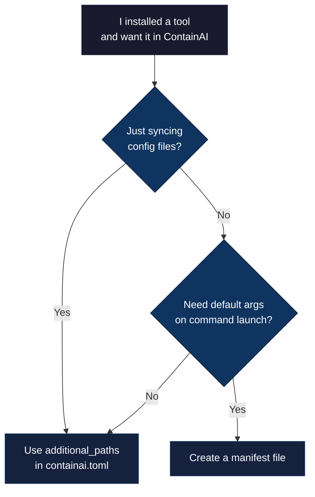

# Custom Tools Guide

This guide explains how to sync your own tools and configurations to ContainAI containers.

> **Contributor looking to add a built-in agent?** See [Adding Agents](adding-agents.md) for the contributor guide.

## Do I Need a Manifest?



**Use `additional_paths`** (simpler) when you:
- Just want to sync config files from host to container
- Don't need default args on command launch

**Create a manifest** when you:
- Want native command shims that prepend arguments (like `--auto` or `--yolo`)
- Need precise control over symlink creation and volume paths

## Option 1: Using additional_paths (Simple)

For simple config syncing, add paths to your `containai.toml`:

```toml
# ~/.config/containai/config.toml
# OR .containai/config.toml in your workspace

[import]
additional_paths = [
    "~/.mytool/config.json",
    "~/.mytool/settings/",
]
```

Then run:

```bash
cai import
cai  # Start container - configs are synced
```

**Rules:**
- Paths must start with `~/` or be absolute under `$HOME`
- Leading dots are stripped for volume paths (`~/.mytool/` becomes `/mnt/agent-data/mytool/`)
- Directories should end with `/`
- Files that don't exist are silently skipped

See [Configuration](configuration.md#import-section) for details.

## Option 2: Creating a User Manifest

For tools that need native command shims or precise symlink control, create a manifest file.

### Quick Start

```bash
# 1. Find where your tool stores config
ls -la ~/.mytool/

# 2. Create manifest directory
mkdir -p ~/.config/containai/manifests

# 3. Create manifest file
cat > ~/.config/containai/manifests/mytool.toml << 'EOF'
# =============================================================================
# MY TOOL
# Description of what this tool does
# =============================================================================

[agent]
name = "mytool"
binary = "mytool"
default_args = ["--headless", "--auto"]
aliases = []
optional = true

[[entries]]
source = ".mytool/config.json"
target = "mytool/config.json"
container_link = ".mytool/config.json"
flags = "fjo"
EOF

# 4. Import and restart container
cai import
cai --fresh  # Restart to load manifest
```

### Manifest Location

User manifests go in:
- **Host:** `~/.config/containai/manifests/*.toml`
- **Container:** `/mnt/agent-data/containai/manifests/*.toml` (synced by `cai import`)

### Manifest Format

```toml
# ~/.config/containai/manifests/mytool.toml

# Optional: [agent] section for native command shim defaults
[agent]
name = "mytool"                        # Function name in shell
binary = "mytool"                      # Actual binary name
default_args = ["--auto", "--quiet"]   # Arguments prepended to all invocations
aliases = ["mt"]                       # Additional command names to wrap
optional = true                        # Skip wrapper if binary not found

# Required: [[entries]] for config file syncing
[[entries]]
source = ".mytool/config.json"         # Path on host (relative to $HOME)
target = "mytool/config.json"          # Path in data volume
container_link = ".mytool/config.json" # Symlink in container home
flags = "fjo"                          # f=file, j=json-init, o=optional
```

### Field Reference

#### `[agent]` Section (Optional)

| Field | Type | Description |
|-------|------|-------------|
| `name` | string | Shell function name (e.g., `mytool`) |
| `binary` | string | Binary name in PATH (e.g., `mytool`) |
| `default_args` | array | Arguments prepended to all calls |
| `aliases` | array | Additional command names to wrap |
| `optional` | boolean | If true, skip wrapper if binary not installed |

**Note:** A native command shim is created when the `[agent]` section is present and `default_args` is non-empty.

#### `[[entries]]` Section

| Field | Type | Description |
|-------|------|-------------|
| `source` | string | Host path relative to `$HOME` |
| `target` | string | Volume path relative to `/mnt/agent-data` |
| `container_link` | string | Symlink path relative to container `~` |
| `flags` | string | Behavior flags (see below) |

### Flags Reference

| Flag | Meaning | When to Use |
|------|---------|-------------|
| `f` | File | Single config files |
| `d` | Directory | Config directories |
| `j` | JSON init | Create `{}` if file doesn't exist |
| `s` | Secret | API keys, OAuth tokens (600 permissions) |
| `o` | Optional | Skip if source doesn't exist on host |
| `R` | Remove first | Remove existing path before linking |

**Common combinations:**
- `fj` - JSON config file (creates `{}` if missing)
- `fjo` - Optional JSON config file
- `fs` - Secret file (credentials, API keys)
- `fso` - Optional secret file
- `dR` - Directory with pre-populated content
- `dRo` - Optional directory

## Common Scenarios

### Tool with Single Config File

```toml
# ~/.config/containai/manifests/mytool.toml

[[entries]]
source = ".mytool/config.json"
target = "mytool/config.json"
container_link = ".mytool/config.json"
flags = "fj"
```

### Tool with Config Directory

```toml
[[entries]]
source = ".mytool"
target = "mytool"
container_link = ".mytool"
flags = "d"
```

### Tool with Credentials

```toml
# Config file (no secret flag)
[[entries]]
source = ".mytool/settings.json"
target = "mytool/settings.json"
container_link = ".mytool/settings.json"
flags = "fj"

# Credentials file (secret flag for 600 permissions)
[[entries]]
source = ".mytool/credentials.json"
target = "mytool/credentials.json"
container_link = ".mytool/credentials.json"
flags = "fs"
```

### Tool with Autonomous Mode Flag

```toml
[agent]
name = "myagent"
binary = "myagent"
default_args = ["--auto-approve"]
optional = true

[[entries]]
source = ".myagent/config.toml"
target = "myagent/config.toml"
container_link = ".myagent/config.toml"
flags = "f"
```

This generates a native command shim so running `myagent` in the container automatically includes `--auto-approve`.

### Tool with Multiple Command Names

```toml
[agent]
name = "kimi"
binary = "kimi"
default_args = ["--auto"]
aliases = ["kimi-cli"]  # Also create a shim alias for kimi-cli
optional = true
```

## How It Works

1. **Import phase** (`cai import`):
   - User manifests from `~/.config/containai/manifests/` are synced to the data volume
   - Config files listed in `[[entries]]` are synced according to their flags

2. **Container startup** (`cai system init` via `containai-init.service`):
   - Reads user manifests from `/mnt/agent-data/containai/manifests/`
   - Creates symlinks for each `[[entries]]` with `container_link`

3. **Runtime**:
   - Symlinks connect container paths to volume paths

## Troubleshooting

### Symlink Not Created

**Symptoms:** `ls -la ~/.mytool` shows no symlink or wrong target

**Check:**
1. Verify manifest is synced: `ls /mnt/agent-data/containai/manifests/`
2. Check container logs: `journalctl -u containai-init`
3. Verify flags include `f` (file) or `d` (directory)
4. Ensure `container_link` is a relative path (no leading `/`)

### Config Not Persisting

**Symptoms:** Changes made in container are lost after restart

**Check:**
1. Verify symlink points to volume: `ls -la ~/.mytool/config.json`
2. Target should be under `/mnt/agent-data/`
3. Check `target` path in manifest matches expected volume location

### Invalid TOML Errors

**Symptoms:** Manifest is skipped with "Invalid TOML syntax" warning

**Check:**
1. Validate TOML syntax: arrays use `[]`, strings use `""`
2. Check for unquoted strings or missing brackets
3. Run `cat ~/.config/containai/manifests/mytool.toml` to inspect

## Security Constraints

User manifests have security restrictions:

- **target** paths must resolve under `/mnt/agent-data` (no `..` traversal)
- **container_link** must be relative (no leading `/`) and under `~`
- **binary** must exist in PATH for optional shim generation
- Invalid entries are logged and skipped (fail-safe)

These constraints prevent manifests from creating symlinks outside the data volume or home directory.

## See Also

- [Adding Agents](adding-agents.md) - Contributor guide for built-in agents
- [Configuration](configuration.md) - Full config reference including `additional_paths`
- [Sync Architecture](sync-architecture.md) - Technical details on sync system
