# ContainAI Build Architecture

This document provides a comprehensive reference for the ContainAI build system, including all scripts, artifacts, and their relationships. Use this as a guide when debugging builds, adding new artifacts, or understanding the release pipeline.

## Table of Contents

- [Overview](#overview)
- [Build Pipelines](#build-pipelines)
  - [Local Development Build](#local-development-build)
  - [CI Release Build](#ci-release-build)
    - [Docker BuildKit Layer Caching](#docker-buildkit-layer-caching)
- [Artifact Flow Diagrams](#artifact-flow-diagrams)
- [Script Reference](#script-reference)
- [Artifact Reference](#artifact-reference)
- [Environment Variables](#environment-variables)
- [Channel System](#channel-system)
- [Security Profile Generation](#security-profile-generation)
- [Verification and Attestation](#verification-and-attestation)

---

## Overview

ContainAI uses a **layered build system** with three main pipelines:

1. **Local Development** (`build-dev.sh` + `setup-local-dev.sh`) — Fast iteration cycle for contributors
2. **CI Image Build** (GitHub Actions) — Multi-arch image builds with attestation
3. **CI Release Packaging** (`build-payload.sh` + `package-artifacts.sh`) — Creates signed, verifiable release artifacts

All pipelines share common utilities and produce compatible artifacts.

### High-Level Architecture

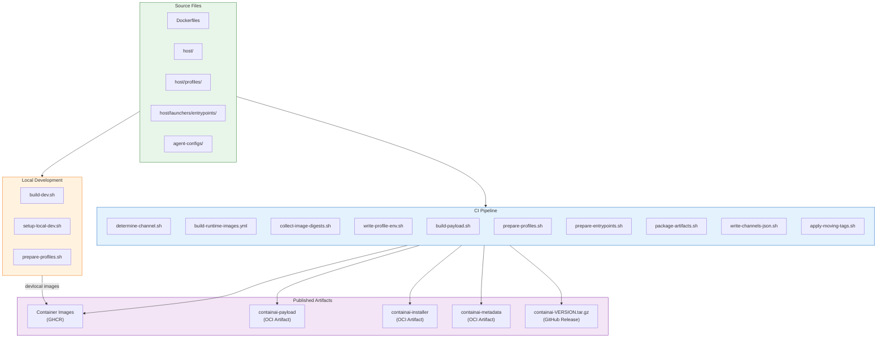

---

## Build Pipelines

### Local Development Build

The local development pipeline provides fast iteration for contributors without requiring CI infrastructure.

#### Pipeline Flow

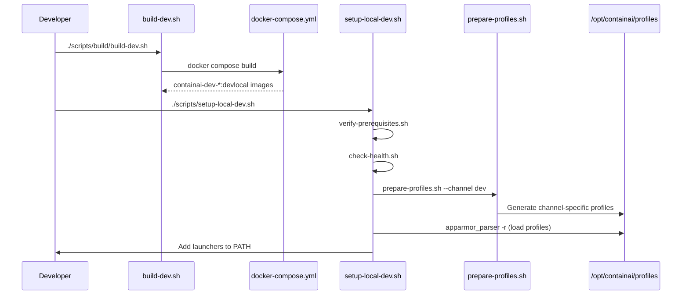

#### Commands

```bash
# Build all dev images
./scripts/build/build-dev.sh

# Build specific agents only
./scripts/build/build-dev.sh --agents copilot,codex

# Install launchers and security profiles
./scripts/setup-local-dev.sh

# Check security assets only (no install)
./scripts/setup-local-dev.sh --check-only
```

#### Artifacts Produced

| Artifact | Location | Description |
|----------|----------|-------------|
| `containai-dev-base:devlocal` | Docker daemon | Base image with runtimes |
| `containai-dev:devlocal` | Docker daemon | All-agents image |
| `containai-dev-copilot:devlocal` | Docker daemon | Copilot-specific image |
| `containai-dev-codex:devlocal` | Docker daemon | Codex-specific image |
| `containai-dev-claude:devlocal` | Docker daemon | Claude-specific image |
| `containai-dev-proxy:devlocal` | Docker daemon | Network proxy sidecar |
| Security profiles | `/opt/containai/profiles/` | Channel-specific AppArmor/seccomp |

---

### CI Release Build

The CI pipeline runs on GitHub Actions and produces signed, attested artifacts for distribution.

#### Complete Pipeline Flow

```mermaid
flowchart TB
    subgraph trigger["Trigger Events"]
        push["push to main"]
        schedule["schedule (nightly)"]
        dispatch["workflow_dispatch"]
        tag["tag v*"]
    end

    subgraph phase1["Phase 1: Context & Security"]
        determine["determine-channel.sh"]
        outputs1["channel, version,<br/>immutable_tag, moving_tags"]
        secretscan["scan-build-context<br/>(Trivy secret scan)"]
    end

    subgraph phase2["Phase 2: Build Images"]
        direction TB
        ghacache[("GHA Cache<br/>(BuildKit layers)")]
        buildbase_amd["build base (amd64)"]
        buildbase_arm["build base (arm64)"]
        assemblebase["assemble base manifest"]
        
        buildcontainai_amd["build containai (amd64)"]
        buildcontainai_arm["build containai (arm64)"]
        assemblecontainai["assemble containai manifest"]
        
        buildvariants["build variants<br/>(copilot, codex, claude,<br/>proxy, log-forwarder)"]
        assemblevariants["assemble variant manifests"]
        
        ghacache -.->|"cache-from"| buildbase_amd
        ghacache -.->|"cache-from"| buildbase_arm
        buildbase_amd -.->|"cache-to"| ghacache
        buildbase_arm -.->|"cache-to"| ghacache
    end

    subgraph phase3["Phase 3: Tag & Digest"]
        collectdigests["collect-image-digests.sh"]
        applytags["apply-moving-tags.sh"]
        finalize["finalize-tags job"]
    end

    subgraph phase4["Phase 4: Payload"]
        writeprofile["write-profile-env.sh"]
        profileenv["profile.env"]
        buildpayload["build-payload.sh"]
        prepentrypoints["prepare-entrypoints.sh"]
        prepprofiles["prepare-profiles.sh"]
        sbomgen["anchore/sbom-action"]
        attestsbom["attest-build-provenance"]
        packageartifacts["package-artifacts.sh"]
        templateinstallers["template_installers()"]
    end

    subgraph phase5["Phase 5: Publish"]
        pushpayload["oras push payload"]
        pushmeta["oras push metadata"]
        pushinstaller["oras push installer"]
        attestall["attest all artifacts"]
        cleanuppartial["cleanup-partial<br/>(on failure)"]
    end

    subgraph phase6["Phase 6: Cleanup"]
        cleanupgha["cleanup-gha-cache job<br/>(BuildKit layers)"]
        cleanupghcr["cleanup-ghcr job<br/>(Container versions)"]
        retention["Apply retention policies"]
    end

    trigger --> phase1
    determine --> secretscan
    phase1 --> phase2
    
    buildbase_amd --> assemblebase
    buildbase_arm --> assemblebase
    assemblebase --> buildcontainai_amd
    assemblebase --> buildcontainai_arm
    buildcontainai_amd --> assemblecontainai
    buildcontainai_arm --> assemblecontainai
    assemblecontainai --> buildvariants
    buildvariants --> assemblevariants
    
    phase2 --> phase3
    assemblevariants --> collectdigests
    collectdigests --> applytags
    applytags --> finalize
    
    phase3 --> phase4
    finalize --> writeprofile
    writeprofile --> profileenv
    profileenv --> buildpayload
    buildpayload --> prepentrypoints
    buildpayload --> prepprofiles
    prepprofiles --> sbomgen
    sbomgen --> attestsbom
    attestsbom --> packageartifacts
    packageartifacts --> templateinstallers
    
    phase4 --> phase5
    templateinstallers --> pushpayload
    pushpayload --> pushmeta
    pushmeta --> pushinstaller
    pushinstaller --> attestall
    
    phase5 --> phase6
    attestall --> cleanupgha
    cleanupgha --> cleanupghcr
    cleanupghcr --> retention

    style trigger fill:#ffecb3,stroke:#ff8f00
    style phase1 fill:#e8f5e9,stroke:#2e7d32
    style phase2 fill:#e3f2fd,stroke:#1565c0
    style phase3 fill:#fff3e0,stroke:#ef6c00
    style phase4 fill:#f3e5f5,stroke:#7b1fa2
    style phase5 fill:#e0f2f1,stroke:#00695c
    style phase6 fill:#fce4ec,stroke:#c2185b
```

#### Detailed Phase Descriptions

##### Phase 1: Determine Context & Security Scan

`scripts/ci/determine-channel.sh` examines the trigger event and outputs:

| Output | Description | Example Values |
|--------|-------------|----------------|
| `channel` | Release channel | `dev`, `nightly`, `prod` |
| `version` | Version string | `dev`, `nightly`, `v1.2.3` |
| `immutable_tag` | Commit-pinned tag | `sha-abc1234` |
| `moving_tags` | Mutable channel tags | `dev\nnightly` |
| `push` | Whether to push to registry | `true`, `false` |

**Security Scan:** Before any image builds begin, the `scan-build-context` job uses Trivy to scan all directories that get COPYed into images (`docker/`, `agent-configs/`, `host/`, `scripts/`) for accidentally committed secrets. The scan fails the pipeline if HIGH or CRITICAL severity secrets are detected.

##### Phase 2: Build Images

Images are built per-architecture, then assembled into multi-arch manifests. Each build uses **GitHub Actions cache** (`type=gha`) to store and reuse Docker BuildKit layers—see [Docker BuildKit Layer Caching](#docker-buildkit-layer-caching) for details.

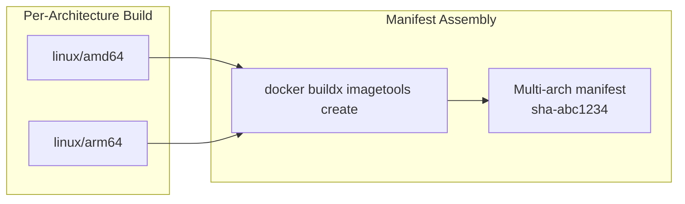

**Build Order:**
1. `containai-base` (both archs, parallel)
2. Assemble base manifest
3. `containai` (both archs, parallel, depends on base)
4. Assemble containai manifest
5. Variants (all agents + proxy + log-forwarder, parallel)
6. Assemble variant manifests

##### Docker BuildKit Layer Caching

The CI pipeline uses **GitHub Actions cache** (`type=gha`) to store Docker BuildKit layer data between workflow runs. This dramatically reduces build times by reusing unchanged image layers instead of rebuilding them from scratch.

###### How the Cache Works

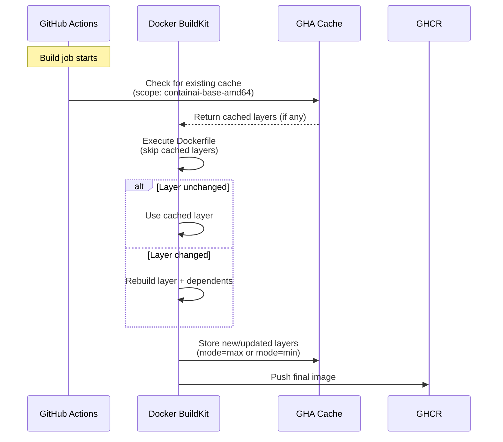

###### Cache Architecture

The pipeline maintains **14 separate cache scopes** (7 images × 2 architectures):

| Image | amd64 Scope | arm64 Scope | Mode |
|-------|-------------|-------------|------|
| `containai-base` | `containai-base-amd64` | `containai-base-arm64` | `max` |
| `containai` | `containai-amd64` | `containai-arm64` | `max` |
| `containai-copilot` | `containai-copilot-amd64` | `containai-copilot-arm64` | `min` |
| `containai-codex` | `containai-codex-amd64` | `containai-codex-arm64` | `min` |
| `containai-claude` | `containai-claude-amd64` | `containai-claude-arm64` | `min` |
| `containai-proxy` | `containai-proxy-amd64` | `containai-proxy-arm64` | `min` |
| `containai-log-forwarder` | `containai-log-forwarder-amd64` | `containai-log-forwarder-arm64` | `min` |

###### Cache Modes Explained

- **`mode=max`**: Stores all intermediate layers from every build stage. Use this for images that serve as build bases (like `containai-base`) where intermediate layers are frequently reused.

- **`mode=min`**: Stores only the layers of the final image. Use this for variant images that derive from base images—their intermediate layers are already cached in the base image's scope.

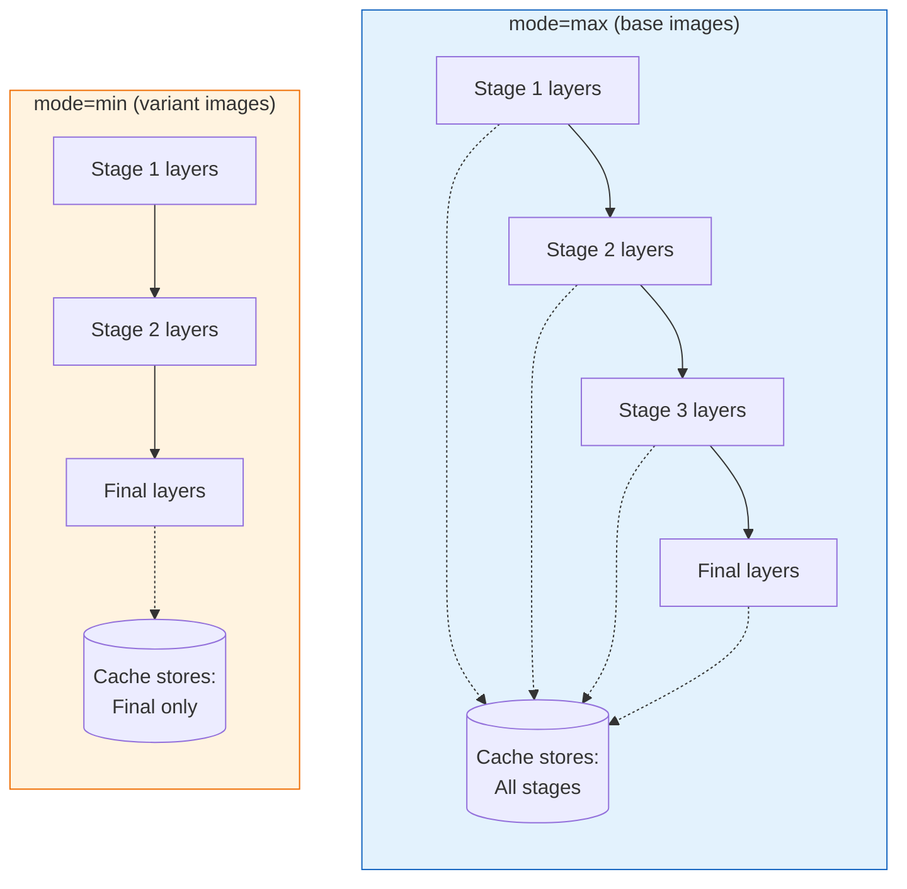

###### Cache Cleanup Job

GitHub Actions has a **10 GB cache limit** per repository. Without cleanup, the 14 cache scopes would quickly exhaust this limit. The `cleanup-gha-cache` job runs after every successful build:

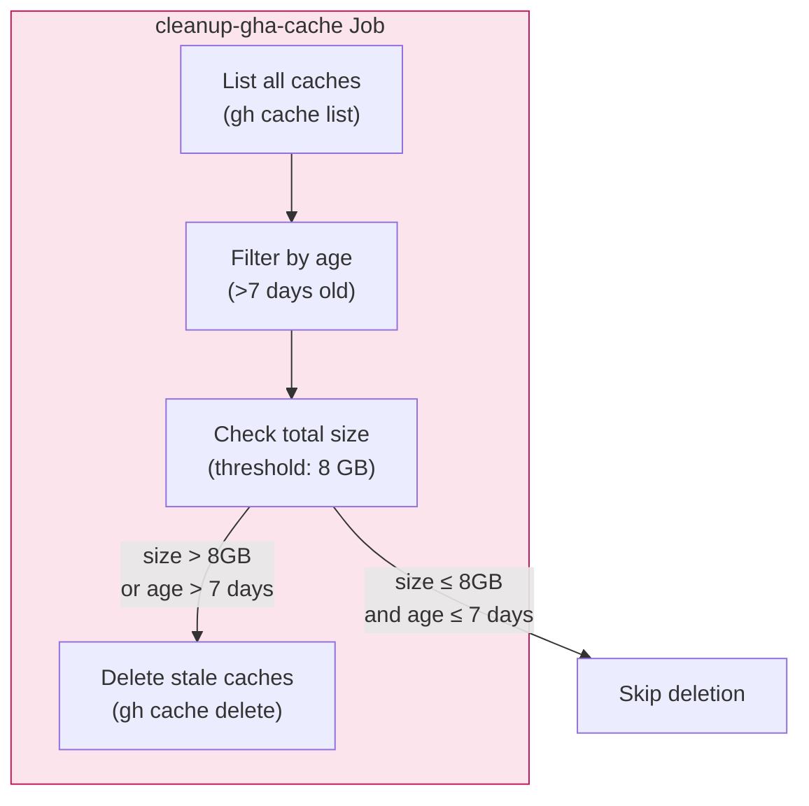

**Cleanup Thresholds:**
- **Age**: Caches older than 7 days are deleted (configurable via `MAX_AGE_DAYS`)
- **Size**: Cleanup is aggressive when total cache exceeds 8 GB (configurable via `SIZE_THRESHOLD_GB`)

The cleanup script lives at `scripts/ci/cleanup-gha-cache.sh` and uses the GitHub CLI to enumerate and delete caches.

###### Cache in Build Flow

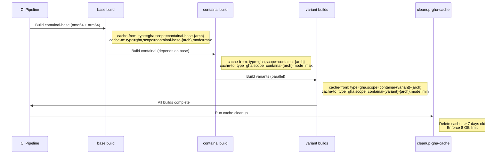

##### Phase 3: Tag & Digest Collection

After all images are built, digests are collected and moving tags applied:

```bash
# Collect digests from all manifest-digest-* artifacts
scripts/ci/collect-image-digests.sh \
    --images "containai:sha-abc,containai-copilot:sha-abc,..." \
    --repo-prefix "ghcr.io/owner" \
    --out digests.json

# Apply channel tags to all images
scripts/ci/apply-moving-tags.sh \
    --digests digests.json \
    --immutable-tag "sha-abc1234" \
    --moving-tags "dev"
```

##### Phase 4: Payload Generation

The payload is the redistributable installation bundle:

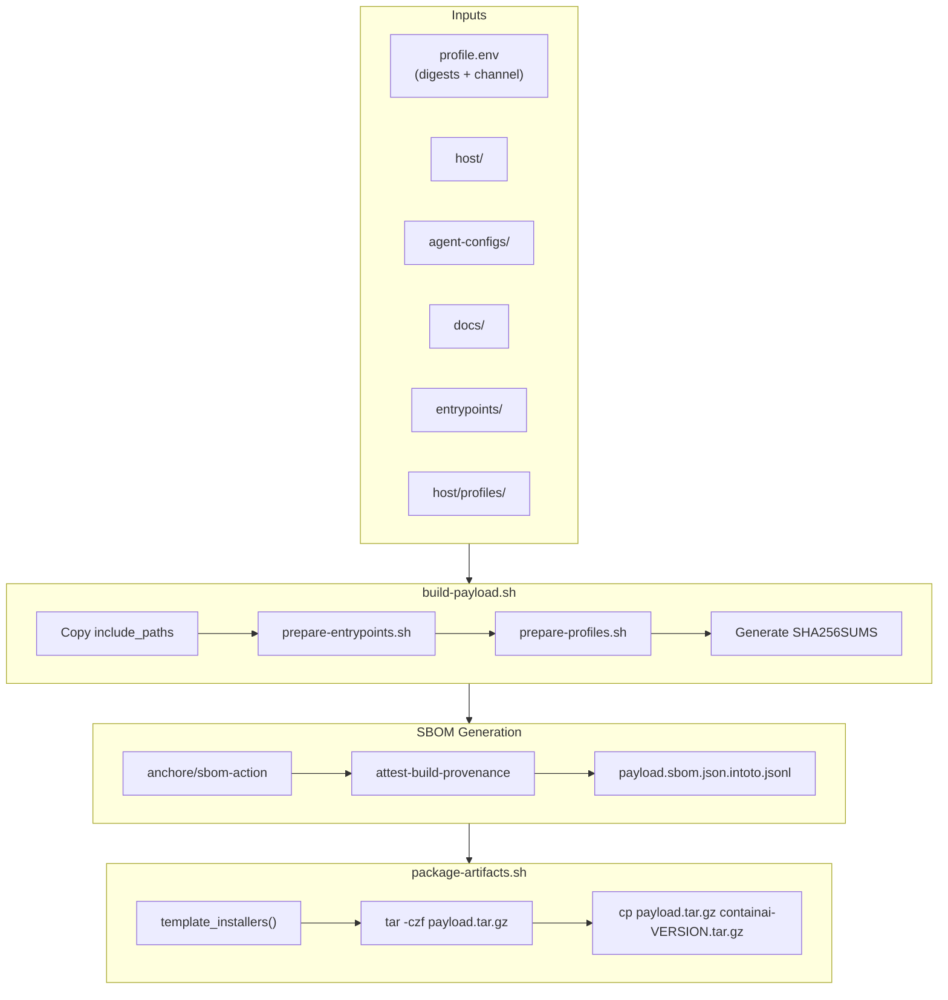

##### Phase 5: Publish Artifacts

All artifacts are pushed to GHCR as OCI artifacts:

| Artifact | Registry Path | Media Type |
|----------|---------------|------------|
| Payload | `containai-payload:VERSION` | `application/vnd.containai.payload.v1` |
| Installer | `containai-installer:VERSION` | `application/vnd.containai.installer.v1` |
| Metadata | `containai-metadata:CHANNEL` | `application/vnd.containai.metadata.v1+json` |

**Partial Publish Cleanup:** If any of the publish jobs (`publish-payload`, `publish-metadata`, `publish-installer`) fail, the `cleanup-partial` job runs to delete any partially published artifacts. This prevents incomplete releases from appearing in the registry.

##### Phase 6: Cleanup

The cleanup phase manages two distinct resource pools:

**1. GitHub Actions Cache (BuildKit layers)**

See [Docker BuildKit Layer Caching](#docker-buildkit-layer-caching) for details. The `cleanup-gha-cache` job:
- Deletes cache entries older than 7 days
- Enforces an 8 GB size threshold (GitHub limit is 10 GB)
- Runs after every successful build

**2. Container Registry Versions (GHCR)**

The `cleanup-ghcr` job applies retention rules to container image versions:
- Keep anything updated within 180 days
- Keep prod-tagged versions indefinitely (or latest prod if older)
- Keep newest N non-prod versions per image (varies by image type)
- Verify all packages are public (visibility inherits from repository)

---

## Artifact Flow Diagrams

### Payload Artifact Contents

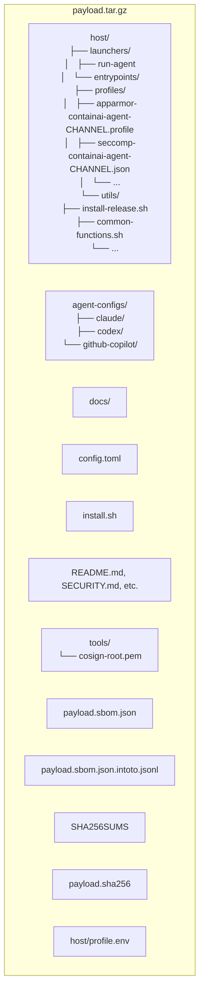

### Image Dependency Graph

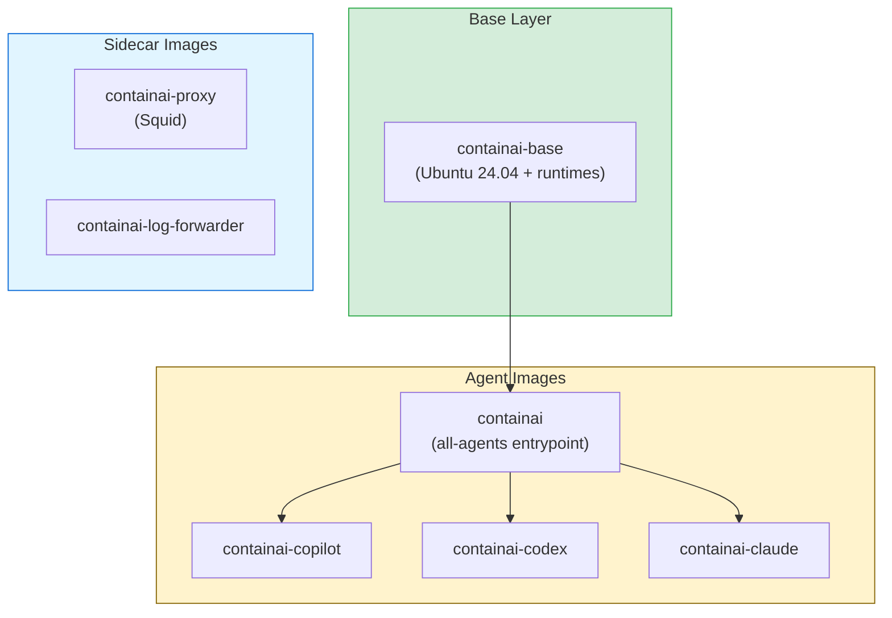

---

## Script Reference

### Build Scripts

| Script | Purpose | Inputs | Outputs |
|--------|---------|--------|---------|
| `scripts/build/compile-binaries.sh` | Compile Rust and .NET native binaries | `ARCH` (amd64/arm64), `OUT_DIR` | Native executables and shared libraries |
| `scripts/build/build-dev.sh` | Build local dev images | `--agents LIST` | Docker images tagged `:devlocal` |
| `scripts/setup-local-dev.sh` | Install launchers + profiles | `--check-only` | Profiles in `/opt/containai/profiles/`, PATH updated |

### Release Scripts

| Script | Purpose | Inputs | Outputs |
|--------|---------|--------|---------|
| `scripts/release/build-payload.sh` | Assemble payload directory | `--version`, `--out`, `--profile-env` | `<out>/<version>/payload/` |
| `scripts/release/package-artifacts.sh` | Package payload into tarballs | `--version`, `--payload-dir`, `--profile-env` | `payload.tar.gz`, `containai-VERSION.tar.gz` |
| `scripts/release/package.sh` | Orchestrate build + package | `--version`, `--out` | Runs both scripts above |
| `scripts/release/write-profile-env.sh` | Generate profile.env with digests | `--prefix`, `--tag`, `--owner`, `--out` | `profile.env` |

### CI Scripts

| Script | Purpose | Inputs | Outputs |
|--------|---------|--------|---------|
| `scripts/ci/determine-channel.sh` | Determine release channel | `--event-name`, `--ref-name` | GITHUB_OUTPUT vars |
| `scripts/ci/collect-image-digests.sh` | Collect image digests | `--images`, `--repo-prefix`, `--out` | JSON array of digests |
| `scripts/ci/apply-moving-tags.sh` | Apply channel tags to images | `--digests`, `--immutable-tag`, `--moving-tags` | Registry tags updated |
| `scripts/ci/write-channels-json.sh` | Generate channel metadata | Many options | `channels.json` |
| `scripts/ci/verify-packages-exist.sh` | Verify packages exist before cleanup | `OWNER`, `IMAGES` | Exit 0 or error |
| `scripts/ci/cleanup-ghcr-versions.sh` | Clean old container versions | `OWNER`, env vars | Versions deleted |
| `scripts/ci/cleanup-gha-cache.sh` | Clean stale GitHub Actions caches | `MAX_AGE_DAYS`, `SIZE_THRESHOLD_GB` | Caches deleted |

### Utility Scripts

| Script | Purpose | Inputs | Outputs |
|--------|---------|--------|---------|
| `host/utils/prepare-profiles.sh` | Generate channel-specific profiles | `--channel`, `--source`, `--dest` | `*-CHANNEL.profile` files |
| `host/utils/prepare-entrypoints.sh` | Generate channel-specific launchers | `--channel`, `--source`, `--dest` | Renamed launcher scripts |
| `host/utils/security-enforce.sh` | Load security profiles | Sourced by other scripts | AppArmor/seccomp loaded |

---

## Artifact Reference

### Registry Artifacts

| Artifact | Path | Contents | Attestation |
|----------|------|----------|-------------|
| Base Image | `ghcr.io/OWNER/containai-base:TAG` | Ubuntu + runtimes | Build provenance |
| All-Agents Image | `ghcr.io/OWNER/containai:TAG` | Entrypoints + configs | Build provenance |
| Agent Variants | `ghcr.io/OWNER/containai-{agent}:TAG` | Agent-specific wrapper | Build provenance |
| Proxy | `ghcr.io/OWNER/containai-proxy:TAG` | Squid proxy | Build provenance |
| Log Forwarder | `ghcr.io/OWNER/containai-log-forwarder:TAG` | Log sidecar | Build provenance |
| Payload | `ghcr.io/OWNER/containai-payload:TAG` | Install bundle | DSSE + SBOM |
| Installer | `ghcr.io/OWNER/containai-installer:TAG` | `install.sh` | DSSE |
| Metadata | `ghcr.io/OWNER/containai-metadata:CHANNEL` | `channels.json` | None |

### File Artifacts

| Artifact | Location | Created By | Consumed By |
|----------|----------|------------|-------------|
| `profile.env` | `artifacts/publish/` | `write-profile-env.sh` | `build-payload.sh`, `package-artifacts.sh` |
| `payload/` | `artifacts/publish/<version>/` | `build-payload.sh` | `package-artifacts.sh`, SBOM action |
| `SHA256SUMS` | Inside payload | `build-payload.sh` | `install-release.sh` (verification) |
| `payload.sha256` | Inside payload | `build-payload.sh` | `install-release.sh` (verification) |
| `payload.sbom.json` | Inside payload | `anchore/sbom-action` | Attestation, audit |
| `*.intoto.jsonl` | Inside payload | `attest-build-provenance` | Sigstore verification |
| `payload.tar.gz` | `artifacts/publish/<version>/` | `package-artifacts.sh` | ORAS push |
| `containai-VERSION.tar.gz` | `artifacts/publish/<version>/` | `package-artifacts.sh` | GitHub Release asset |
| `containai-profiles-CHANNEL.sha256` | `/opt/containai/profiles/` | `prepare-profiles.sh` | `setup-local-dev.sh` (change detection) |

### Native Binary Artifacts

The following platform-specific binaries are compiled from source during CI and embedded in the base image:

| Binary | Source | Target | Purpose |
|--------|--------|--------|---------|
| `agentcli-exec` | `src/agent-task-runner` (Rust) | `linux-{arch}-gnu` | Setuid helper that switches to `agentcli` user and installs seccomp filter |
| `agent-task-runnerd` | `src/agent-task-runner` (Rust) | `linux-{arch}-gnu` | Daemon that receives seccomp notifications and manages sandbox execution |
| `agent-task-sandbox` | `src/agent-task-runner` (Rust) | `linux-{arch}-gnu` | Sandbox runner that executes commands in isolated namespace |
| `libaudit_shim.so` | `src/audit-shim` (Rust cdylib) | `linux-{arch}-gnu` | LD_PRELOAD library that intercepts syscalls for audit logging |
| `containai-log-collector` | `src/ContainAI.LogCollector` (.NET AOT) | `linux-x64`, `linux-arm64` | Receives audit events over Unix socket and writes structured logs |

**Note:** All binaries target glibc (`linux-gnu`) since production containers run Ubuntu 24.04.

**Cross-compilation:** The `compile-binaries.sh` script supports cross-architecture compilation using clang/lld. Requirements for cross-compiling from x64 to ARM64:
- `clang`, `lld`, `llvm-objcopy` (LLVM toolchain)
- `gcc-aarch64-linux-gnu` (cross-compiler for Rust)
- `zlib1g-dev:arm64` (ARM64 zlib libraries)

CI builds use native runners (`ubuntu-24.04-arm` for ARM64) for maximum reliability.

---

## Environment Variables

### Build Configuration

| Variable | Default | Description |
|----------|---------|-------------|
| `REGISTRY` | `ghcr.io/novotnyllc` | Container registry prefix |
| `IMAGE_PREFIX` | `containai-dev` | Image name prefix |
| `IMAGE_TAG` | `devlocal` | Default tag for local builds |
| `COMPOSE_FILE` | `docker-compose.yml` | Compose file path |

### Profile Configuration

| Variable | Default | Description |
|----------|---------|-------------|
| `CONTAINAI_LAUNCHER_CHANNEL` | `dev` | Channel for profile names (dev/nightly/prod) |

**Note:** The system profiles directory (`/opt/containai/profiles`) is hardcoded and not configurable for security reasons.

### Installer Configuration

| Variable | Default | Description |
|----------|---------|-------------|
| `CONTAINAI_CHANNEL` | `prod` | Install channel |
| `CONTAINAI_VERSION` | (from metadata) | Specific version to install |
| `CONTAINAI_INSTALL_ROOT` | `/opt/containai` | Installation directory |
| `CONTAINAI_REPO` | `ContainAI/ContainAI` | Source repository |
| `CONTAINAI_REGISTRY` | `ghcr.io` | Registry host |

---

## Channel System

ContainAI uses a **channel system** to manage release stability:

| Channel | Trigger | Image Tag | Stability | Use Case |
|---------|---------|-----------|-----------|----------|
| `dev` | Push to main | `dev`, `sha-*` | Unstable | Development testing |
| `nightly` | Schedule (0600 UTC) | `nightly`, `sha-*` | Semi-stable | Integration testing |
| `prod` | Tag `v*` | `prod`, `v*`, `sha-*` | Stable | Production use |

### Channel Detection Logic

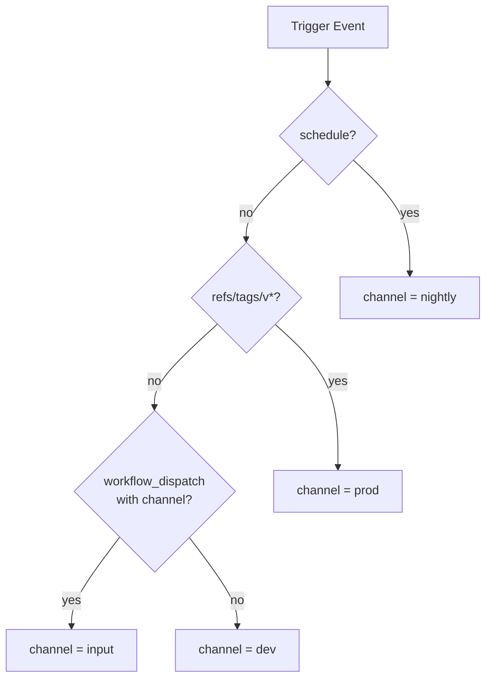

### Channel-Specific Artifacts

Channels affect artifact naming:

| Artifact Type | Dev | Nightly | Prod |
|---------------|-----|---------|------|
| AppArmor profile name | `containai-agent-dev` | `containai-agent-nightly` | `containai-agent-prod` |
| Profile filename | `apparmor-containai-agent-dev.profile` | `apparmor-containai-agent-nightly.profile` | `apparmor-containai-agent-prod.profile` |
| Launcher name | `run-copilot-dev` | `run-copilot-nightly` | `run-copilot` |
| Metadata tag | `containai-metadata:dev` | `containai-metadata:nightly` | `containai-metadata:prod` |

---

## Security Profile Generation

Security profiles (AppArmor and seccomp) are generated at **build time** to ensure SHA256 validation covers the exact content that gets loaded.

### Profile Generation Flow

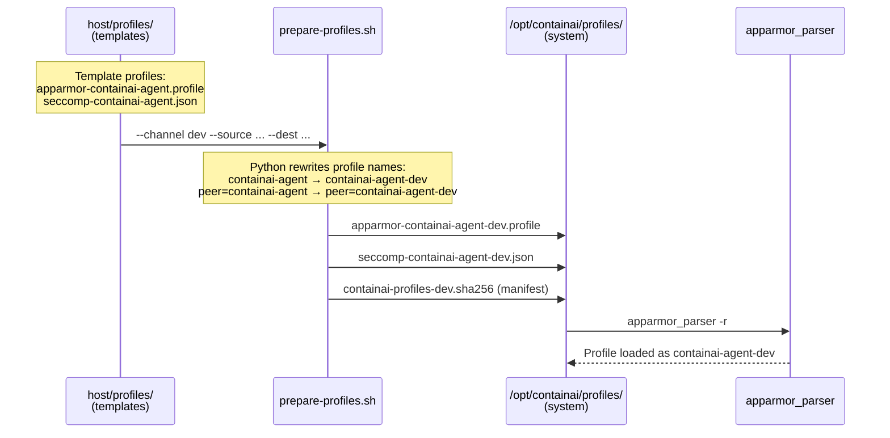

### Profile Transformation Example

**Template** (`host/profiles/apparmor-containai-agent.profile`):
```
profile containai-agent flags=(attach_disconnected,mediate_deleted) {
  ...
  signal peer=containai-agent,
  ...
}
```

**Generated** (`/opt/containai/profiles/apparmor-containai-agent-dev.profile`):
```
profile containai-agent-dev flags=(attach_disconnected,mediate_deleted) {
  ...
  signal peer=containai-agent-dev,
  ...
}
```

### Why Build-Time Generation?

1. **SHA256 Validation**: Generated profiles are included in `SHA256SUMS` and signed SBOM
2. **Tamper Resistance**: No runtime modification means verified content = loaded content
3. **Dev/CI Parity**: Same `prepare-profiles.sh` script runs in both environments
4. **Channel Isolation**: Different channels can run simultaneously without profile conflicts

---

## Verification and Attestation

### Attestation Chain

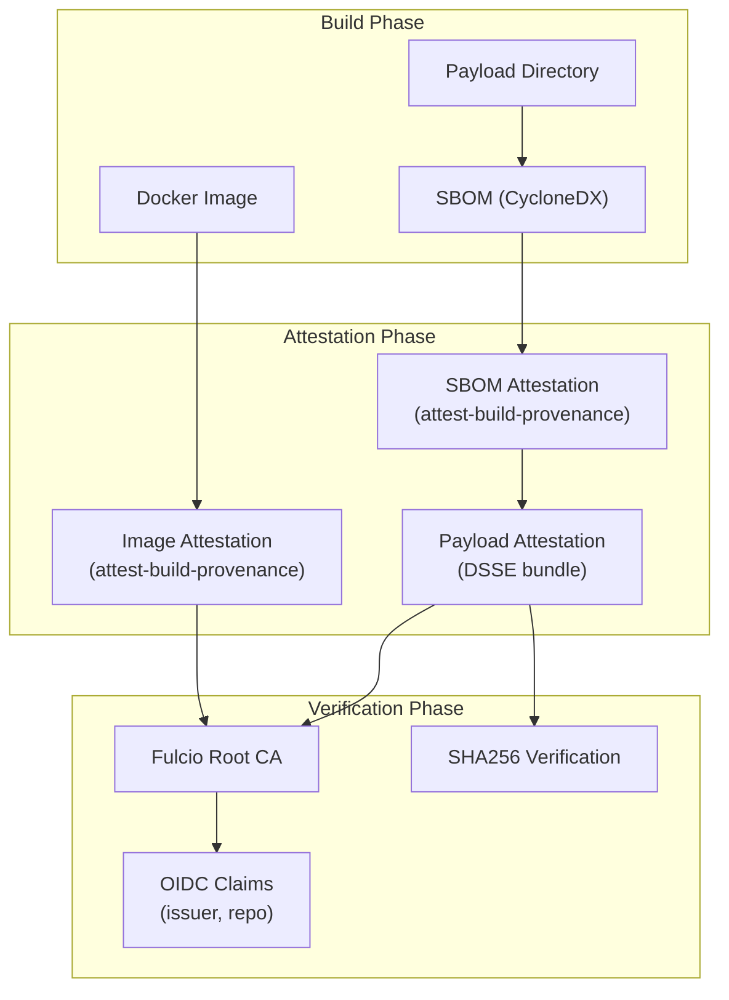

### Installer Verification Steps

The `install.sh` installer performs these verification steps:

1. **Self-Verification**: Installer verifies its own SHA256 hash
2. **Manifest Fetch**: Retrieve OCI manifest from registry
3. **Attestation Fetch**: Retrieve DSSE attestation bundle
4. **DSSE Verification**:
   - Verify signature against Fulcio root CA
   - Verify OIDC issuer is GitHub Actions
   - Verify repository matches expected source
   - Verify subject digest matches manifest
5. **Payload Verification**: Verify blob digest matches manifest entry
6. **Internal Verification**: After extraction, `install-release.sh` verifies `SHA256SUMS`

### Trust Anchors

| Anchor | Purpose | Location |
|--------|---------|----------|
| Fulcio Root CA | Sigstore certificate verification | Embedded in `install.sh` |
| `cosign-root.pem` | Repository-specific trust root | `tools/cosign-root.pem` in payload |
| `SHA256SUMS` | File integrity | Root of payload |
| `payload.sha256` | Overall payload hash | Root of payload |

---

## Troubleshooting

### Common Issues

#### Profile Generation Fails

```bash
# Check source profiles exist
ls -la host/profiles/apparmor-*.profile

# Run profile generation manually
./host/utils/prepare-profiles.sh \
    --channel dev \
    --source host/profiles \
    --dest /tmp/test-profiles \
    --manifest /tmp/test-profiles/manifest.sha256
```

#### SHA256 Mismatch

```bash
# Verify payload checksums
cd artifacts/publish/<version>/payload
sha256sum -c SHA256SUMS

# Check specific file
sha256sum host/utils/install-release.sh
```

#### Missing Digests in profile.env

```bash
# Check profile.env contents
cat artifacts/publish/profile.env

# Required variables:
# PROFILE, IMAGE_DIGEST, IMAGE_DIGEST_COPILOT, IMAGE_DIGEST_CODEX,
# IMAGE_DIGEST_CLAUDE, IMAGE_DIGEST_PROXY, IMAGE_DIGEST_LOG_FORWARDER
```

#### Attestation Verification Fails

```bash
# Check attestation bundle structure
jq . payload.sbom.json.intoto.jsonl

# Verify OIDC claims in certificate
openssl x509 -in cert.pem -text -noout | grep -A1 "1.3.6.1.4.1.57264"
```

---

## See Also

- [build.md](build.md) — Container image contents and modification
- [ghcr-publishing.md](ghcr-publishing.md) — GitHub repository setup and operations
- [contributing.md](contributing.md) — Development workflow and testing
- [../security/architecture.md](../security/architecture.md) — Security model
