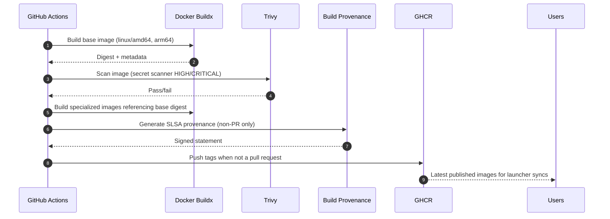
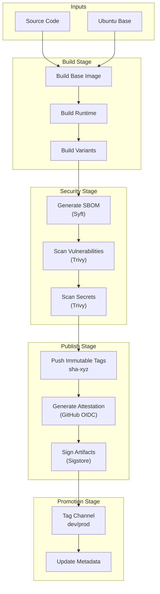
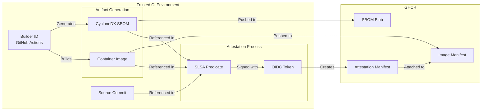
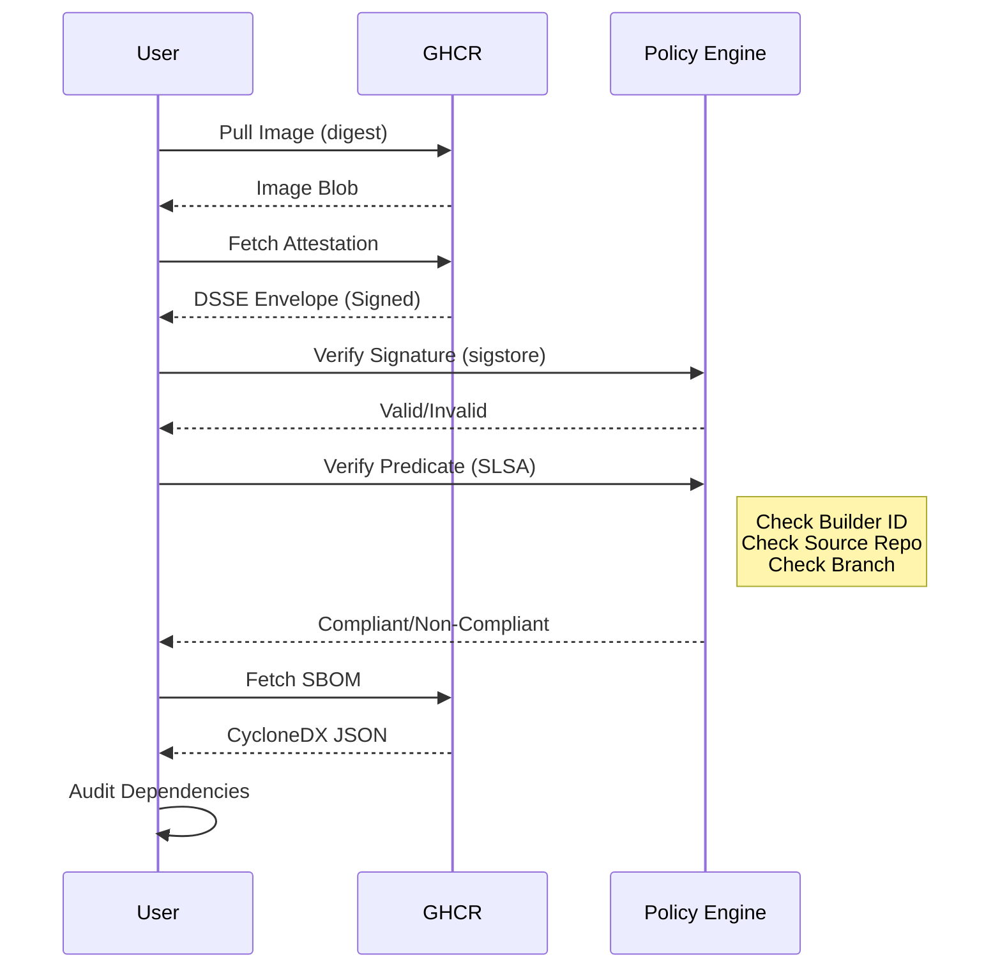

# GHCR Publishing, Metadata, and Retention Runbook

This runbook details the CI/CD pipeline that builds, secures, and publishes the ContainAI artifacts. It covers the build graph, security gates, and artifact lifecycle management.

## Audience & Scope

- **DevOps Engineers**: Focus on the [CI/CD Pipeline](#cicd-pipeline-devops-view) for caching, tagging, and promotion strategies.
- **Security Auditors**: Focus on the [Supply Chain Security](#supply-chain-security-auditor-view) section for SBOMs, attestation, and provenance.
- **Developers/Consumers**: Focus on the [Verification Flow](#verification-flow-consumer-view) to validate artifact integrity.

## CI Build & Security Gates



**Highlights**
- Pull requests still build and scan images but skip pushes/attestations.
- Build matrices ensure the Squid proxy and each agent image share the same vetted base digest.
- The `scripts/build` helpers mirror this workflow locally so developers can test the same steps before opening a PR.

## GitHub Repository Setup

To enable this pipeline, the following configuration is required on the GitHub repository.

### 1. Actions Permissions
The workflow requires specific permissions to publish packages and generate attestations. These are defined in the workflow file but require the repository to allow **GitHub Actions to create and approve pull requests** (if applicable) and **Read and write permissions** for the `GITHUB_TOKEN`.

**Settings > Actions > General > Workflow permissions:**
- Select **Read and write permissions**.
- Check **Allow GitHub Actions to create and approve pull requests**.

### 2. Package Settings (GHCR)
The pipeline automatically attempts to set package visibility to **Public**. However, for the first run or if permissions are restricted:
1. Go to the user/org profile page.
2. Click **Packages**.
3. For each package (`containai`, `containai-base`, etc.):
   - Click **Package Settings**.
   - Scroll to **Danger Zone**.
   - Click **Change visibility** -> **Public**.

### 3. Secrets
The pipeline relies almost exclusively on the automatic `GITHUB_TOKEN`. No long-lived secrets are required for standard operations.

| Secret | Source | Purpose |
|--------|--------|---------|
| `GITHUB_TOKEN` | Automatic | Authenticating with GHCR, pushing images, managing package versions, and setting visibility. |
| `id-token` | Automatic | OIDC token generation for SLSA provenance and Sigstore signing. |

### 4. OIDC Trust
The `id-token: write` permission is mandatory in the workflow YAML to enable OIDC. This allows the workflow to request a short-lived token from GitHub's OIDC provider, which is then used to sign the artifacts without managing private keys.

## CI/CD Pipeline (DevOps View)

The build process is a directed acyclic graph (DAG) optimized for caching and security. It ensures that all variants share the exact same base layer and that no artifacts are published until all tests pass.



## Supply Chain Security (Auditor View)

We employ a "secure by default" approach, ensuring every artifact is traceable to its source.



### Key Security Controls
1.  **Immutable Tags**: We never overwrite tags during the build phase. We push unique `sha-<commit>` tags first. Only after all checks pass do we apply mutable tags like `dev`.
2.  **SLSA Provenance**: Every image and artifact is signed using GitHub's OIDC identity, linking the artifact back to the specific workflow run and commit.
3.  **Secret Scanning**: Trivy runs against the *built image* before it is promoted. If a secret is found, the pipeline fails, and the `dev` tag is never updated.

## Verification Flow (Consumer View)

Consumers can verify the integrity and provenance of the artifacts before use.



## Artifact Reference

### Container Images
- `ghcr.io/<owner>/containai-base`
- `ghcr.io/<owner>/containai` (The core runtime)
- `ghcr.io/<owner>/containai-copilot`
- `ghcr.io/<owner>/containai-codex`
- `ghcr.io/<owner>/containai-claude`
- `ghcr.io/<owner>/containai-proxy`

### OCI Artifacts
- **Payload**: `ghcr.io/<owner>/containai-payload`
    - Contains the installer scripts and host tools.
    - Artifact Type: `application/vnd.containai.payload.v1`
    - Layer Type: `application/vnd.containai.payload.layer.v1+gzip`
- **Installer**: `ghcr.io/<owner>/containai-installer`
    - Contains the standalone installer script.
    - Artifact Type: `application/vnd.containai.installer.v1`
    - Layer Type: `application/vnd.containai.installer.v1+sh`
- **Metadata**: `ghcr.io/<owner>/containai-metadata`
    - Contains the JSON mapping of channels to versions.
    - Artifact Type: `application/vnd.containai.metadata.v1+json`
    - Layer Type: `application/json`

## Operations & Recovery

### Manual Release
To manually promote a specific commit to `prod`:
1. Go to the "Build Runtime Images" workflow in GitHub Actions.
2. Click "Run workflow".
3. Select the branch/tag.
4. Set `channel` to `prod`.
5. Set `version` to `v1.2.3` (optional, for semantic tagging).

### Retention Policy
We use `actions/delete-package-versions` to keep the registry clean:
- **Dev/Nightly**: Last 10-15 versions kept.
- **Prod**: Longer retention (configurable).
- **Untagged**: Aggressively pruned (failed builds).

### Emergency Rollback
Since `prod` is just a moving tag:
1. Identify the previous working digest.
2. Use `crane` or `docker buildx imagetools` to re-tag that digest as `prod`.
   ```bash
   docker buildx imagetools create \
     ghcr.io/owner/containai:old-digest \
     --tag ghcr.io/owner/containai:prod
   ```
   *(Repeat for all variants)*
