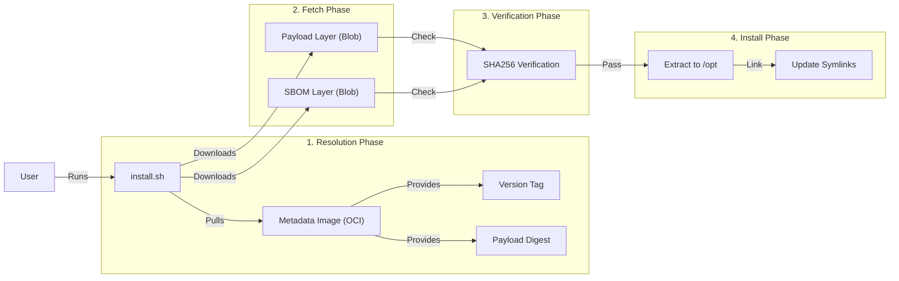
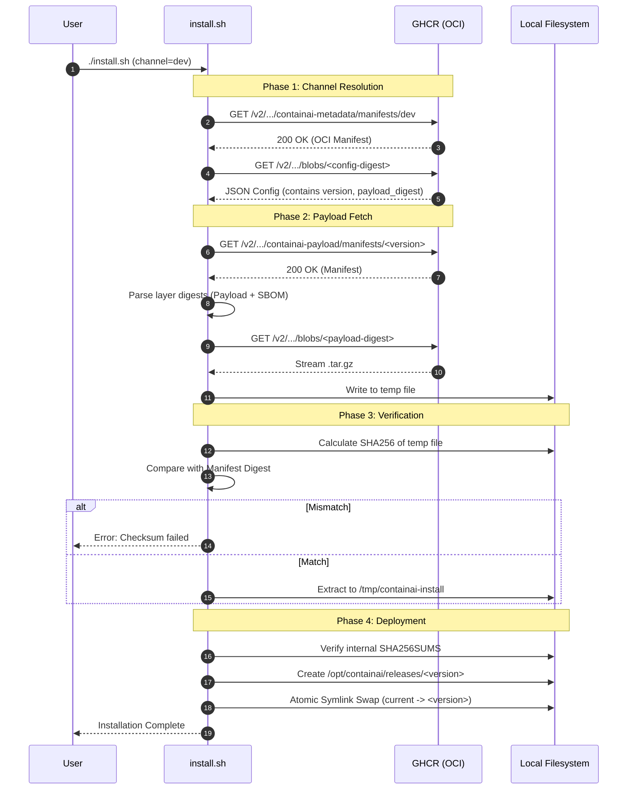

# Installer End-to-End Flow

This document details the bootstrap installation process, focusing on channel resolution, artifact verification, and the security model.

## Audience & Scope

- **Developers**: Understand how to test the installer locally and verify payload integrity.
- **DevOps**: Learn how channels map to releases and how the blue/green deployment works.
- **Security**: Review the trust root, cryptographic verification steps, and SBOM handling.

## Architecture Overview

The installer operates as a stateless bootstrapper that resolves a "Channel" (e.g., `dev`, `prod`) to a specific immutable "Payload Digest". It then fetches that payload from GHCR without requiring authentication.

### Transport Delivery

- **Prod/Tagged**: Publish `containai-<tag>.tar.gz` as a GitHub Release asset with a DSSE attestation. Installer verifies transport and SBOM attestations; failures are fatal.
- **Nightly/Dev**: Push payload tar to OCI and generate cosign bundles for transport + SBOM stored as CI artifacts. Installer detects channel from the bundled `profile.env` (sourced from `artifacts/publish/profile.env`) and accepts missing attestations only for `channel=dev`; all other channels enforce strict verification.

The installer extracts the contents, verifies `SHA256SUMS` across the extracted files, and uses `tools/cosign-root.pem` to validate attestations.



## Installation Sequence

The following sequence diagram illustrates the exact interactions between the user, the installer script, the OCI registry (GHCR), and the local filesystem.



## Detailed Components

### 1. Channel Resolution
- **Source**: `ghcr.io/<owner>/containai-metadata:<channel>`
- **Mechanism**: The installer pulls a specialized OCI image that contains no filesystem layers, only a JSON config blob.
- **Data**:
    - `channel`: The requested channel name.
    - `version`: The resolved semantic version (e.g., `v1.2.3`).
    - `payload_digest`: The immutable SHA256 digest of the payload artifact.
- **Fallback**: If metadata fetch fails, the installer attempts to use the channel name as a tag directly.

### 2. Payload Artifact
- **Reference**: `ghcr.io/<owner>/containai-payload@sha256:<digest>`
- **Structure**:
    - Layer 1: `application/vnd.containai.payload.layer.v1+gzip` (The actual code).
    - Layer 2: `application/vnd.cyclonedx+json` (The SBOM).
- **Contents**:
    - `host/`: Launcher scripts and utilities.
    - `agent-configs/`: AI agent configuration files.
    - `config.toml`: Default configuration.
    - `SHA256SUMS`: Internal integrity manifest.

### 3. Verification Model
- **Trust Root**: The OCI Manifest from GHCR (served over HTTPS).
- **Chain of Trust**:
    1. HTTPS verifies the connection to GHCR.
    2. The Manifest contains the SHA256 digests of the layers.
    3. The Installer calculates the SHA256 of the downloaded blobs.
    4. If `Calculated Hash == Manifest Hash`, the download is verified.
- **Internal Integrity**: After extraction, `install-release.sh` verifies `SHA256SUMS` against the extracted files to ensure no corruption occurred during decompression.

## DevOps & Rollback

### Directory Structure
The installer uses a blue/green-style directory structure to allow instant rollbacks.

```text
/opt/containai/
├── releases/
│   ├── v1.0.0/
│   ├── v1.1.0/
│   └── v1.2.0/  <-- Extracted payload
├── current -> releases/v1.2.0
└── previous -> releases/v1.1.0
```

### Rollback Procedure
To roll back to the previous version, simply update the symlink:

```bash
sudo ln -sfn /opt/containai/releases/v1.1.0 /opt/containai/current
```

## Developer Workflow

To test the installer with a local build:

1. **Build the payload**:
   ```bash
   ./scripts/release/package.sh --version dev --out artifacts/publish
   ```
2. **Run the installer in local mode**:
   ```bash
   ./install.sh --local-payload ./artifacts/publish/dev-<gitsha>/containai-dev-<gitsha>.tar.gz
   ```
   The tarball path lives under the git-ignored `artifacts/publish/<version>/` tree (printed by `package.sh`). This bypasses the GHCR fetch and verification steps, using the local tarball instead.

## Windows Integration

The installer and runtime support Windows via WSL 2. The architecture relies on a "Shim" pattern to bridge the Windows and Linux environments transparently.

### The WSL Shim (`wsl-shim.ps1`)
Windows entrypoints (e.g., `install.ps1`, `run-agent.ps1`) are lightweight wrappers that delegate execution to their Bash counterparts running inside WSL.

1.  **Detection**: The shim verifies `wsl.exe` is available.
2.  **Path Translation**: It converts Windows paths (e.g., `C:\Users\Dev`) to WSL paths (e.g., `/mnt/c/Users/Dev`) using `wslpath -u`.
3.  **Context Preservation**: It executes the target Bash script inside WSL using `--cd` to maintain the user's current working directory.
4.  **Exit Codes**: It propagates the exit code from the Bash script back to the PowerShell session.

This ensures that all business logic resides in the Bash scripts, maintaining a single source of truth while providing a native feel for Windows users.

## Offline & Air-Gapped Mode

For environments without internet access, the installer supports an offline mode.

### Prerequisites
1.  **Payload**: You must transfer the `containai-payload.tar.gz` artifact to the target machine manually.
2.  **Images**: You must `docker load` the required agent and sidecar images manually.

### Installation
Run the installer pointing to the local payload:
```bash
./install.sh --local-payload /path/to/containai-payload.tar.gz
```

### Runtime Configuration
To ensure the runtime avoids attempting to pull updates or connect to external proxies, use the `restricted` network proxy mode:
```bash
export NETWORK_PROXY="restricted"
./run-agent ...
```
In this mode:
- `NETWORK_MODE` is set to `none`.
- External network access is blocked.
- The Squid Proxy and Log Forwarder sidecars remain inactive.
