```mermaid
flowchart LR
    subgraph input["Input (config.toml)"]
        toml["[mcp_servers.local-tool]<br/>command = '/usr/local/bin/my-tool'<br/>env.API_KEY = '${MY_API_KEY}'"]
    end
    
    subgraph output["Output (agent config)"]
        json["local-tool: {<br/>  command: 'mcp-wrapper-local-tool',<br/>  env: { WRAPPER_SPEC: '...' }<br/>}"]
    end
    
    subgraph wrapper["Wrapper Spec (plaintext JSON)"]
        spec["~/.config/containai/wrappers/local-tool.json<br/>command: '/usr/local/bin/my-tool'<br/>env: { API_KEY: '${MY_API_KEY}' }<br/>secrets: ['MY_API_KEY']"]
    end
    
    subgraph sealed["Sealed Secrets"]
        secrets["~/.config/containai/capabilities/local-tool/<br/>├── session-xxx.json (capability token)<br/>└── secrets/MY_API_KEY.sealed (encrypted)"]
    end
    
    toml -->|"convert-toml-to-mcp.py"| json
    toml -->|"writes"| spec
    toml -.->|"host renders"| sealed
    
    style input fill:#fff8e1,stroke:#ffa000,stroke-width:2px
    style output fill:#e3f2fd,stroke:#1976d2,stroke-width:2px
    style wrapper fill:#fff3e0,stroke:#f57c00,stroke-width:2px
    style sealed fill:#ffebee,stroke:#c62828,stroke-width:2px
```

# MCP Proxy Architecture

This document describes how ContainAI proxies MCP (Model Context Protocol) traffic to enforce network policy and manage secrets securely.

## Overview

All MCP traffic inside a ContainAI container goes through one of two proxy mechanisms:

1. **Helper Proxy** - For remote MCP servers (URL-based, typically SSE/HTTP)
2. **Wrapper** - For local MCP servers (command-based, typically stdio)

The agent never connects directly to external services or sees plaintext secrets. **All network traffic from any component goes through the Squid proxy** - this includes both helper proxies forwarding to remote servers AND local MCP servers that need to make outbound requests.

## Why Proxying is Required

Without proxying:
- Agents could exfiltrate data to arbitrary endpoints
- Bearer tokens would be visible in process environment or config files  
- No audit trail of MCP traffic
- Network policy couldn't be enforced

With proxying:
- All outbound traffic goes through Squid (network policy enforcement)
- Secrets are injected at the last moment by trusted code
- MCP traffic can be logged/audited
- Agent process never sees raw credentials

## Architecture Diagram

```mermaid
flowchart TB
    subgraph container["ContainAI Container"]
        subgraph agent_zone["Agent Zone"]
            agent_uid["UID 1000"]
            agent["Agent<br/>(Copilot/Claude/Codex)"]
            config["~/.config/agent/mcp/config.json"]
        end
        
        subgraph helper_zone["Helper Proxy Zone"]
            helper_uid["UID 1000"]
            helper["mcp-http-helper.py<br/>Listens on 127.0.0.1:52100+"]
        end
        
        subgraph wrapper_zone["Wrapper Zone"]
            wrapper_uid["UID 20000-40000"]
            wrapper["mcp-wrapper-runner.sh<br/>→ mcp-wrapper.py"]
            mcp_local["Local MCP Server<br/>(e.g., npx server-xyz)"]
        end
    end
    
    subgraph proxy_container["Squid Proxy Container"]
        proxy_uid["UID: proxy"]
        squid["Squid Proxy<br/>• URL allowlist<br/>• TLS intercept<br/>• Audit logging"]
    end
    
    external["External Services<br/>(GitHub, APIs, etc.)"]
    
    agent -->|"reads"| config
    agent -->|"HTTP to localhost:52100<br/>(remote servers)"| helper
    agent -->|"spawns as child<br/>(local servers)"| wrapper
    
    helper -->|"HTTPS via HTTP_PROXY"| squid
    wrapper -->|"exec()"| mcp_local
    mcp_local -->|"HTTPS via HTTP_PROXY<br/>(if server needs network)"| squid
    
    squid -->|"Allowlisted URLs only"| external
    
    wrapper -.->|"stdio"| agent
    
    style container fill:#e8eaf6,stroke:#3f51b5,stroke-width:2px
    style agent_zone fill:#e3f2fd,stroke:#1976d2,stroke-width:2px
    style helper_zone fill:#e3f2fd,stroke:#1976d2,stroke-width:2px
    style wrapper_zone fill:#fff3e0,stroke:#f57c00,stroke-width:2px
    style proxy_container fill:#e8f5e9,stroke:#388e3c,stroke-width:2px
    style external fill:#fce4ec,stroke:#c2185b,stroke-width:2px
    style agent_uid fill:#bbdefb,stroke:#1565c0,stroke-width:1px
    style helper_uid fill:#bbdefb,stroke:#1565c0,stroke-width:1px
    style wrapper_uid fill:#ffe0b2,stroke:#ef6c00,stroke-width:1px
    style proxy_uid fill:#c8e6c9,stroke:#2e7d32,stroke-width:1px
```



## UID Isolation Model

Each component runs under a different UID for defense-in-depth:

```mermaid
flowchart LR
    subgraph uids["Process Isolation by UID"]
        direction TB
        agent_uid["**Agent Process**<br/>UID: 1000 (agentuser)<br/>• Runs the AI agent<br/>• Cannot read secrets<br/>• Cannot access /proc of other UIDs"]
        
        helper_uid["**Helper Proxies**<br/>UID: 1000 (agentuser)<br/>• One per remote server<br/>• Holds bearer tokens in memory<br/>• Forwards via Squid"]
        
        wrapper_uid["**MCP Wrappers**<br/>UID: 20000-40000 (per-wrapper)<br/>• Deterministic hash of name<br/>• Isolated /run/mcp-wrappers/name/<br/>• Agent cannot read /proc/wrapper"]
        
        squid_uid["**Squid Proxy**<br/>UID: proxy (separate container)<br/>• Enforces URL allowlist<br/>• TLS interception<br/>• Audit logging"]
    end
    
    agent_uid --> helper_uid
    agent_uid --> wrapper_uid
    helper_uid --> squid_uid
    wrapper_uid --> squid_uid
    
    style agent_uid fill:#e3f2fd,stroke:#1976d2,stroke-width:2px,color:#0d47a1
    style helper_uid fill:#e3f2fd,stroke:#1976d2,stroke-width:2px,color:#0d47a1
    style wrapper_uid fill:#fff3e0,stroke:#f57c00,stroke-width:2px,color:#e65100
    style squid_uid fill:#e8f5e9,stroke:#388e3c,stroke-width:2px,color:#1b5e20
```



**Color Legend:**
- 🔵 **Blue** (UID 1000): Agent user processes - can see each other's memory
- 🟠 **Orange** (UID 20000-40000): Isolated wrapper processes - agent cannot inspect
- 🟢 **Green** (separate container): Squid proxy - complete network isolation

**Wrapper UID Calculation:**
```python
# From mcp-wrapper-runner.sh
uid = 20000 + (sha256(wrapper_name).hexdigest() % 20000)
# Range: 20000-40000, deterministic per wrapper name
```

## Network Traffic Enforcement

**All outbound network traffic goes through Squid** - there are no exceptions:

```mermaid
flowchart TB
    subgraph container["ContainAI Container"]
        agent["Agent Process"]
        helper["Helper Proxy"]
        wrapper["MCP Wrapper"]
        local_mcp["Local MCP Server"]
    end
    
    squid["Squid Proxy<br/>(containai-proxy)"]
    internet["Internet"]
    
    agent -->|"❌ Direct access blocked<br/>(iptables/firewall)"| internet
    agent -->|"✅ HTTP to localhost"| helper
    agent -->|"✅ spawns"| wrapper
    wrapper -->|"✅ exec()"| local_mcp
    helper -->|"✅ HTTP_PROXY"| squid
    local_mcp -->|"✅ HTTP_PROXY"| squid
    squid -->|"✅ Allowlisted URLs"| internet
    
    style agent fill:#e3f2fd,stroke:#1976d2,stroke-width:2px
    style helper fill:#e3f2fd,stroke:#1976d2,stroke-width:2px
    style wrapper fill:#fff3e0,stroke:#f57c00,stroke-width:2px
    style local_mcp fill:#fff3e0,stroke:#f57c00,stroke-width:2px
    style squid fill:#e8f5e9,stroke:#388e3c,stroke-width:2px
    style internet fill:#fce4ec,stroke:#c2185b,stroke-width:2px
    
    linkStyle 0 stroke:#d32f2f,stroke-width:3px
    linkStyle 1 stroke:#388e3c,stroke-width:2px
    linkStyle 2 stroke:#388e3c,stroke-width:2px
    linkStyle 3 stroke:#388e3c,stroke-width:2px
    linkStyle 4 stroke:#388e3c,stroke-width:2px
    linkStyle 5 stroke:#388e3c,stroke-width:2px
    linkStyle 6 stroke:#388e3c,stroke-width:2px
```


    linkStyle 2 stroke:#388e3c,stroke-width:2px
    linkStyle 3 stroke:#388e3c,stroke-width:2px
    linkStyle 4 stroke:#388e3c,stroke-width:2px
```

**How enforcement works:**

1. **Helper proxies** (remote MCP servers): Set `CONTAINAI_REQUIRE_PROXY=1` which makes the helper fail if HTTP_PROXY is not set
2. **Local MCP servers**: Inherit `HTTP_PROXY`/`HTTPS_PROXY` environment variables from the wrapper
3. **Firewall rules**: iptables blocks direct outbound connections from the container except to the proxy

**Environment variables set on MCP processes:**
```bash
HTTP_PROXY=http://containai-proxy:3128
HTTPS_PROXY=http://containai-proxy:3128
SSL_CERT_FILE=/etc/ssl/certs/containai-ca.crt  # For TLS interception
REQUESTS_CA_BUNDLE=/etc/ssl/certs/containai-ca.crt
```

## Remote MCP Servers (Helper Proxy)

Remote servers are external HTTP/SSE endpoints (like GitHub's MCP API).

### Transformation


**Input** (config.toml):
```toml
[mcp_servers.github]
url = "https://api.githubcopilot.com/mcp/"
bearer_token_env_var = "GITHUB_TOKEN"
```

**Output** (agent config):
```json
{
  "mcpServers": {
    "github": {
      "url": "http://127.0.0.1:52100"
    }
  }
}
```

**Helper manifest** (~/.config/containai/helpers.json):
```json
{
  "helpers": [
    {
      "name": "github",
      "listen": "127.0.0.1:52100",
      "target": "https://api.githubcopilot.com/mcp/",
      "bearerToken": "ghp_actual_token_here"
    }
  ]
}
```

### Execution Flow


1. Agent reads config, sees `url: http://127.0.0.1:52100`
2. Agent makes HTTP request to localhost:52100
3. `mcp-http-helper.py` receives request
4. Helper injects `Authorization: Bearer <token>` header
5. Helper forwards to real URL via Squid proxy (HTTP_PROXY env var)
6. Squid validates URL against allowlist, logs request
7. Response streams back through helper to agent

### Security Properties

- Agent never sees the bearer token (it's in helper's memory only)
- All traffic goes through Squid (network policy enforced)
- Helper only forwards to its configured target (no open redirect)
- Tokens can be rotated without agent restart

## Local MCP Servers (Wrapper)

Local servers are executables that run inside the container (stdio-based). Even though they communicate with the agent via stdio, **any network requests they make still go through Squid** via the HTTP_PROXY environment variable.

### Transformation



**Input** (config.toml):
```toml
[mcp_servers.local-tool]
command = "/usr/local/bin/my-tool"
args = ["--mode", "mcp", "--verbose"]
cwd = "/workspace"

[mcp_servers.local-tool.env]
API_KEY = "${MY_TOOL_API_KEY}"
TOOL_CONFIG = "/workspace/.tool-config.json"
```

**Output** (agent config):
```json
{
  "mcpServers": {
    "local-tool": {
      "command": "/home/agentuser/.local/bin/mcp-wrapper-local-tool",
      "args": [],
      "env": {
        "CONTAINAI_WRAPPER_SPEC": "~/.config/containai/wrappers/local-tool.json",
        "CONTAINAI_WRAPPER_NAME": "local-tool"
      }
    }
  }
}
```

**Wrapper spec** (~/.config/containai/wrappers/local-tool.json):
```json
{
  "name": "local-tool",
  "command": "/usr/local/bin/my-tool",
  "args": ["--mode", "mcp", "--verbose"],
  "env": {
    "API_KEY": "${MY_TOOL_API_KEY}",
    "TOOL_CONFIG": "/workspace/.tool-config.json"
  },
  "cwd": "/workspace",
  "secrets": ["MY_TOOL_API_KEY"]
}
```

### Execution Flow


1. Agent reads config, sees `command: mcp-wrapper-local-tool`
2. Agent spawns wrapper as child process
3. `mcp-wrapper-runner.sh` calculates deterministic UID (20000 + hash(name) % 20000)
4. Runner creates isolated tmpfs at `/run/mcp-wrappers/local-tool/`
5. `mcp-wrapper.py` loads spec from CONTAINAI_WRAPPER_SPEC
6. Wrapper finds capability token in `~/.config/containai/capabilities/local-tool/`
7. Wrapper decrypts sealed secrets using session key
8. Wrapper substitutes `${MY_TOOL_API_KEY}` → actual value
9. Wrapper `exec()` the real command with secrets in environment + HTTP_PROXY set
10. Real MCP server runs, communicates with agent via stdio
11. **If the MCP server makes network requests, they go through Squid** (HTTP_PROXY is set)

### Capability Token Structure


**Capability token** (session-abc123.json):
```json
{
  "name": "local-tool",
  "capability_id": "cap_xyz789",
  "session_key": "deadbeef...",
  "expires_at": "2024-12-09T00:00:00Z"
}
```

**Sealed secret** (MY_TOOL_API_KEY.sealed):
```json
{
  "name": "local-tool",
  "capability_id": "cap_xyz789",
  "ciphertext": "base64_encrypted_data..."
}
```

### Security Properties

- Spec file is readable (for debugging) but contains no secrets
- Actual secrets are encrypted with session key
- Session key is only in capability token (ephemeral)
- Wrapper scrubs env vars before exec (secrets don't leak to agent)
- Each wrapper runs under a **unique UID** (20000-40000 range)
- Each wrapper has isolated tmpfs at `/run/mcp-wrappers/<name>/`
- Agent (UID 1000) cannot read `/proc/<wrapper_pid>/` due to UID mismatch
- **Network requests from local MCP servers go through Squid** (HTTP_PROXY is inherited)

## Config Processing Pipeline


**Two paths for config generation:**

1. **Host-side rendering** (preferred): `render-session-config.py` runs on the host, generates sealed capabilities, and mounts the bundle into the container
2. **In-container conversion**: If `/workspace/config.toml` exists, `setup-mcp-configs.sh` converts it inside the container (less secure - secrets may be in workspace)

## Pre-existing Config Handling

When agent configs already exist (from previous sessions or manual setup), they must be rewritten to go through the proxy mechanism.

```mermaid
flowchart LR
    subgraph before["Before (INSECURE)"]
        existing["existing-mcp-config.json<br/>my-server: { url: 'https://api.example.com' }"]
    end
    
    subgraph after["After (SECURE)"]
        rewritten["merged config.json<br/>my-server: { url: 'http://127.0.0.1:52102' }"]
        helper["helpers.json<br/>my-server → https://api.example.com"]
    end
    
    existing -->|"convert-toml-to-mcp.py<br/>rewrites ALL servers"| rewritten
    existing -->|"creates helper entry"| helper
    
    style before fill:#ffebee,stroke:#c62828,stroke-width:2px
    style after fill:#e8f5e9,stroke:#388e3c,stroke-width:2px
    style existing fill:#ffcdd2,stroke:#b71c1c,stroke-width:2px
    style rewritten fill:#c8e6c9,stroke:#2e7d32,stroke-width:2px
    style helper fill:#c8e6c9,stroke:#2e7d32,stroke-width:2px
```



**Problem**: A pre-existing config like:
```json
{
  "mcpServers": {
    "my-server": {
      "url": "https://my-api.example.com/mcp"
    }
  }
}
```

Would bypass all security controls if left unchanged.

**Solution**: The converter rewrites ALL servers, not just new ones:
- Remote servers (with `url`) → routed through helper proxy
- Local servers (with `command`) → wrapped for secret injection

See [convert-toml-to-mcp.py](../../host/utils/convert-toml-to-mcp.py) for implementation.

## File Locations

| File | Purpose |
|------|---------|
| `/workspace/config.toml` | User's MCP server definitions |
| `~/.config/containai/mcp-secrets.env` | Secrets file (host-side) |
| `~/.config/containai/helpers.json` | Helper proxy manifest |
| `~/.config/containai/wrappers/<name>.json` | Wrapper specs (readable) |
| `~/.config/containai/capabilities/<name>/` | Capability tokens + sealed secrets |
| `~/.config/<agent>/mcp/config.json` | Final agent config |
| `/run/mcp-wrappers/<name>/` | Wrapper runtime state (tmpfs) |
| `/run/mcp-helpers/` | Helper proxy runtime state (tmpfs) |

## Adding New MCP Servers

1. Add to `config.toml`:
   ```toml
   [mcp_servers.my-new-server]
   url = "https://api.example.com/mcp"
   bearer_token_env_var = "MY_API_TOKEN"
   ```

2. Add secret to `mcp-secrets.env`:
   ```
   MY_API_TOKEN=secret_value_here
   ```

3. Restart container (or run `setup-mcp-configs.sh` if hot-reloading)

The system automatically:
- Creates helper proxy entry for the new server
- Allocates a localhost port
- Routes traffic through Squid
- Injects bearer token on each request
