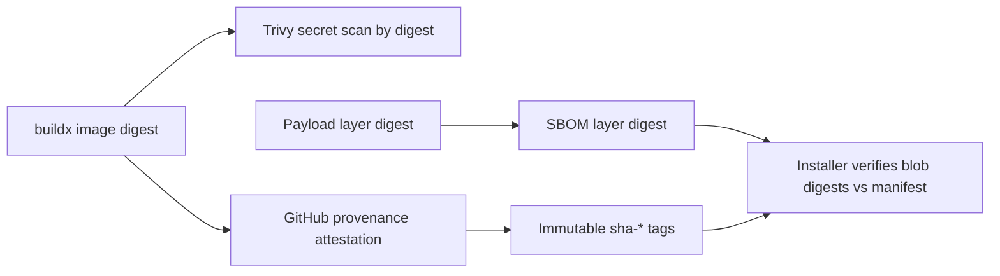

# Architecture & Flow Diagrams

## Developer setup (installer → metadata → payload/images)
```mermaid
flowchart LR
    A[User runs install.sh] --> B[Fetch channel metadata (GHCR, anon)]
    B --> C[Resolve version/tag + payload digest]
    C --> D[Download payload OCI layer + SBOM]
    D --> E[Verify SHA256 vs manifest]
    E --> F[Extract payload, run install-release.sh]
    F --> G[Blue/green swap under /opt/containai]
```

## CI build graph (base → agents/proxy → metadata/payload)
```mermaid
flowchart TD
    B[Build base (buildx push sha)] --> C[Build containai (uses base digest)]
    C --> D[Build variants: copilot, codex, claude, proxy, log-forwarder]
    D --> E[Finalize tags (dev/nightly/prod + sha) via imagetools]
    E --> F[Publish payload OCI + SBOM + attestation]
    E --> G[Publish channel metadata OCI]
    E --> H[GHCR visibility + retention cleanup]
```

## Security & provenance


## Runtime flow
```mermaid
flowchart LR
    R1[run-* launcher] --> R2[Container start]
    R2 --> R3[Entrypoint: unset CONTAINAI_*; mount tmpfs; harden proc]
    R3 --> R4[Agent runtime]
    R4 --> R5[MCP helpers spawn (http proxy)]
    R5 --> R6[IPC: stdio + SSE to user prompt]
    R4 --> R7[Proxy (Squid) with hardened entrypoint]
```
