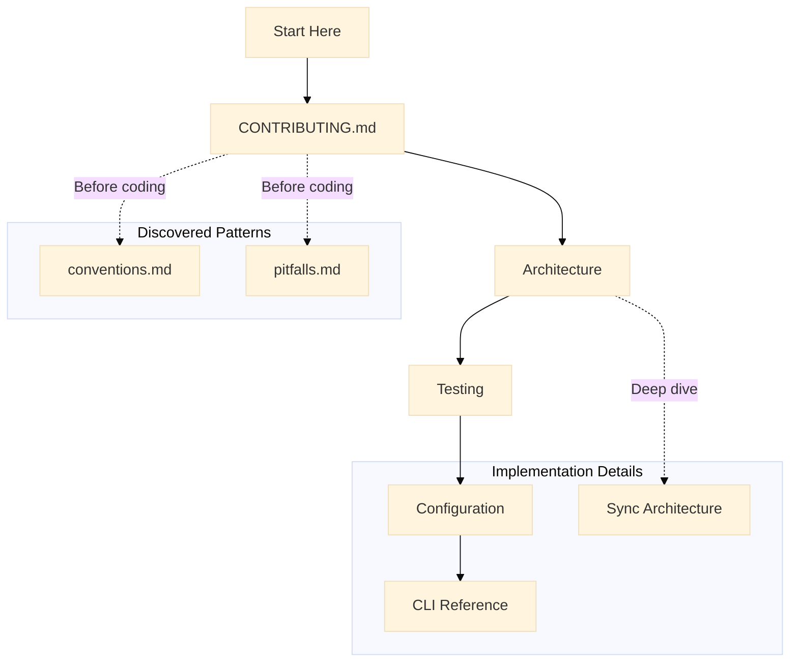

# For Contributors

**You want to improve ContainAI** - fix bugs, add features, or enhance documentation. This page guides you through the codebase and contribution workflow.

## Start Here

1. **Fork and clone**:
   ```bash
   git clone https://github.com/YOUR_USERNAME/containai.git
   cd containai
   ```

2. **Source the CLI** to load all functions:
   ```bash
   source src/containai.sh
   ```

3. **Verify your environment**:
   ```bash
   cai doctor
   ```

## Recommended Reading Order

1. **[CONTRIBUTING.md](../CONTRIBUTING.md)** - Development setup, coding conventions, PR process
2. **[Architecture Overview](architecture.md)** - System design, data flow, component responsibilities
3. **[Testing Guide](testing.md)** - Test tiers, running tests, adding new tests
4. **[Configuration Reference](configuration.md)** - TOML schema, config precedence, validation
5. **[CLI Reference](cli-reference.md)** - Command implementation patterns
6. **[Sync Architecture](sync-architecture.md)** - Host-to-container sync internals

## Reading Path



## Code Structure

```
containai/
├── src/                     # Main CLI and container runtime
│   ├── containai.sh         # Entry point (sources lib/*.sh)
│   ├── lib/                 # Modular shell libraries
│   │   ├── core.sh          # Logging utilities
│   │   ├── platform.sh      # OS detection
│   │   ├── docker.sh        # Docker helpers
│   │   ├── doctor.sh        # Health checks
│   │   ├── config.sh        # TOML parsing
│   │   ├── container.sh     # Container lifecycle
│   │   ├── import.sh        # Dotfile sync
│   │   └── ...              # Other modules
│   ├── container/           # Container-specific content
│   │   ├── entrypoint.sh    # Security validation
│   │   └── Dockerfile*      # Image layers
│   └── build.sh             # Build script
├── tests/
│   ├── unit/                # Unit tests (portable)
│   └── integration/         # Integration tests (require Docker)
└── docs/                    # Documentation
```

## Key Patterns

### Shell Scripting Conventions

ContainAI uses strict shell conventions for portability:

| Pattern | Why |
|---------|-----|
| `command -v` not `which` | Portable across shells |
| `printf '%s\n'` not `echo` | Handles `-n`/`-e` safely |
| `[[:space:]]` not `\s` | POSIX character classes |
| `local` for loop variables | Prevents shell pollution |
| `set -euo pipefail` | Strict error handling |

See [.flow/memory/conventions.md](../.flow/memory/conventions.md) for the full list.

### Verbose Pattern

Commands are silent by default (Unix Rule of Silence):

- Use `_cai_info()` for status messages (respects `_CAI_VERBOSE`)
- Use `--verbose` or `CONTAINAI_VERBOSE=1` to see messages
- Warnings/errors always emit to stderr

### Security Considerations

This is a sandboxing tool. Changes to these areas require extra review:

- Credential isolation
- Docker socket handling
- SSH configuration
- Volume mounts and path validation

See [SECURITY.md](../SECURITY.md) for the threat model.

## Testing

### Test Tiers

| Tier | Location | Requirements |
|------|----------|--------------|
| Linting | CI | None (shellcheck) |
| Integration | `tests/integration/` | Docker |
| E2E | Manual | Sysbox runtime |

### Running Tests

```bash
# Linting
shellcheck -x src/*.sh src/lib/*.sh

# Integration tests
./tests/integration/test-sync-integration.sh

# E2E tests (requires sysbox)
./tests/integration/test-secure-engine.sh
```

## Common Pitfalls

Before coding, review [.flow/memory/pitfalls.md](../.flow/memory/pitfalls.md) for 36+ documented gotchas:

- ERE grep syntax differences across platforms
- Docker BuildKit cache mount gotchas
- Systemd socket activation in containers
- Git worktree state sharing issues

## Good First Issues

Look for issues labeled [`good first issue`](https://github.com/novotnyllc/containai/labels/good%20first%20issue):

- Documentation improvements
- Test coverage additions
- Bug fixes with clear reproduction steps
- Small enhancements with limited scope

## Other Perspectives

- **[For Users](for-users.md)** - Running AI agents safely
- **[For Security Auditors](for-security-auditors.md)** - Evaluating ContainAI's security posture
