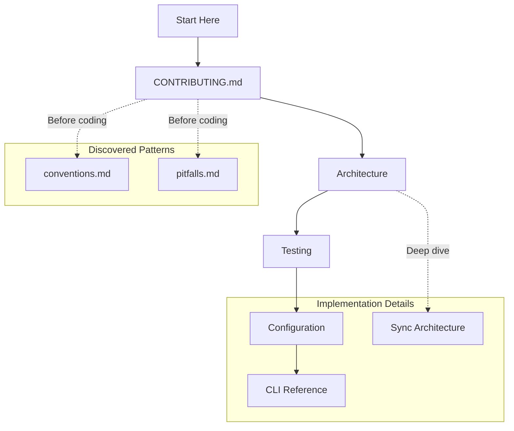

# For Contributors

**You want to improve ContainAI** - fix bugs, add features, or enhance documentation. This page guides you through the codebase and contribution workflow.

Prerequisites: .NET SDK 10+, Docker CLI (`docker --version`), Bash 4.0+, and Git.

## Start Here

1. **Fork and clone**:
   ```bash
   git clone https://github.com/YOUR_USERNAME/containai.git
   cd containai
   ```

2. **Bootstrap local install paths and wrapper**:
   ```bash
   ./install.sh --local --yes --no-setup
   ```
   `install.sh` delegates install operations to `cai install --local --yes --no-setup`.

3. **Build the native CLI and test projects**:
   ```bash
   dotnet build ContainAI.slnx -c Release
   ```

4. **Run one-time runtime setup**:
   ```bash
   cai setup
   ```

5. **Verify your environment**:
   ```bash
   cai doctor
   ```

6. **Export sample configs when validating import/sync flows**:
   ```bash
   cai examples export --output-dir ./.containai/examples --force
   ```

## Build Container Images (When Required)

Build image layers whenever your change affects container artifacts, runtime images, Dockerfiles, manifests consumed by image assembly, or systemd/runtime packaging behavior.

```bash
# Build all layers
dotnet build src/cai/cai.csproj -t:BuildContainAIImages -p:ContainAILayer=all -p:ContainAIImagePrefix=containai -p:ContainAIImageTag=latest

# Build a single layer during iteration
dotnet build src/cai/cai.csproj -t:BuildContainAIImages -p:ContainAILayer=base -p:ContainAIImagePrefix=containai -p:ContainAIImageTag=latest

# Multi-arch build and push
dotnet build src/cai/cai.csproj -t:BuildContainAIImages -p:ContainAILayer=all -p:ContainAIPlatforms=linux/amd64,linux/arm64 -p:ContainAIPush=true -p:ContainAIBuildSetup=true -p:ContainAIImagePrefix=ghcr.io/ORG/containai -p:ContainAIImageTag=nightly

# Publish native AOT CLI binary
dotnet publish src/cai/cai.csproj -c Release -r linux-x64 -warnaserror -p:PublishAot=true -p:PublishTrimmed=true -p:TrimmerSingleWarn=false
```

For pure CLI/library/docs changes, image rebuilds are optional unless tests in your branch explicitly depend on freshly built images.

## Recommended Reading Order

1. **[CONTRIBUTING.md](../CONTRIBUTING.md)** - Development setup, coding conventions, PR process
2. **[Architecture Overview](architecture.md)** - System design, data flow, component responsibilities
3. **[Testing Guide](testing.md)** - Test tiers, running tests, adding new tests
4. **[Configuration Reference](configuration.md)** - TOML schema, config precedence, validation
5. **[CLI Reference](cli-reference.md)** - Command implementation patterns
6. **[Sync Architecture](sync-architecture.md)** - Host-to-container sync internals

## Reading Path



## Code Structure

```
containai/
├── src/                     # Main CLI and runtime libraries
│   ├── cai/                 # NativeAOT host executable
│   ├── ContainAI.Cli/       # System.CommandLine surface
│   ├── ContainAI.Cli.Abstractions/
│   ├── AgentClientProtocol.Proxy/
│   ├── container/           # Container-specific content
│   │   └── Dockerfile*      # Image layers
│   └── manifests/           # Authoritative sync manifests
├── tests/
│   ├── ContainAI.Cli.Tests/
│   └── AgentClientProtocol.Proxy.Tests/
└── docs/                    # Documentation
```

## Key Patterns

### Native CLI Conventions

ContainAI uses a .NET 10 native CLI with strong typing and deterministic behavior:

| Pattern | Why |
|---------|-----|
| `System.CommandLine` entrypoint | Structured command/subcommand parsing |
| `System.Text.Json` + `CsToml` + YAML parser | Native JSON/TOML/YAML parsing without external parser executables |
| `xunit.v3.mtp-v2` + Microsoft Testing Platform v2 | Consistent local/CI test execution and coverage |
| NBGV (`dotnet nbgv`) | Versioning from Git metadata |

See [.flow/memory/conventions.md](../.flow/memory/conventions.md) for the full list.

**Command surface**: Commands/options are statically declared in `src/ContainAI.Cli/RootCommandBuilder.cs` and related command builder files. Shell completion uses the built-in `cai completion suggest` path; `dotnet-suggest` is not required.
For core session commands (`run`, `shell`, `exec`), parsed `System.CommandLine` option models are passed directly into runtime typed APIs (no argv reconstruction/reparse loop in the call path).

### Verbose Pattern

Commands are silent by default (Unix Rule of Silence):

- Use `_cai_info()` for status messages (respects `_CAI_VERBOSE`)
- Use `--verbose` or `CONTAINAI_VERBOSE=1` to see messages
- Warnings/errors always emit to stderr

### Security Considerations

This is a sandboxing tool. Changes to these areas require extra review:

- Credential isolation
- Docker socket handling
- SSH configuration
- Volume mounts and path validation

See [SECURITY.md](../SECURITY.md) for the threat model.

## Testing

### Test Tiers

| Tier | Location | Requirements |
|------|----------|--------------|
| Linting | CI | None (shellcheck on installer script) |
| Integration | `tests/ContainAI.Cli.Tests/` | Docker |
| ACP | `tests/AgentClientProtocol.Proxy.Tests/` | None |
| E2E | CI + Local | Sysbox runtime |

### Running Tests

```bash
# Linting
shellcheck -x install.sh

# Integration tests
dotnet test --project tests/ContainAI.Cli.Tests/ContainAI.Cli.Tests.csproj --configuration Release -- --filter-trait "Category=SyncIntegration" --xunit-info

# ACP proxy tests
dotnet test --project tests/AgentClientProtocol.Proxy.Tests/AgentClientProtocol.Proxy.Tests.csproj --configuration Release -- --xunit-info

# E2E smoke checks (requires sysbox)
docker --context containai-docker run --rm --runtime=sysbox-runc ghcr.io/novotnyllc/containai/base:latest cai version
```

### Coverage Gate Policy

CI requires Cobertura coverage artifacts and merged reports. If no coverage artifacts are generated, the workflow fails.

CI also enforces minimum line coverage thresholds:
- `ContainAI.Cli` >= 97%
- `ContainAI.Cli.Abstractions` >= 97%
- `AgentClientProtocol.Proxy` >= 97%

### Shell Fixture Guidance (Tests)

When test code writes Bash fixture scripts from C# raw string literals, normalize line endings to LF before writing:

```csharp
File.WriteAllText(scriptPath, script.ReplaceLineEndings("\n"));
```

CRLF shell fixtures can fail on Linux with immediate process exit (for example, surfacing as `Broken pipe` during ACP lifecycle tests).

## Common Pitfalls

Before coding, review [.flow/memory/pitfalls.md](../.flow/memory/pitfalls.md) for 36+ documented gotchas:

- ERE grep syntax differences across platforms
- Docker BuildKit cache mount gotchas
- Systemd socket activation in containers
- Git worktree state sharing issues

## Good First Issues

Look for issues labeled [`good first issue`](https://github.com/novotnyllc/containai/labels/good%20first%20issue):

- Documentation improvements
- Test coverage additions
- Bug fixes with clear reproduction steps
- Small enhancements with limited scope

## Other Perspectives

- **[For Users](for-users.md)** - Running AI agents safely
- **[For Security Auditors](for-security-auditors.md)** - Evaluating ContainAI's security posture
