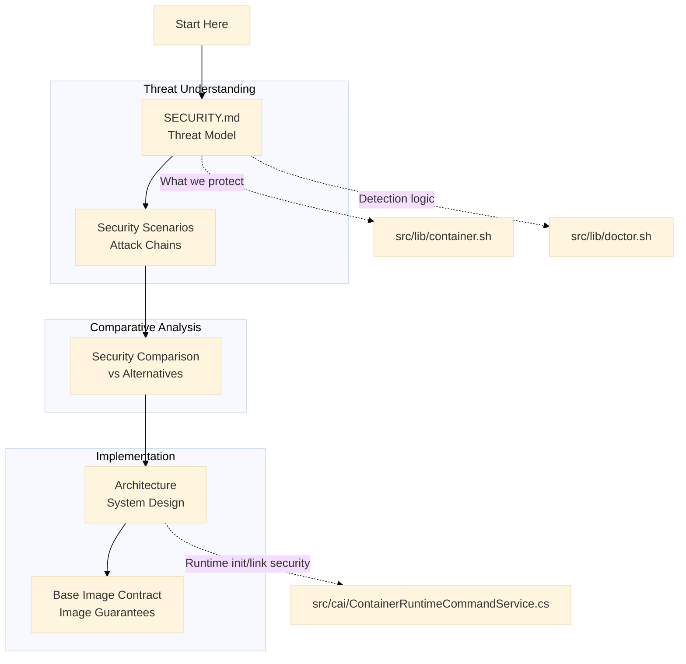

# For Security Auditors

**You want to evaluate ContainAI's security** - understand its isolation guarantees, threat model, attack surface, and what it explicitly does not protect against.

## Start Here

1. **Read the threat model** - [SECURITY.md](../SECURITY.md) documents isolation modes, security guarantees, and explicit non-goals

2. **Understand the isolation** - ContainAI uses Sysbox for isolation: on Linux/WSL2 via ContainAI-managed docker-ce, on macOS via Lima VM. Both provide user namespace isolation (container root maps to unprivileged host UID). See [SECURITY.md](../SECURITY.md#security-model) for details.

3. **Review the attack scenarios** - [Security Scenarios](security-scenarios.md) shows what happens with and without isolation

## Recommended Reading Order

1. **[SECURITY.md](../SECURITY.md)** - Threat model, security guarantees, unsafe opt-ins, reporting process
2. **[Security Scenarios](security-scenarios.md)** - Real-world attack chains with/without isolation
3. **[Security Comparison](security-comparison.md)** - ContainAI vs Docker ECI, gVisor, microVMs, plain containers
4. **[Architecture](architecture.md)** - System design and security boundaries
5. **[Base Image Contract](base-image-contract.md)** - What the container images guarantee

## Security Documentation Hierarchy

## Isolation Model

ContainAI enforces sandbox-first execution using Sysbox:

- **Linux/WSL2**: Uses `--runtime=sysbox-runc` with ContainAI-managed docker-ce daemon
- **macOS**: Uses Lima VM with Sysbox runtime

Both provide user namespace isolation (container root maps to unprivileged host UID), credential isolation, and Docker socket denial by default.

For the complete isolation guarantees table, see [SECURITY.md > Security Guarantees](../SECURITY.md#security-guarantees).

## Explicit Non-Goals

ContainAI explicitly does **not** protect against malicious container images, network-based attacks, resource exhaustion, or host kernel exploits.

See [SECURITY.md > Non-Goals](../SECURITY.md#non-goals) for the complete list with rationale.

## Unsafe Opt-ins and Bypasses

ContainAI provides explicit bypass flags for testing:

- `--force`: Skips isolation verification (for development/testing only)

Credentials are synced via `cai import` from host to volume, not shared at runtime. Inner Docker (DinD) is used rather than mounting the host Docker socket.

See [SECURITY.md > Unsafe Opt-ins](../SECURITY.md#unsafe-opt-ins) for details and [CLI Reference](cli-reference.md#cai) for flag documentation.

## Attack Surface

### External Inputs

| Input | Validation Location | Notes |
|-------|---------------------|-------|
| TOML config files | [TomlCommandProcessor.cs](../src/cai/TomlCommandProcessor.cs) | Parsed without shell eval |
| Environment variables | [ContainerRuntimeCommandService.cs](../src/cai/ContainerRuntimeCommandService.cs) | Key/value validation |
| Volume mount paths | [ContainerRuntimeCommandService.cs](../src/cai/ContainerRuntimeCommandService.cs) | Symlink and traversal checks |
| Container names | [ContainerNameGenerator.cs](../src/cai/ContainerNameGenerator.cs) | RFC 1123 hostname compliance |

### In-Scope for Vulnerability Reports

- Container isolation bypasses
- Host credential exposure
- Path traversal vulnerabilities
- Docker socket access escalation
- Authentication/authorization issues

### Out of Scope

- Vulnerabilities in upstream dependencies (report to respective maintainers)
- Issues requiring physical access
- Social engineering attacks
- Denial of service against your own containers

## Key Implementation Files

| File | Security Role |
|------|---------------|
| [src/cai/NativeLifecycleCommandRuntime.cs](../src/cai/NativeLifecycleCommandRuntime.cs) | Isolation detection and verification |
| [src/cai/NativeSessionCommandRuntime.cs](../src/cai/NativeSessionCommandRuntime.cs) | Container start with isolation checks |
| [src/cai/ContainerRuntimeCommandService.cs](../src/cai/ContainerRuntimeCommandService.cs) | Volume mount security, .env parsing |
| [src/cai/TomlCommandProcessor.cs](../src/cai/TomlCommandProcessor.cs) | TOML parsing (no shell eval) |

## Reporting Vulnerabilities

**Do not report security vulnerabilities through public GitHub issues.**

Use [GitHub Security Advisories](https://github.com/novotnyllc/containai/security/advisories/new):

1. Go to the **Security** tab in the repository
2. Click **Report a vulnerability**
3. Include: description, reproduction steps, impact assessment, suggested mitigations

Response timeline:
- Initial acknowledgment: Within 48 hours
- Detailed response: Within 7 days

See [SECURITY.md](../SECURITY.md#safe-harbor) for safe harbor policy.

## External References

- [Sysbox Documentation](https://github.com/nestybox/sysbox) - Runtime isolation details
- [User Namespaces](https://man7.org/linux/man-pages/man7/user_namespaces.7.html) - Linux kernel feature
- [CVE-2024-21626](https://nvd.nist.gov/vuln/detail/CVE-2024-21626) - Example container escape (covered in security scenarios)

## Other Perspectives

- **[For Users](for-users.md)** - Running AI agents safely
- **[For Contributors](for-contributors.md)** - Want to improve ContainAI? Start here
