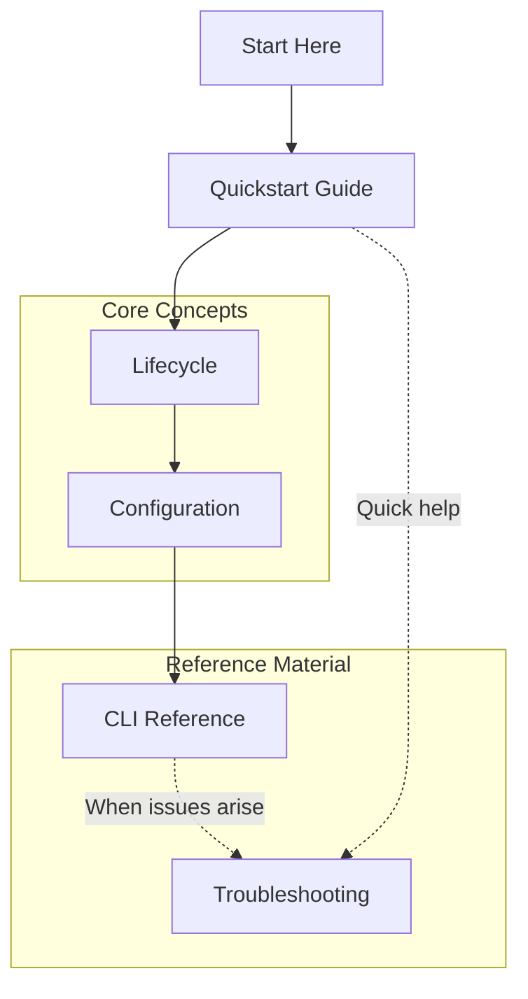

# For Users

**You want to run AI agents safely** - without risking your host system, without complex Docker configuration, and with your shell preferences intact.

## Start Here

Prerequisites: Docker CLI (`docker --version`) and Bash 4.0+.

1. **Install** - Clone the repo and install `cai`:
   ```bash
   git clone https://github.com/novotnyllc/containai.git
   cd containai
   ./install.sh --yes --no-setup
   ```
   `install.sh` bootstraps the binary and delegates to `cai install --local` with the same options (`--yes --no-setup` here).
   `cai install --yes` wires shell integration using `~/.config/containai/profile.d/containai.sh`, including completion for `cai`, `containai-docker`, and `docker-containai`.

2. **Setup isolation** (one-time):
   - Linux (Ubuntu/Debian) and WSL2: Run `cai setup` (installs a ContainAI-managed Docker daemon bundle and Sysbox)
   - macOS: Run `cai setup` (configures a Lima VM with Sysbox runtime)
   - Other Linux distros: Follow [Setup Guide](setup-guide.md) for manual Sysbox installation

3. **Launch your first sandbox** - Navigate to your project and run `cai`:
   ```bash
   cd /path/to/project && cai
   ```

## Recommended Reading Order

1. **[Quickstart Guide](quickstart.md)** - Zero to sandbox in 5 minutes with environment verification
2. **[Container Lifecycle](lifecycle.md)** - Usage patterns: ephemeral vs persistent modes, data volumes
3. **[Configuration Reference](configuration.md)** - TOML config files, volumes, and environment variables
4. **[CLI Reference](cli-reference.md)** - Complete command documentation with examples
5. **[Troubleshooting](troubleshooting.md)** - Common issues and fixes for Docker, SSH, and agents

## Reading Path



## Key Features for Users

### Preferences Sync

Your git config, shell aliases, and editor settings carry into the container automatically. The environment feels like your local machine, not a sterile sandbox.

- See [Configuration > Sync Section](configuration.md) for what gets synced
- Use `cai import` to manually refresh synced files

### Ephemeral or Persistent

Choose your workflow:

| Mode | Command | Use Case |
|------|---------|----------|
| Persistent | `cai` | Long-lived dev environment with saved state |
| Fresh volume | `cai --reset` | Starts fresh with a new volume (existing volume retained for manual cleanup) |
| Force recreate | `cai --restart` | Recreate container, keep data volume |

See [Lifecycle](lifecycle.md) for details on container and volume management.

### Multiple Agents

ContainAI supports different AI agents:

```bash
cai                           # Default agent (claude)
CONTAINAI_AGENT=gemini cai    # Use Gemini instead
```

Set the default agent in your config with `[agent].default = "gemini"`.

### SSH Access

Connect via VS Code Remote-SSH or standard SSH. First configure SSH access:

```bash
cai shell   # Configures SSH for your container
ssh <container-name>  # Connect using container name
```

See [Troubleshooting](troubleshooting.md#ssh-connection-issues) for port configuration (dynamic range 2300-2500).

## Quick Reference

| Command | Description |
|---------|-------------|
| `cai` | Start or attach to sandbox |
| `cai doctor` | Check system capabilities |
| `cai shell` | Open bash shell in running sandbox |
| `cai import` | Sync host dotfiles to container |
| `cai stop --all` | Stop all ContainAI containers |
| `cai --help` | Full command reference |

## Other Perspectives

- **[For Contributors](for-contributors.md)** - Want to improve ContainAI? Start here
- **[For Security Auditors](for-security-auditors.md)** - Evaluating ContainAI's security posture
