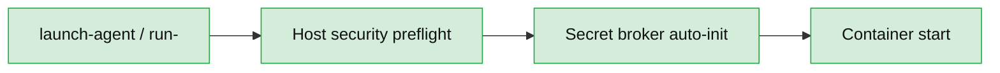

# Getting Started with ContainAI

This guide will walk you through setting up ContainAI from scratch, even if you've never used Docker or containers before. If you already have Docker installed and just need to understand the launcher workflow, skip ahead to [docs/running-agents.md](running-agents.md).

**Total Time**: 20-50 minutes (first time)

## Table of Contents

- [Prerequisites](#prerequisites)
- [Step 1: Install Docker](#step-1-install-docker)
- [Step 2: Check Git Configuration (Host)](#step-2-check-git-configuration-host)
- [Step 3: Install GitHub CLI (Optional)](#step-3-install-github-cli-optional)
- [Step 4: Authenticate GitHub CLI (Optional)](#step-4-authenticate-github-cli-optional)
- [Step 5: Verify Your Setup](#step-5-verify-your-setup)
- [Step 6: Clone ContainAI](#step-6-clone-ContainAI)
- [Step 7: (Optional) Pre-fetch or Build Images](#step-7-optional-pre-fetch-or-build-images)
- [Step 8: Install Launcher Scripts](#step-8-install-launcher-scripts)
- [Step 9: First Launch](#step-9-first-launch)
- [Step 10: Connect from VS Code](#step-10-connect-from-vs-code-optional)
- [Detaching and Reconnecting](#detaching-and-reconnecting)
- [Next Steps](#next-steps)
- [Troubleshooting](#troubleshooting)

## Prerequisites

Before you begin, you'll need:

- **Operating System**: Windows 10/11 (with WSL2), macOS 10.15+, or Linux
- **Container Runtime**: Docker 20.10+ (Docker Desktop or Docker Engine)
- **Disk Space**: 5GB minimum (10GB recommended)
- **RAM**: 8GB minimum (16GB recommended for multiple agents)
- **Internet Connection**: Required for downloading images and cloning repositories
- **Administrator Access**: May be needed for Docker installation

## Step 1: Install Docker

You need Docker to run ContainAI.

### Docker

#### Windows

1. Download [Docker Desktop for Windows](https://www.docker.com/products/docker-desktop/)
2. Run the installer
3. During installation:
   - Enable WSL2 integration (required)
   - Enable Hyper-V if prompted
4. Restart your computer when prompted
5. Start Docker Desktop from the Start menu
6. Wait for Docker to fully start (whale icon in system tray)

**Verify installation:**
```powershell
docker --version
# Should show: Docker version 20.10.0 or higher

docker ps
# Should show empty table (not an error)
```

**Install socat in WSL (required for credential/GPG proxy):**
```powershell
wsl sudo apt-get update
wsl sudo apt-get install -y socat
```

**Troubleshooting**: If you see "Docker daemon is not running", ensure Docker Desktop is started and the whale icon shows "Docker Desktop is running".

### macOS

1. Download [Docker Desktop for Mac](https://www.docker.com/products/docker-desktop/)
2. Open the `.dmg` file and drag Docker to Applications
3. Open Docker from Applications
4. Grant permissions in System Preferences if prompted
5. Wait for Docker to start (whale icon in menu bar)

**Verify installation:**
```bash
docker --version
# Should show: Docker version 20.10.0 or higher

docker ps
# Should show empty table (not an error)
```

**Install socat (required for credential/GPG proxy):**
```bash
brew install socat
```

### Linux

**Ubuntu/Debian:**
```bash
# Update package index
sudo apt-get update

# Install prerequisites
sudo apt-get install -y ca-certificates curl gnupg

# Add Docker's official GPG key
sudo install -m 0755 -d /etc/apt/keyrings
curl -fsSL https://download.docker.com/linux/ubuntu/gpg | sudo gpg --dearmor -o /etc/apt/keyrings/docker.gpg
sudo chmod a+r /etc/apt/keyrings/docker.gpg

# Set up repository
echo \
  "deb [arch=$(dpkg --print-architecture) signed-by=/etc/apt/keyrings/docker.gpg] https://download.docker.com/linux/ubuntu \
  $(. /etc/os-release && echo "$VERSION_CODENAME") stable" | \
  sudo tee /etc/apt/sources.list.d/docker.list > /dev/null

# Install Docker
sudo apt-get update
sudo apt-get install -y docker-ce docker-ce-cli containerd.io docker-buildx-plugin docker-compose-plugin

# Install socat (required for credential/GPG proxy)
sudo apt-get install -y socat

# Add your user to docker group (avoids needing sudo)
sudo usermod -aG docker $USER

# Log out and back in for group changes to take effect
```

**Fedora/RHEL:**
```bash
sudo dnf install -y docker socat
sudo systemctl start docker
sudo systemctl enable docker
sudo usermod -aG docker $USER
# Log out and back in
```

**Verify installation:**
```bash
docker --version
# Should show: Docker version 20.10.0 or higher

docker ps
# Should show empty table (not an error)
```

## Step 2: Check Git Configuration (Host)

Containers automatically reuse the Git identity and credential helpers already configured on your host. In most cases, there's nothing to do. If you're unsure whether Git knows who you are, run the following on the **host**:

```bash
git config --global user.name
git config --global user.email
```

If those commands already return your information, you're done. If they're empty, set them once on the host so commits created from inside the container still carry your name/email.

## Step 3: Install GitHub CLI (Optional)

**⚠ Only required if you plan to use GitHub Copilot or authenticate with GitHub-hosted repositories.**

For other git hosting (GitLab, Bitbucket, self-hosted) or non-Copilot workflows, skip to [Step 5](#step-5-verify-your-setup).

The GitHub CLI (`gh`) enables OAuth authentication for GitHub Copilot and seamless GitHub integration.

### Windows

**Option 1: WinGet (Recommended)**
```powershell
winget install --id GitHub.cli
```

**Option 2: Download Installer**
1. Visit [cli.github.com](https://cli.github.com/)
2. Download the Windows installer (`.msi`)
3. Run the installer
4. Restart PowerShell

### macOS

**Homebrew (Recommended):**
```bash
brew install gh
```

**MacPorts:**
```bash
sudo port install gh
```

### Linux

**Ubuntu/Debian:**
```bash
type -p curl >/dev/null || (sudo apt update && sudo apt install curl -y)
curl -fsSL https://cli.github.com/packages/githubcli-archive-keyring.gpg | sudo dd of=/usr/share/keyrings/githubcli-archive-keyring.gpg \
&& sudo chmod go+r /usr/share/keyrings/githubcli-archive-keyring.gpg \
&& echo "deb [arch=$(dpkg --print-architecture) signed-by=/usr/share/keyrings/githubcli-archive-keyring.gpg] https://cli.github.com/packages stable main" | sudo tee /etc/apt/sources.list.d/github-cli.list > /dev/null \
&& sudo apt update \
&& sudo apt install gh -y
```

**Fedora/RHEL:**
```bash
sudo dnf install gh
```

**Verify installation:**
```bash
gh --version
# Should show: gh version 2.0.0 or higher
```

## Step 4: Authenticate GitHub CLI (Optional)

**⚠ Only needed if you installed GitHub CLI in Step 3.**

This step connects your GitHub account for accessing Copilot and GitHub-hosted repositories.

```bash
gh auth login
```

**Follow the interactive prompts:**

1. **What account do you want to log into?**
   - Choose: `GitHub.com`

2. **What is your preferred protocol for Git operations?**
   - Choose: `HTTPS` (recommended)

3. **Authenticate Git with your GitHub credentials?**
   - Choose: `Yes`

4. **How would you like to authenticate GitHub CLI?**
   - Choose: `Login with a web browser` (easiest)

5. **Copy the one-time code** (e.g., `1234-5678`)

6. **Press Enter** to open your browser

7. **In your browser:**
   - Paste the one-time code
   - Click "Authorize GitHub CLI"
   - Confirm with your GitHub password/2FA if prompted

8. **Back in terminal:**
   - You should see: "✓ Authentication complete"

**Verify authentication:**
```bash
gh auth status
# Should show:
# ✓ Logged in to github.com as YOUR_USERNAME
```

**Troubleshooting**: If authentication fails, run `gh auth logout` then try `gh auth login` again.

## Step 5: Verify Your Setup

Run the verification script to check all prerequisites:

**Linux/Mac:**
```bash
cd ContainAI  # If you've already cloned (Step 6)
./host/utils/verify-prerequisites.sh
```

**Windows:**
```powershell
cd ContainAI  # If you've already cloned (Step 6)
.\host\utils\verify-prerequisites.ps1
```

**Expected Output:**
```
✓ Docker installed (25.0.0)
✓ Docker is running
✓ Git configured (user.name: Your Name)
✓ Git configured (user.email: your@email.com)
⚠ GitHub CLI not installed (optional - only needed for GitHub Copilot)
✓ Disk space available: 15.2 GB

✅ Core prerequisites met! You're ready to use ContainAI.
⚠ 1 optional tool missing (see above)
```

**Note:** The warning about GitHub CLI is expected if you skipped Steps 3-4. It's only required for GitHub Copilot or GitHub authentication.

**If you see any ❌ errors**, go back to the relevant step above.

## Step 6: Clone ContainAI

Get the ContainAI repository:

```bash
git clone https://github.com/novotnyllc/ContainAI.git
```

## Step 7: (Optional) Pre-fetch or Build Images

You can skip this step entirely—the launchers automatically pull whatever image they need the first time you run them. Pre-fetching is only helpful if you want to download everything ahead of time (for example, before hopping on a slow network) or if you're developing custom images.

### Option A: Pre-fetch pre-built images (~1 minute)

```bash
docker pull ghcr.io/novotnyllc/containai-copilot:latest
docker pull ghcr.io/novotnyllc/containai-codex:latest
docker pull ghcr.io/novotnyllc/containai-claude:latest
```

### Option B: Build locally (~15-20 minutes)

Build all images from source (useful for development or customization). You can also target a subset of images if you only need specific agents.

**Linux/Mac:**
```bash
# Build everything
./scripts/build/build-dev.sh

# Build only Copilot + proxy
./scripts/build/build-dev.sh --agents copilot,proxy
```

**Windows:**
```powershell
# Build everything
.\scripts\build\build.ps1

# Build only Copilot + proxy
.\scripts\build\build.ps1 -Agents copilot,proxy
```

**What happens during build:**
1. Prompts for base image only if you're building one or more agent images (`copilot`, `codex`, `claude`)
2. Builds `containai-base:local` (if you choose to build locally)
3. Builds `containai:local` (shared "all agents" image) whenever agent images are selected
4. Builds the requested specialized agent images (e.g., `containai-copilot:local`)
5. Builds `containai-proxy:local` when `proxy` is part of the target list

**Build time breakdown:**
- Base image: ~10 minutes (if building locally, 1 min if pulling)
- Each specialized image: ~2 minutes
- Proxy image: ~1 minute

**Verify (optional):**
```bash
docker images | grep containai
# Shows the tags you just pulled or built
```

## Step 8: Install Launcher Scripts

Add launcher scripts to your PATH for easy access:

**Linux/Mac:**
```bash
./scripts/install.sh
```

**Windows:**
```powershell
.\scripts\install.ps1
```

**What this does:**
- Adds `host/launchers` to your PATH
- Allows you to run `run-copilot`, `launch-agent`, etc. from anywhere

**Activate the changes:**

**Linux (bash):**
```bash
source ~/.bashrc
```

**Mac (zsh):**
```bash
source ~/.zshrc
```

**Windows:**
- Restart PowerShell (close and reopen)

**Verify:**
```bash
which run-copilot    # Linux/Mac
where.exe run-copilot  # Windows

# Should show path to host/launchers/run-copilot
```

## Step 9: First Launch

Time to launch your first coding agent! Before any container starts, the launcher automatically verifies host security requirements and seeds the secret broker.



### Quick Launch (Ephemeral)

Navigate to any git repository and run:

```bash
cd ~/my-project  # Navigate to your project
run-copilot
```

**What happens:**
1. Checks that directory is a git repository
2. Pulls latest image if available
3. Creates ephemeral container
4. Mounts your repository at `/workspace`
5. Drops you into a shell with GitHub Copilot CLI
6. Starts a tmux session so you can safely detach/reconnect (`Ctrl+B`, then `D`)

**Try it out:**
```bash
# Inside the container
gh copilot suggest "list files in current directory"
gh copilot explain "git rebase -i HEAD~3"

# When done
exit  # Container auto-commits and pushes changes
```

**Container Features:**
- ✅ Your code mounted at `/workspace`
- ✅ Git configured from host
- ✅ Git authentication (if configured on host)
- ✅ Auto-commit and push on exit (if remote configured)
- ✅ Works on your current branch

### Optional: Configure Launcher Update Policy

Every launcher checks whether your local ContainAI repository is behind its upstream before starting. By default it prompts when updates are available. You can change this behavior with a tiny host-side config file:

| Platform | Config file |
|----------|-------------|
| Linux / macOS | `~/.config/containai/host-config.env` |
| Windows | `%USERPROFILE%\.config\containai\host-config.env` |

Example:

```ini
# ~/.config/containai/host-config.env
LAUNCHER_UPDATE_POLICY=prompt   # prompt | always | never
```

- `prompt` (default): notify when updates are available and ask before pulling
- `always`: automatically `git pull --ff-only` whenever you're behind (requires clean working tree)
- `never`: skip the check entirely (useful for air-gapped environments)

You can temporarily override the policy per-process with `CONTAINAI_LAUNCHER_UPDATE_POLICY` in your shell or PowerShell session.

### Advanced Launch (Persistent)

For longer coding sessions with VS Code integration:

```bash
launch-agent copilot ~/my-project -b feature-auth
```

**Arguments:**
- `copilot` - Agent type (copilot, codex, or claude)
- `~/my-project` - Repository path
- `-b feature-auth` - Create `copilot/feature-auth` branch

**What happens:**
1. Creates isolated `copilot/feature-auth` branch
2. Launches persistent container
3. Container runs in background
4. Ready for VS Code Dev Containers connection

**Check status:**
```bash
docker ps
# Should show running container: copilot-myproject-feature-auth
```

## Step 10: Connect from VS Code (Optional)

For the best experience, connect VS Code to your running container:

### Install Extension

1. Open VS Code
2. Install "Dev Containers" extension (ms-vscode-remote.remote-containers)
3. Restart VS Code if prompted

### Connect to Container

1. Click the remote icon in bottom-left corner (><)
2. Select "Attach to Running Container..."
3. Choose your container (e.g., `copilot-myproject-feature-auth`)
4. VS Code reopens connected to the container
5. Open folder: `/workspace`
6. Start coding with full IDE features!

**Benefits:**
- ✅ IntelliSense and debugging work
- ✅ Extensions run inside container
- ✅ Terminal is inside container
- ✅ Git operations work seamlessly

### Stop the Container

```bash
docker stop copilot-myproject-feature-auth
```

**Auto-push on stop**: Container automatically commits and pushes changes when stopped (unless launched with `--no-push`).

- Changes are pushed to a dedicated bare repository under `~/.containai/local-remotes/<repo-hash>.git` so the container never writes directly to your working tree.
- A host-side sync daemon fast-forwards your working tree as soon as the push completes (disable with `CONTAINAI_DISABLE_AUTO_SYNC=1`).
- Override the storage path by setting `CONTAINAI_LOCAL_REMOTES_DIR` before launching if you prefer a different secure location.

## Detaching and Reconnecting

Every launcher runs your agent inside a managed tmux session. Detach any time without stopping the container:

```text
Inside container: press Ctrl+B, then D
```

Later, reattach from the host even if VS Code isn't connected:

```bash
# Bash
host/launchers/connect-agent --name copilot-myproject-feature-auth

# PowerShell
host\launchers\connect-agent.ps1 -Name copilot-myproject-feature-auth

# When only one agent is running, omit --name
connect-agent
```

`connect-agent` will show the running containers and tmux sessions if you forget the name. Use `exit` inside tmux to leave the session (and let auto-commit/push run) when you're truly finished.

## Next Steps

### Explore Features

- **Network Isolation**: `launch-agent copilot . --network-proxy restricted`
- **Resource Limits**: `run-copilot --cpu 8 --memory 16g`
- **GPU Support**: `run-copilot --gpu all`
- **Custom Branches**: `launch-agent copilot . -b my-feature`

### Read Documentation

- [Usage Guide](../USAGE.md) - Detailed usage patterns
- [Architecture](architecture.md) - How it works
- [Network Proxy](network-proxy.md) - Network isolation modes
- [MCP Setup](mcp-setup.md) - Configure Model Context Protocol servers
- [Contributing](../CONTRIBUTING.md) - Development guide

### Configure MCP Servers (Optional)

Model Context Protocol (MCP) servers extend agent capabilities:

1. See [MCP Setup Guide](mcp-setup.md)
2. Create `~/.config/containai/mcp-secrets.env` (host-only; the launcher reads it before rendering each session)
3. Add API keys for services you want to use (GitHub token required for GitHub MCP)

### Multiple Agents

Run different agents in parallel:

```bash
launch-agent copilot ~/project1 -b feature-a
launch-agent codex ~/project2 -b refactor-b
launch-agent claude ~/project3 -b docs-c
```

Each agent:
- ✅ Isolated container
- ✅ Separate branch
- ✅ Own workspace
- ✅ No conflicts

## Troubleshooting

### Docker Not Running

**Error**: `Cannot connect to the Docker daemon`

**Solution**:
- **Windows/Mac**: Start Docker Desktop
- **Linux**: `sudo systemctl start docker`
- Wait 30 seconds for Docker to fully start
- Try command again

### WSL2 Not Enabled (Windows)

**Error**: `WSL 2 installation is incomplete`

**Solution**:
1. Open PowerShell as Administrator
2. Run: `wsl --install`
3. Restart computer
4. Reinstall Docker Desktop

### GitHub CLI Not Authenticated (Optional)

**Note:** Only relevant if you're using GitHub Copilot or GitHub-hosted repositories requiring authentication.

**Error**: `gh: Not authenticated`

**Solution**:
```bash
gh auth login
# Follow prompts to authenticate
```

### Permission Denied (Linux)

**Error**: `permission denied while trying to connect to Docker daemon`

**Solution**:
```bash
sudo usermod -aG docker $USER
# Log out and back in
```

### Out of Disk Space

**Error**: `no space left on device`

**Solution**:
```bash
# Remove unused Docker images
docker image prune -a

# Remove stopped containers
docker container prune

# Check space
df -h
```

### Port Already in Use

**Error**: `port is already allocated`

**Solution**:
- Stop conflicting container: `docker ps` then `docker stop <container>`
- Or use different port (advanced, see USAGE.md)

### Container Exits Immediately

**Error**: Container starts then exits

**Solution**:
```bash
# Check logs
docker logs <container-name>

# Common issues:
# - Repository path doesn't exist
# - Not a git repository
# - Branch name invalid
```

### More Help

- [Full Troubleshooting Guide](../TROUBLESHOOTING.md)
- [Usage Guide FAQ](../USAGE.md#faq)
- [GitHub Issues](https://github.com/novotnyllc/ContainAI/issues)

## Summary

You've successfully:
- ✅ Installed Docker
- ✅ Configured Git
- ℹ️  Optionally installed and authenticated GitHub CLI (for Copilot)
- ✅ Cloned ContainAI
- ✅ Got container images
- ✅ Installed launcher scripts
- ✅ Launched your first agent

**Happy coding with secure, isolated AI agents!** 🚀
