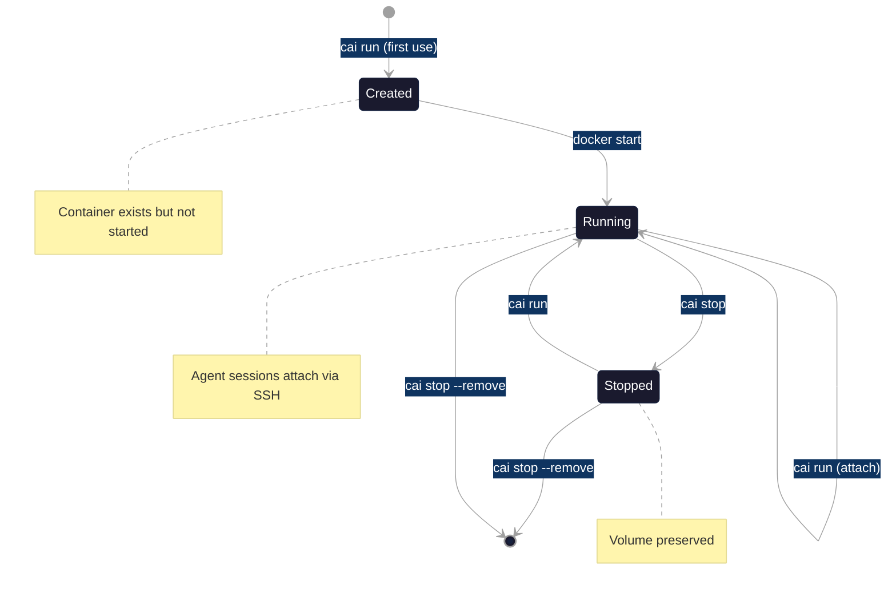

# Container Lifecycle

This guide explains how ContainAI manages container lifecycle: creation, starting, stopping, and destruction.

## Overview

ContainAI containers are designed to be persistent workspaces for AI coding agents. Unlike traditional ephemeral containers, they maintain state across sessions through data volumes and are identified by workspace-derived names.



## Container Creation

Containers are created automatically when you first run `cai run` or `cai` for a workspace.

### Naming Convention

Container names are derived from your workspace:
- **Format**: `{repo}-{branch_leaf}` (max 24 characters)
- **Branch leaf**: Last segment of a branch path (e.g., `feature/oauth` becomes `oauth`)
- **Deterministic**: Same workspace always produces the same container name

```bash
# In a git repo on branch "feature/auth"
cd ~/projects/myapp
cai  # Creates container: myapp-auth
```

### Labels

ContainAI containers are labeled for identification and management:

| Label | Description |
|-------|-------------|
| `containai.managed=true` | Identifies ContainAI-managed containers |
| `containai.workspace` | Original workspace path |
| `containai.keep=true` | Protection label (prevents GC deletion) |

### What Happens During Creation

1. **Context selection**: ContainAI selects the appropriate Docker context (e.g., `containai-docker` for Sysbox isolation)
2. **Image resolution**: Resolves the container image based on agent and template
3. **Volume setup**: Creates or attaches the data volume for persistent storage
4. **Container creation**: Runs `docker create` with appropriate mounts and labels
5. **SSH configuration**: Sets up SSH access for agent sessions

## Container Starting

Containers start automatically when accessed. ContainAI handles the transition from stopped to running state transparently.

### Automatic Start Behavior

When you run `cai` or `cai run`:
1. If container exists and is stopped, it starts automatically
2. If container is already running, a new session attaches
3. SSH setup is verified on every start

### Start Verification

ContainAI verifies container health on start:
- Systemd services are running (systemd is PID 1)
- SSH daemon is accessible
- Required ports are available

## Container Stopping

Use `cai stop` to stop containers. Stopping preserves the container and its data volume.

### Basic Stop

```bash
# Stop container for current workspace
cai stop

# Stop specific container
cai stop --container myapp-main

# Stop all ContainAI containers
cai stop --all
```

### Session Warning

When stopping a container with active sessions, ContainAI warns you:

```
[WARN] Container 'myapp-main' may have active sessions
Stop anyway? [y/N]:
```

Session detection uses best-effort methods:
- **SSH connections**: Checks established connections on port 22
- **Active terminals**: Counts PTY devices in `/dev/pts/`
- **Unknown**: If detection tools are unavailable, proceeds without warning

Use `--force` to skip the session warning prompt.

### Stop vs Remove

| Command | Effect |
|---------|--------|
| `cai stop` | Stops container (keeps container and volume) |
| `cai stop --remove` | Removes container (keeps volume) |

When removing containers, SSH configurations are automatically cleaned up.

## Container Destruction

Containers can be destroyed in several ways, with different effects on data.

### Remove Container Only

```bash
# Remove specific container (volume preserved)
cai stop --remove --container myapp-main

# Remove all containers (volumes preserved)
cai stop --all --remove
```

### Fresh Start (Recreate Container)

```bash
# Recreate container with same volume
cai --fresh

# Equivalent alias
cai --restart
```

This removes and recreates the container while preserving the data volume. Useful after:
- Configuration changes
- Template updates
- Image updates

### Reset (New Volume)

```bash
# Start fresh with new volume
cai --reset
```

This generates a new unique volume name, effectively starting from scratch. The old volume remains but is no longer referenced.

## Volume Lifecycle

Data volumes persist independently of containers. This separation ensures your agent credentials, plugins, and configuration survive container recreation.

### Volume Contents

| Path | Purpose |
|------|---------|
| `/mnt/agent-data` | Primary data mount in container |
| `~/.config/claude` | Claude agent configuration |
| `~/.config/gemini` | Gemini agent configuration |
| Agent credentials | OAuth tokens, API keys |
| Shell history | Command history |
| Custom configs | User-specific settings |

### Volume Persistence Rules

| Action | Container | Volume |
|--------|-----------|--------|
| `cai stop` | Stopped | Preserved |
| `cai stop --remove` | Removed | Preserved |
| `cai --fresh` | Recreated | Preserved |
| `cai --reset` | Recreated | New volume (old preserved) |
| `docker volume rm` | N/A | Deleted |

### Finding Your Volume

```bash
# Check workspace state for volume name
cai config get data_volume

# List volumes with inspect
docker volume ls

# Inspect container mounts
docker inspect <container> --format '{{range .Mounts}}{{.Name}}{{end}}'
```

## Garbage Collection (GC)

> **Note**: The `cai gc` command is planned for a future release. This section documents the intended behavior.

ContainAI will provide garbage collection to clean up stale resources.

### Container GC (Planned)

The `cai gc` command will prune stopped containers based on age:

```bash
# Preview what would be removed
cai gc --dry-run

# Remove containers stopped more than 7 days ago
cai gc --age 7d

# Skip confirmation prompt
cai gc --force
```

### GC Protection Rules

Containers will be protected from GC if:
1. **Running**: Active containers are never pruned
2. **Keep label**: Containers with `containai.keep=true` are protected
3. **Managed only**: Only `containai.managed=true` containers are considered

### Staleness Calculation

For stopped containers (`status=exited`):
- Age is calculated from `.State.FinishedAt` timestamp

For never-ran containers (`status=created`):
- Age is calculated from `.Created` timestamp

### Image GC (Planned)

With `--images`, GC will also prune unused ContainAI images:

```bash
cai gc --images
```

Only images matching these prefixes will be considered:
- `containai:*` (local builds)
- `ghcr.io/containai/*` (official registry)

Images in use by any container (running or stopped) are never removed.

### Manual Cleanup (Current)

Until `cai gc` is implemented, you can manually clean up:

```bash
# Remove specific stopped container
cai stop --remove --container <name>

# Remove all ContainAI containers
cai stop --all --remove

# Remove unused images (Docker native)
docker image prune -f
```

## Status Monitoring

Use `cai status` to inspect container state:

```bash
# Current workspace container
cai status

# Specific container
cai status --container myapp-main

# JSON output
cai status --json
```

### Output Fields

**Required fields** (always available):
- Container name
- Status (running/stopped/created)
- Image name

**Best-effort fields** (5-second timeout):
- Uptime (for running containers)
- Session counts (SSH connections, active terminals)
- Resource usage (memory, CPU)

Example output:
```
Container: myapp-main
  Status: running
  Uptime: 3d 4h 12m
  Image: containai:latest

  Sessions (best-effort):
    SSH connections: 2
    Active terminals: 3

  Resource Usage:
    Memory: 1.2GB / 4.0GB (30%)
    CPU: 5.2%
```

## Best Practices

### Keep Containers Running

For the best experience, leave your container running:
- Faster subsequent connections (no startup delay)
- Background processes continue running
- Agent can perform long-running tasks

### Use --fresh for Config Changes

After changing templates or configuration:
```bash
cai --fresh
```

### Regular Cleanup

Periodically clean up stale resources:
```bash
# Remove all stopped ContainAI containers
cai stop --all --remove

# Once cai gc is available (planned):
# cai gc --dry-run
# cai gc --age 30d
```

### Protect Important Containers

For containers you want to keep indefinitely, labels must be set at creation time.
ContainAI will provide a `--keep` flag in a future release. For now, you can:

```bash
# Use --container flag to create with a specific name that's easy to identify
cai --container important-project

# Or simply avoid running cai gc on containers you want to keep
```

## Troubleshooting

### Container Won't Start

1. Check Docker daemon: `docker info`
2. Check Sysbox availability: `cai doctor`
3. Review logs: `docker logs <container>`

### Session Detection Issues

If session detection returns "unknown":
- The `ss` utility may not be installed in the container
- ContainAI will proceed without warning in this case

### Volume Not Found

If the expected volume is missing:
1. Check workspace state: `cai config get data_volume`
2. List available volumes: `docker volume ls`
3. Use `--reset` to start fresh with a new volume

### SSH Connection Failures

1. Clean stale configs: `cai ssh cleanup`
2. Check SSH key: `~/.config/containai/keys/`
3. View container logs: `docker logs <container>`

## Related Documentation

- [Quickstart Guide](quickstart.md): Getting started with ContainAI
- [Configuration Reference](configuration.md): Config options and workspace settings
- [Troubleshooting](troubleshooting.md): Common issues and solutions
- [Security Model](../SECURITY.md): Isolation and threat model
