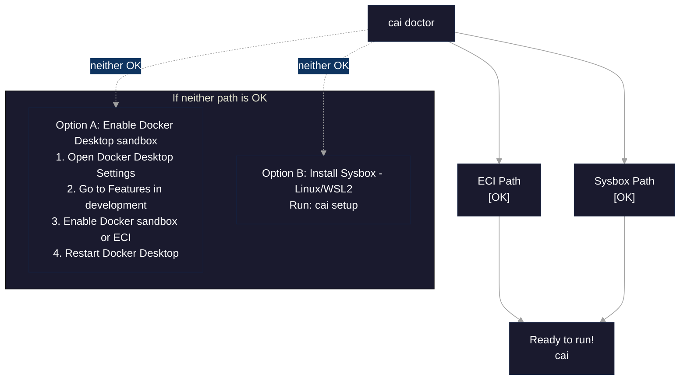
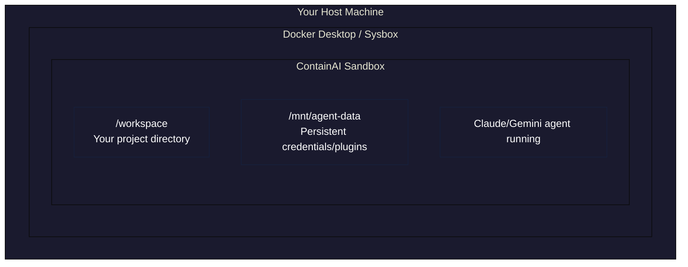

# Quickstart Guide

Get from zero to your first AI sandbox in under 5 minutes.

## Prerequisites

Before starting, ensure you have:

| Requirement | Version | Check Command |
|-------------|---------|---------------|
| Docker | Desktop 4.50+ or Engine 24.0+ | `docker --version` |
| Bash shell | 4.0+ | `echo "${BASH_VERSION}"` |
| Git | Any | `git --version` |

> **Shell note:** ContainAI requires **bash 4.0+**. If you use zsh, fish, or another shell, run `bash` first. macOS ships with bash 3.2; install a newer version via Homebrew (`brew install bash`).

## Step 1: Clone the Repository

```bash
git clone https://github.com/novotnyllc/containai.git
cd containai
```

**Verify:**
```bash
ls src/containai.sh
# Should show: src/containai.sh
```

## Step 2: Source the CLI

```bash
source src/containai.sh
```

**Verify:**
```bash
cai --help | head -3
# Should show:
# ContainAI - Run AI coding agents in a secure Docker sandbox
#
# Usage: containai [subcommand] [options]
```

> **Note:** You must source the script (not execute it) to add the `cai` command to your shell. Add this to your `~/.bashrc` for persistence.

## Step 3: Check Your Environment

Run the doctor command to detect your system's capabilities:

```bash
cai doctor
```

**What to look for:**

| Output | Meaning | Action |
|--------|---------|--------|
| `ECI Path: [OK]` | Docker Desktop with Enhanced Container Isolation | Ready to go! |
| `Sysbox Path: [OK]` | Sysbox runtime configured | Ready to go! |
| `ECI Path: [ERROR]` + `Sysbox Path: [WARN]` | No isolation available | See runtime options below |

### Runtime Decision Tree



## Step 4: Start Your First Sandbox

Navigate to a project directory (or stay in containai for testing):

```bash
# Optional: go to your project
cd /path/to/your/project

# Start the sandbox
cai
```

**Verify:**
```
Starting new sandbox container...
# or
Attaching to running container...
```

You should see the Claude agent interface (or a login prompt if not yet authenticated).

## Step 5: Authenticate Your Agent (First Run Only)

If Claude prompts you to log in, follow the authentication flow. If you need to authenticate manually:

1. Open a new terminal
2. Run `cai shell` to get a bash prompt inside the running container
3. Run `claude login` and follow the prompts

Credentials are stored in the sandbox's persistent data volume and persist across container restarts.

**Verify (from `cai shell`):**
```bash
claude --version
# Should show Claude CLI version without authentication errors
```

> **Using a different agent?** Start the sandbox with `cai --agent gemini` (on your host), then authenticate via `cai shell` and `gemini login`.

## What Just Happened?

When you ran `cai`, ContainAI:

1. **Detected isolation mode** - Checked for Docker Desktop ECI or Sysbox runtime
2. **Created a named container** - Based on your git repo and branch (e.g., `myproject-main`)
3. **Mounted your workspace** - Your current directory is available at `/workspace` inside the container
4. **Created a data volume** - `sandbox-agent-data` stores your agent credentials and plugins
5. **Started the AI agent** - Claude (or your configured agent) is ready to use



## Common First-Run Commands

| Command | Description |
|---------|-------------|
| `cai` | Start/attach to sandbox |
| `cai --restart` | Force recreate container (e.g., after config changes) |
| `cai doctor` | Check system capabilities |
| `cai shell` | Open bash shell in running sandbox |
| `cai stop --all` | Stop all ContainAI containers |

## Next Steps

- **Configure ContainAI** - See the [Technical README](../src/README.md#commands) for volume, naming, and configuration options
- **Troubleshoot issues** - See [Troubleshooting](../src/README.md#troubleshooting) for common problems
- **Security model** - See [SECURITY.md](../SECURITY.md) for security guarantees and threat model

---

## Quick Reference

### Starting fresh each session

```bash
# Add to ~/.bashrc for permanent access
echo 'source /path/to/containai/src/containai.sh' >> ~/.bashrc

# Or source manually each session
source src/containai.sh
```

### Platform-specific notes

| Platform | Shell | Notes |
|----------|-------|-------|
| Linux | bash | Native support |
| WSL2 | bash | Native support |
| macOS | zsh default | Run `bash` first, then source |
| macOS | bash | Direct support |

### Minimum versions

- Docker Desktop: 4.50+ (ECI path) **OR** Docker Engine: 24.0+ (Sysbox path)
- Git: any recent version
- Bash: 4.0+ (macOS default is 3.2; use `brew install bash`)
