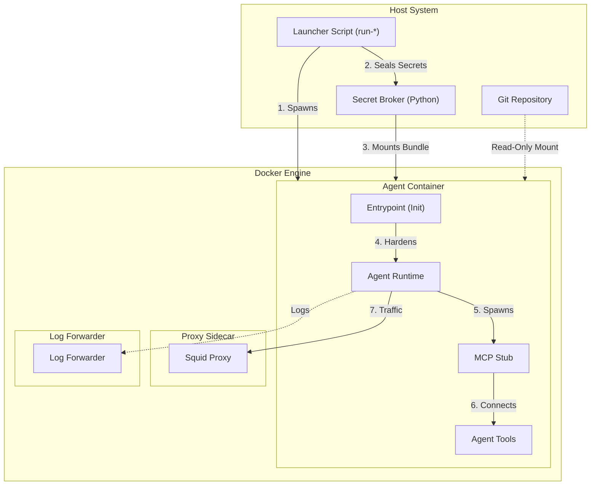
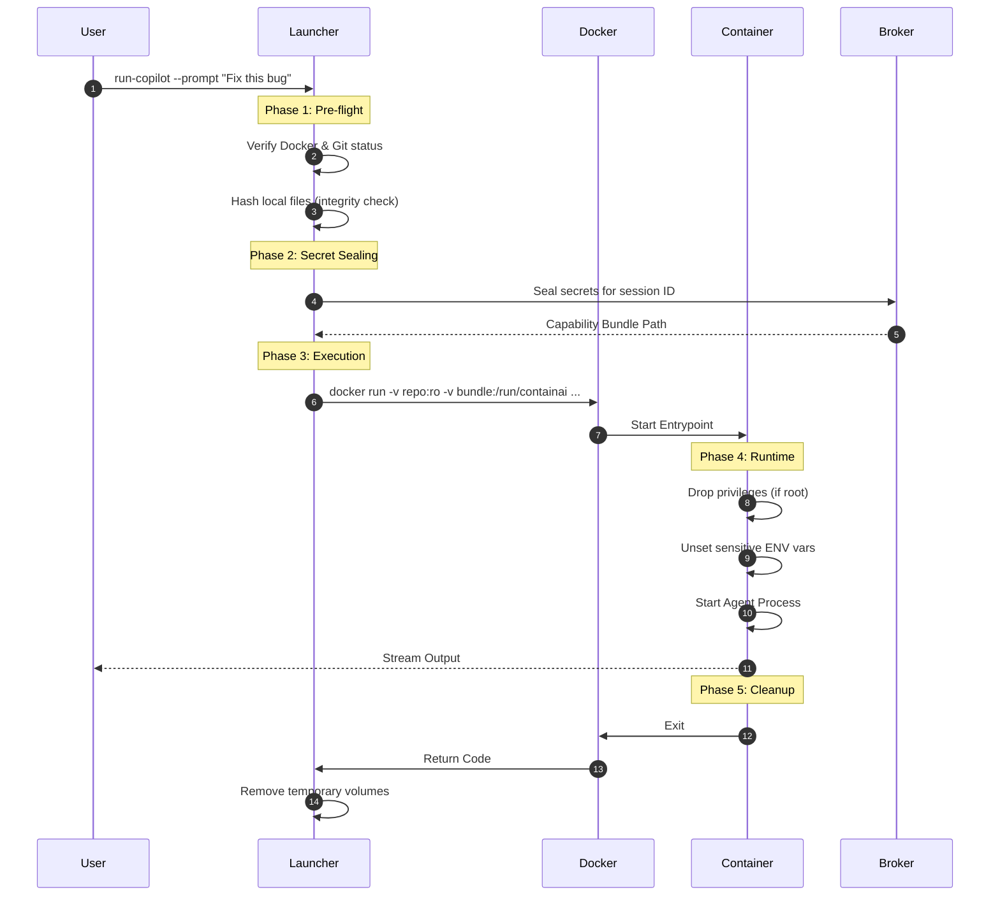

# Running ContainAI Containers

This guide details the runtime architecture, security boundaries, and operational workflows for launching AI agents.

## Audience & Scope

- **Developers**: Learn how to launch agents, attach debuggers, and manage sessions.
- **DevOps**: Understand the container lifecycle, networking, and resource usage.
- **Security**: Review the isolation boundaries, secret brokering, and network restrictions.

## Runtime Architecture

The runtime environment is designed to isolate the AI agent from the host system while providing controlled access to necessary resources (repositories, secrets).



## Isolation Model

### 1. Filesystem
- **Repository**: Mounted read-only by default. The agent cannot modify your source code directly unless explicitly authorized (future feature).
- **Workspace**: A copy-on-write overlay or a temporary volume is used for the agent's working directory.
- **Tmpfs**: Secrets are mounted into `/run/containai` which is a RAM-backed filesystem, ensuring secrets are never written to disk.

### 2. Networking
- **Default (Proxy)**: All outbound traffic is forced through a mandatory Squid sidecar for audit logging and policy enforcement.
- **Restricted**: `--network-proxy restricted` removes the network interface entirely for offline/air-gapped sessions.
- **Logging**: A mandatory Log Forwarder sidecar captures and ships logs to the configured collector.

### 3. Secrets (The Broker)
Secrets are never passed as environment variables.
1. The **Launcher** collects secrets from the host (keychain, env vars).
2. The **Secret Broker** encrypts/seals them into a "Capability Bundle".
3. The **Bundle** is mounted into the container.
4. The **MCP Stub** inside the container requests a specific capability (e.g., "GitHub Token").
5. The **Broker** validates the request and returns the token ephemerally.

## Launch Sequence



## 3. Install the Launchers (One Time)

```bash
./scripts/setup-local-dev.sh          # Linux/macOS
powershell -File scripts/setup-local-dev.ps1   # Windows
```

Installation simply adds the `host/launchers` directory to your PATH so you can call `run-*`/`launch-*` from any repository. You can also add the folder manually if you prefer to keep control of your shell profile.

> **Windows note:** The PowerShell entrypoints are WSL shims. They require WSL 2 and forward arguments to the bash scripts verbatim. `scripts\install.ps1` adds `host\launchers\entrypoints` to your PATH so channel-specific launchers work anywhere (`run-copilot-dev` in repo clones, `run-copilot` in prod bundles, `run-copilot-nightly` for nightly smoke). When passing GNU-style flags (`--prompt`, `--network-proxy squid`, etc.) from PowerShell, use `--%` before the first flag (`pwsh host\launchers\entrypoints\run-copilot-dev.ps1 --% --prompt "Status"`) so PowerShell does not treat them as native parameters.

## 4. Launch Patterns

### Ephemeral (Default)

Use the `run-*` shortcuts when you want the container to disappear after the session (pick the suffix for your channel: `-dev` in repo clones, none for prod bundles, `-nightly` for nightly builds):

```bash
cd ~/my-repo
run-copilot-dev                # or run-codex-dev / run-claude-dev
run-copilot-dev --no-push      # skip the safety auto-push
run-copilot-dev ~/other/repo   # explicit repo path
```

Ephemeral containers:
- Mount the target repository read-only
- Create an isolated branch (e.g., `copilot/session-12`)
- Auto-remove themselves when the agent exits

### Prompt Sessions

When you only need an answer (no repo work), pass `--prompt "<prompt>"` (same flag on Windows via the shim) to **any** `run-*` launcher:

```bash
run-copilot --prompt "Return the words: host secrets OK."
run-codex --prompt "Describe the branching policy"
run-claude --prompt "List required secrets"
```

Characteristics:
- Works uniformly for Copilot, Codex, and Claude. The launcher invokes the correct CLI (`github-copilot-cli exec`, `codex exec`, or `claude -p`) inside the container and exits once the response has streamed.
- Reuses your current Git repository automatically (auto-detecting the repo root even when you run from a subdirectory) and falls back to an empty workspace only when no repo exists.
- Accepts repo arguments plus `--branch` or `--use-current-branch` just like a normal session. Auto-push stays enabled whenever a real repo is mounted and is only forced off when the launcher has to synthesize an empty workspace.
- Uses the same security preflights, manifest hashing, and secret-broker flow as repo-backed sessions, so host secrets remain protected.

This is also the path exercised by `./scripts/test/integration-test.sh --with-host-secrets`, so documenting and testing it ensures parity across all agents.

### Persistent (Long-Running)

`launch-agent` keeps the container alive until you remove it (use `launch-agent-dev`, `launch-agent`, or `launch-agent-nightly` per channel):

```bash
launch-agent-dev copilot                # uses current repo + branch
launch-agent-dev codex --branch api-fixes
launch-agent-dev claude ~/proj --network-proxy restricted
```

Persistent containers gain extra management features:
- Reattach with `connect-agent`
- Detach via tmux (`Ctrl-B`, `D`)
- Auto-push before removal (unless `--no-push` specified)

### Container Management

```bash
list-agents                        # show running containers
remove-agent copilot-myapp-main    # remove + auto-push
remove-agent copilot-myapp-main --no-push
connect-agent -n copilot-myapp-main
```

Naming format: `{agent}-{repo}-{branch}` (sanitized). Labels expose repo path, branch, and agent so helper scripts can discover containers quickly.

## 5. Network Profiles

| Flag | Behavior |
|------|----------|
| `--network-proxy restricted` | Launches the container with `--network none` for fully offline sessions |
| `--network-proxy squid` (Default) | Spawns a Squid sidecar (`containai-proxy:local`) that logs traffic through the inspectable proxy |

Proxy images now pull automatically the first time you choose Squid mode, so you do not have to run build scripts manually.

## 6. VS Code Integration

1. Install the **Dev Containers** extension.
2. Launch an agent as usual.
3. From VS Code, run `Remote Explorer → Containers → Attach` and pick the container name (e.g., `copilot-myapp-main`).
4. VS Code will open directly inside `/workspace` with the same repo you mounted.

You can still use the tmux session from a terminal, so detaching in VS Code will not stop the container.

## 7. Secrets, MCP, and Configs

- Launchers render a session manifest on the host, hash the Docker + runtime files, and stage MCP configs per agent.
- API keys never leave the host: `secret-broker.py` seals them and places a capability bundle in `/run/containai` (tmpfs) inside the container.
- Every MCP server entry goes through the trusted `mcp-stub`, so even if an agent is compromised it does not learn the raw credential.

If you need to customize MCP servers, edit `config.toml` in your repository or set `~/.config/containai/mcp-secrets.env`. The setup flow is covered in detail in [docs/mcp-setup.md](mcp-setup.md).

## 8. Troubleshooting Quick Reference

| Symptom | Fix |
|---------|-----|
| `docker: command not found` | Install Docker or ensure it is on PATH |
| Launcher hangs on pull | Run `docker login ghcr.io` so GHCR pulls succeed |
| Container exits immediately | Check repo cleanliness; some launchers refuse to start with uncommitted changes unless you pass `--force` |
| VS Code cannot attach | Ensure Dev Containers extension is installed and Docker API is reachable |
| Proxy launch fails | Build dev proxy locally (`scripts/build/build-dev.sh --agents proxy`) or pull the published proxy tag pinned in `host/profile.env` |

## 9. Learn More

- [docs/getting-started.md](getting-started.md) – Full onboarding walkthrough (installation through first container)
- [docs/local-build-and-test.md](local-build-and-test.md) – When you need to build from source or run the automated test suite
- [docs/security-workflows.md](security-workflows.md) – Sequence diagrams for launch flow, secret brokering, and CI security gates
- [docs/cli-reference.md](cli-reference.md) – All launcher and helper command options
