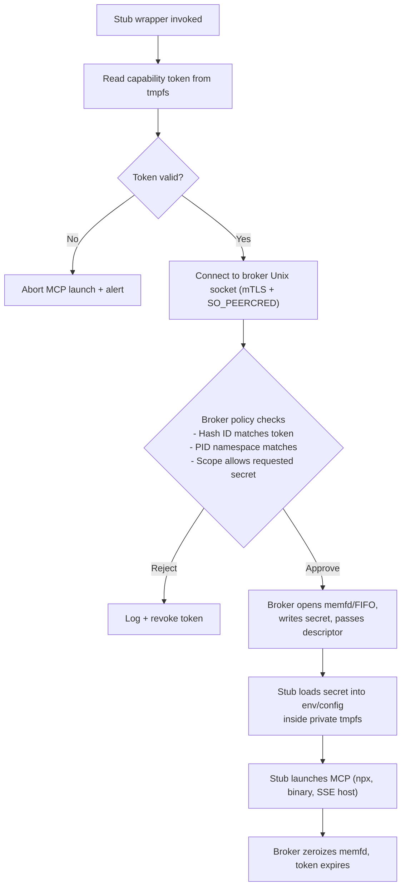

# Secret Broker and Credential Isolation Architecture

This document explains how Coding Agents restricts access to long-lived credentials (Copilot/Codex/Context7, MCP bearer tokens, GitHub PATs, etc.) while still allowing immutable MCP binaries to run unmodified. It is written from the perspective of the trusted launcher (`scripts/launchers/*`) and the host-resident secret broker they coordinate with.

## Objectives

1. **Enforce trust boundaries** – Only launcher-managed stubs may ever ask for MCP or agent credentials.
2. **Prevent accidental disclosure** – Secrets never hit command lines, disk, or shared sidecars; they live in per-process tmpfs or `memfd` regions.
3. **Contain compromise** – An agent process can only exfiltrate the credentials it legitimately owns for that session. Capabilities, tmpfs mounts, and broker policy keep the blast radius per agent/MCP.
4. **Provide audit + revocation** – Every credential issuance is linked to a session ID, hash measurement, and PID namespace so kill switches can revoke fast and operators can reconstruct events.

## Components and Trust Boundaries

| Component | Trust Level | Responsibility |
| --- | --- | --- |
| `launch-agent` / `run-agent` (host) | Trusted | Builds containers, hashes stubs, requests broker capabilities, wires tmpfs mounts.
| Secret Broker (host daemon) | Trusted | Stores master secrets, validates capabilities, streams secrets via one-time handles.
| Git tree attestation (`scripts/launchers/**`, stubs) | Trusted data | Launcher verifies these paths are clean vs. `HEAD` (and records the tree hash) before secrets are issued, so bits exactly match the current commit.
| Agent container runtime | Partially trusted | Runs untrusted code but with seccomp/AppArmor, read-only roots, and dedicated tmpfs for sensitive material.
| MCP Stub Wrappers | Trusted binaries inside container | Immutable helpers responsible for redeeming capabilities and launching MCPs.
| Squid proxy | Shared service | Provides egress filtering/logging only; never stores credentials.

## Launch-Time Capability Provisioning

```mermaid
sequenceDiagram
    autonumber
    participant Host as "Host launch-agent"
    participant Git as "Git (HEAD state)"
    participant Broker
    participant Container as "Agent Container"

    Host->>Git: "Verify launchers/stubs are clean vs HEAD"
    Host->>Git: "Record tree hash for audit log"
    Host->>Host: "Hash bundled agent + MCP stub binaries"
    Host->>Broker: "Request capability tokens (session + stub IDs)"
    Broker-->>Host: "Scoped, single-use capability blobs"
    Host->>Container: "Start container (seccomp/AppArmor, readonly root)"
    Host->>Container: "Bind per-stub tmpfs mounts + drop capability blobs"
    Note over Container: No untrusted code has run yet&#59; only launcher and stubs exist
```

Key points:

- Capability tokens encode session ID, target stub hash, cgroup/pid namespace, and expiry.
- Tokens are stored in broker-managed tmpfs directories with `chmod`/`chown` locking them to the stub user; general agent workloads cannot read them.
- If any launcher or stub file is dirty relative to `HEAD` (or its tree hash shifts unexpectedly), `launch-agent` refuses to start the container until the git state is restored.
- Agent containers set `kernel.yama.ptrace_scope=3` (via privileged helper) and rely on `seccomp`/AppArmor profiles that block `ptrace`, `process_vm_*`, and `/proc/<pid>/mem` access against stub UIDs, preventing credential snooping even from processes in the same namespace.

## Host-Synthesized Session Configs

`config.toml` remains user-editable, but the launcher renders a session-specific view before any containerized code starts:

1. Read `config.toml` plus CLI overrides on the host.
2. Merge runtime facts (session ID, network mode, tmpfs mount points, capability token paths).
3. Write the merged config into the agent tmpfs (`nosuid,nodev,noexec,0700`) and record its SHA256 in the broker log for traceability.
4. Pass the config path to the agent entrypoint. Because it is generated anew each launch, changes to `config.toml` are picked up automatically without relaxing integrity checks on trusted scripts.

## Mutual Authentication & Session-Derived Secrets

- During installation (or first run), the broker creates random per-stub shared keys under `~/.config/coding-agents/broker.d/secrets.json` and never places them in git or containers.
- When a stub redeems a capability, it signs the request with `HMAC(shared_key, nonce || capability_id)`; the broker validates before streaming any secret.
- Static upstream secrets (e.g., Context7) are envelope-encrypted per session: `session_key = HMAC(master_secret, session_id || timestamp)`. The broker transmits `Enc(session_key, api_secret)` plus the nonce so that leaking a tmpfs only reveals ciphertext tied to that session.
- All tmpfs mounts that hold configs, shared keys, or decrypted secrets are mounted as private, `nosuid,nodev,noexec`, and use dedicated UIDs so other processes—even within the same container—cannot traverse them.
- SSE/HTTPS helper processes run under unique UIDs with dedicated seccomp/AppArmor profiles that only permit loopback IPC plus outbound HTTPS to the intended MCP endpoint; they cannot access host files beyond their tmpfs.

## Additional Hardening Controls

- **Syscall + namespace isolation** – Every stub and helper runs inside its own PID namespace with `ptrace` fully disabled and `procfs` mount options `hidepid=2,gid=agentproc` so agent workloads cannot inspect other processes.
- **Broker sandboxing** – The broker executes as a `systemd --user` service with `ProtectSystem=strict`, `ProtectHome=read-only`, `NoNewPrivileges=yes`, `PrivateTmp=yes`, and a custom seccomp filter limited to file/socket syscalls. Per-stub mutual-auth keys reside in `~/.config/coding-agents/broker.d/` with `chmod 600` and `chattr +i` so only the host user can edit them.
- **Rate limiting & watchdog** – The broker enforces per-session capability quotas and exponential backoff on repeated failures; a host-side watchdog halts new launches if the broker exits, loses its seccomp/AppArmor profiles, or detects tampering with the shared-key store.
- **Immutable audit trail** – Issuance events (including generated config SHA256, git tree hash, capability IDs) are logged to `journald` with persistent storage and mirrored to an append-only file. Optional off-host shipping (scp/HTTPS) provides tamper-evident history.
- **Dev overrides** – If developers need to run with modified launchers/stubs, they create a host-only override token (e.g., `~/.config/coding-agents/overrides/allow-dirty`). Launcher requires the token and logs its use so deviations are explicit.

## Secret Redemption and MCP Launch Flow

Implementation notes:

- Secret delivery uses `memfd_create` or a one-time FIFO so data never appears on disk. File descriptors are passed over the Unix socket (`SCM_RIGHTS`).
- The stub translates secrets into whatever format the MCP expects (env var such as `bearer_token_env_var`, dedicated config file, or header cache) inside its private tmpfs mount.
- Because many MCPs require long-lived in-memory tokens, the stub keeps the tmpfs mounted and tightens `chmod 600` under its dedicated UID. When the MCP exits, the stub scrubs the mount and releases descriptors.

## Handling Static Secrets (e.g., Context7)

Static API keys cannot be rotated on demand, so safeguards focus on limiting exposure:

1. **Selective capability issuance** – Only sessions configured to use Context7 receive tokens that can request that key. Other agents cannot even ask.
2. **Per-session tmpfs** – The key is streamed into a tmpfs exclusive to the requesting stub; lateral movement within the container cannot read it without compromising that stub.
3. **Session envelope encryption** – Broker sends `Enc(HMAC(master, session data), api_key)` so even if the tmpfs is copied, the ciphertext cannot unlock future sessions without the master kept on the host.
4. **Audit + rotation** – Broker logs include session ID + timestamp; if compromise is suspected, operators rotate the upstream Context7 key once and rely on the broker to re-distribute it to trusted sessions.

## GitHub PATs Without Apps

To avoid GitHub App complexity while still minimizing blast radius:

1. Host `launch-agent` calls `gh auth token --scopes repo:read` (or fine-grained PAT CLI) scoped to the active repository and public repos.
2. The resulting PAT is stored only in broker encrypted memory.
3. MCP stubs redeem capability tokens for the PAT just like any other secret.
4. Tokens expire within an hour; launchers refresh on demand. Revoking on the host (via `gh auth logout` or deleting the PAT) immediately invalidates future broker requests.

## Revocation and Monitoring

- **Kill switch** (`coding-agents kill <session>`): Signals the broker to revoke all capabilities for that session, wipe tmpfs mounts, and stop the container.
- **Telemetry**: Broker emits structured logs for issuance, redemption, and policy failures; Squid provides complementary outbound request logs for correlation.
- **Anomaly detection**: Excess secret requests, mismatched PID namespaces, or attempts to use expired tokens trigger automatic revocation and optional container teardown.

## IO Models vs. User Isolation

Agents interact with MCPs through multiple transports (STDIO, SSE, HTTPS) while each MCP stub runs under its own Unix user. The launcher wires these pieces together as follows:

1. **STDIO MCPs (in-container)**
    - Each MCP stub is executed under a dedicated UID (for example `mcp_context7`).
    - The stub forks the immutable MCP binary and keeps its stdin/stdout pipes connected to the requesting agent process (`agentuser`). Linux permissions allow this because the pipes are created before dropping privileges; only the stub-owned tmpfs with secrets/config is protected via ownership + `chmod 600`.
    - Result: untrusted agent code can still speak STDIO, but it cannot read the MCP’s credential storage area.

2. **SSE or HTTPS MCPs (host helpers)**
    - `launch-agent` spawns host-side helpers under per-MCP system users (or `systemd --user` slices). Helpers redeem their capability tokens, keep secrets in their private tmpfs, and expose only an authenticated Unix socket or localhost HTTPS endpoint to the agent container.
    - The container connects over that socket/TLS channel (optionally through the Squid proxy for auditing). Since only the helper’s UID can access the tmpfs and capability, secrets never enter the agent namespace.

3. **Mixed mode / chained MCPs**
    - Some agents launch additional MCPs from within the first MCP (e.g., tool runners). Each requested MCP still has its own UID + capability; the first stub merely acts as a broker client and never gains direct read access to the secondary MCP secrets.

In every transport, the data path (pipes, sockets, HTTP) remains compatible with the MCP’s expectations, while the credential path is locked to the stub’s UID via tmpfs ownership and broker-issued capabilities.
