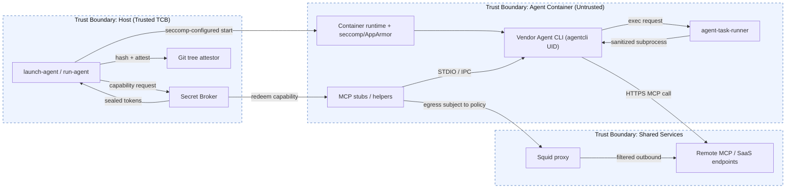
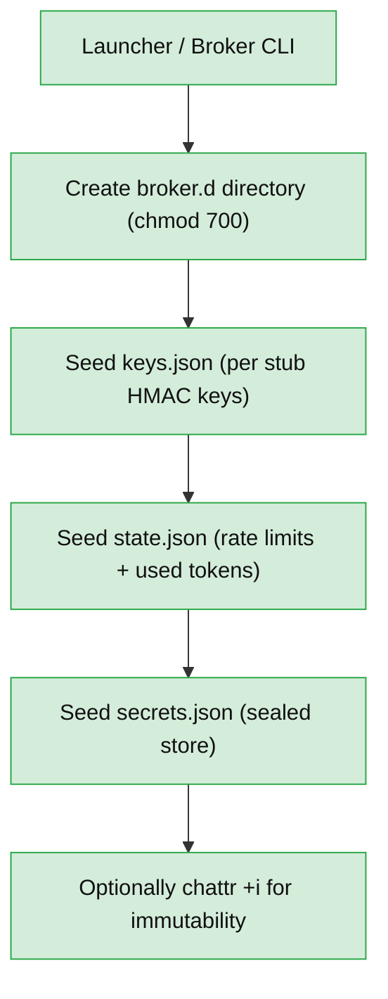
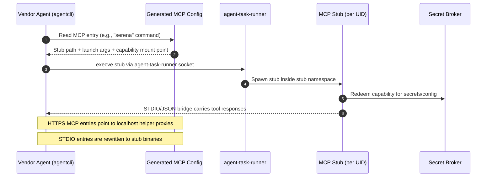
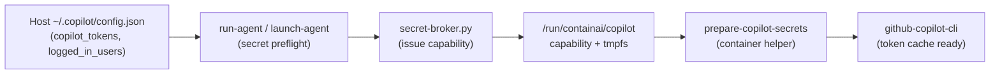
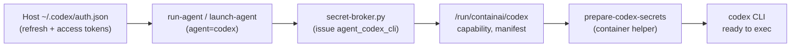
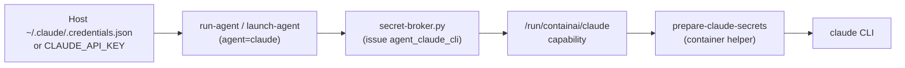
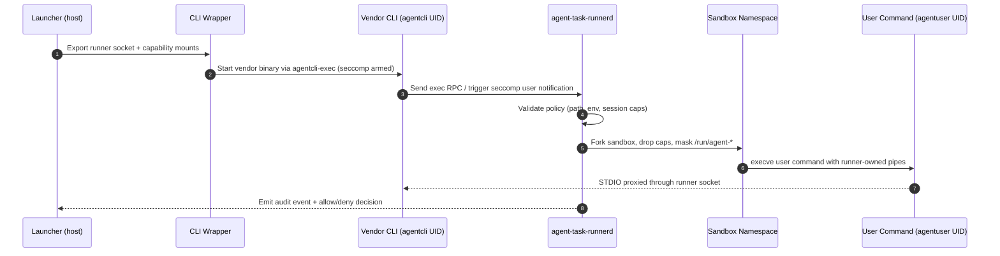
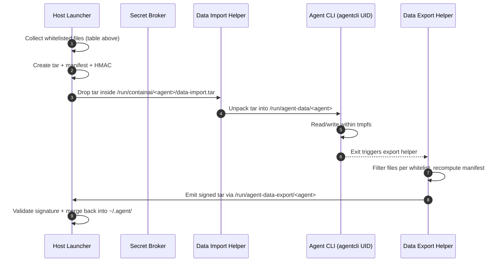

# Secret Credential Isolation Architecture

This document explains how ContainAI restricts access to long-lived credentials (Copilot/Codex/Context7, MCP bearer tokens, GitHub PATs, etc.) while still allowing immutable MCP binaries to run unmodified. It is written from the perspective of the trusted launcher (`host/launchers/*`) and the host-resident secret broker they coordinate with.

## Objectives

1. **Enforce trust boundaries** – Only launcher-managed stubs may ever ask for MCP or agent credentials.
2. **Prevent accidental disclosure** – Secrets never hit command lines, disk, or shared sidecars; they live in per-process tmpfs or `memfd` regions.
3. **Contain compromise** – An agent process can only exfiltrate the credentials it legitimately owns for that session. Capabilities, tmpfs mounts, and broker policy keep the blast radius per agent/MCP.
4. **Provide audit + revocation** – Every credential issuance is linked to a session ID, hash measurement, and PID namespace so kill switches can revoke fast and operators can reconstruct events.

## Components and Trust Boundaries

| Component | Trust Level | Responsibility |
| --- | --- | --- |
| `launch-agent` / `run-agent` (host) | **Trusted (TCB)** | Builds containers, hashes stubs, requests broker capabilities, wires tmpfs mounts.
| Secret Broker (host daemon) | **Trusted (TCB)** | Stores master secrets, validates capabilities, streams secrets via one-time handles.
| Git tree attestation (`host/launchers/**`, stubs) | **Trusted Data** | Launcher verifies these paths are clean vs. `HEAD` (and records the tree hash) before secrets are issued.
| Agent container runtime | **Untrusted** | Runs untrusted code but with seccomp/AppArmor, read-only roots, and dedicated tmpfs for sensitive material.
| MCP Stub Wrappers | **Trusted Binaries** | Immutable helpers inside the container responsible for redeeming capabilities and launching MCPs.
| Squid proxy | **Trusted Bridge** | Provides egress filtering/logging only; never stores credentials.

### Trust Boundary Overview

The diagram below mirrors the Microsoft Threat Modeling Tool convention by explicitly drawing the trust boundaries around the host launcher, the untrusted container, and shared network services.



## Automatic Initialization & Health Guarantees

Any launcher command that issues, stores, redeems, or health-checks secrets triggers `_ensure_broker_files`, which performs the following idempotent operations:



- Existing files are preserved; missing stubs silently gain keys so new MCP helpers can be added via config alone.
- `secret-broker.py health` and launcher audit hooks rely on the same helper to confirm the files exist before continuing, ensuring drift or accidental deletion is caught immediately.
- Because initialization happens lazily, CI and developers never have to remember a bootstrap command—running any launcher is enough.

## Launch-Time Capability Provisioning

```mermaid
sequenceDiagram
    autonumber
    participant Host as "Host launch-agent"
    participant Git as "Git (HEAD state)"
    participant Broker
    participant Container as "Agent Container"

    Host->>Git: "Verify launchers/stubs are clean vs HEAD"
    Host->>Git: "Record tree hash for audit log"
    Host->>Host: "Hash bundled agent + MCP stub binaries"
    Host->>Broker: "Request capability tokens (session + stub IDs)"
    Broker-->>Host: "Scoped, single-use capability blobs"
    Host->>Container: "Start container (seccomp/AppArmor, readonly root)"
    Host->>Container: "Bind per-stub tmpfs mounts + drop capability blobs"
    Note over Container: No untrusted code has run yet&#59; only launcher and stubs exist
```



This sequence only runs after the host and container runtimes pass the security preflight described in `docs/architecture.md`. If seccomp/AppArmor cannot be guaranteed, the broker never receives a capability request, preventing secrets from leaving the host.

Key points:

- Capability tokens encode session ID, target stub hash, cgroup/pid namespace, and expiry.
- Tokens are stored in broker-managed tmpfs directories with `chmod`/`chown` locking them to the stub user; general agent workloads cannot read them.
- If any launcher or stub file is dirty relative to `HEAD` (or its tree hash shifts unexpectedly), `launch-agent` refuses to start the container until the git state is restored.
- Agent containers set `kernel.yama.ptrace_scope=3` (via privileged helper) and rely on `seccomp`/AppArmor profiles that block `ptrace`, `process_vm_*`, and `/proc/<pid>/mem` access against stub UIDs, preventing credential snooping even from processes in the same namespace.

## Host-Synthesized Session Configs

`config.toml` remains user-editable, but the launcher renders a session-specific view before any containerized code starts:

1. Read `config.toml` plus CLI overrides on the host.
2. Merge runtime facts (session ID, network mode, tmpfs mount points, capability token paths).
3. Write the merged config into the agent tmpfs (`nosuid,nodev,noexec,0700`) and record its SHA256 in the audit log (`session-config` event) for traceability.
4. Pass the config path to the agent entrypoint. Because it is generated anew each launch, changes to `config.toml` are picked up automatically without relaxing integrity checks on trusted scripts.

## Mutual Authentication & Session-Derived Secrets

- During installation (or first run), the broker creates random per-stub shared keys under `~/.config/containai/broker.d/secrets.json` and never places them in git or containers.
- When a stub redeems a capability, it signs the request with `HMAC(shared_key, nonce || capability_id)`; the broker validates before streaming any secret.
- Static upstream secrets (e.g., Context7) are envelope-encrypted per session: `session_key = HMAC(master_secret, session_id || timestamp)`. The broker transmits `Enc(session_key, api_secret)` plus the nonce so that leaking a tmpfs only reveals ciphertext tied to that session.
- All tmpfs mounts that hold configs, shared keys, or decrypted secrets are mounted as private, `nosuid,nodev,noexec`, and use dedicated UIDs so other processes—even within the same container—cannot traverse them.
- SSE/HTTPS helper processes run under unique UIDs with dedicated seccomp/AppArmor profiles that only permit loopback IPC plus outbound HTTPS to the intended MCP endpoint; they cannot access host files beyond their tmpfs.

## Additional Hardening Controls

- **Syscall + namespace isolation** – Every stub and helper runs inside its own PID namespace with `ptrace` fully disabled and `procfs` mount options `hidepid=2,gid=agentproc` so agent workloads cannot inspect other processes.
- **Broker sandboxing** – The broker executes as a `systemd --user` service with `ProtectSystem=strict`, `ProtectHome=read-only`, `NoNewPrivileges=yes`, `PrivateTmp=yes`, and a custom seccomp filter limited to file/socket syscalls. Per-stub mutual-auth keys reside in `~/.config/containai/broker.d/` with `chmod 600` and `chattr +i` so only the host user can edit them.
- **Rate limiting & watchdog** – The broker enforces per-session capability quotas and exponential backoff on repeated failures; a host-side watchdog halts new launches if the broker exits, loses its seccomp/AppArmor profiles, or detects tampering with the shared-key store.
- **Immutable audit trail** – Issuance events (including generated config SHA256, git tree hash, capability IDs) are logged to `journald` with persistent storage and mirrored to an append-only file. Optional off-host shipping (scp/HTTPS) provides tamper-evident history.
- **Dev overrides** – If developers need to run with modified launchers/stubs, they create a host-only override token (e.g., `~/.config/containai/overrides/allow-dirty`). Launcher requires the token and logs its use so deviations are explicit.

### Helper Sandbox Policies

- **Network policy:** Helper runners default to `--network none`, exposing only loopback IPC. Override with `CONTAINAI_HELPER_NETWORK_POLICY=host|bridge|<docker-network>` if a specific helper truly requires egress.
- **Tmpfs isolation:** `/tmp` and `/var/tmp` inside helper containers are tmpfs mounts (`nosuid,nodev,noexec`) sized 64MB/32MB to prevent secrets from ever touching disk.
- **Resource clamps:** `CONTAINAI_HELPER_PIDS_LIMIT` (default `64`) and `CONTAINAI_HELPER_MEMORY` (default `512m`) bound helper processes so compromised helpers cannot starve the host.
- **Seccomp/AppArmor parity:** `resolve_seccomp_profile_path` injects the same ptrace-denying profile used by the main agent, and AppArmor (when available) assigns helpers to the `containai` profile to block filesystem escapes.

### Audit Trail & Override Workflow

- **Log location:** Unless overridden via `CONTAINAI_AUDIT_LOG`, launchers append newline-delimited JSON to `~/.config/containai/security-events.log` and mirror each event to `systemd-cat -t containai-launcher`.
- **Event taxonomy:**
    - `session-config` – session ID, manifest SHA256, git `HEAD`, trusted tree hashes
    - `capabilities-issued` – session ID, requested stubs, capability IDs emitted by the broker
    - `override-used` – repo path, label, and list of trusted files that were dirty when the override token was honored
- **Operational use:** Tail the file during development (`tail -f ~/.config/containai/security-events.log`) to capture manifest hashes for change-management tickets, or feed it into your SIEM/log shipper.
- **Override tokens:** A launch only succeeds on dirty trusted files if `~/.config/containai/overrides/allow-dirty` (configurable via `CONTAINAI_DIRTY_OVERRIDE_TOKEN`) exists. Deleting the token immediately restores strict enforcement, and every use is auditable via the log above.

### `audit-agent`: On-Demand Session Inventory

To help operators and developers validate a running session, we introduce `host/launchers/audit-agent` (with matching PowerShell). The command produces a signed JSON report describing the configuration, files, mounts, UIDs, and capability handles associated with an agent container without requiring any manual `docker exec` inspection.

#### Invocation

```
audit-agent --session <session-id> [--output /path/report.tar.gz] [--format json|table] [--include-secrets]
```

- `--session` (required) identifies the running container. Shortcuts like `--latest` read `~/.config/containai/session-manifests/last.json`.
- `--output` (optional) writes the resulting tarball to a custom location; default is `~/.config/containai/audit/<session>-audit.tar.gz`.
- `--format table` controls the textual summary printed to `stdout`, but the authoritative artifact is always the tarball.
- `--include-secrets` inlines decrypted values (Base64) instead of redacting them with `*****`. Use only when absolutely necessary; the flag is logged as an `audit-agent` event so reviewers know secrets were exported.

#### Data Sources and Collection Steps

1. **Host config provenance** – hash `config.toml`, `agent-configs/<agent>`, CLI overrides, and the rendered session manifest already stored under `~/.config/containai/session-manifests/<session>.json`. Copy each file into the tarball under `host-config/`.
2. **Generated in-container artifacts** – `docker cp` (read-only) the files we synthesized: `/run/agent-data/<agent>/manifest.json`, `/run/agent-secrets/<agent>/manifest.json`, `/run/containai/<agent>/session-config.toml`, etc. Place them inside `generated-artifacts/` and include `sha256` entries in `manifest.json`.
3. **Capability handles** – call `secret-broker.py dump --session <session>` to list each capability: stub name, capability path, expiry, owning UID/GID, and current redemption count. Write the metadata to `capabilities/index.json` and copy the raw capability files (symbolic links only) into `capabilities/files/`, redacting contents unless `--include-secrets` is supplied.
4. **User and namespace inventory** – query the container (`docker exec <cid> getent passwd agentuser agentcli mcp_*`) plus `ps --no-headers -eo user,pid,cmd` filtered to the session cgroup. Record PID namespaces, `Uid:` lines from `/proc/<pid>/status`, and seccomp/AppArmor labels gathered from `/proc/<pid>/attr/current`.
5. **Mount table** – parse `/proc/<pid>/mountinfo` for the init process to list every tmpfs we created (agent data, secrets, broker bundles) along with mount options and owning UID.
6. **Network + proxy bindings** – capture the Squid ACL in use, helper container network settings (from `docker inspect`), and any loopback sockets exposed by MCP stubs, saving details to `network/info.json`.

After collecting data, `audit-agent` assembles a directory tree:

```
audit-agent-<session>/
    manifest.json
    host-config/
    generated-artifacts/
    capabilities/
        index.json
        files/<capability blobs or placeholders>
    container/
        users.json
        mounts.json
        processes.json
    network/info.json
```

The tree is tarred + gzipped and signed; `manifest.json` references every file with its `sha256`, `owner`, `source`, and whether the payload is redacted.

#### Redaction Model

By default every sensitive field (`apiKey`, `copilot_tokens`, `capabilityBlob`, etc.) is replaced with `"value": "*****"` while retaining metadata (`length`, `createdAt`, `source`). Passing `--include-secrets` populates `"value"` with the real data encoded as Base64 and adds `"plaintextBytes"` for sanity checks. Because the host/CLI user already owns the secrets, we do not enforce extra access control, but the audit log records:

```
{"event":"audit-agent","session":"abcd...","includeSecrets":true,"timestamp":"..."}
```

This balance lets day-to-day troubleshooting rely on redacted manifests while still providing a break-glass path for deep debugging.

#### Output Guarantees

- **Signed reports:** `audit-agent` signs the final JSON with the same per-user keyring used for session manifests, enabling offline verification.
- **No mutation:** The command runs entirely read-only—tmpfs mounts are copied, not modified, and no new capabilities are issued.
- **Composable:** Reports can be attached to support tickets or CI artifacts; ingestion scripts can assert that every stub, mount, and capability referenced in the report matches expectations.

Together with the runtime audit log, `audit-agent` gives operators a trustworthy, reproducible view of what is running inside each agent container.

## Secret Redemption and MCP Launch Flow

```mermaid
flowchart TD
    subgraph Command_MCP[Command MCP]
        AC[Vendor agent] -->|execve intercepted| RC[agent-task-runner]
        RC -->|capability request| BR[Secret Broker]
        BR -->|memfd secret| ST[Per-MCP stub (UID mcp_X)]
        ST -->|STDIO bridge| AC
        ST -->|sandboxed network| NET1[Allowed domains]
    end
    subgraph HTTPS_or_SSE_MCP[HTTPS/SSE MCP]
        AV[Vendor agent (agentcli namespace)] -->|read config secret| CFG[Generated MCP config]
        AV -->|HTTPS request with secret| NET2[Remote MCP endpoint]
        AV -.->|spawn helper?| RC2[agent-task-runner denies access to /run/agent-secrets]
    end
```

Key points:

- MCP entries come in two flavors:
    1. **Command-based** (e.g., Serena, Playwright). These follow the exec-intercept + stub flow shown above: the runner launches the stub under a dedicated UID, secrets live inside stub tmpfs, and STDIO/IPC is bridged back to the vendor agent.
    2. **HTTPS/SSE endpoints** (e.g., Context7, GitHub MCP, Microsoft Learn). The vendor agent connects to a localhost helper (Unix socket or 127.0.0.1) that we inject into the generated config; that helper redeems the capability and forwards traffic to the real remote endpoint over a constrained network policy.
- Even for HTTPS/SSE entries, exec interception matters because any helper the agent spawns while handling responses still goes through the runner and therefore cannot read `/run/agent-secrets` or the config directories. The only components that ever see decrypted HTTPS secrets are the localhost helper proxy and (optionally) the vendor agent process running inside the sealed `agentcli` namespace.
- Command-based MCPs retain stubs to provide per-server UIDs, tmpfs cleanup, network/seccomp policy enforcement, and broker-audited lifecycle management. HTTPS MCPs rely on the vendor agent’s namespace isolation to keep secrets away from untrusted subprocesses while still allowing the agent to embed tokens in outbound requests.

### Vendor Agent MCP Invocation

From the vendor agent’s perspective, MCP definitions in the generated config are already rewritten to reference the hardened stubs. STDIO-style entries never point directly at upstream binaries; instead the launcher replaces them with stub executables plus the exact launch args the stub expects. HTTPS entries keep their URLs and API keys because the vendor agent makes those calls itself.



Because the config already references stub binaries, no vendor code change is required: the agent still “launches what the config tells it,” but now that command resolves to `prepare-serena-stub` (for example) rather than the raw MCP binary. The launcher performs this translation while generating the session config:

1. Parse every MCP entry.
2. For `command` transports, replace `command` and `args` with the stub executable and required arguments (`--cap-path`, `--session-id`, etc.).
3. Record the stub hash in the manifest so any tampering invalidates the configuration.
4. Leave HTTPS/SSE transports untouched except for embedding the per-session API keys.

At runtime the vendor agent invokes the stub described in its config, the agent-task-runner intercepts the exec, and the stub handles capability redemption + sandboxing. This ensures the vendor agent remains the orchestrator while the enforcement logic stays in the trusted stub code.

### HTTPS/SSE Helper Proxies

When an MCP definition advertises an HTTPS or SSE transport, the launcher does **not** let the vendor agent call the internet directly with long-lived keys. Instead, config generation swaps the remote URL with a localhost helper endpoint (`https://127.0.0.1:<port>/mcp/<name>` or `unix:///run/mcp-sockets/<name>.sock`). That helper process:

1. Runs under a dedicated UID (`mcp_https_<name>`) inside the container or as a host-side helper with `--network none` except for egress to the approved domains.
2. Redeems the broker capability to obtain the real upstream API key and TLS settings, storing them only in its tmpfs.
3. Terminates the agent’s inbound HTTPS request, rewrites it as needed (headers, auth), and establishes the outbound TLS/SSE session to the remote MCP.
4. Streams responses back over the localhost connection so the vendor agent experiences a normal HTTPS MCP even though the secrets never leave the helper namespace.

Only in rare debug scenarios (gated by an override token) will the config embed the upstream URL directly. Otherwise, the helper proxy allows us to enforce DNS allow-lists, certificate pinning, rate limits, and auditing exactly as we do for command-based stubs while still honoring the MCP’s HTTPS protocol requirements.

### Why MCP Stubs Still Exist (Command Mode)

For command-based MCPs, the seccomp intercept removes the need for vendor binaries to spawn helper processes directly, but the stub layer continues to provide guarantees the vendor agent does not implement. Treat the vendor agent as “trusted for intent” and the stub as “trusted for containment”:

1. **Per-MCP identities and namespaces** – Each stub runs under a unique Unix user/AppArmor label (`mcp_context7`, `mcp_serena`, etc.) with its own mount + network namespace. If a server-side binary (often npm/pip modules) is compromised, it can only access the tmpfs and network rules assigned to that server, not the rest of the agent environment.
2. **Broker integration and revocation** – Stubs redeem sealed capabilities, log issuance, zeroize memfds, and revoke permissions when a session ends. Letting the vendor agent consume raw API keys for command-based servers would bypass those controls and force secrets to live indefinitely in its workspace.
3. **Transport mediation** – Many command MCPs actually chain to host helpers (e.g., SSE bridges) or require bespoke startup logic (`npx`, `uvx`, `python`). Stubs encapsulate that logic and expose only STDIO/JSON to the agent, keeping the transport surface auditable.
4. **Fine-grained outbound policy** – Stubs ship with server-specific seccomp filters, DNS allow-lists, TLS pinning, filesystem visibility, and rate-limiters. Rebuilding those rules inside each vendor binary would be brittle and difficult to audit.
5. **Lifecycle hygiene + auditing** – When a stub exits, it scrubs tmpfs, closes broker descriptors, emits audit events, and can revoke the capability. Without that cleanup, command MCPs would leak decrypted secrets and disappear from the security log.

HTTPS/SSE MCPs do not require a stub because the vendor agent itself makes the network call and already sits inside the restricted `agentcli` namespace. The intercept layer ensures only that process can read the generated config and send authenticated traffic; everything it spawns still goes through the task runner and therefore cannot reach the secrets.

## Handling Static Secrets (e.g., Context7)

Static API keys cannot be rotated on demand, so safeguards focus on limiting exposure:

1. **Selective capability issuance** – Only sessions configured to use Context7 receive tokens that can request that key. Other agents cannot even ask.
2. **Per-session tmpfs** – The key is streamed into a tmpfs exclusive to the requesting stub; lateral movement within the container cannot read it without compromising that stub.
3. **Session envelope encryption** – Broker sends `Enc(HMAC(master, session data), api_key)` so even if the tmpfs is copied, the ciphertext cannot unlock future sessions without the master kept on the host.
4. **Audit + rotation** – Broker logs include session ID + timestamp; if compromise is suspected, operators rotate the upstream Context7 key once and rely on the broker to re-distribute it to trusted sessions.

## GitHub PATs

1. Host `launch-agent` calls `gh auth token --scopes repo:read` (or fine-grained PAT CLI) scoped to the active repository and public repos.
2. The resulting PAT is stored only in broker encrypted memory.
3. MCP stubs redeem capability tokens for the PAT just like any other secret.
4. Tokens expire within an hour; launchers refresh on demand. Revoking on the host (via `gh auth logout` or deleting the PAT) immediately invalidates future broker requests.

## Revocation and Monitoring

- **Kill switch** (`containai kill <session>`): Signals the broker to revoke all capabilities for that session, wipe tmpfs mounts, and stop the container.
- **Telemetry**: Broker emits structured logs for issuance, redemption, and policy failures; Squid provides complementary outbound request logs for correlation.
- **Anomaly detection**: Excess secret requests, mismatched PID namespaces, or attempts to use expired tokens trigger automatic revocation and optional container teardown.

## IO Models vs. User Isolation

Agents interact with MCPs through multiple transports (STDIO, SSE, HTTPS) while each MCP stub runs under its own Unix user. The launcher wires these pieces together as follows:

1. **STDIO MCPs (in-container)**
    - Each MCP stub is executed under a dedicated UID (for example `mcp_context7`).
    - The stub forks the immutable MCP binary and keeps its stdin/stdout pipes connected to the requesting agent process (`agentuser`). Linux permissions allow this because the pipes are created before dropping privileges; only the stub-owned tmpfs with secrets/config is protected via ownership + `chmod 600`.
    - Result: untrusted agent code can still speak STDIO, but it cannot read the MCP’s credential storage area.

2. **SSE or HTTPS MCPs (host helpers)**
    - `launch-agent` spawns host-side helpers under per-MCP system users (or `systemd --user` slices). Helpers redeem their capability tokens, keep secrets in their private tmpfs, and expose only an authenticated Unix socket or localhost HTTPS endpoint to the agent container.
    - The container connects over that socket/TLS channel (optionally through the Squid proxy for auditing). Since only the helper’s UID can access the tmpfs and capability, secrets never enter the agent namespace.

3. **Mixed mode / chained MCPs**
    - Some agents launch additional MCPs from within the first MCP (e.g., tool runners). Each requested MCP still has its own UID + capability; the first stub merely acts as a broker client and never gains direct read access to the secondary MCP secrets.

In every transport, the data path (pipes, sockets, HTTP) remains compatible with the MCP’s expectations, while the credential path is locked to the stub’s UID via tmpfs ownership and broker-issued capabilities.

## Agent CLI Secret Flows

The previous sections focus on MCP secrets. Individual agents (Copilot, Codex, Claude) also rely on long-lived CLI auth files that must originate on the host. Today the launchers only mount optional config directories, so the agent-specific secrets never actually cross the trust boundary. The diagrams and work items below define how to make those flows real.

### GitHub Copilot CLI (`~/.copilot/config.json`)



**Current gap**
- Launchers only mount `~/.config/github-copilot` / `~/.config/gh`; the actual Copilot CLI state lives under `~/.copilot/config.json`, so tokens never enter the container.
- `init-copilot-config.sh` tries to copy from `$HOME/.copilot`, but that directory points to the container home volume, not the host mount.

**Implementation plan**
1. Extend `run-agent` / `launch-agent` (bash & PowerShell) to detect `${HOME}/.copilot/config.json` on the host, hash it, and request a capability from `secret-broker.py` (new stub `agent_copilot_cli`). Store the sealed blob plus manifest metadata under `/run/containai/copilot/<session>.cap` (tmpfs, `0700`).
2. Add a bind mount for the capability directory and a tmpfs destination (e.g., `/run/agent-secrets/copilot`) in the Docker arguments so only the helper UID can read it. Stop mounting the entire host `~/.copilot` tree once the broker path is live.
3. Replace `init-copilot-config.sh` with a helper (`prepare-copilot-secrets.sh`) that redeems the capability, extracts `copilot_tokens`, `last_logged_in_user`, and `logged_in_users`, writes them into `/home/agentuser/.copilot/config.json` (`chmod 600`), and invokes the existing `merge-copilot-tokens.py` for backward compatibility.
4. Teach the helper to fall back to broker-provided GitHub CLI tokens if Copilot config is missing, while logging an audit event so operators know which identity was used.
5. Add unit/integration tests (`scripts/test/test-launchers.{sh,ps1}`) that create a fake `~/.copilot/config.json`, run the launcher with `--with-host-secrets`, and assert the container manifest contains a Copilot capability mount. Tests should also verify that the helper refuses to run unless the capability hash matches the broker response.

### OpenAI Codex CLI (`~/.codex/auth.json`)



**Current gap**
- Launchers only mount `~/.config/codex`, but Codex CLI stores OAuth tokens under `~/.codex/auth.json`. No code copies those tokens into the container, so `codex exec` always prompts for auth.
- Secret broker is never invoked for Codex, so there is no audit trail for when host tokens would be consumed.

**Implementation plan**
1. Define a Codex credential descriptor (JSON pointer to `refresh_token`, `access_token`, `expires_at`) and teach `run-agent` / `launch-agent` to read `~/.codex/auth.json` and call `secret-broker.py issue --stub agent_codex_cli --path ~/.codex/auth.json --json-schema codex_auth`.
2. Mount the resulting capability (e.g., `/run/containai/codex/<session>.cap`) plus an empty tmpfs destination (`/run/agent-secrets/codex`) into the container with dedicated ownership.
3. Add a container helper (`prepare-codex-secrets.sh`), invoked from the entrypoint before the CLI launches, that redeems the capability, reconstructs `auth.json`, writes it to `/home/agentuser/.codex/auth.json`, and sets `chmod 600`. The helper should also populate `/home/agentuser/.config/codex/` with any non-secret defaults.
4. Modify `docker/agents/codex/Dockerfile` CMD to run the helper + validation script before `codex`. Remove the expectation that users must bind-mount their entire host config tree.
5. Extend launcher tests to assert that Codex sessions fail fast (with actionable messages) when `~/.codex/auth.json` is absent or when the broker rejects the capability, ensuring we never launch Codex without secrets wired correctly.

**Implementation status (Nov 2025)**
- `run-agent` / `launch-agent` (bash + PowerShell) now hash-check `~/.codex/auth.json`, request `agent_codex_cli` capabilities from the broker, and copy the sealed bundle plus manifest into `/run/containai/codex/cli/capabilities` before the container starts.
- `docker/agents/codex/prepare-codex-secrets.sh` redeems `codex_cli_auth_json` via `capability-unseal` and writes `/home/agentuser/.codex/auth.json` (chmod 600) entirely from tmpfs; CMD now executes the helper prior to `codex` so launches fail closed if secrets are missing.
- Launcher unit tests `test_codex_cli_helper` (bash) and `Test-CodexCliHelper` (PowerShell) simulate capability issuance, invoke the helper with overridden paths, and verify that the decrypted payload matches the stored fixture—guarding against regressions without needing to boot a container.

### Anthropic Claude CLI (`~/.claude/.credentials.json`)



**Current gap**
- The legacy `init-claude-config.sh` expected `$HOME/.claude/.credentials.json`, yet launchers never mounted the host `~/.claude` directory—so launches historically proceeded without credentials even though `validate-claude-auth.sh` warned. The new helper removes that behavior, but we retain the documentation for historical context.
- There was no consistent way to feed raw `CLAUDE_API_KEY` env vars through the broker when developers preferred not to store JSON files on disk; the capability + helper pipeline now normalizes that path.

**Implementation plan**
1. Expand launcher preflights to look for either `~/.claude/.credentials.json` or `CLAUDE_API_KEY` on the host. Whichever is present gets sealed through the broker via the `agent_claude_cli` stub; if both exist, prefer the JSON file but note the choice in the audit log.
2. Deliver the capability to `/run/containai/claude/<session>.cap` and mount a tmpfs target (`/run/agent-secrets/claude`) into the container under a helper-specific UID.
3. Replace `init-claude-config.sh` with `prepare-claude-secrets.sh` that redeems the capability, writes `.credentials.json` (or synthesizes it from `CLAUDE_API_KEY`), and ensures `/home/agentuser/.claude` never leaves tmpfs. Validation should now fail closed if the capability is missing or unreadable.
4. Update the Claude Dockerfile entrypoint to run `prepare-claude-secrets.sh && validate-claude-auth.sh && claude`, ensuring credentials always exist before the CLI boots.
5. Add launcher tests that simulate both file-based and env-based Claude secrets, verifying that only the selected form appears inside the container tmpfs and that audit logs record the fallback path.

**Implementation status (Nov 2025)**
- Host launchers now treat `agent_claude_cli` the same as Copilot/Codex: they hash whichever credential source is present (favoring `~/.claude/.credentials.json`), request a broker capability, and sync both the sealed bundle and manifest into `/run/containai/claude/cli/capabilities` ahead of container start so the helper can operate entirely from tmpfs.
- The Claude image bundles `prepare-claude-secrets.sh`, which redeems `claude_cli_credentials`, copies default `.claude.json` settings, and emits a chmod 600 `.claude/.credentials.json` derived from either the full JSON payload or a bare `CLAUDE_API_KEY`; `validate-claude-auth.sh` now errors out if that file is missing, preventing the CLI from launching without secrets.
- New regression tests (`test_claude_cli_helper` in bash and `Test-ClaudeCliHelper` in PowerShell) exercise the helper with both JSON and inline fixtures by overriding `CONTAINAI_AGENT_HOME`, `CONTAINAI_AGENT_CAP_ROOT`, and `CONTAINAI_CAPABILITY_UNSEAL`, ensuring capability redemption + file synthesis stays in lockstep across shells.

Across all three agents, the broker-issued capability flow keeps long-lived host secrets resident on the host while still letting the containerized CLI authenticate. The steps above bring the implementation in line with the documented security model and give operators traceability for every time an agent consumes a host identity.

### Host Agent Data Synchronization & Isolation

Authenticating the CLI is only half of the story; each agent also relies on non-secret working data that should persist across sessions (logs, conversation history, cached sessions) and needs stronger isolation than a blanket `-v ~/.agent:/home/agentuser/.agent`. We will treat secrets and durable data separately:

| Agent | Host root | Files to import at launch | Files to export on shutdown | Merge rule |
| --- | --- | --- | --- | --- |
| Copilot | `~/.copilot/` | `config.json` (read-only tokens), `sessions/*.json`, `logs/*.log`, `telemetry/*.jsonl` | Same globs plus any new session folders | Append by session directory name; for logs without IDs, append while truncating older than 14 days |
| Codex | `~/.codex/` | `auth.json` (via broker), `sessions/*.json`, `logs/**/*.log`, `history.jsonl` | Same plus generated `history.jsonl` | Session folders copied wholesale; `history.jsonl` merged by timestamp + dedupe on SHA256 |
| Claude | `~/.claude/` + `~/.claude.json` | `.credentials.json` (via broker), root-level `.claude.json`, `logs/**/*.log`, `sessions/*`, `attachments/*` | Same globs plus updated `.claude.json` | Preserve per-session directories; attachments copied only for `session-*` prefixes to avoid arbitrary host writes |

Design principles:

1. **Immutable import envelope** – Host launcher packs allowed files into a tarball, records SHA256 per entry, and places it in `/run/containai/<agent>/data-import.tar` (tmpfs, `chmod 600`).
2. **Dedicated data tmpfs** – Containers mount `/run/agent-data/<agent>` as tmpfs owned by a new UID `agentcli` with `chmod 700`. The helper unpacks the import tar here before launching the CLI.
3. **Export tokens** – On shutdown, the helper re-packages only whitelisted paths into `/run/agent-data-export/<agent>/<session>.tar`, signs the manifest (HMAC with broker-issued per-agent key), and notifies the host via a shutdown hook (existing auto-push path).
4. **Host merge worker** – After the container exits, the launcher copies the export tar back to the host, validates the signature + file hashes, and merges into the real `~/.agent/` tree:
   - Session-scoped directories (`session-*`, `run-*`) replace any existing directory with the same name.
   - Log/history files without session IDs are merged line-wise with `tsv-append` semantics while dropping duplicates.
5. **No passthrough mounts** – We deliberately avoid bind-mounting the entire host directory so untrusted code cannot tamper with host state or glean unrelated files.

#### Preventing Unauthorized Access Inside the Container

- **Split identities:** The interactive shell continues to run as `agentuser`, but the CLI binary starts under `agentcli` using `setpriv --reuid agentcli --regid agentcli --init-groups --no-new-privs`. Only `agentcli` owns `/run/agent-data/<agent>` and `/run/agent-secrets/<agent>`.
- **Seccomp/AppArmor overlays:** Extend the existing profiles with path rules that confine `agentcli` to `/run/agent-*` plus `/home/agentuser/.config/<agent>` and prevent `agentuser` (and child processes it spawns) from traversing those directories. Linux `chmod 700` already blocks sibling UIDs; the profiles add enforcement even if privilege escalation is attempted.
- **PID namespace guard:** Launch the CLI inside its own PID namespace (`unshare --pid --fork --mount-proc`) so tools started by developers (or malicious scripts) cannot `ptrace` or inspect `/proc/<pid>` to locate the data tmpfs.
- **Runner bootstrap + mount masking:** `entrypoint.sh` now spawns `agent-task-runnerd` before it drops privileges to `agentuser`, so the daemon keeps the capabilities required for `unshare`/mount operations. Each sandbox invocation immediately replaces `/run/agent-secrets`, `/run/agent-data`, and `/run/agent-data-export` with sealed tmpfs mounts (`mode 000`) and sets `PR_SET_NO_NEW_PRIVS`, preventing child processes from remounting or inheriting the sensitive tmpfs even if they discover the original paths.
- **Helper-mediated IPC only:** Child processes spawned by the CLI inherit the `agentcli` UID, so they can still operate. Any other background tasks (running as `agentuser`) must go through the helper’s Unix socket if they need read-only access (e.g., to tail logs).

**Why the CLI still runs as `agentcli`:** We treat the CLI front-end as a control plane that may read/write its private cache, but we no longer allow it (or its descendants) to execute arbitrary repo commands inside that namespace. The wrapper script performs these steps atomically:

1. `prepare-<agent>-secrets.sh` runs as root, wires tmpfs, and marks the mount tree `MS_PRIVATE|MS_UNBINDABLE` so it cannot be propagated to child namespaces.
2. It executes `unshare --mount --pid --fork --mount-proc -- setpriv --reuid agentcli --regid agentcli --init-groups --no-new-privs --reset-env /usr/local/bin/<agent>-cli-wrapper`.
3. The wrapper starts the CLI and replaces its traditional "spawn shell" logic with RPC calls to `/run/agent-task-runner.sock` (see below). The CLI process never `exec`s user commands directly, so it has no children that inherit the secret/data mounts.
4. The AppArmor profile for `agentcli` grants access only to `/run/agent-*/<agent>` and the CLI binary. Even if untrusted repo code tricks the CLI into running `!bash`, the connection is proxied, not executed locally, so the sandbox remains sealed.

#### Task Execution Without Data Access

Every time an agent CLI needs to run user-supplied code (e.g., `github-copilot-cli exec`, `codex exec`, `claude -p`), it now speaks to a dedicated `agent-task-runner` helper via a Unix domain socket:

1. CLI sends `{command, env, cwd}` JSON to the runner whenever it would have spawned a process—whether that's due to a `run/exec` subcommand invoked by a human or an automated tool invocation generated by the agent itself.
2. Runner validates the request, spawns a process as `agentuser` inside a fresh pid+mount namespace that **does not** include `/run/agent-data/<agent>` or `/run/agent-secrets/<agent>`.
3. Runner bind-mounts only `/workspace`, `/home/agentuser`, `/tmp`, and the network policy tmpfs required for the command. Because the sensitive mounts were marked unbindable/private in step 1, they cannot be re-shared into this namespace.
4. Runner applies `no_new_privs`, seccomp profile, and an AppArmor label (`containai-task`) that explicitly denies access to `/run/agent-*` even if the process later attempts to mount or open those paths via `/proc/self/fd` tricks.
5. STDIN/STDOUT/STDERR of the spawned process are proxied back to the CLI over the socket, giving the CLI the illusion that it executed the command locally.

With this split, arbitrary subprocesses launched during a prompt run are **never** executed within the `agentcli` namespace, so they cannot observe or exfiltrate the agent data mount. Even if a prompt asks the agent to run `cat /run/agent-data/copilot/config.json`, the request goes through the runner and gets denied by both the mount topology (path not present) and AppArmor policy.

##### Exec Interception Flow (visual)

The following sequence shows how launcher-provided wrappers, the runner socket, and the sandbox namespace cooperate to keep every exec behind the policy gate.



Only the runner ever touches the secret/data tmpfs mounts, so even successful user commands inherit a namespace that simply lacks those paths.

If an operator truly needs shell access with the same visibility as the CLI (for debugging the cache), we expose a gated `containai with-agentcli <cmd>` helper that requires an override token plus MFA challenge before mapping the caller into the control-plane namespace. This keeps day-to-day workloads locked down while preserving a break-glass path.

##### How Existing CLIs Learn About the Runner

When we talk about an “agent” in this document we mean the upstream binaries provided by GitHub (Copilot CLI), OpenAI (Codex), and Anthropic (Claude). Those binaries remain untouched; we interpose using two layers:

1. **Binary shim (best effort path detection).** During image build we rename the real binary (e.g., `/usr/bin/github-copilot-cli` → `.real`) and install a wrapper that exports `AGENT_TASK_RUNNER_SOCKET` and reroutes any *explicit* subcommands (like `copilot exec`) through the socket. This covers the common cases we control.
2. **Seccomp exec interception (enforced logging + policy).** Regardless of what the vendor binary tries to run, we apply a seccomp filter to the `agentcli` namespace that places `execve` and `execveat` behind a user-notification handler:
    - When the CLI (or any library it loads) issues an `execve`, the kernel pauses the call and notifies the in-container `agent-task-runnerd` via the seccomp user-notification FD. `agentcli-exec` automatically registers the FD and tags the connection with the current agent name/binary.
    - Both `agentcli-exec` and `agent-task-runnerd` are compiled from the Rust crate in `docker/runtime/agent-task-runner`, satisfying the "safe language" requirement and replacing the legacy C helpers.
    - The daemon reconstructs the syscall target (path, argv pointer) straight from the paused task’s memory, writes a JSON log line to `/run/agent-task-runner/events.log`, and evaluates the request against the policy selected via `CONTAINAI_RUNNER_POLICY` (`observe` by default, `enforce` to block access to paths under `/run/agent-secrets` or `/run/agent-data`). Allowed commands resume transparently via `SECCOMP_USER_NOTIF_FLAG_CONTINUE`; denied commands return `EPERM`, preventing helpers from reaching the sensitive tmpfs even if wrappers were bypassed.
    - Because every exec is observed, we gain deterministic auditability today and can tighten policy in future phases without modifying vendor binaries. When the explicit runner socket integration lands, the same daemon will reuse these logs as ground truth before proxying STDIO.

If the vendor adds new execution pathways that bypass our wrapper, the seccomp layer still intercepts them. This guarantees that every process launch—whether initiated manually or automatically by the agent’s own reasoning loop—is at least audited (and optionally denied) before it can observe `/run/agent-data/<agent>`.

If the CLI needs to share artifacts with the general workspace (for example, download files for the repo), it should explicitly copy them into `/workspace` or `/home/agentuser`—the data tmpfs is not shared automatically.

#### Bi-Directional Sync Workflow



This approach lets us persist the useful artifacts (logs, history, saved sessions) while preventing arbitrary file writes back onto the host. It also guarantees that the same data the CLI expects is present every time without reopening the attack surface that came with raw bind mounts.

**Implementation status (Nov 2025)**
- Both launcher stacks now package host data via `host/utils/package-agent-data.py`, placing `data-import.tar` + manifest pairs beneath `/run/containai/<agent>/data` for every agent that has matching inputs.
- The container entrypoint provisions `/run/agent-data` as a tmpfs (size tuned via `CONTAINAI_DATA_TMPFS_SIZE`) and unpacks any staged tarballs into `/run/agent-data/<agent>` prior to starting the vendor CLI, keeping caches in tmpfs-only storage owned by the agent user.
- Vendor CLIs are rewritten to wrappers that export `AGENT_TASK_RUNNER_SOCKET`/helper metadata and execute the preserved `.real` binary via the setuid helper `/usr/local/bin/agentcli-exec`, ensuring every session runs as `agentcli`.
- Launcher regression tests cover the packager helper to ensure manifests contain session metadata and that empty imports do not generate stale tarballs.
