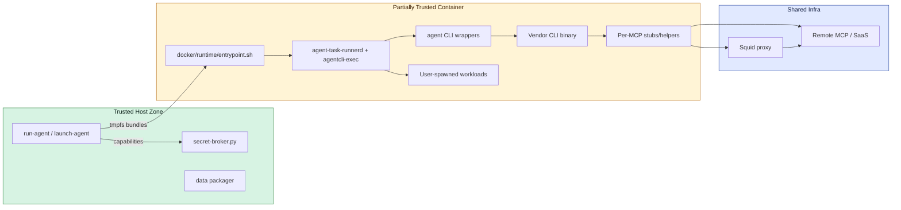
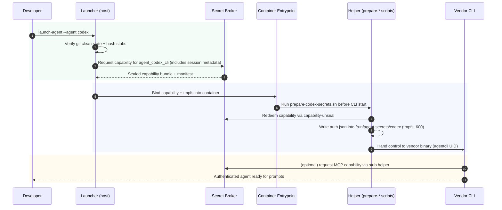
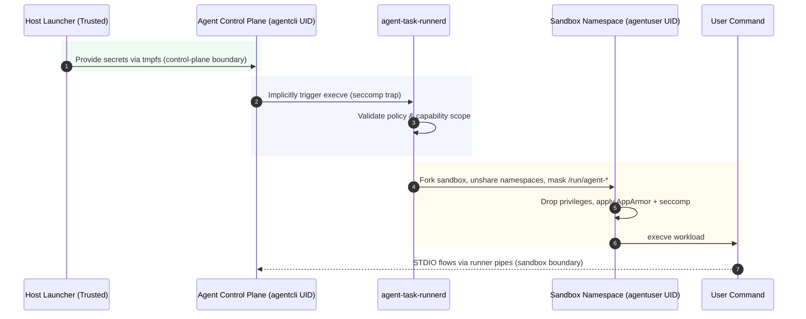
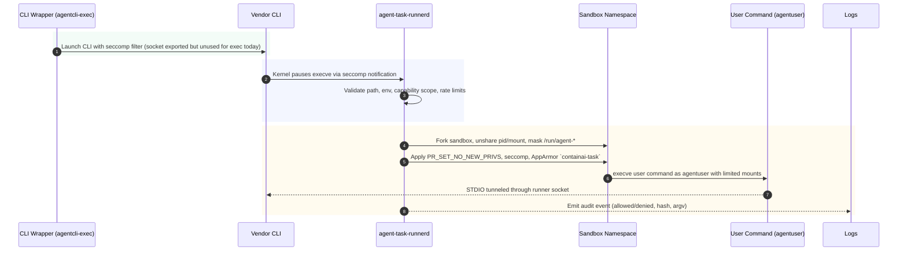
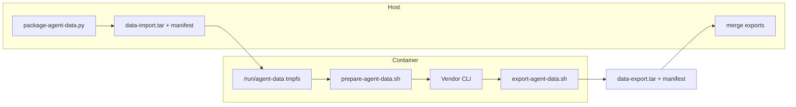

# Secret Credential Security Review

This document expands on `docs/secret-credential-architecture.md` for the purposes of a formal security review. It traces the full lifecycle of sensitive material, enumerates attacker models, maps each threat to compensating controls, and cites the concrete code paths that implement those controls.

## 1. Executive Summary & Scope

ContainAI executes immutable vendor-provided CLI binaries (Copilot, Codex, Claude, MCP servers) inside per-session containers while exporting long-lived host credentials on demand. The security objective is to prevent those binaries—or any code they launch—from exfiltrating brokered secrets or escalating privileges, without modifying the vendor executables themselves. This review covers:

- Host-side launchers (`host/launchers/*.sh|ps1`), secret broker (`host/utils/secret-broker.py`), and packaging helpers.
- Container bootstrap (`docker/agents/**`, `docker/runtime/entrypoint.sh`) plus the Rust runner (`docker/runtime/agent-task-runner/**`).
- Credential redemption helpers (`prepare-*-secrets.sh`) and the new data import/export workers.
- Monitoring surfaces (audit log, agent-task-runner events, `audit-agent`).

Out of scope: upstream SaaS services, developer laptops beyond launcher preflight, and infrastructure hardening of Docker itself.

## 2. Threat Model & Assumptions

### 2.1 Assets Under Protection

| Asset | Description | Impact if Compromised |
| --- | --- | --- |
| MCP API keys (Context7, GitHub MCP, Microsoft Learn) | Long-lived tokens issued by the broker | Attacker gains persistent access to upstream MCP APIs |
| Agent CLI credentials (`~/.copilot/config.json`, `~/.codex/auth.json`, `~/.claude/.credentials.json`) | OAuth / API material needed for CLI auth | Can impersonate user, leak private repositories |
| Host session manifests & capability bundles | Files tying secrets to specific sessions | Replay attack could redeem secrets in rogue container |
| tmpfs contents under `/run/agent-secrets` & `/run/agent-data` | Decrypted secrets and cached agent state | Enables lateral movement between sessions |
| Audit trail (`security-events.log`, agent-task-runner events) | Evidence for incident response | Loss blocks detection and forensic reconstruction |

### 2.2 Adversaries

1. **Malicious vendor agent** – Copilot/Codex/Claude binaries altered upstream or coerced via supply chain.
2. **Prompt-level attacker** – User or remote model instructing the agent to run arbitrary commands in the workspace.
3. **Compromised MCP stub/helper** – Command MCP downloaded dependency containing malware.
4. **Host-local attacker** – Another process on the developer workstation attempting to read broker files.
5. **Network observer** – Intercepts traffic between helper proxies and remote MCP endpoints.

### 2.3 Trust Zones & Boundaries

Assumptions:

- The host user account is uncompromised when launching agents.
- Docker/AppArmor/SELinux are available to enforce namespace and profile settings.
- Secret broker key store resides on encrypted disk with OS-level protections.

## 3. Component Overview & Responsibilities

| Component | Location | Key Responsibilities | Relevant Artifacts |
| --- | --- | --- | --- |
| Launchers (`run-agent`, `run-codex`, etc.) | Host | Attest git state, request capabilities, package host data, configure container args | `host/launchers/**` |
| Secret Broker | Host | Store master secrets, issue per-stub capabilities, log issuance | `host/utils/secret-broker.py` |
| Entry point | Container | Mount tmpfs, start `agent-task-runnerd`, drop privileges | `docker/runtime/entrypoint.sh` |
| `agent-task-runnerd` + `agentcli-exec` | Container | Intercept all exec, fork sandboxed workloads, enforce policies/logging | `docker/runtime/agent-task-runner/src/**` |
| Credential helpers (`prepare-*-secrets.sh`) | Container | Redeem capabilities into tmpfs, hydrate CLI configs | `docker/agents/*/prepare-*-secrets.sh` |
| Data packager/import/export | Host + container | Copy whitelisted agent data into tmpfs and merge exports post-run | `host/utils/package-agent-data.py`, `docker/agents/*/prepare-agent-data.sh` |
| Audit + diagnostics | Host + container | Record manifests, capability usage, runner events, produce signed reports | `audit-agent`, `security-events.log` |

## 4. Credential Lifecycle

Revocation:

- Launcher or operator invokes `containai kill <session>` → broker revokes remaining capabilities, wipes tmpfs, and instructs Docker to stop the container.
- Capability manifests include expiry timestamps and session IDs; helpers refuse redemption after expiry or if run outside the expected namespace.

## 5. Execution Mediation & Sandbox Guarantees

Every process launched by the vendor CLI now passes through `agent-task-runnerd` twice: the wrapper intercepts any *explicit* execution subcommands (e.g., `copilot exec`, `codex run`, `claude shell`) and routes them through the runner RPC, while the seccomp path backstops everything else the binary (or its dependencies) tries to `execve`. This dual approach means we have deterministic auditing before the kernel event even fires, while still protecting against unexpected code paths inside the vendor tools.

1. **Explicit runner socket (shipping now)** – The wrappers install `/usr/local/bin/agent-task-runnerctl`, a Rust client that connects to `AGENT_TASK_RUNNER_SOCKET`, sends a `MSG_RUN_REQUEST` JSON payload (argv, cwd, env, session metadata), and then streams STDIN/STDOUT/STDERR for the command. Because this happens before the vendor binary forks, the daemon can log intent, enforce policy, and associate the request with a specific agent binary. Successful commands never need to bypass the sandbox directly; user-visible subcommands are always mediated by the runner socket first.
2. **Seccomp user-notification path (backstop)** – Whenever the CLI (or any dependency) issues `execve`/`execveat`, the filter installed by `agentcli-exec` pauses the syscall, reports it to the daemon, and blocks or allows it based on policy. The CLI itself is unaware this interception is happening, but it guarantees that even code paths we do not control still hit the policy engine.

Wrappers therefore remain extremely small: they rename the vendor binary, export environment variables (socket path, session metadata), and either execute the appropriate runner RPC (`agent-task-runnerctl`) or fall back to the original binary through `agentcli-exec`. All enforcement occurs in the runner/socket/seccomp layer rather than inside vendor code.

### 5.1 Seccomp Policy (Shipping Today)

The Rust crate installs a user-notification filter defined in `docker/runtime/agent-task-runner/src/seccomp.rs`. The filter has two phases:

1. **Trap phase** – Registers `execve`/`execveat` with `SECCOMP_FILTER_FLAG_NEW_LISTENER`, forcing the kernel to pause the calling thread and send a notification to `agent-task-runnerd`. The notification includes the syscall number, argument registers, tid/pid, and a file descriptor that the daemon uses to respond. No process leaves this pause without an explicit `SECCOMP_IOCTL_NOTIF_SEND` from the daemon.
2. **Enforcement phase** – After the daemon approves and forks the sandbox, it applies the “containai-task” seccomp profile to the spawned workload. That profile blocks syscall classes that could expose secrets or break out of the namespace.

| Category | Syscalls denied | Rationale |
| --- | --- | --- |
| Introspection | `ptrace`, `process_vm_readv`, `process_vm_writev`, `kcmp` | Prevent snooping the `agentcli` control plane or other processes to steal capabilities |
| Namespace escape | `mount`, `pivot_root`, `umount2`, `unshare`, `clone3` with namespace flags | Block attempts to re-mount host paths or spawn privileged namespaces |
| Device / kernel tampering | `bpf`, `perf_event_open`, `init_module`, `finit_module` | Disallow loading eBPF programs or kernel modules that could read memory |
| Direct hardware / net | `socket` (raw), `socketpair` outside AF_UNIX, `io_uring_setup` | Keep workloads pinned to the approved Unix sockets and block raw network access |
| Filesystem shortcuts | `openat` on `/run/agent-*/`, `memfd_secret`, `mknod` | Prevent re-opening sealed tmpfs via `/proc/self/fd` tricks or creating device nodes |

Any attempt to call one of the denied syscalls returns `EPERM`, is logged by the runner, and increments the per-session anomaly counter that can trigger automatic revocation.

### 5.2 Sandbox Construction Steps

Once the daemon allows the `execve`, it forks a helper that executes `agent_task_sandbox::exec_command`. That helper:

1. **Unshares namespaces** – Calls `unshare(CLONE_NEWNS | CLONE_NEWPID | CLONE_NEWIPC | CLONE_NEWUTS)` while it still runs as root, creating a fresh mount + pid namespace for the workload.
2. **Masks sensitive mounts** – Replaces `/run/agent-secrets`, `/run/agent-data`, and `/run/agent-data-export` with anonymous tmpfs mounts owned by root and mounted `mode=000,MS_PRIVATE|MS_UNBINDABLE`. Even if a file descriptor leaked, bind propagation cannot re-introduce the original paths.
3. **Drops privileges** – Uses `setresgid`/`setresuid` to switch to `agentuser`, clears supplementary groups, and calls `prctl(PR_SET_NO_NEW_PRIVS, 1)`.
4. **Loads AppArmor/SELinux profile** – Applies the `containai-task` label that confines filesystem access to `/workspace`, `/home/agentuser`, `/tmp`, `/var/tmp`, and the runner pipe FDs.
5. **Attaches seccomp profile** – Loads the deny list summarized above for the lifetime of the process tree.
6. **Executes workload** – Finally `execve`s the user command with STDIO wired back to the runner so outputs flow to the vendor CLI.

This diagram highlights the two security boundaries: (1) control-plane processes that can read `/run/agent-secrets` and (2) sandboxed workloads that cannot. Only the runner crosses between them, and only after remounting and privilege dropping steps succeed.

Sandbox invariants:

- `/run/agent-secrets/*` and `/run/agent-data/*` are private tmpfs mounts owned by `agentcli` or per-stub UIDs; sandboxed workloads never see those paths because the mount propagation is `MS_PRIVATE|MS_UNBINDABLE`.
- `PR_SET_NO_NEW_PRIVS` blocks setuid binaries or ambient capability acquisition.
- Seccomp profile denies `ptrace`, `process_vm_*`, `mount`, `pivot_root`, and `unshare` for spawned workloads.
- AppArmor profile (`containai-task`) restricts filesystem access to `/workspace`, `/home/agentuser`, `/tmp`, and helper sockets.

## 6. Data Persistence & Sync Controls

Host data required by the CLI is synchronized via signed tarballs rather than bind mounts.

Guarantees:

- Import manifests list SHA256 + ownership; launcher logs them under `session-config` events.
- Export tarballs are signed (HMAC with per-agent key) before leaving the container; the host verifies before merging into `~/.agent/*`.
- Only whitelisted paths (session directories, logs, telemetry) are imported/exported; helper scripts refuse unexpected files.
- CLI cache remains in tmpfs owned by `agentcli`, preventing workspace commands from reading it.

## 7. Control Mapping

| Threat | Control(s) | Evidence |
| --- | --- | --- |
| Vendor binary reads host secrets directly | Secrets stored only on host, broker issues sealed capability; inside container secrets live in tmpfs owned by helper UID | `run-agent`, `prepare-*-secrets.sh`, broker logs |
| Prompt instructs agent to `cat /run/agent-secrets/...` | Runner sandbox spawns commands in separate namespace without secret mounts; AppArmor denies paths even if accessible | `agent_task_sandbox.rs`, `containai-task` profile |
| Compromised MCP stub exfiltrates other MCP keys | Per-MCP UID + tmpfs + network policy limited to approved domains; capability scoped to stub hash/session | `docker/agents/*/init-*.sh`, broker capability manifest |
| Replay attack using leaked capability | Manifest pins session ID, namespace, expiry; helpers verify environment before redeeming | `capability-unseal.py`, helper scripts |
| Helper tampering / dirty launcher tree | Launcher refuses to start if trusted paths dirty; override token required (audited) | `run-agent`, `security-events.log` |
| Lack of audit trail | `security-events.log`, `agent-task-runner/events.log`, `audit-agent` signed reports | `host/launchers/common`, `docker/runtime/agent-task-runner/src/events.rs`, `host/launchers/audit-agent` |
| Data persistence leaks arbitrary files | Packager imports only whitelisted globs, tmpfs prevents direct host mounts, signed exports verify before merge | `host/utils/package-agent-data.py`, `prepare-agent-data.sh` |

## 8. Verification & Monitoring

- **Static enforcement:** PSScriptAnalyzer + shellcheck gating launcher scripts; Rust crate uses clippy + unit tests (`agent_task_sandbox.rs` tests masking/PR_SET_NO_NEW_PRIVS behavior).
- **Unit/functional tests:** `scripts/test/test-launchers.sh|ps1` cover capability issuance, helper preparation, data packaging; `test-branch-management` ensures git attestation logic holds.
- **Integration tests:** `scripts/test/integration-test.sh --mode launchers` spins agent containers to validate end-to-end secret flows in disposable Docker-in-Docker environment.
- **Runtime monitoring:**
  - `security-events.log` records session manifests, capability issuance, override usage.
  - `agent-task-runner/events.log` logs every exec attempt with allow/deny decision.
  - `audit-agent` generates signed inventories for live sessions.
  - Squid proxy emits outbound request logs correlated by session ID.
- **Operational response:** `containai kill <session>` revokes capabilities and tears down containers; logs allow root-cause investigation.

## 9. Residual Risks & Mitigations in Progress

| Risk | Status / Plan |
| --- | --- |
| Wrapper RPC path not yet enforced for every CLI subcommand | **Mitigated (Nov 2025):** wrappers now hand `exec`/`run`/`shell` style commands to `agent-task-runnerctl`, which speaks the documented RPC and streams STDIO via the socket; seccomp user-notification remains the fallback for anything inside the vendor binary we cannot pre-parse. |
| Host compromise before launch | Out of scope; rely on OS hardening + developer hygiene. Future work: hardware-backed key store for broker. |
| Broker single point of failure | Mitigated by `systemd --user` service protections; backlog item to add replication/backup before GA. |
| Helper network policy gaps | Default `--network none` + allow-list enforced; pending work to add eBPF-based egress meter. |
| Manual override token misuse | Overrides logged; plan to require MFA assertion when token consumed. |

## 10. References

- `docs/secret-credential-architecture.md` – functional narrative.
- `AGENTS.md` + `docs/security-workflows.md` – operational procedures.
- `.serena/memories/secret_credential_https_backlog.md` – implementation backlog with Epic tracking.
- `docker/runtime/agent-task-runner/src/*` – runner source of truth.
- `host/launchers/audit-agent` – inspection tooling referenced in this review.

This document should accompany security assessment packets alongside CI evidence (test logs, audit artifacts) to demonstrate that every control is implemented, tested, and monitored.