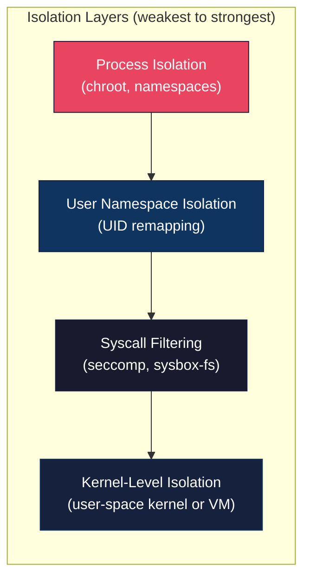
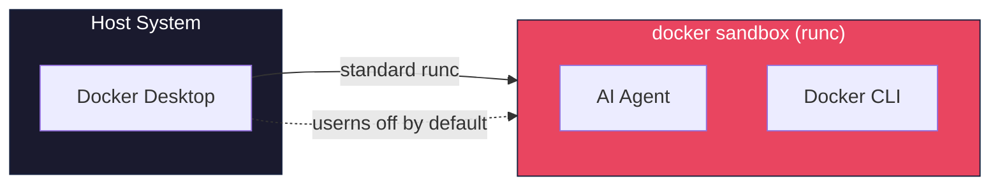
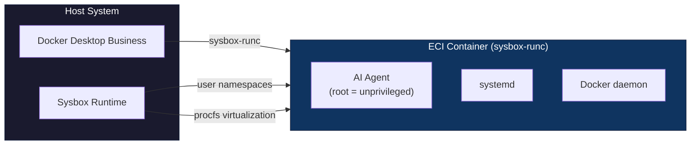
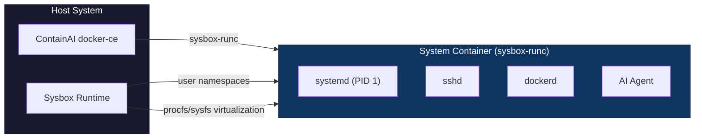
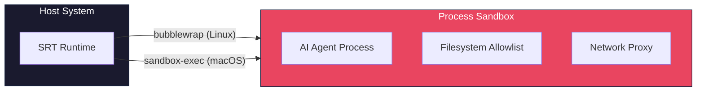
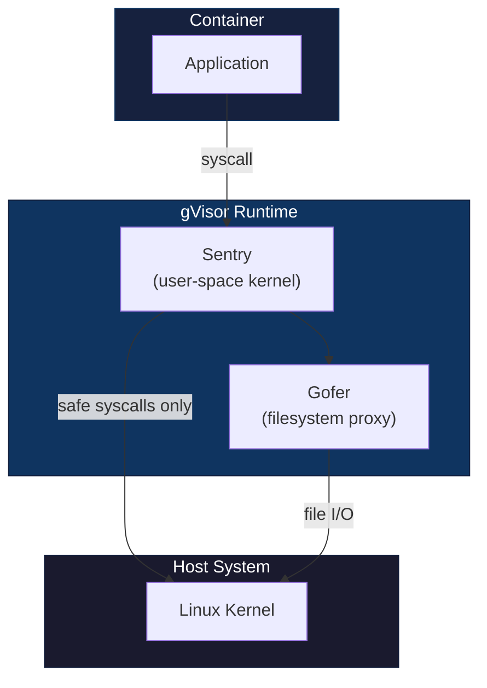
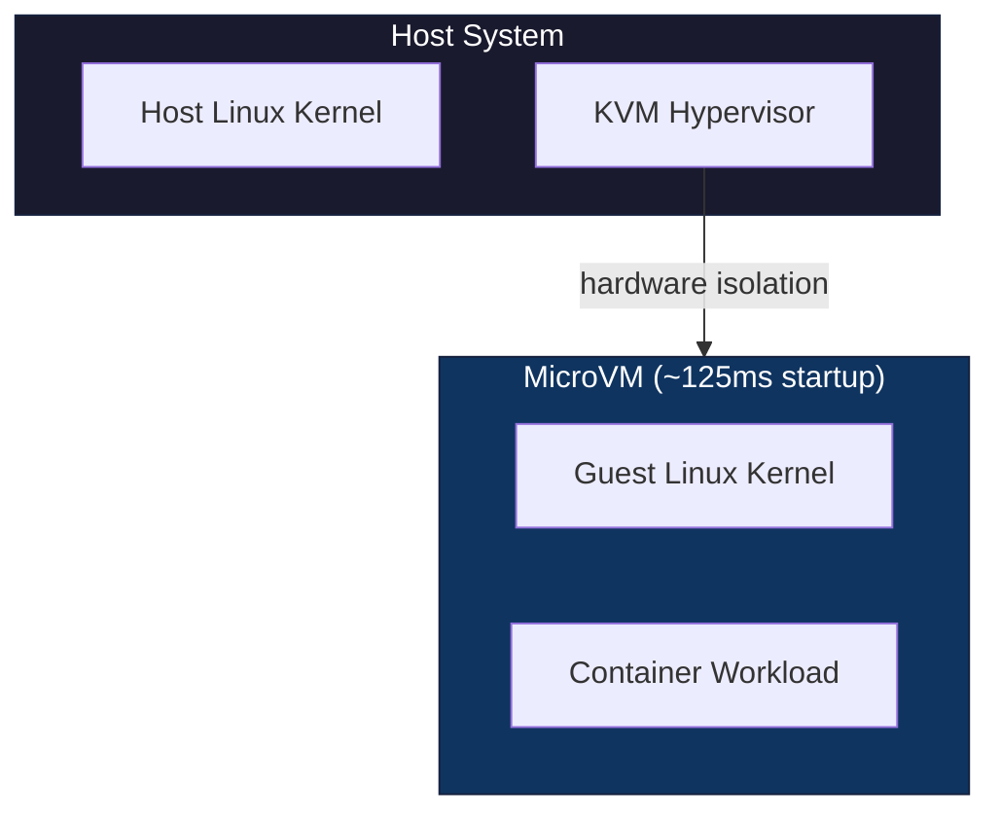
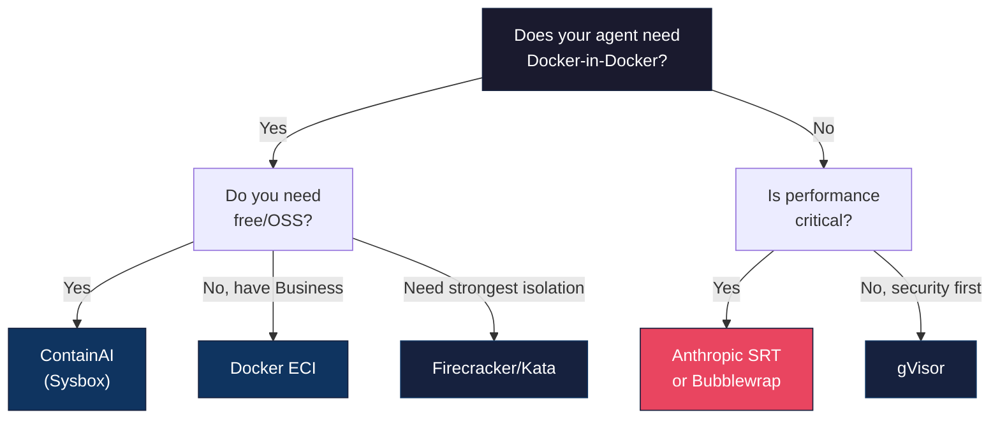

# AI Agent Sandboxing: Security Comparison

This document compares ContainAI's Sysbox-based system containers with other AI agent sandboxing solutions, helping developers understand security trade-offs and choose the right isolation for their use case.

## Table of Contents

- [Executive Summary](#executive-summary)
- [Understanding Isolation Layers](#understanding-isolation-layers)
- [Solution Comparison Table](#solution-comparison-table)
- [Detailed Solution Analysis](#detailed-solution-analysis)
  - [Docker Desktop "docker sandbox"](#docker-desktop-docker-sandbox)
  - [Docker Desktop ECI](#docker-desktop-eci)
  - [ContainAI (Sysbox)](#containai-sysbox)
  - [Anthropic SRT](#anthropic-srt)
  - [Bubblewrap](#bubblewrap)
  - [gVisor](#gvisor)
  - [Firecracker / Kata Containers](#firecracker--kata-containers)
  - [nsjail / Firejail](#nsjail--firejail)
- [What This Means For You](#what-this-means-for-you)
- [Choosing the Right Solution](#choosing-the-right-solution)
- [References](#references)

## Executive Summary

AI coding agents need sandboxing to prevent malicious or mistaken commands from affecting your host system. The solutions differ significantly in:

- **Isolation strength**: How well they contain escapes
- **Capabilities**: What the agent can do inside (Docker, systemd, etc.)
- **Cost**: Free vs paid tiers
- **Complexity**: Setup and maintenance burden

**Key insight**: Docker Desktop's experimental "docker sandbox" command is **not** the same as its Enhanced Container Isolation (ECI). They provide very different security guarantees.

| Solution | User Namespaces | Docker-in-Docker | systemd | Cost |
|----------|----------------|------------------|---------|------|
| Docker sandbox | No | CLI only | No | Free |
| Docker ECI | Yes | Yes | Yes | Business tier |
| **ContainAI** | **Yes** | **Yes** | **Yes** | **Free** |
| Anthropic SRT | No | No | No | Free |
| gVisor | Yes | Partial | Limited | Free |
| microVMs | Yes | Yes | Yes | Varies |

## Understanding Isolation Layers

Before comparing solutions, it helps to understand what each isolation mechanism provides:

### Layer Explanations

| Layer | What It Does | Why It Matters |
|-------|-------------|----------------|
| **Process Isolation** | Hides host filesystem and processes | Basic containment, easily escaped if root |
| **User Namespace Isolation** | Maps container root to unprivileged host user | Container root cannot affect host even if container escapes |
| **Syscall Filtering** | Blocks or virtualizes dangerous system calls | Reduces attack surface, helps mitigate classes of kernel exploits |
| **Kernel-Level Isolation** | Separate kernel or full VM | Strongest isolation, immune to most kernel bugs |

## Solution Comparison Table

| Feature | Docker Sandbox | Docker ECI | ContainAI | SRT | gVisor | microVMs |
|---------|---------------|------------|-----------|-----|--------|----------|
| **User Namespaces** | :x: | :white_check_mark: | :white_check_mark: | :x: | :white_check_mark: | :white_check_mark: |
| **Enhanced Syscall Vetting** | :warning: | :white_check_mark: | :white_check_mark: | :x: | :white_check_mark: :white_check_mark: | :white_check_mark: |
| **Docker-in-Docker** | :warning: | :white_check_mark: | :white_check_mark: | :x: | :warning: | :white_check_mark: |
| **systemd Support** | :x: | :white_check_mark: | :white_check_mark: | :x: | :warning: | :white_check_mark: |
| **Cost** | Free | Business tier | Free | Free | Free | Varies |
| **Startup Time** | Fast | Fast | Fast | Instant | ~100ms | ~125ms |

**Legend**: :white_check_mark: = Full support | :warning: = Partial/Limited | :x: = No support

**Notes on Docker-in-Docker**:
- **Docker Sandbox** (:warning:): Includes Docker CLI that talks to the host Docker daemon (not a nested daemon)
- **gVisor** (:warning:): Requires special configuration flags and has compatibility limitations

**Notes on Enhanced Syscall Vetting**:
- **Docker Sandbox** (:warning:): Has Docker's default seccomp profile but no sysbox-style procfs/sysfs virtualization
- **gVisor** (:white_check_mark: :white_check_mark:): Intercepts all syscalls via user-space kernel (strongest)

**Building block tools** (Bubblewrap, nsjail, Firejail) are not included in the main comparison as they are low-level components rather than complete solutions. See their dedicated sections below.

## Detailed Solution Analysis

### Docker Desktop "docker sandbox"

**What it is**: An experimental AI agent workspace feature in Docker Desktop 4.50+ (December 2025).

| Aspect | Details |
|--------|---------|
| **Runtime** | Standard `runc` (NOT sysbox-runc) |
| **User Namespaces** | Not enabled by default |
| **Isolation Level** | Basic container isolation only |
| **Docker-in-Docker** | Docker CLI only (talks to host daemon, not a nested `dockerd`) |
| **Agent Privileges** | Has sudo access inside container |
| **Status** | Experimental - commands may change |

**What this means for you**: If the container escapes on a native Linux host, you have host root. On macOS/Windows, the immediate "host" is Docker Desktop's Linux VM, not your actual machine - but the VM still has access to mounted workspaces, credentials, and network. The "sandbox" name is misleading - it provides convenience, not enhanced security. Fine for development, not for untrusted code.

**Source**: [Docker Desktop 4.50 Release Notes](https://docs.docker.com/desktop/release-notes/#4500)

---

### Docker Desktop ECI

**What it is**: Enhanced Container Isolation - Sysbox integrated into Docker Desktop, available only on Business tier.

| Aspect | Details |
|--------|---------|
| **Runtime** | `sysbox-runc` (same as ContainAI) |
| **User Namespaces** | Always enabled |
| **Syscall Vetting** | Yes, via sysbox-fs |
| **Procfs/Sysfs Virtualization** | Yes |
| **Docker-in-Docker** | Yes, securely |
| **systemd Support** | Yes |
| **Cost** | Docker Business subscription (requires paid tier) |
| **Platform** | Linux containers only (no Windows containers) |

**What this means for you**: Same excellent isolation as ContainAI, but requires a paid subscription. If you're already on Docker Business, enable ECI in Settings > General > Enhanced Container Isolation.

**Key point**: ECI IS Sysbox. Docker acquired Nestybox (Sysbox creators) in 2022 and integrated it into Docker Desktop Business.

**Source**: [Docker ECI Documentation](https://docs.docker.com/desktop/hardened-desktop/enhanced-container-isolation/)

---

### ContainAI (Sysbox)

**What it is**: Open-source system containers using the same Sysbox runtime as Docker ECI, but free and running on your own docker-ce installation.

| Aspect | Details |
|--------|---------|
| **Runtime** | `sysbox-runc` |
| **User Namespaces** | Automatic (root = unprivileged on host) |
| **Syscall Vetting** | Yes |
| **Procfs/Sysfs Virtualization** | Yes |
| **Docker-in-Docker** | Yes, unprivileged |
| **systemd Support** | Yes (full init system) |
| **SSH Access** | Built-in (VS Code Remote-SSH compatible) |
| **Cost** | Free (MIT License) |

**What this means for you**: Enterprise-grade isolation without the enterprise price tag. ContainAI installs a dedicated docker-ce instance alongside your existing Docker, so there are no conflicts with Docker Desktop.

**Source**: [ContainAI Architecture](architecture.md)

---

### Anthropic SRT

**What it is**: Anthropic's Sandbox Runtime - lightweight process sandboxing used by Claude Code for basic isolation.

| Aspect | Details |
|--------|---------|
| **Type** | Process sandbox (not a container) |
| **Linux Backend** | Bubblewrap (bwrap) |
| **macOS Backend** | sandbox-exec |
| **Windows Support** | No |
| **Filesystem** | Allowlist-based access |
| **Network** | Proxy filtering |
| **Docker-in-Docker** | No |
| **systemd** | No |
| **User Namespaces** | No (uses existing user) |

**What this means for you**: SRT is great for simple agent isolation - restricting filesystem and network access for agents that just need to read/write files. Not suitable for agents that need to build containers, run services, or use Docker.

**Source**: [Claude Code Documentation](https://docs.anthropic.com/claude-code)

---

### Bubblewrap

**What it is**: A low-level namespace sandboxing tool used by Flatpak and SRT. You configure everything manually.

| Aspect | Details |
|--------|---------|
| **Type** | Low-level namespace tool |
| **Preconfigured** | No - DIY only |
| **Docker-in-Docker** | No |
| **systemd** | No |
| **Use Case** | Building custom sandboxes, underlying tool for SRT |

**What this means for you**: Bubblewrap is a building block, not a complete solution. Unless you're building your own sandboxing system, use something that wraps it (like SRT or Flatpak).

**Source**: [Bubblewrap GitHub](https://github.com/containers/bubblewrap)

---

### gVisor

**What it is**: A user-space kernel that intercepts all syscalls, providing the strongest syscall-level isolation available in containers.

| Aspect | Details |
|--------|---------|
| **Isolation** | Intercepts all application syscalls via user-space kernel |
| **Syscall Compatibility** | Implements a subset of Linux syscalls; some applications may not work |
| **I/O Performance** | Measurable overhead on I/O-intensive workloads (varies by use case) |
| **Docker-in-Docker** | Partial (requires special flags) |
| **systemd** | Limited compatibility |
| **Startup** | ~100ms |

**What this means for you**: gVisor provides strong syscall isolation by intercepting all application syscalls in user-space, reducing the kernel attack surface. However, it has measurable performance overhead and compatibility limitations. Good for running untrusted code that doesn't need Docker or complex Linux features.

**Source**: [gVisor Documentation](https://gvisor.dev/docs/) - See [Compatibility](https://gvisor.dev/docs/user_guide/compatibility/) and [Performance](https://gvisor.dev/docs/architecture_guide/performance/) for details.

---

### Firecracker / Kata Containers

**What it is**: MicroVMs - true VM isolation with container-like ergonomics.

| Aspect | Details |
|--------|---------|
| **Isolation** | Hardware-level (KVM) |
| **Startup** | ~125ms (Firecracker) |
| **Memory Overhead** | Higher than containers |
| **Docker-in-Docker** | Yes |
| **systemd** | Yes |
| **Requirements** | KVM support (bare metal or nested virt) |

**What this means for you**: MicroVMs provide the strongest isolation (separate kernel), suitable for running truly untrusted code. However, they require KVM support, more memory, and are more complex to set up. AWS Lambda uses Firecracker.

**Firecracker**: [AWS Firecracker](https://firecracker-microvm.github.io/)
**Kata**: [Kata Containers](https://katacontainers.io/)

---

### nsjail / Firejail

**What it is**: Process sandboxing tools with seccomp filtering, designed for single-process isolation.

| Aspect | Details |
|--------|---------|
| **Type** | Process sandbox |
| **Seccomp** | Yes |
| **Docker-in-Docker** | No |
| **systemd** | No |
| **Use Case** | Single process isolation (parsers, renderers) |

**What this means for you**: Good for isolating individual untrusted processes (like running a PDF parser), not suitable for full development environments or AI agents that need Docker.

**nsjail**: [nsjail GitHub](https://github.com/google/nsjail)
**Firejail**: [Firejail](https://firejail.wordpress.com/)

## What This Means For You

For concrete examples of these security concepts in action, see [Security Scenarios](security-scenarios.md) which walks through real-world attack patterns and how proper isolation prevents them.

### Why Docker Sandbox Alone Is Not Enough

Docker Desktop's experimental `docker sandbox` command provides convenience but not enhanced security:

1. **Uses standard runc** - No user namespace isolation by default
2. **Agent has sudo** - Root inside = root on host if escaped (on native Linux)
3. **No enhanced syscall vetting** - Only standard container controls (Docker's default seccomp profile), no sysbox-style virtualization
4. **Experimental status** - Commands may change without notice

**Bottom line**: Use it for quick development, but don't trust it with untrusted code.

### Why ECI Requires Business Tier

Docker ECI provides the same Sysbox isolation as ContainAI, but:

1. **Subscription required** - Docker Business tier (paid)
2. **Docker Desktop only** - Not available with docker-ce
3. **Linux containers only** - No Windows container support
4. **Same technology** - Docker acquired Nestybox (Sysbox) in 2022

**Bottom line**: If you're already on Docker Business, enable ECI. Otherwise, ContainAI gives you the same isolation for free.

### Why SRT/Bubblewrap Is Not Enough for System Containers

Anthropic's SRT and raw Bubblewrap provide process-level isolation:

1. **No DinD** - Cannot run Docker inside
2. **No systemd** - Cannot run services
3. **Process-only** - Not a full environment
4. **No Windows** - macOS and Linux only

**Bottom line**: Great for simple agents that just read/write files. Not suitable for agents that need to build containers or run services.

### Why System Containers Matter for AI Agents

AI coding agents often need capabilities that require system containers:

| Agent Need | Requires |
|------------|----------|
| Build Docker images | Docker-in-Docker |
| Run `docker compose` | Docker-in-Docker |
| Background services | systemd |
| VS Code Remote-SSH | Real SSH daemon |
| Full dev environment | Multiple services |

ContainAI provides all of this with strong isolation through Sysbox.

## Choosing the Right Solution

### Quick Recommendations

| If you need... | Use... |
|---------------|--------|
| Quick development sandbox | Docker sandbox (experimental) |
| DinD + free + strong isolation | **ContainAI** |
| DinD + already have Docker Business | Docker ECI |
| Simple file/network isolation | Anthropic SRT |
| Strongest syscall isolation | gVisor (accept performance hit) |
| Strongest overall isolation | Firecracker/Kata microVMs |
| Building your own sandbox | Bubblewrap + seccomp |

## References

### Official Documentation

- [Docker Desktop ECI](https://docs.docker.com/desktop/hardened-desktop/enhanced-container-isolation/)
- [Docker Desktop 4.50 Release Notes](https://docs.docker.com/desktop/release-notes/#4500)
- [Sysbox Documentation](https://github.com/nestybox/sysbox/tree/master/docs)
- [gVisor Documentation](https://gvisor.dev/docs/)
- [Firecracker](https://firecracker-microvm.github.io/)
- [Kata Containers](https://katacontainers.io/)
- [Bubblewrap](https://github.com/containers/bubblewrap)

### ContainAI Documentation

- [Architecture](architecture.md) - System container design
- [Security Scenarios](security-scenarios.md) - Real-world attack scenarios and how isolation helps
- [Configuration](configuration.md) - Container configuration options
- [Troubleshooting](troubleshooting.md) - Common issues and solutions
- [Security Model](../SECURITY.md) - Threat model and reporting

### Background Reading

- [Nestybox Acquisition by Docker (2022)](https://www.docker.com/blog/docker-advances-container-isolation-and-workloads-with-acquisition-of-nestybox/)
- [User Namespaces in Docker](https://docs.docker.com/engine/security/userns-remap/)
- [Linux Namespaces](https://man7.org/linux/man-pages/man7/namespaces.7.html)
- [seccomp](https://man7.org/linux/man-pages/man2/seccomp.2.html)
