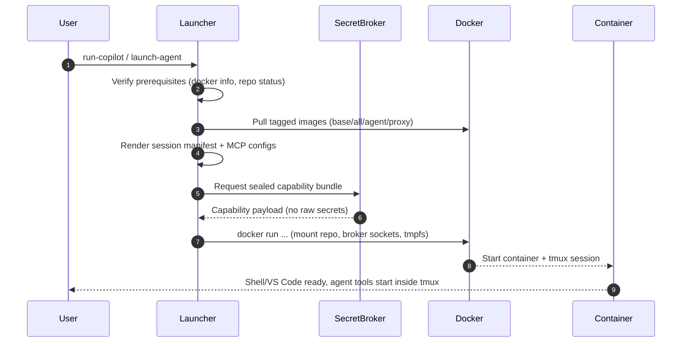
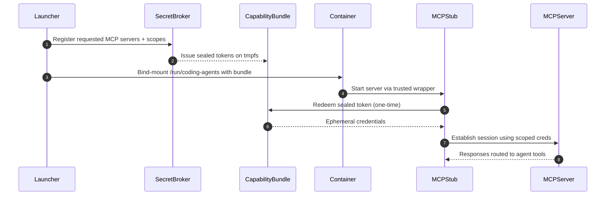
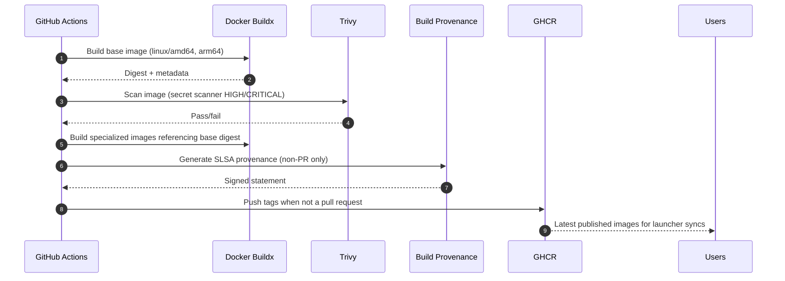
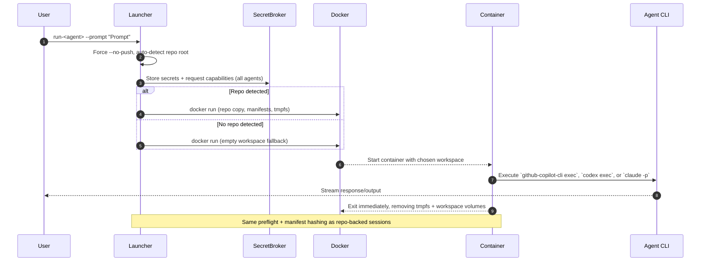

# Security & Workflow Diagrams

The following sequence diagrams illustrate how launchers enforce security boundaries, how secrets move through the system, and how CI gates protect published images.

## 1. Launcher Boot Flow

**Key takeaways**
- Hashes of launch scripts and runtime assets are recorded before container creation.
- Every launch path pulls published images by default; `--from-source` is reserved for contributors.
- The broker handshake happens on the host so containers never see plaintext secrets at rest.

## 2. Secret Handling & MCP Enforcement

**Defenses**
- Capabilities live in tmpfs with `0700` permissions owned by the stub user.
- Tokens are single-use and audience-bound, so exfiltrated blobs are worthless.
- Launchers optionally merge `~/.config/coding-agents/mcp-secrets.env` for hosts that prefer .env-style inputs.

## 3. CI Build & Security Gates

**Highlights**
- Pull requests still build and scan images but skip pushes/attestations.
- Build matrices ensure the Squid proxy and each agent image share the same vetted base digest.
- The `scripts/build` helpers mirror this workflow locally so developers can test the same steps before opening a PR.

## 4. Prompt Flow

Why this matters:

- Multi-agent parity: The same flag works for Copilot, Codex, or Claude, and the launcher chooses the correct CLI entry point automatically.
- Safe repo reuse: When you run inside a Git repo, the workspace matches a normal session with branch isolation; otherwise the launcher falls back to an empty workspace so prompts still work anywhere.
- Security invariants hold: capability bundles, MCP configs, and audit metadata still flow through the broker before the container launches.
- Ideal for diagnostics and the `--with-host-secrets` integration gate; failures isolate to the agent CLI rather than repository plumbing.
