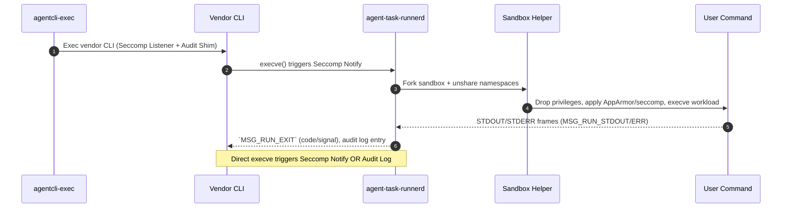

# Agent Task Runner Security Notes

This document explains the Rust-based control plane that mediates every process launched inside ContainAI containers. It is written for security auditors who need to understand how the runner components interact, which invariants they enforce, and how those guarantees are verified in CI and release builds.

## 1. High-Level Goals

- Interpose on *every* execution path triggered by vendor-provided CLIs (Copilot, Codex, Claude, MCP helpers) without modifying the vendor binaries.
- Apply namespace, AppArmor, and seccomp confinement **before** any user workload obtains access to decrypted secrets under `/run/agent-secrets` or `/run/agent-data`.
- Provide tamper-resistant audit records that correlate launcher metadata (agent, binary, session ID) with each command executed in the container.
- Degrade safely: even if wrappers fail, the seccomp backstop blocks unsanctioned `execve`/`execveat` calls.

## 2. Components & Responsibilities

| Program | Location | Role | Key Inputs / Outputs |
| --- | --- | --- | --- |
| `agent-task-runnerd` | `src/agent-task-runner/src/agent_task_runnerd.rs` | Master daemon. Owns the Unix seqpacket socket, tracks registered vendors, accepts `MSG_RUN_REQUEST` frames, and spawns sandbox helpers. Also handles seccomp user notifications for any `execve`/`execveat` attempted by vendor binaries. | Inputs: socket payloads, seccomp notifications, policy config. Outputs: audit log entries, sandbox processes, JSON responses to clients. |
| `agentcli-exec` | `src/agent-task-runner/src/agentcli_exec.rs` | Shim that intercepts the vendor binary, installs the seccomp filter, and ensures every `execve` traps into `agent-task-runnerd`. | Inputs: original CLI path. Outputs: instrumented vendor CLI process plus seccomp listener FD. |
| `libauditshim.so` | `src/audit-shim/src/lib.rs` | Userspace audit library injected via `LD_PRELOAD`. Wraps libc functions to log activity when kernel interception is unavailable. | Inputs: libc calls. Outputs: JSON events to `/run/containai/audit.sock`. |
| `agent-task-sandbox` | `src/agent-task-runner/src/agent_task_sandbox.rs` | Helper executed by the daemon to unshare namespaces, drop privileges to `agentuser`, remount sensitive paths as sealed tmpfs, apply AppArmor + seccomp, and finally `execve` the requested command. | Inputs: daemon-provided argv/env, hide-path list, AppArmor profile. Outputs: isolated workload process tree. |
| `channel.rs` | `src/agent-task-runner/src/channel.rs` | Shared wrapper around Unix seqpacket sockets. Handles framing, size enforcement, and JSON helpers for both the client and daemon. | Inputs: `OwnedFd`. Outputs: strongly-typed header/payload tuples. |

These programs are shipped inside every agent container by the `docker/base/Dockerfile` builder stage (`cargo build --release --locked`). The container entrypoint ensures that the vendor binary is executed via `agentcli-exec`, which installs the necessary security hooks before the vendor code runs.

## 3. Control Plane Flow

1. **Launcher metadata** – Host launchers populate `HOST_SESSION_ID`, `CONTAINAI_AGENT_NAME`, `CONTAINAI_AGENT_BINARY`, and expose `/run/agent-task-runner.sock` inside the container.
2. **Direct Execution** – The container entrypoint executes `agentcli-exec <vendor-binary>`. This shim installs the seccomp filter and/or audit shim before executing the vendor binary in-place.
3. **Seccomp Interception** – When the vendor binary attempts to `execve` a subprocess (e.g. `git`, `node`), the kernel suspends the process and notifies `agent-task-runnerd`.
4. **Sandbox creation** – The daemon validates policy (hide paths, workspace dir, session scope) and calls into `agent-task-sandbox`. That helper unshares namespaces, masks `/run/agent-*`, drops to `agentuser`, applies the AppArmor enforce profile plus seccomp task filter, and finally `execve`s the requested binary.
5. **Streaming output & exit status** – `agent-task-runnerd` relays STDOUT/STDERR frames back to the client, logs every run, and responds with `MSG_RUN_EXIT` when the sandboxed process tree terminates.
6. **Audit Shim** – Independently, `agentcli-exec` ensures the vendor CLI itself cannot `execve` arbitrary binaries without notifying the daemon.
    *   **Standard Linux**: Uses `seccomp_load` with `SCMP_ACT_NOTIFY`.
    *   **Defense-in-Depth**: Always injects `LD_PRELOAD=/usr/lib/containai/libaudit_shim.so` to log `execve` calls via userspace interception.

## 4. Security Guarantees

| Guarantee | Mechanism | Notes |
| --- | --- | --- |
| Fail-Closed Privilege Drop | `agentcli-exec` strictly enforces `switch_user()`. If the user switch fails, the process exits immediately. | No fallback to running as the original user (root/agentcli). |
| Secrets remain in tmpfs | Entrypoint mounts `/run/agent-secrets` and `/run/agent-data` as `tmpfs` with `mode=000`; sandbox helper remounts them private/unbindable and workloads run as `agentuser`. | Documented in [secret-credential-security-review.md](secret-credential-security-review.md) §4–5. |
| Every workload is logged | Runner assigns each command the agent/binary/session metadata carried by the wrapper and emits structured JSON events (`/run/agent-task-runner/events.log`). | Log format defined in `agent_task_runnerd.rs` (`Event` struct). |
| Policy enforcement even when wrappers fail | `agentcli-exec` installs a seccomp user-notification filter on `execve`/`execveat`; daemon can deny or allow after inspecting `/proc/<pid>/exe`. | Violations return `EPERM` and increment anomaly counter. |
| Audit Shim Defense-in-Depth | `agentcli-exec` *always* injects `libauditshim.so` to log execution intent via userspace interception, providing visibility even if kernel enforcement is bypassed or unavailable. | Ensures visibility when kernel enforcement is unavailable. |
| Namespace, AppArmor, seccomp applied before user code | `agent-task-sandbox` unshares, remounts hide paths (`--hide`), drops to `agentuser`, calls `prctl(PR_SET_NO_NEW_PRIVS,1)`, then loads the `containai-task` profile before final `execve`. | Prevents privileged syscalls (ptrace, mount, perf, raw sockets, etc.). |
| STDIO integrity | seqpacket channel ensures message boundaries and backpressure; client handles EINTR and closes STDIN cleanly on EOF, so signal delivery is deterministic. | See `channel.rs` + `FSIZE` guard. |
| Build reproducibility | `docker/base/Dockerfile` builds all runner binaries in an isolated stage (`cargo build --release --locked`). CI uses the same Dockerfile to produce release artifacts. | `scripts/build/build-dev.sh` rebuilds dev-scoped images; prod builds are pinned and produced in CI. |

## 5. Audit Surfaces & Incident Response Hooks

- `events.log` – Located at `/run/agent-task-runner/events.log`. Every event has: timestamp, PID, agent name, binary name, path or syscall, and action (`register`, `run-exit`, `run-error`, `deny`). The log is append-only and owned by root.
- Seccomp anomalies – Denied syscalls are written to stderr and logged, providing early warning when vendor binaries attempt unexpected behavior.
- Launcher manifests – Host launchers record the exact git commit, hash of wrapper scripts, and session IDs used to create the container. Cross-reference the session ID that appears in runner payloads to trace an entire incident.
- Capability usage – Helpers (`prepare-*-secrets.sh`) log every capability redemption with session ID; combined with runner logs, auditors can tie secret issuance to individual command executions.

## 6. Testing & Verification

| Check | Command | Purpose |
| --- | --- | --- |
| Rust unit tests | `cd src/agent-task-runner && cargo test` | Validates protocol helpers, CLI parsing, sandbox helpers. Required before any doc/code change lands. |

| Seccomp filter check | `cargo test -- --ignored` (future work) | Ensures deny list stays synchronized with policy doc. |
| Container build | `scripts/build/build-dev.sh` | Rebuilds the base image in the dev namespace; CI handles prod tags. |
| Integration tests | `scripts/test/integration-test.sh --mode launchers` | Spins up mock images and verifies direct execution via `agentcli-exec`, seccomp mediation, and audit logging. |

## 7. Related Documents

- [secret-credential-security-review.md](secret-credential-security-review.md) – Broader architecture, threat model, and credential lifecycle.
- [administration.md](administration.md) – Operations guide, audit logs, and system health.
- [development/workflow.md](../development/workflow.md) – How to rebuild the base image and run the test suites mentioned above.
- [architecture.md](architecture.md) – High-level system diagram; this document drills into the runner-specific portion of that graph.

For questions or change requests, contact the security owner listed in `CODEOWNERS` for the `src/agent-task-runner/**` path. Any modification to runner binaries **must** include updates to this document and the security review notes.
