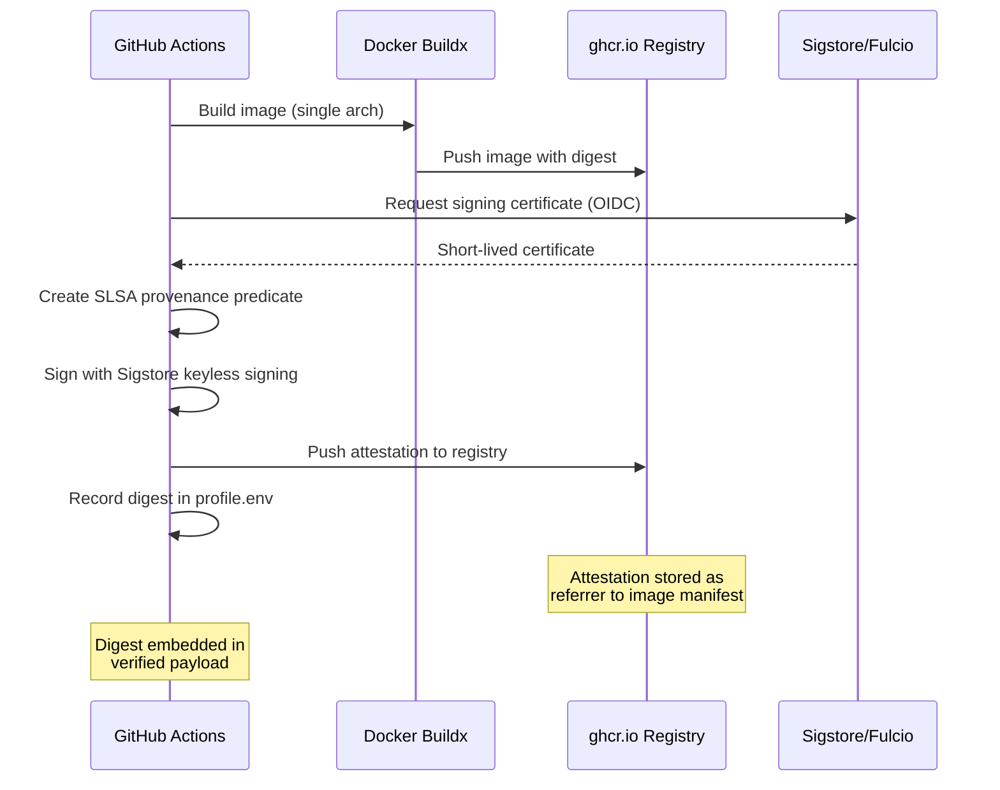
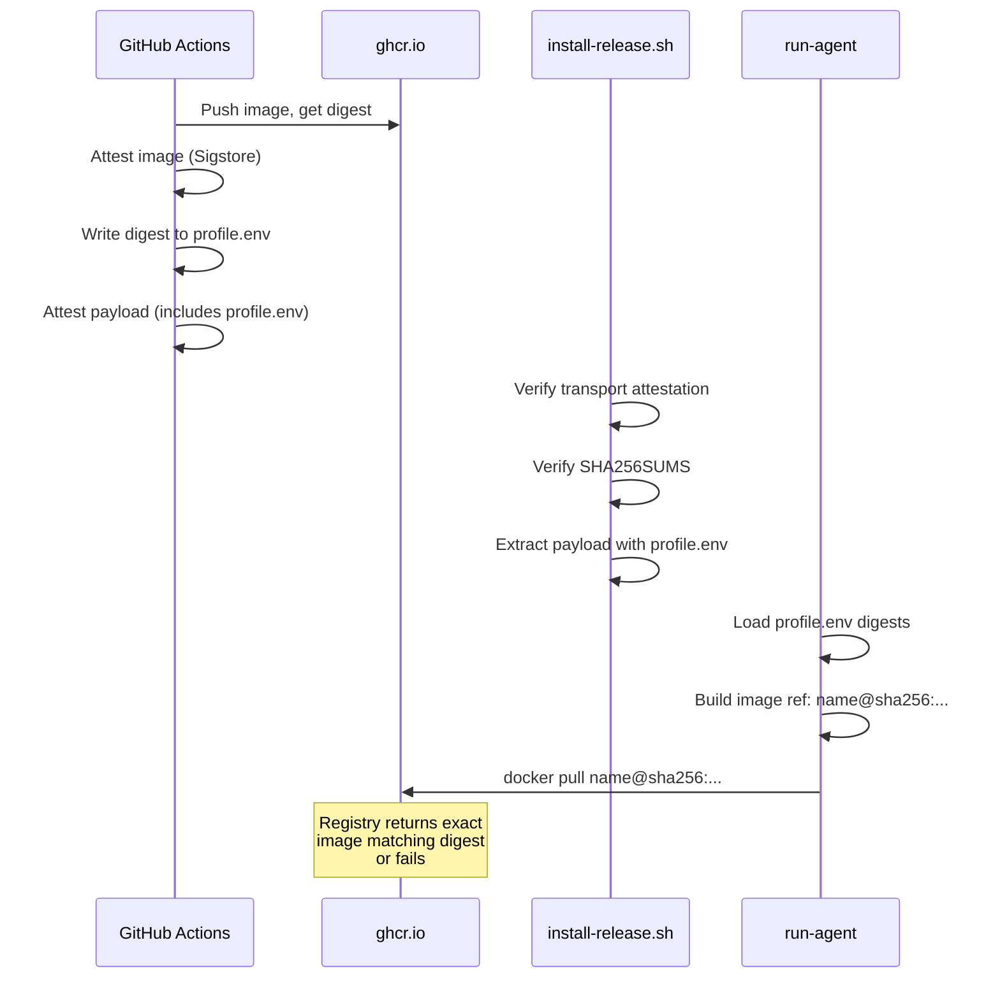
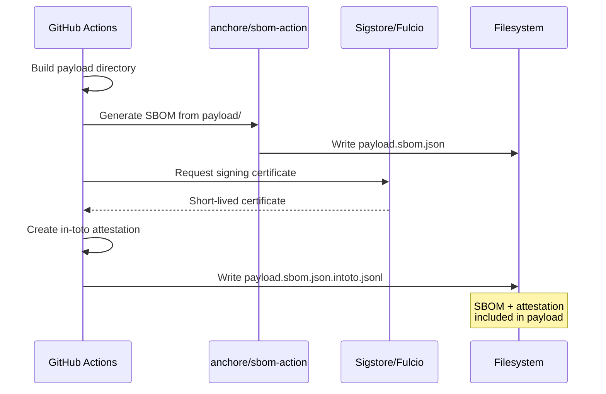
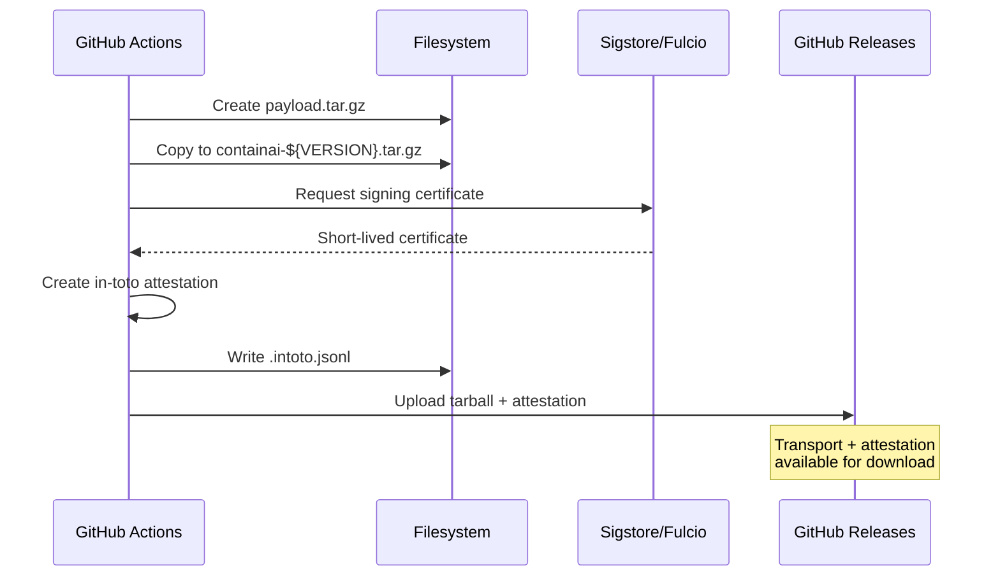
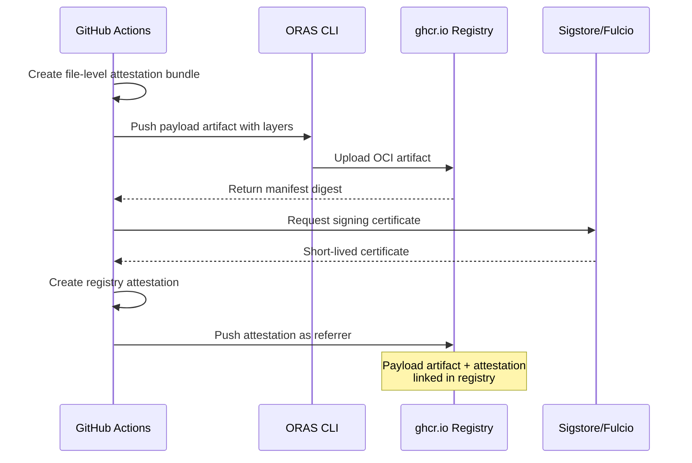
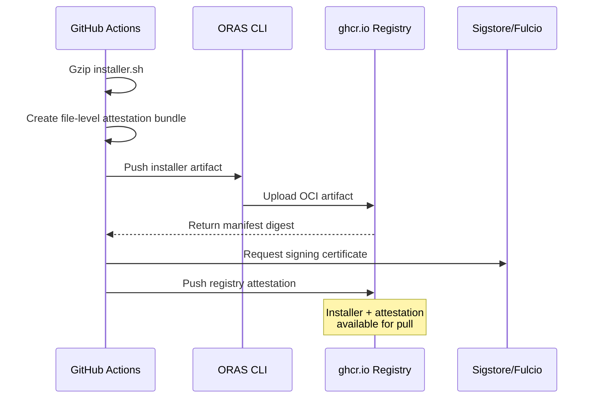
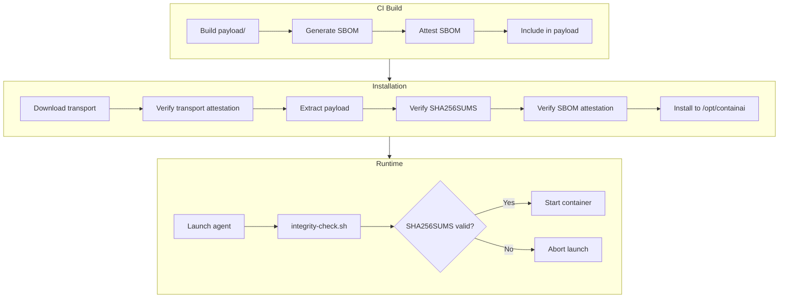
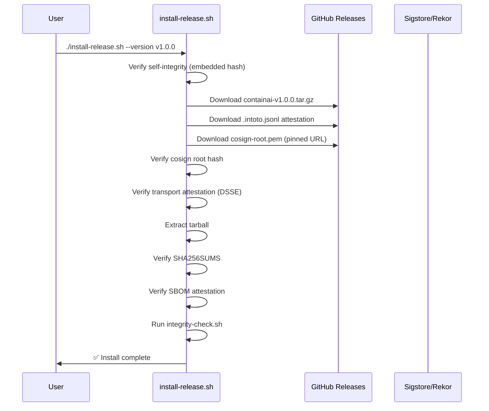
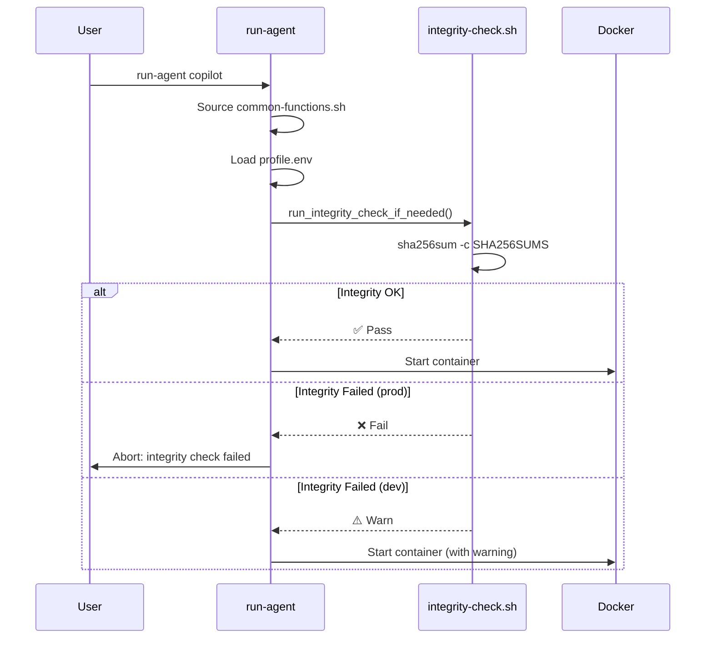

# Supply Chain Security: Attestations, SBOMs, and Signed Artifacts

This document provides comprehensive documentation of all cryptographic attestations, Software Bills of Materials (SBOMs), and signed artifacts in the ContainAI project. It explains what each artifact protects, how it's produced, how it's verified, and why it exists.

## Overview

ContainAI uses [Sigstore](https://www.sigstore.dev/) attestations via GitHub's `actions/attest-build-provenance` action to establish cryptographic proof of artifact provenance. These attestations form a chain of trust from source code to deployed containers.

### Attestation Categories

| Category | Count | Purpose |
|----------|-------|---------|
| Container Images | 14 | Prove each architecture-specific image was built from this repo |
| Payload Artifacts | 3 | Prove release bundles were built from this repo |
| Installer | 2 | Prove installer script authenticity |

**Total: 19 attestations per release** (14 images × 2 architectures for 7 images, plus 5 artifact attestations)

---

## Container Image Attestations

### What They Are

Each container image receives a [SLSA Provenance](https://slsa.dev/provenance/) attestation that cryptographically binds the image digest to the GitHub Actions workflow that built it.

### Images Attested

| Image | Architectures | Attestations |
|-------|---------------|--------------|
| `containai-base` | amd64, arm64 | 2 |
| `containai` | amd64, arm64 | 2 |
| `containai-copilot` | amd64, arm64 | 2 |
| `containai-codex` | amd64, arm64 | 2 |
| `containai-claude` | amd64, arm64 | 2 |
| `containai-proxy` | amd64, arm64 | 2 |
| `containai-log-forwarder` | amd64, arm64 | 2 |

### Production Flow



### What They Protect Against

| Threat | Protection |
|--------|------------|
| **Registry tampering** | Attestation digest must match pulled image |
| **Build hijacking** | Certificate binds to specific GitHub repo/workflow |
| **Replay attacks** | Timestamp in Rekor transparency log |
| **Unauthorized rebuilds** | Only `build-runtime-images.yml` can produce valid attestations |

### How Image Integrity Is Enforced

ContainAI uses **digest-pinning** to ensure image integrity at runtime. The image attestations provide cryptographic proof during the build, and the resulting digests are embedded in the verified payload.

#### Build-Time: Digest Capture

During the CI build, `write-profile-env.sh` captures each image's digest and writes them to `profile.env`:

```bash
# Example profile.env (embedded in payload)
PROFILE=prod
IMAGE_PREFIX=containai
IMAGE_TAG=v1.0.0
REGISTRY=ghcr.io/novotnyllc
IMAGE_DIGEST=sha256:abc123...
IMAGE_DIGEST_COPILOT=sha256:def456...
IMAGE_DIGEST_CODEX=sha256:789abc...
IMAGE_DIGEST_CLAUDE=sha256:...
IMAGE_DIGEST_PROXY=sha256:...
IMAGE_DIGEST_LOG_FORWARDER=sha256:...
```

#### Install-Time: Payload Verification

The `install-release.sh` script verifies the transport tarball attestation, which covers the entire payload including `profile.env`. This ensures the embedded digests are authentic.

#### Launch-Time: Digest-Pinned Pulls

The `run-agent` launcher reads digests from `profile.env` and constructs image references by digest:

```bash
# From run-agent: build_image_ref()
build_image_ref() {
    local agent="$1"
    local base="${CONTAINAI_IMAGE_PREFIX}-${agent}"
    local digest_var=""
    case "$agent" in
        copilot) digest_var="$CONTAINAI_IMAGE_DIGEST_COPILOT" ;;
        codex) digest_var="$CONTAINAI_IMAGE_DIGEST_CODEX" ;;
        # ...
    esac
    if [ -n "$digest_var" ]; then
        printf '%s@%s\n' "$base" "$digest_var"  # e.g., containai-copilot@sha256:abc...
        return
    fi
    # Prod requires digests - fail if missing
    if [ "$CONTAINAI_PROFILE" = "prod" ]; then
        echo "❌ Prod profile requires image digests" >&2
        exit 1
    fi
}
```

#### Verification Chain



This design means:
- **Image attestations** prove build provenance and are stored in the registry
- **Payload attestation** proves the digests in `profile.env` are authentic  
- **Digest-pinned pulls** ensure the exact attested image is used at runtime

#### Optional: Manual Attestation Verification

For additional assurance, users can manually verify image attestations using `cosign`:

```bash
# Verify image attestation
cosign verify-attestation \
  --type slsaprovenance \
  --certificate-identity-regexp "https://github.com/novotnyllc/ContainAI/.*" \
  --certificate-oidc-issuer "https://token.actions.githubusercontent.com" \
  ghcr.io/novotnyllc/containai-copilot@sha256:abc123...
```

---

## Payload Attestations

The payload is the distributable bundle containing launchers, configs, documentation, and the SBOM.

### 1. SBOM Attestation

**File:** `payload.sbom.json.intoto.jsonl`

| Property | Value |
|----------|-------|
| **Subject** | `payload.sbom.json` |
| **Format** | CycloneDX JSON |
| **Producer** | Anchore SBOM Action |
| **Signer** | GitHub Actions OIDC |

#### Production Flow



#### What It Protects Against

| Threat | Protection |
|--------|------------|
| **SBOM tampering** | Signature covers exact SBOM content |
| **Dependency confusion** | Verifiable manifest of included components |
| **License compliance** | Cryptographic proof of declared dependencies |
| **Vulnerability attribution** | Signed inventory for CVE matching |

#### Consumer: Install Script

The `install-release.sh` script verifies this attestation during installation:

```bash
# From install-release.sh
verify_dsse_attestation "$sbom_hash" "$SBOM_ATTEST_PATH" "$TRUST_ANCHOR_PATH" "SBOM" "payload.sbom.json"
```

### 2. Transport Tarball Attestation

**File:** `containai-${VERSION}.tar.gz.intoto.jsonl`

| Property | Value |
|----------|-------|
| **Subject** | `containai-${VERSION}.tar.gz` |
| **Format** | Gzipped tarball |
| **Contents** | Complete payload directory |
| **Signer** | GitHub Actions OIDC |

#### Production Flow



#### What It Protects Against

| Threat | Protection |
|--------|------------|
| **Download tampering** | Signature covers exact tarball bytes |
| **CDN/mirror attacks** | Verification independent of download source |
| **Version confusion** | Attestation binds to specific release |

#### Consumer: Install Script

```bash
# From install-release.sh
verify_dsse_attestation "$transport_hash" "$TRANSPORT_ATTEST_PATH" "$TRUST_ANCHOR_PATH" "Transport" ""
```

### 3. Payload Registry Artifact Attestation

**Subject:** `ghcr.io/novotnyllc/containai-payload:${VERSION}`

| Property | Value |
|----------|-------|
| **Registry** | ghcr.io |
| **Artifact Type** | `application/vnd.containai.payload.v1` |
| **Layers** | payload.tar.gz, SBOM, file-level bundle |
| **Signer** | GitHub Actions OIDC |

#### Production Flow



#### What It Protects Against

| Threat | Protection |
|--------|------------|
| **Registry manipulation** | Attestation linked to exact manifest digest |
| **Artifact substitution** | ORAS pull verifies digest |
| **Metadata tampering** | Artifact type and layers are signed |

---

## Installer Attestation

**Subject:** `ghcr.io/novotnyllc/containai-installer:${VERSION}`

| Property | Value |
|----------|-------|
| **Registry** | ghcr.io |
| **Artifact Type** | `application/vnd.containai.installer.v1` |
| **Content** | `installer.sh.gz` |
| **Signer** | GitHub Actions OIDC |

### Production Flow



### What It Protects Against

| Threat | Protection |
|--------|------------|
| **Script injection** | Signature covers exact script content |
| **Curl-pipe-bash attacks** | Verification before execution possible |
| **Version mismatch** | Tagged versions have immutable attestations |

---

## SBOM (Software Bill of Materials)

### File: `payload.sbom.json`

| Property | Value |
|----------|-------|
| **Format** | CycloneDX 1.5 JSON |
| **Generator** | Anchore Syft via `anchore/sbom-action` |
| **Scope** | All files in payload directory |

### What It Contains

```json
{
  "bomFormat": "CycloneDX",
  "specVersion": "1.5",
  "components": [
    {
      "type": "file",
      "name": "host/launchers/run-agent",
      "hashes": [{"alg": "SHA-256", "content": "..."}]
    },
    {
      "type": "library", 
      "name": "some-dependency",
      "version": "1.2.3",
      "purl": "pkg:npm/some-dependency@1.2.3"
    }
  ]
}
```

### Verification Chain



---

## SHA256SUMS Integrity File

### File: `SHA256SUMS`

Not an attestation, but a critical integrity artifact verified at multiple points.

| Property | Value |
|----------|-------|
| **Format** | BSD-style checksums |
| **Scope** | All files in payload directory |
| **Hash** | SHA-256 |

### Example Content

```
a1b2c3...  ./host/launchers/run-agent
d4e5f6...  ./host/utils/common-functions.sh
789abc...  ./config.toml
...
```

### Verification Points

| When | Verifier | Action on Failure |
|------|----------|-------------------|
| **Install** | `install-release.sh` | Abort installation |
| **Launch (prod)** | `integrity-check.sh` | Abort container start |
| **Launch (dev)** | `integrity-check.sh` | Warn only |

### What It Protects Against

| Threat | Protection |
|--------|------------|
| **Post-install tampering** | Detects modified files at launch |
| **Partial updates** | Detects incomplete/corrupted installs |
| **Rollback detection** | Combined with version in `install.meta` |

---

## Trust Anchor: Cosign Root Certificate

### File: `tools/cosign-root.pem`

The trust anchor for verifying Sigstore attestations offline.

| Property | Value |
|----------|-------|
| **Source** | Sigstore Fulcio root certificate |
| **Pinned** | SHA-256 hash embedded in installer |
| **Fetched** | From pinned GitHub raw URL at install time |

### Security Properties

1. **Hash pinned in installer:** The `install-release.sh` script contains a hardcoded SHA-256 hash of the expected root certificate
2. **URL pinned to commit:** The download URL includes the git commit SHA, preventing substitution
3. **Verified before use:** Hash is verified immediately after download

```bash
# From install-release.sh
COSIGN_ROOT_EXPECTED_SHA256="__COSIGN_ROOT_SHA256__"  # Replaced at build time
COSIGN_ROOT_URL="__COSIGN_ROOT_URL__"  # Replaced at build time

fetch_trust_anchor() {
    curl -fL -o "$dest" "$COSIGN_ROOT_URL"
    cosign_hash=$(sha256sum "$dest" | awk '{print $1}')
    if [[ "$cosign_hash" != "$COSIGN_ROOT_EXPECTED_SHA256" ]]; then
        die "cosign-root.pem hash mismatch"
    fi
}
```

---

## End-to-End Verification Flow

### Installation



### Runtime Launch



---

## Channel-Specific Behavior

| Channel | Transport Attestation | SBOM Attestation | Integrity Check |
|---------|----------------------|------------------|-----------------|
| **prod** | Required | Required | Hard fail |
| **nightly** | Required | Required | Hard fail |
| **dev** | Optional (skip if missing) | Optional (skip if missing) | Warn only |

This allows development workflows to proceed without full signing infrastructure while maintaining strict verification for production releases.

---

## Attestation Summary Table

| Attestation | Subject | Producer | Consumer | Protects |
|-------------|---------|----------|----------|----------|
| Image (per-arch) | Container digest | `build-runtime-images.yml` | `run-agent` via digest-pinning | Registry tampering, build hijacking |
| SBOM | `payload.sbom.json` | Anchore + GHA | `install-release.sh` | Dependency tampering, license compliance |
| Transport | `containai-*.tar.gz` | `publish-payload` job | `install-release.sh` | Download tampering, CDN attacks |
| Payload OCI | Registry artifact | `publish-payload` job | ORAS consumers | Registry substitution |
| Installer OCI | Registry artifact | `publish-installer` job | ORAS consumers | Script injection |

---

## Maintenance Notes

### Retention and Pruning

Attestations are not stored indefinitely. The `cleanup-ghcr-versions.sh` script runs after each CI build and enforces the following retention policy:

| Retention Rule | Duration/Count |
|----------------|----------------|
| All versions updated recently | 6 months |
| Prod-tagged versions | 6 months + latest prod forever |
| Non-prod versions (dev/nightly) | Newest 10-15 per image |

**Packages subject to cleanup:**

| Package | Type | Min Versions Kept |
|---------|------|-------------------|
| `containai-base` | Container image | 10 |
| `containai` | Container image | 15 |
| `containai-copilot` | Container image | 10 |
| `containai-codex` | Container image | 10 |
| `containai-claude` | Container image | 10 |
| `containai-proxy` | Container image | 10 |
| `containai-log-forwarder` | Container image | 10 |
| `containai-payload` | OCI artifact | 10 |
| `containai-installer` | OCI artifact | 10 |
| `containai-metadata` | OCI artifact | 10 |

**How attestation cleanup works:**
- Container image attestations are stored as [OCI referrers](https://github.com/opencontainers/distribution-spec/blob/main/spec.md#listing-referrers) attached to image manifests
- When `cleanup-ghcr-versions.sh` deletes an old image/artifact version, the registry **automatically garbage collects** its attached attestations
- File-based attestations (`.intoto.jsonl` files in GitHub Releases) follow GitHub's release retention policies

This means:
- **Prod releases**: Attestations kept indefinitely (latest prod is never deleted)
- **Nightly builds**: Attestations pruned after ~10-15 newer builds
- **Dev builds**: Attestations pruned after ~10-15 newer builds

### Adding New Images

When adding a new container image:

1. Add build job to `build-runtime-images.yml`
2. Include `actions/attest-build-provenance@v1` step after push
3. Add to variant manifest assembly
4. Update this documentation

### Updating Trust Anchor

If the Sigstore root certificate changes:

1. Update `host/utils/cosign-root.pem`
2. The `package-artifacts.sh` script automatically computes and embeds the new hash
3. Existing installations will fail to verify new releases until updated

### Debugging Attestation Failures

```bash
# Verify image attestation manually
cosign verify-attestation \
  --type slsaprovenance \
  --certificate-identity-regexp "https://github.com/novotnyllc/ContainAI/.*" \
  --certificate-oidc-issuer "https://token.actions.githubusercontent.com" \
  ghcr.io/novotnyllc/containai:latest

# Inspect DSSE bundle
cat payload.sbom.json.intoto.jsonl | jq -r '.payload' | base64 -d | jq .

# Verify SHA256SUMS locally
cd /opt/containai/current && sha256sum -c SHA256SUMS
```

---

## References

- [SLSA Provenance Specification](https://slsa.dev/provenance/v1)
- [Sigstore Documentation](https://docs.sigstore.dev/)
- [GitHub Artifact Attestations](https://docs.github.com/en/actions/security-guides/using-artifact-attestations-to-establish-provenance-for-builds)
- [In-toto Attestation Framework](https://github.com/in-toto/attestation)
- [CycloneDX SBOM Standard](https://cyclonedx.org/)
