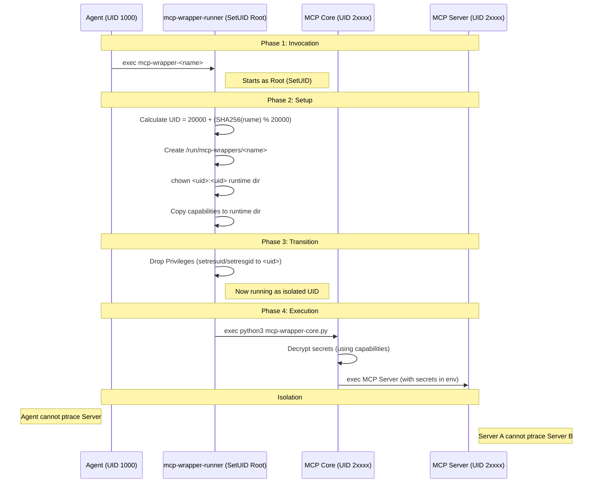

# MCP Server Isolation Architecture

This document details the security architecture used to isolate Model Context Protocol (MCP) servers from the main agent process and from each other.

## Problem Statement

AI agents (running as `agentuser`, UID 1000) execute arbitrary code and process untrusted input. MCP servers often hold sensitive credentials (API keys, tokens) to access external tools. 

1.  **Agent Compromise**: If an MCP server runs as the same user as the agent, a compromised agent process could use `ptrace` or read `/proc/<pid>/mem` to extract these credentials.
2.  **Lateral Movement**: If all MCP servers run as a single shared user (e.g., `agentcli`), a compromised MCP server could attack other MCP servers to steal their secrets.

## Solution: Per-Process UID Isolation

To prevent both threats, we implement a **strict per-process isolation model**. Every MCP server runs as a mathematically distinct, deterministic UID. This leverages the Linux kernel's standard process isolation to ensure that no process can inspect or modify the memory of another.

### Components

1.  **`agentuser` (UID 1000)**: The main user for the container. Runs the agent logic, VS Code server, and shell.
2.  **`mcp-wrapper-runner`**: A setuid-root Rust binary that acts as the secure launcher.
3.  **Dynamic UIDs**: A reserved range of UIDs (20000-40000) used for MCP servers.

## Architecture Diagram

## Detailed Workflow

### 1. Invocation

The agent calls a wrapper script (e.g., `mcp-wrapper-git`), which is a symlink to `/usr/local/bin/mcp-wrapper-runner`.

### 2. Secure Setup (Root)

The runner starts with root privileges (via the setuid bit) to perform setup that `agentuser` cannot do:

*   **Identity Calculation**: Computes a deterministic UID based on the wrapper name: `20000 + (SHA256(name) % 20000)`. This ensures the same tool always gets the same UID, but different tools get different UIDs.
*   **Runtime Directory**: Creates `/run/mcp-wrappers/<name>` and transfers ownership to the target UID. This serves as the `HOME` and `TMPDIR` for the isolated process.
*   **Capability Transfer**: Copies the sealed capability bundle from the agent's config directory to the isolated runtime directory.

### 3. Privilege Drop

The runner permanently drops privileges to the calculated UID/GID using `setresuid`/`setresgid`. It clears the environment of potentially dangerous variables (except those explicitly allowed) and re-injects the `LD_PRELOAD` audit shim.

### 4. Execution (Isolated UID)

The runner executes the core wrapper logic (`mcp-wrapper-core.py`).

*   **Secret Redemption**: The core wrapper decrypts the secrets using the session key found in the capability bundle.
*   **Launch**: It launches the actual MCP server with the secrets injected into its environment.

## Security Guarantees

1.  **Agent Isolation**: `agentuser` cannot access the MCP server's memory or secrets.
2.  **Inter-MCP Isolation**: "Git" cannot access "Postgres" secrets, because they run as different UIDs.
3.  **No Sudo**: The system does not rely on `sudo` configuration or the `sudo` binary.
4.  **Minimal Attack Surface**: The setuid binary is a small, focused Rust program that does one thing: setup and drop privileges.

## Filesystem Permissions

| Path | Owner | Mode | Purpose |
|------|-------|------|---------|
| `/run/mcp-wrappers/<name>` | `UID 2xxxx` | `0700` | Private runtime state for the MCP server |
| `/usr/local/bin/mcp-wrapper-runner` | `root` | `4755` | Setuid launcher |
| `/usr/local/libexec/mcp-wrapper-core.py` | `root` | `0755` | Core logic (read-only to users) |

## Audit Logging

The `LD_PRELOAD` audit shim is injected into the isolated process, ensuring that all file access and network activity performed by the MCP server is still logged to the central audit log, even though it runs as a different user.
