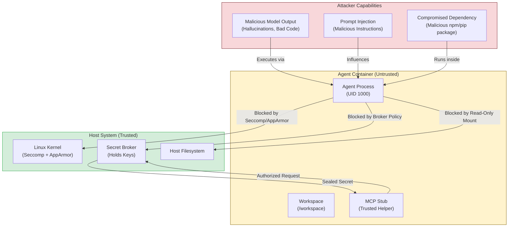

# Security Model

This document defines the security architecture, trust boundaries, and isolation mechanisms of the ContainAI runtime.

## Trust Boundaries

The system is designed around three distinct trust zones:

### 1. The Host (Trusted)
The host machine (developer's laptop or CI runner) is the **Trusted Computing Base (TCB)**.
- **Assets**: Source code, SSH keys, API tokens, GPG keys.
- **Responsibilities**: Orchestration, secret sealing, audit logging.
- **Assumption**: The host is secure; compromise of the host is critical.

### 2. The Agent Container (Untrusted)
The container running the AI agent is considered **Untrusted**.
- **Risk**: The AI model executes arbitrary code, processes untrusted inputs, and may hallucinate or be prompt-injected.
- **Restrictions**:
    - **Read-Only Root**: The root filesystem is read-only.
    - **No Privileges**: Runs as a non-root user (`UID 1000`) with `no-new-privileges:true`.
    - **Seccomp/AppArmor**: Restricted kernel syscalls (no `ptrace`, `mount`, etc.).
    - **Ephemeral**: The container is destroyed after the session.

### 3. The Broker & Sidecars (Trusted Bridge)
Helper processes that bridge the gap between the Host and the Container.
- **Secret Broker**: Validates requests for secrets and issues ephemeral tokens.
- **Proxy Sidecar**: Enforces network policies and logs traffic.
- **Log Forwarder**: Exfiltrates logs to a secure destination.

## Data Flow & Isolation

### Filesystem Isolation
- **Source Code**: Mounted **Read-Only** by default. The agent modifies the source code on the host only via controlled mechanisms.
- **Workspace**: A copy-on-write overlay or temporary volume is used for the agent's working directory.
- **Writes**: Changes are written to the container's writable layer.
- **Sync**: To persist changes, the agent performs a `git push` to a **Local Remote** (a bare repo on the host). The host then fast-forwards its working tree. This prevents the container from corrupting the host's `.git` index or locking files.

### Secret Management
**Principle**: Secrets are passed via secure mechanisms, not environment variables.

1.  **Sealing**: The Launcher collects secrets from the host (e.g., `GITHUB_TOKEN`) and encrypts/seals them into a **Capability Bundle**.
2.  **Mounting**: This bundle is mounted into the container at `/run/containai` (a RAM-backed `tmpfs`).
3.  **Access**: The agent process accesses the bundle only via the MCP Stub. Instead, it makes requests to the **MCP Stub**.
4.  **Unsealing**: The MCP Stub validates the request and retrieves the specific secret from the bundle only when needed.

### Network Isolation
- **Default**: Outbound access is permitted but routed through a **Squid Proxy Sidecar** for audit logging.
- **Restricted**: (`--network-proxy restricted`) The container is launched with `--network none`. No external access is possible.
- **DNS**: The container uses the host's DNS settings but cannot access localhost services unless explicitly configured.

## Threat Model & Attack Surface

The following diagram illustrates the primary attack surfaces and the corresponding security controls.

| Threat | Description | Mitigation |
|--------|-------------|------------|
| **Malicious Model Output** | The AI generates code that deletes files or exfiltrates data. | **Container Isolation**: Read-only root, copy-on-write workspace. **Network Policy**: Egress filtering via Squid. |
| **Prompt Injection** | An attacker embeds instructions in a file that the agent reads, hijacking its behavior. | **Least Privilege**: Agent runs as non-root. **No Secrets**: Secrets are not in env vars. **Restricted Network**: Can block outbound calls. |
| **Supply Chain Attack** | The agent installs a malicious package (npm/pip) that tries to steal credentials. | **Secret Broker**: Credentials are not on disk. **Seccomp**: Blocks `ptrace` and other snooping syscalls. **Ephemeral**: Container is destroyed after use. |
| **Container Escape** | The agent tries to break out of the container to access the host. | **Hardened Runtime**: `no-new-privileges`, `cap-drop=ALL`, strict Seccomp/AppArmor profiles. |
| **Secret Exfiltration** | The agent tries to send secrets to a remote server. | **Traffic Analysis**: All outbound traffic logged via Squid. **Short-lived Tokens**: Secrets are ephemeral. |

## Defense in Depth

We employ a multi-layered security approach:

### Layer 1: Kernel Hardening
- **Seccomp**: We use a custom profile (template: `host/profiles/seccomp-containai-agent.json`, runtime: `seccomp-containai-agent-<channel>.json`) that hard-denies dangerous syscalls like `ptrace`, `mount`, `keyctl`, and `bpf`. Process creation (`clone`, `clone3`) is allowed for normal operation.
- **AppArmor**: A mandatory access control profile (`containai-agent-<channel>`) restricts file access (deny `/proc`, `/sys` writes). Mount rules are scoped only to sandbox namespace operations.
- **Capabilities**: All Linux capabilities are dropped (`--cap-drop=ALL`), then `CAP_SYS_ADMIN` is added for sandbox namespace isolation (`unshare --mount --pid`). The sandbox explicitly verifies caps are dropped before executing user commands.

### Layer 2: Process Isolation
- **User Namespaces**: The agent runs as a non-root user (`UID 1000`).
- **No New Privileges**: The `no-new-privileges` flag prevents the process from gaining privileges via setuid binaries.
- **PID Limits**: Strict limits on the number of processes (`--pids-limit`) prevent fork bombs.

### Layer 3: Identity & Secret Management
- **Secret Broker**: Secrets are never stored on the container's disk. They are brokered Just-In-Time (JIT) into memory (`tmpfs`) only when needed by a specific MCP stub.
- **Memory-Only**: Secrets are injected via `memfd_create` or tmpfs and are wiped immediately after use.

### Layer 4: Network Governance
- **Sidecar Proxy**: All HTTP/HTTPS traffic is routed through a transparent Squid proxy sidecar.
- **Egress Filtering**: By default, traffic is allowed but logged. In `restricted` mode, all outbound traffic is blocked.
- **DNS**: The container uses the host's DNS but cannot access localhost services unless explicitly configured.

For detailed profile design rationale and diagrams, see [Profile Architecture](profile-architecture.md).

## Audit & Compliance

All security-relevant events are logged to the host's audit log (`~/.config/containai/security-events.log`):
- **Session Start**: Records the session manifest hash.
- **Secret Access**: Records which capability was requested and when.
- **Overrides**: Records if the user bypassed integrity checks (`CONTAINAI_DIRTY_OVERRIDE_TOKEN`).
- **Network Traffic**: The Squid proxy logs all HTTP/HTTPS CONNECT requests.
