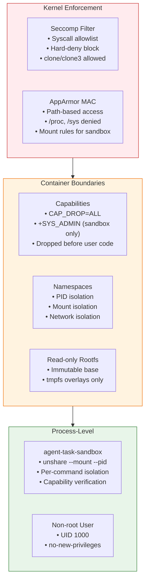
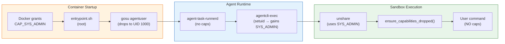
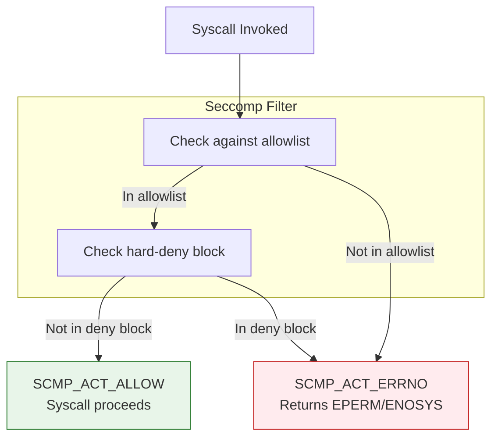
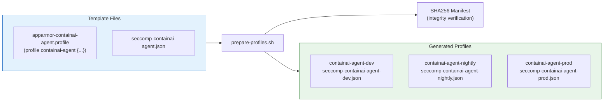
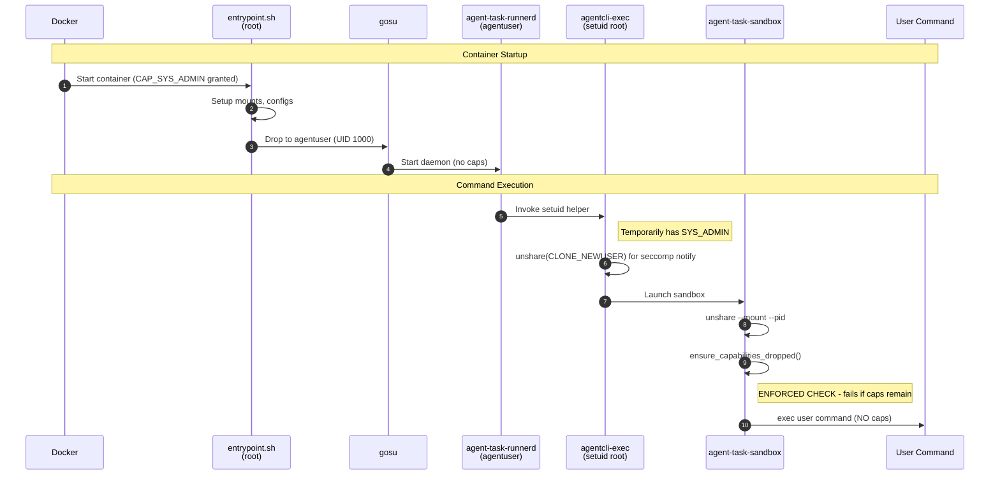

# ContainAI Security Profile Architecture

This document explains the security profile design and the rationale behind each configuration choice.

## Defense-in-Depth Model

ContainAI uses multiple overlapping security layers. Each layer provides independent protection—if one layer is bypassed, others remain intact.



| Layer | Mechanism | Primary Role |
|-------|-----------|--------------|
| 1 | **Seccomp** | Syscall filtering - blocks dangerous syscalls at kernel level |
| 2 | **AppArmor** | MAC policy - path-based access control |
| 3 | **Capabilities** | Privilege restriction - drops all caps except SYS_ADMIN |
| 4 | **Namespaces** | Resource isolation - pid, mount, network via Docker |
| 5 | **Read-only rootfs** | Immutable base - prevents persistent modifications |
| 6 | **Sandbox** | Process isolation - each command runs in isolated namespace |

## Capability Requirements

### Capability Flow



### CAP_SYS_ADMIN

**Required**: Yes  
**Reason**: The `agent-task-sandbox` uses `unshare --mount --pid --mount-proc` to create isolated namespaces for each command execution. This requires CAP_SYS_ADMIN.

**Security**: The agent process itself never has CAP_SYS_ADMIN. The capability is:
1. Granted to the container at startup
2. Used by privileged setup processes (root entrypoint, setuid helpers)
3. Explicitly dropped by `agent_task_sandbox` before executing user commands
4. Verified dropped via integration test `test_capability_isolation`

### CAP_NET_ADMIN

**Required**: No (removed)  
**Reason**: No code path uses network administration capabilities. Previously included but analysis showed it was vestigial.

## Seccomp Profile Design

**File**: `host/profiles/seccomp-containai-agent.json`

### Syscall Filtering Model



### Default Action
```json
"defaultAction": "SCMP_ACT_ERRNO"
```
All syscalls not explicitly allowed are blocked with EPERM.

### Key Allowed Syscalls

| Syscall | Reason |
|---------|--------|
| `clone`, `clone3` | Process creation (fork/exec) - essential for any multi-process workload |
| `unshare` | Namespace isolation for sandbox |
| `io_uring_*` | Node.js uses io_uring for async I/O |
| `execve`, `execveat` | Running programs |

### Hard-Deny Block

The profile ends with a "hard deny" block that blocks dangerous syscalls regardless of capabilities:

```json
{
    "names": ["mount", "ptrace", "setns", "pivot_root", ...],
    "action": "SCMP_ACT_ERRNO",
    "errnoRet": 38,
    "comment": "Hard deny high-risk syscalls even if capabilities are reintroduced"
}
```

This provides defense-in-depth: even if CAP_SYS_ADMIN is somehow retained, these syscalls remain blocked.

## AppArmor Profile Design

**File**: `host/profiles/apparmor-containai-agent.profile`

### Broad Grants

```
network,
capability,
file,
```

These are intentionally broad because agent containers must compile code, install packages, and run various development tools. Fine-grained restrictions would break legitimate use cases.

**Security is enforced via other layers** (seccomp hard-deny, cap-drop, sandbox isolation).

### Mount Rules

The mount rules exist for `unshare --mount` in the sandbox, NOT for the entrypoint:

```apparmor
mount options=(rw,remount) -> /proc/,
mount fstype=tmpfs -> /run/agent-secrets/,
...
```

Docker's `--tmpfs` flags handle actual tmpfs creation. These rules permit the propagation changes needed by `unshare`.

### Ptrace Denial

```apparmor
deny ptrace,
```

Ptrace is hard-blocked by seccomp. The AppArmor deny provides defense-in-depth and prevents audit log noise.

## WSL2 Limitations

WSL2 kernels (as of 5.15.x) often lack `CONFIG_SECCOMP_USER_NOTIFICATION`. The runtime handles this gracefully:

1. `agentcli_exec.rs` detects WSL via `/proc/version`
2. If seccomp notify fails with EBUSY, returns `Ok(None)`
3. System falls back to the Audit Shim for observability
4. No crash, just reduced syscall interception capability

**Reference**: microsoft/WSL#9783

## Profile Generation

Channel-specific profiles are generated from templates to support different release channels (dev, nightly, prod):



The `prepare-profiles.sh` script:
1. Replaces profile names with channel suffixes
2. Updates `peer=` references in AppArmor
3. Generates SHA256 manifest for integrity verification

## Privilege Flow

The following diagram shows how privileges are managed from container startup through command execution:



**Key invariants**:
- `agentuser` processes **never** have CAP_SYS_ADMIN
- User commands **always** run with no capabilities
- The `ensure_capabilities_dropped()` check is enforced, not optional

## Testing

Integration tests verify the security model:

- `test_capability_isolation`: Verifies agent process has no SYS_ADMIN
- `test_seccomp_ptrace_block`: Verifies ptrace syscall returns ENOSYS
- `test_agent_task_runner_seccomp`: Verifies seccomp notify works (skipped on WSL)
