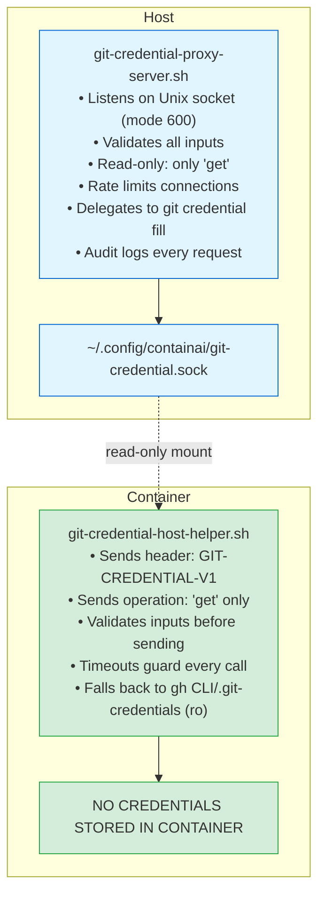
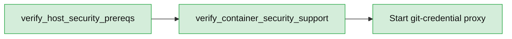

# Git Credential Proxy Security Architecture

## Overview

The credential proxy uses a **READ-ONLY** socket-based architecture to provide maximum security when accessing git credentials from containers. This document explains the security model and design decisions.

## Security Model

### Principle: Containers Can Only Read Credentials

**Key Decision:** Containers can ONLY perform `get` operations. They CANNOT `store` or `erase` credentials.

**Rationale:**
1. **No Legitimate Use Case**: Containers should never need to modify host credentials
2. **Credential Poisoning Prevention**: Compromised container cannot corrupt host credential store
3. **Minimal Attack Surface**: Reduces operations from 3 (get/store/erase) to 1 (get)
4. **Least Privilege**: Containers get exactly what they need, nothing more

### Threat Model

**Threats We Mitigate:**

1. **Compromised Container**
   - Container malware cannot steal credentials (they never enter container)
   - Cannot modify/corrupt host credentials (read-only access)
   - Cannot DoS credential service (rate limiting, timeouts)
   - Cannot pollute audit logs (request validation)

2. **Network-Based Attacks**
   - Socket only accessible to user's processes (mode 600)
   - No network exposure (Unix socket only)
   - No DNS rebinding or SSRF (strict hostname validation)

3. **Resource Exhaustion**
   - Connection limits prevent DoS
   - Request size limits prevent memory exhaustion
   - Timeouts prevent connection holding
   - Rate limiting per container possible

4. **Injection Attacks**
   - All inputs validated with strict regex
   - Length limits on all fields
   - Log sanitization prevents log injection
   - CRLF injection prevented

**Out of Scope (Accept Risk):**

1. **Root User Compromise**: If attacker has root, game over anyway
2. **Host Compromise**: Proxy runs on host, host compromise is total
3. **Physical Access**: Physical access = root access typically

## Architecture

### Components



### Protocol

**Version 1 Protocol:**

```
Client → Server: "GIT-CREDENTIAL-PROXY-V1\n"
Client → Server: "get\n"
Client → Server: "protocol=https\n"
Client → Server: "host=github.com\n"
Client → Server: "\n"  (blank line)
Server → Client: "protocol=https\n"
Server → Client: "host=github.com\n"
Server → Client: "username=user\n"
Server → Client: "password=token\n"
Server → Client: "\n"  (blank line)
[Connection closed]
```

**Protocol Design:**
- Version header allows protocol evolution
- Only `get` operation allowed (enforced by server)
- Blank line terminates request/response
- Server closes connection after response
- Timeouts prevent hanging connections

## Input Validation

### Server-Side Validation

All inputs validated with strict rules:

| Field      | Validation                                    | Max Length |
|------------|----------------------------------------------|------------|
| `protocol` | Must be: `http`, `https`, `git`, `ssh`       | 10 bytes   |
| `host`     | RFC-compliant hostname (alphanumeric, -, .)  | 255 bytes  |
| `path`     | Printable characters only, no null bytes     | 255 bytes  |
| `username` | Alphanumeric + `._@-` only                   | 128 bytes  |

**Total Request Limit:** 4096 bytes

### Why Strict Validation?

1. **Prevent Injection**: CRLF, null byte, control character injection
2. **Prevent DoS**: Length limits prevent memory exhaustion
3. **Prevent SSRF**: Hostname validation prevents DNS rebinding
4. **Audit Quality**: Clean inputs = clean audit logs

## Security Properties

### What We Achieve

✅ **Credential Isolation**: Credentials never enter container filesystem  
✅ **Read-Only Access**: Containers cannot modify host credentials  
✅ **Audit Trail**: All requests logged with validation results  
✅ **Rate Limiting**: Connection limits prevent DoS  
✅ **Input Validation**: All inputs sanitized and validated  
✅ **Timeout Protection**: Prevents resource holding attacks  
✅ **Minimal Privilege**: Containers get minimum necessary access  
✅ **Defense in Depth**: Multiple layers of validation  

### Comparison with Alternatives

| Approach                  | Security | Pros | Cons |
|---------------------------|----------|------|------|
| **Socket Proxy (Current)**| ⭐⭐⭐⭐⭐ | Max security, audit trail, rate limiting | Requires server process |
| Mount .git-credentials RO | ⭐⭐⭐   | Simple | Credentials visible in container |
| Mount .git-credentials RW | ⭐       | Git works | Container can corrupt credentials |
| gh CLI Only               | ⭐⭐⭐⭐  | OAuth tokens | GitHub only |
| SSH Agent Forwarding      | ⭐⭐⭐⭐  | Keys stay on host | SSH only, not HTTPS |

## Rate Limiting

**Current Limits:**
- Max concurrent connections: 10
- Connection timeout: 5 seconds
- Request size limit: 4096 bytes
- Operation timeout: 10 seconds (git credential fill)

**Per-Container Rate Limiting (Future):**
- Could use SO_PEERCRED to identify container
- Track requests per container UID
- Implement per-container quotas

## Audit Logging

**What We Log:**
- Timestamp (ISO 8601)
- Request ID (unique per request)
- Operation (always 'get')
- Host being accessed
- Username (if provided)
- Success/failure
- Denial reasons

**Log Location:** `~/.config/containai/git-credential-proxy.log`

**What We DON'T Log (Security):**
- Passwords or tokens (never logged)
- Full credential responses
- Sensitive paths containing secrets

**Log Sanitization:**
- All inputs sanitized before logging
- Control characters removed
- Length limited to prevent log flooding

## Edge Cases Handled

### Multiple Containers

✅ **Concurrent Access**: socat with fork handles multiple containers  
✅ **Rate Limiting**: Connection counter prevents DoS  
✅ **Fair Access**: No container can monopolize socket  

### Socket Not Available

✅ **Graceful Fallback**: Container helper falls back to file-based credentials  
✅ **No Breakage**: Git operations continue to work  
✅ **Clear Status**: Entrypoint shows which mode is active  

### Server Crash/Restart

✅ **Auto-Reconnect**: Container helper tries socket on each request  
✅ **Fallback**: Falls back to files if socket unavailable  
✅ **No Hanging**: Timeouts prevent indefinite waiting  

### Malformed Requests

✅ **Validation**: All inputs validated before processing  
✅ **Early Rejection**: Invalid requests rejected immediately  
✅ **Logged**: All rejections logged with reason  

### Resource Exhaustion

✅ **Connection Limits**: Max 10 concurrent connections  
✅ **Request Size Limits**: Max 4KB per request  
✅ **Timeouts**: All operations timeout (5-10 seconds)  
✅ **Memory Bounded**: No unbounded reads  

## Future Enhancements

### Container Authentication (Optional)

Could use SO_PEERCRED to:
- Identify which container made request
- Implement per-container policies
- Track per-container quotas
- Require container to prove identity

**Trade-offs:**
- ➕ Better audit trail (know which container)
- ➕ Per-container rate limiting
- ➕ Can deny specific containers
- ➖ More complex implementation
- ➖ Doesn't defend against root compromise

### Policy Enforcement

Could implement:
- Allowlist/denylist of hosts
- Require approval for new hosts
- Time-based access restrictions
- Notification on credential access

### Credential Caching

Could cache credentials in server memory:
- Reduces git credential fill calls
- Improves performance
- Increases attack surface (memory dump risk)

**Decision**: Not implemented - security over performance

## Testing

### Security Tests

Required before deployment:

1. **Validation Tests**
   - ✅ Reject invalid hostnames
   - ✅ Reject oversized requests
   - ✅ Reject invalid protocols
   - ✅ Reject control characters

2. **Operation Tests**
   - ✅ Allow `get` operation
   - ✅ Block `store` operation
   - ✅ Block `erase` operation
   - ✅ Block unknown operations

3. **Rate Limiting Tests**
   - ✅ Accept up to 10 concurrent connections
   - ✅ Reject 11th concurrent connection
   - ✅ Timeout hung connections

4. **Injection Tests**
   - ✅ CRLF injection in host
   - ✅ Null byte injection
   - ✅ Control character injection
   - ✅ Log injection attempts

## Deployment

### Prerequisites

**Required on host:**
- `socat` (for socket server)
- `bash` 4.0+ (for validation)
- `git` (for credential delegation)

**Required in container:**
- `socat` (for socket client)
- `bash` 4.0+
- Standard Unix utilities (cut, grep, timeout)

#### Host Security Preflight

The same launcher checks that guard the secret broker also protect the credential proxy:



- If AppArmor or seccomp are missing, the launcher halts before exposing the socket, preventing unconfined containers from connecting. These guardrails are mandatory and cannot be bypassed.

### Starting the Server

Server auto-starts when launching container:

```bash
# Launcher script handles this automatically
./host/launchers/entrypoints/launch-agent-dev copilot

# Or start manually:
./host/utils/git-credential-proxy-server.sh \
    ~/.config/containai/git-credential.sock \
    ~/.config/containai/git-credential-proxy.log
```

### Monitoring

Check server status:

```bash
# Check if socket exists
ls -la ~/.config/containai/git-credential.sock

# View recent logs
tail -f ~/.config/containai/git-credential-proxy.log

# Count active connections (approximate)
cat /tmp/git-cred-proxy-*.count 2>/dev/null || echo "0"
```

## Security Checklist

Before deploying to production:

- [ ] Verify `socat` is installed on host
- [ ] Verify socket permissions are 600
- [ ] Verify socket path is under user home directory
- [ ] Test with invalid inputs (should be rejected)
- [ ] Test with oversized requests (should be rejected)
- [ ] Test `store` operation (should be blocked)
- [ ] Test concurrent access from multiple containers
- [ ] Verify audit logs are being written
- [ ] Verify no credentials appear in logs
- [ ] Test fallback when socket unavailable
- [ ] Verify timeouts work (don't hang indefinitely)

## References

- [Git Credential API](https://git-scm.com/docs/gitcredentials)
- [Unix Socket Security](https://www.man7.org/linux/man-pages/man7/unix.7.html)
- [Principle of Least Privilege](https://en.wikipedia.org/wiki/Principle_of_least_privilege)
- [OWASP Input Validation](https://cheatsheetseries.owasp.org/cheatsheets/Input_Validation_Cheat_Sheet.html)
