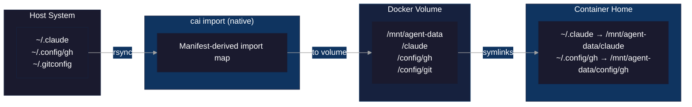
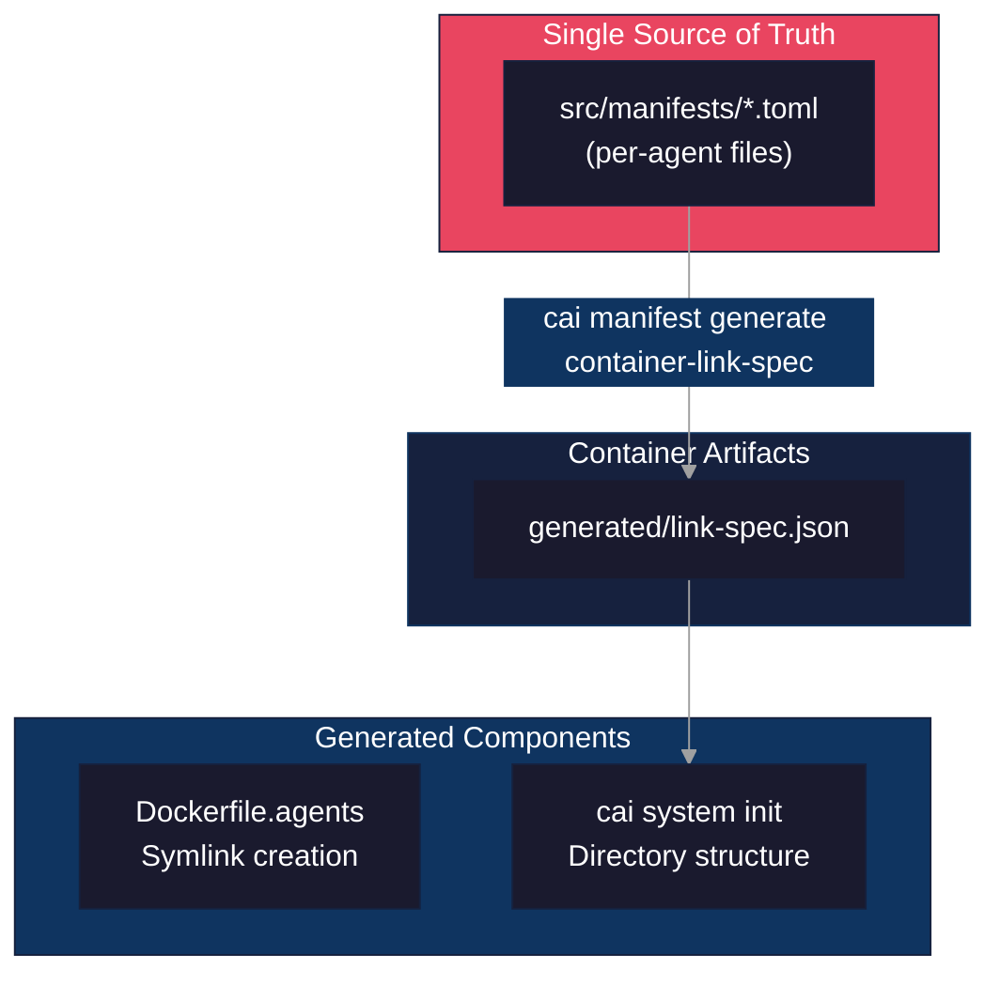

# Config Sync Architecture

This document describes the config synchronization system between the host and container data volume.

## Overview



The import/sync system has three main components that must stay synchronized:
1. **Host-side sync** (`src/cai/NativeLifecycleCommandRuntime.cs`): Uses manifest-driven native copy rules for source->target mappings
2. **Container image symlinks** (`src/container/Dockerfile.agents`): Creates build-time symlinks from home directories to `/mnt/agent-data`
3. **Runtime init** (`src/cai/ContainerRuntimeCommandService.cs`): Ensures volume directory structure exists on first boot



## Per-Agent Manifest Structure

Configuration is split into per-agent manifest files for maintainability:

```
src/manifests/
├── 00-common.toml    # Shared entries (fonts, agents directory)
├── 01-shell.toml     # Shell configuration (bash, zsh)
├── 02-git.toml       # Git configuration
├── 03-gh.toml        # GitHub CLI
├── 04-editors.toml   # Vim, Neovim
├── 05-vscode.toml    # VS Code Server
├── 06-ssh.toml       # SSH (disabled by default)
├── 07-tmux.toml      # tmux
├── 08-prompt.toml    # Starship, oh-my-posh
├── 10-claude.toml    # Claude Code
├── 11-codex.toml     # Codex
├── 12-gemini.toml    # Gemini
├── ...               # Other agents
```

Numeric prefixes ensure deterministic processing order matching the original monolithic manifest section order.

### Manifest File Format

Each manifest can have an optional `[agent]` section and `[[entries]]`:

```toml
# src/manifests/10-claude.toml

[agent]
name = "claude"
binary = "claude"
default_args = ["--dangerously-skip-permissions"]
aliases = []
optional = false

[[entries]]
source = ".claude.json"
target = "claude/claude.json"
container_link = ".claude.json"
flags = "fjs"
```

The `[agent]` section is only present for agents that need launch wrappers (agents with autonomous mode flags).

## Component Analysis

### 1. Import Sync Map (manifest-derived)

The manifest-derived import mapping defines what gets synced from host `$HOME` to the data volume. This table shows representative examples; see `src/manifests/*.toml` for the complete list.

| Source | Target | Flags | Description |
|--------|--------|-------|-------------|
| `/source/.claude.json` | `/target/claude/claude.json` | `fjs` | Claude root config (file, JSON init, secret) |
| `/source/.claude/.credentials.json` | `/target/claude/credentials.json` | `fs` | Claude credentials (file, secret) |
| `/source/.claude/settings.json` | `/target/claude/settings.json` | `fj` | Claude settings (file, JSON init) |
| `/source/.claude/settings.local.json` | `/target/claude/settings.local.json` | `f` | Claude local settings (file) |
| `/source/.claude/plugins` | `/target/claude/plugins` | `d` | Claude plugins (directory) |
| `/source/.claude/skills` | `/target/claude/skills` | `d` | Claude skills (directory) |
| `/source/.config/gh` | `/target/config/gh` | `ds` | GitHub CLI config (directory, secret) |
| `/source/.config/opencode/opencode.json` | `/target/config/opencode/opencode.json` | `fjs` | OpenCode config (file, JSON init, secret) |
| `/source/.config/opencode/agents` | `/target/config/opencode/agents` | `d` | OpenCode agents (directory) |
| `/source/.tmux.conf` | `/target/config/tmux/tmux.conf` | `f` | tmux dotfile config (fallback) |
| `/source/.config/tmux` | `/target/config/tmux` | `d` | tmux XDG config (preferred) |
| `/source/.local/share/tmux` | `/target/local/share/tmux` | `d` | tmux data (directory) |
| `/source/.local/share/fonts` | `/target/local/share/fonts` | `d` | User fonts (directory) |
| `/source/.agents` | `/target/agents` | `d` | Common agents directory (directory) |
| `/source/.bash_aliases` | `/target/shell/bash_aliases` | `f` | Bash aliases (file) |
| `/source/.bashrc.d` | `/target/shell/bashrc.d` | `d` | Bash startup scripts (directory) |
| `/source/.zshrc` | `/target/shell/zshrc` | `f` | Zsh config (file) |
| `/source/.zprofile` | `/target/shell/zprofile` | `f` | Zsh profile (file) |
| `/source/.inputrc` | `/target/shell/inputrc` | `f` | Readline config (file) |
| `/source/.oh-my-zsh/custom` | `/target/shell/oh-my-zsh-custom` | `d` | Oh-My-Zsh custom plugins/themes (directory) |
| `/source/.vimrc` | `/target/editors/vimrc` | `f` | Vim config (file) |
| `/source/.vim` | `/target/editors/vim` | `d` | Vim directory (directory) |
| `/source/.config/nvim` | `/target/config/nvim` | `d` | Neovim config (directory) |
| `/source/.config/starship.toml` | `/target/config/starship.toml` | `f` | Starship prompt config (file) |
| `/source/.config/oh-my-posh` | `/target/config/oh-my-posh` | `d` | Oh-My-Posh themes (directory) |
| `/source/.vscode-server/extensions` | `/target/vscode-server/extensions` | `d` | VS Code extensions (directory) |
| `/source/.vscode-server/data/Machine` | `/target/vscode-server/data/Machine` | `d` | VS Code machine settings (directory) |
| `/source/.vscode-server/data/User/mcp` | `/target/vscode-server/data/User/mcp` | `d` | VS Code MCP config (directory) |
| `/source/.vscode-server/data/User/prompts` | `/target/vscode-server/data/User/prompts` | `d` | VS Code prompts (directory) |
| `/source/.vscode-server-insiders/extensions` | `/target/vscode-server-insiders/extensions` | `d` | VS Code Insiders extensions (directory) |
| `/source/.vscode-server-insiders/data/Machine` | `/target/vscode-server-insiders/data/Machine` | `d` | VS Code Insiders machine settings (directory) |
| `/source/.vscode-server-insiders/data/User/mcp` | `/target/vscode-server-insiders/data/User/mcp` | `d` | VS Code Insiders MCP config (directory) |
| `/source/.vscode-server-insiders/data/User/prompts` | `/target/vscode-server-insiders/data/User/prompts` | `d` | VS Code Insiders prompts (directory) |
| `/source/.copilot/config.json` | `/target/copilot/config.json` | `f` | Copilot config (file) |
| `/source/.copilot/mcp-config.json` | `/target/copilot/mcp-config.json` | `f` | Copilot MCP config (file) |
| `/source/.copilot/skills` | `/target/copilot/skills` | `d` | Copilot skills (directory) |
| `/source/.gemini/google_accounts.json` | `/target/gemini/google_accounts.json` | `fs` | Gemini accounts (file, secret) |
| `/source/.gemini/oauth_creds.json` | `/target/gemini/oauth_creds.json` | `fs` | Gemini OAuth (file, secret) |
| `/source/.gemini/settings.json` | `/target/gemini/settings.json` | `fj` | Gemini settings (file, JSON init) |
| `/source/.gemini/GEMINI.md` | `/target/gemini/GEMINI.md` | `f` | Gemini instructions (file) |
| `/source/.codex/config.toml` | `/target/codex/config.toml` | `f` | Codex config (file) |
| `/source/.codex/auth.json` | `/target/codex/auth.json` | `fs` | Codex auth (file, secret) |
| `/source/.codex/skills` | `/target/codex/skills` | `dx` | Codex skills (directory, exclude .system/) |
| `/source/.local/share/opencode/auth.json` | `/target/local/share/opencode/auth.json` | `fs` | OpenCode auth (file, secret) |

**Flags:**
- `d` = directory
- `f` = file
- `j` = initialize JSON with `{}` if empty
- `m` = mirror mode (`--delete` to remove files not in source)
- `s` = secret (600 for files, 700 for dirs)
- `x` = exclude `.system/` subdirectory

### 2. Dockerfile.agents Symlinks

Symlinks created in the container image pointing to `/mnt/agent-data`:

| Container Path | Volume Target | Notes |
|----------------|---------------|-------|
| `~/.claude/.credentials.json` | `/mnt/agent-data/claude/credentials.json` | |
| `~/.claude.json` | `/mnt/agent-data/claude/claude.json` | Root-level file |
| `~/.claude/settings.json` | `/mnt/agent-data/claude/settings.json` | |
| `~/.claude/plugins` | `/mnt/agent-data/claude/plugins` | Directory symlink |
| `~/.claude/skills` | `/mnt/agent-data/claude/skills` | Directory symlink |
| `~/.copilot/config.json` | `/mnt/agent-data/copilot/config.json` | |
| `~/.copilot/mcp-config.json` | `/mnt/agent-data/copilot/mcp-config.json` | |
| `~/.copilot/skills` | `/mnt/agent-data/copilot/skills` | Uses rm -rf first |
| `~/.gemini/google_accounts.json` | `/mnt/agent-data/gemini/google_accounts.json` | |
| `~/.gemini/oauth_creds.json` | `/mnt/agent-data/gemini/oauth_creds.json` | |
| `~/.gemini/settings.json` | `/mnt/agent-data/gemini/settings.json` | |
| `~/.gemini/GEMINI.md` | `/mnt/agent-data/gemini/GEMINI.md` | |
| `~/.codex/auth.json` | `/mnt/agent-data/codex/auth.json` | |
| `~/.codex/config.toml` | `/mnt/agent-data/codex/config.toml` | |
| `~/.codex/skills` | `/mnt/agent-data/codex/skills` | Uses rm -rf first |
| `~/.local/share/opencode/auth.json` | `/mnt/agent-data/local/share/opencode/auth.json` | |
| `~/.vscode-server/data/Machine/settings.json` | `/mnt/agent-data/vscode-server/data/Machine/settings.json` | |
| `~/.vscode-server/extensions` | `/mnt/agent-data/vscode-server/extensions` | Directory symlink |
| `~/.vscode-server/data/User/mcp.json` | `/mnt/agent-data/vscode-server/data/User/mcp.json` | |
| `~/.vscode-server/data/User/prompts` | `/mnt/agent-data/vscode-server/data/User/prompts` | Directory symlink |
| `~/.vscode-server/data/User/mcp` | `/mnt/agent-data/vscode-server/data/User/mcp` | Directory symlink |
| `~/.vscode-server-insiders/data/Machine/settings.json` | `/mnt/agent-data/vscode-server-insiders/data/Machine/settings.json` | |
| `~/.vscode-server-insiders/extensions` | `/mnt/agent-data/vscode-server-insiders/extensions` | Directory symlink |
| `~/.vscode-server-insiders/data/User/mcp.json` | `/mnt/agent-data/vscode-server-insiders/data/User/mcp.json` | |
| `~/.vscode-server-insiders/data/User/prompts` | `/mnt/agent-data/vscode-server-insiders/data/User/prompts` | Directory symlink |
| `~/.vscode-server-insiders/data/User/mcp` | `/mnt/agent-data/vscode-server-insiders/data/User/mcp` | Directory symlink |
| `~/.config/gh` | `/mnt/agent-data/config/gh` | Directory symlink |
| `~/.config/opencode` | `/mnt/agent-data/config/opencode` | Directory symlink |
| `~/.config/tmux` | `/mnt/agent-data/config/tmux` | Directory symlink |
| `~/.local/share/tmux` | `/mnt/agent-data/local/share/tmux` | Directory symlink |
| `~/.local/share/fonts` | `/mnt/agent-data/local/share/fonts` | Directory symlink |
| `~/.agents` | `/mnt/agent-data/agents` | Directory symlink |
| `~/.bash_aliases_imported` | `/mnt/agent-data/shell/bash_aliases` | Note: different name |
| `~/.zshrc` | `/mnt/agent-data/shell/zshrc` | Zsh config |
| `~/.zprofile` | `/mnt/agent-data/shell/zprofile` | Zsh profile |
| `~/.inputrc` | `/mnt/agent-data/shell/inputrc` | Readline config |
| `~/.oh-my-zsh/custom` | `/mnt/agent-data/shell/oh-my-zsh-custom` | Uses rm -rf first |
| `~/.vimrc` | `/mnt/agent-data/editors/vimrc` | Vim config |
| `~/.vim` | `/mnt/agent-data/editors/vim` | Uses rm -rf first |
| `~/.config/nvim` | `/mnt/agent-data/config/nvim` | Uses rm -rf first |
| `~/.config/starship.toml` | `/mnt/agent-data/config/starship.toml` | Starship prompt |
| `~/.config/oh-my-posh` | `/mnt/agent-data/config/oh-my-posh` | Oh-My-Posh themes |

### 3. Runtime Init Directory Structure

Directories and files created on first boot:

**Directories:**
- `/mnt/agent-data/claude`
- `/mnt/agent-data/claude/plugins`
- `/mnt/agent-data/claude/skills`
- `/mnt/agent-data/config/gh`
- `/mnt/agent-data/config/opencode`
- `/mnt/agent-data/config/tmux`
- `/mnt/agent-data/config/nvim`
- `/mnt/agent-data/config/oh-my-posh`
- `/mnt/agent-data/local/share/tmux`
- `/mnt/agent-data/local/share/fonts`
- `/mnt/agent-data/shell`
- `/mnt/agent-data/shell/bashrc.d`
- `/mnt/agent-data/shell/oh-my-zsh-custom`
- `/mnt/agent-data/editors`
- `/mnt/agent-data/editors/vim`
- `/mnt/agent-data/vscode-server/extensions`
- `/mnt/agent-data/vscode-server/data/Machine`
- `/mnt/agent-data/vscode-server/data/User/mcp`
- `/mnt/agent-data/vscode-server/data/User/prompts`
- `/mnt/agent-data/vscode-server-insiders/extensions`
- `/mnt/agent-data/vscode-server-insiders/data/Machine`
- `/mnt/agent-data/vscode-server-insiders/data/User/mcp`
- `/mnt/agent-data/vscode-server-insiders/data/User/prompts`
- `/mnt/agent-data/copilot/skills`
- `/mnt/agent-data/gemini`
- `/mnt/agent-data/codex/skills`
- `/mnt/agent-data/local/share/opencode`

**Files (with JSON init):**
- `/mnt/agent-data/claude/claude.json` (JSON)
- `/mnt/agent-data/claude/credentials.json` (JSON)
- `/mnt/agent-data/claude/settings.json` (JSON)
- `/mnt/agent-data/vscode-server/data/Machine/settings.json` (JSON)
- `/mnt/agent-data/vscode-server/data/User/mcp.json` (JSON)
- `/mnt/agent-data/vscode-server-insiders/data/Machine/settings.json` (JSON)
- `/mnt/agent-data/vscode-server-insiders/data/User/mcp.json` (JSON)
- `/mnt/agent-data/gemini/settings.json` (JSON)

**Files (plain):**
- `/mnt/agent-data/claude/settings.local.json`
- `/mnt/agent-data/shell/bash_aliases`
- `/mnt/agent-data/shell/zshrc`
- `/mnt/agent-data/shell/zprofile`
- `/mnt/agent-data/shell/inputrc`
- `/mnt/agent-data/config/starship.toml`
- `/mnt/agent-data/editors/vimrc`
- `/mnt/agent-data/copilot/config.json`
- `/mnt/agent-data/copilot/mcp-config.json`
- `/mnt/agent-data/gemini/google_accounts.json`
- `/mnt/agent-data/gemini/oauth_creds.json`
- `/mnt/agent-data/gemini/GEMINI.md`
- `/mnt/agent-data/codex/config.toml`
- `/mnt/agent-data/codex/auth.json`
- `/mnt/agent-data/local/share/opencode/auth.json`

**Secret permissions (chmod 600/700):**
- `/mnt/agent-data/claude/claude.json` (600)
- `/mnt/agent-data/claude/credentials.json` (600)
- `/mnt/agent-data/gemini/google_accounts.json` (600)
- `/mnt/agent-data/gemini/oauth_creds.json` (600)
- `/mnt/agent-data/codex/auth.json` (600)
- `/mnt/agent-data/local/share/opencode/auth.json` (600)
- `/mnt/agent-data/config/gh` (700)

## Identified Mismatches

### Missing from Import

None currently identified from built-in manifests and generated artifacts.

### Missing from Dockerfile (imported but no symlink)

1. **`~/.claude/settings.local.json`** - Imported to volume but no symlink in Dockerfile
2. **`~/.bashrc.d`** - Imported to `shell/bashrc.d` but linked differently (sourced via .bashrc hook, not symlinked directly)

### Missing from Runtime Init

None - all symlinked paths are created by `cai system init`.

### Naming Inconsistencies

1. **bash_aliases** - Import uses `shell/bash_aliases`, symlink points to `~/.bash_aliases_imported` (intentional: keeps user's original `.bash_aliases` intact)

## XDG Config Preference

For tools that support both dotfile and XDG config locations, ContainAI prefers the XDG location:

| Tool | Dotfile Location | XDG Location | Behavior |
|------|-----------------|--------------|----------|
| tmux | `~/.tmux.conf` | `~/.config/tmux/` | Both synced; XDG preferred |

**tmux precedence:** The dotfile `~/.tmux.conf` is synced first to `/target/config/tmux/tmux.conf`, then the XDG `~/.config/tmux/` directory is synced over it. This ensures:
- If only the dotfile exists: it becomes available at the XDG location in the container
- If only XDG exists: it is used directly
- If both exist: XDG wins (overwrites the dotfile content)

## Exclude Pattern Behavior

### Implementation

Excludes are evaluated relative to the **destination path** and transported per-entry in MAP_DATA:

```
source:target:flags:excludes_b64
```

**Pattern Classification:**
1. **No-slash WITH glob metacharacters** (`*.log`, `*.tmp`): Global globs applied to all entries
2. **No-slash WITHOUT glob metacharacters** (`claude`, `config`): Root prefixes that skip matching entries
3. **Path patterns** (`claude/plugins/.system`): Bidirectional parent/child matching

## User Manifest Processing

Users can add custom tool configurations by creating manifest files in `~/.config/containai/manifests/`.

### Runtime Processing

User manifests are processed at container startup (not build time):

```mermaid
%%{init: {'theme': 'base', 'themeVariables': {
  'primaryColor': '#1a1a2e',
  'primaryTextColor': '#ffffff',
  'primaryBorderColor': '#16213e',
  'secondaryColor': '#0f3460',
  'tertiaryColor': '#1a1a2e',
  'lineColor': '#a0a0a0',
  'textColor': '#ffffff',
  'background': '#0d1117'
}}}%%
flowchart LR
    subgraph Host["Host System"]
        UserManifests["~/.config/containai/manifests/*.toml"]
    end

    subgraph Import["cai import"]
        SyncOp["rsync to volume"]
    end

    subgraph Volume["Data Volume"]
        VolManifests["/mnt/agent-data/containai/manifests/"]
    end

    subgraph Container["Container Startup"]
        InitRuntime["cai system init"]
        ManifestRuntime["ManifestGenerators + ManifestApplier"]
    end

    subgraph Runtime["Runtime Artifacts"]
        Symlinks["User symlinks in ~/"]
        LinkSpec["user-link-spec.json"]
    end

    UserManifests -->|"cai import"| SyncOp
    SyncOp --> VolManifests
    VolManifests -->|"cai system init"| InitRuntime
    InitRuntime --> ManifestRuntime
    ManifestRuntime --> Symlinks
    ManifestRuntime --> LinkSpec

    style Host fill:#1a1a2e,stroke:#16213e,color:#fff
    style Import fill:#0f3460,stroke:#16213e,color:#fff
    style Volume fill:#16213e,stroke:#0f3460,color:#fff
    style Container fill:#0f3460,stroke:#16213e,color:#fff
    style Runtime fill:#1a1a2e,stroke:#16213e,color:#fff
```



1. User creates `~/.config/containai/manifests/mytool.toml`
2. `cai import` syncs to `/mnt/agent-data/containai/manifests/`
3. On container start, `cai system init` processes user manifests using managed C# runtime services:
   - Generates `user-link-spec.json` from TOML manifests
   - Applies symlinks and init directory policy

### Security Constraints

User manifests have security restrictions enforced at runtime:

| Constraint | Enforcement |
|------------|-------------|
| `target` must resolve under `/mnt/agent-data` | Path validation in `ManifestApplier` |
| `container_link` must be relative, no `..` | Pattern matching |
| Invalid TOML files | Logged and skipped |
| Invalid entries | Logged and skipped (fail-safe) |

### Generated Artifacts

**User symlinks**: Created in `~/` pointing to volume paths

**User link spec** (`/mnt/agent-data/containai/user-link-spec.json`):
```json
{
  "version": 1,
  "data_mount": "/mnt/agent-data",
  "home_dir": "/home/agent",
  "links": [
    {"link": "/home/agent/.mytool/config.json", "target": "/mnt/agent-data/mytool/config.json", "remove_first": 0}
  ]
}
```

### Link Repair

The `cai system link-repair` command reads both built-in and user link specs to repair symlinks:
- Built-in: `/usr/local/lib/containai/link-spec.json`
- User: `/mnt/agent-data/containai/user-link-spec.json`

## References

- Import implementation: `src/cai/NativeLifecycleCommandRuntime.cs`
- Container symlinks: `src/container/Dockerfile.agents`
- Runtime init: `src/cai/ContainerRuntimeCommandService.cs`
- Per-agent manifests: `src/manifests/*.toml` (single source of truth)
- User manifest generators: `src/cai/ManifestGenerators.cs` and `src/cai/ManifestApplier.cs`
- User guide: [Custom Tools Guide](custom-tools.md)
