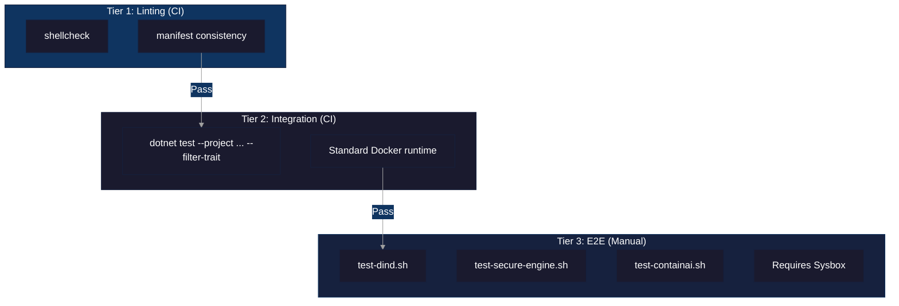

# Testing Guide

This document describes how to run ContainAI tests locally and in CI.

## Test Tiers

ContainAI uses a tiered testing strategy:



### Tier 1: Linting (CI - ubuntu-latest)

Host-side checks that don't require Docker:

```bash
# Shell script linting
shellcheck -x src/*.sh src/lib/*.sh

# Manifest consistency check
dotnet run --project src/cai -- manifest check src/manifests
```

### Tier 2: Integration Tests (CI - ubuntu-latest)

Tests that run against standard Docker runtime:

```bash
# Run all integration tests
dotnet test --project tests/ContainAI.Cli.Tests/ContainAI.Cli.Tests.csproj --configuration Release -- --filter-trait "Category=SyncIntegration" --xunit-info

# Use a pre-built image (CI does this)
IMAGE_NAME="containai:latest" dotnet test --project tests/ContainAI.Cli.Tests/ContainAI.Cli.Tests.csproj --configuration Release -- --filter-trait "Category=SyncIntegration" --xunit-info
```

These tests cover:
- CLI help and basic functionality
- Import dry-run and full sync
- Secret permissions
- Plugin loading
- Symlink handling
- Environment variable import
- Hot-reload and data migration scenarios

### Tier 3: E2E Tests (Manual - requires sysbox)

Full system container tests require sysbox runtime for systemd support. These are not run automatically in CI due to infrastructure requirements.

**Prerequisites:**
- Linux host with sysbox installed
- Docker configured with sysbox-runc runtime

**Running E2E tests:**

```bash
# Verify sysbox is available
docker info --format '{{json .Runtimes}}' | grep -q sysbox-runc

# Run E2E tests (requires sysbox)
./tests/integration/test-dind.sh
./tests/integration/test-secure-engine.sh
./tests/integration/test-containai.sh
```

**Why sysbox is required:**

ContainAI system containers run systemd as PID 1 and support Docker-in-Docker. This requires:
- User namespace isolation
- Nested container support
- procfs/sysfs virtualization

These features are provided by sysbox runtime, not standard runc.

## CI Workflow

The GitHub Actions workflow (`docker.yml`) runs:

1. **lint job**: shellcheck + manifest consistency (always)
2. **build job**: Build Docker images (after lint)
3. **test job**: Integration tests against built image (PRs only)

E2E tests are documented for manual execution on self-hosted infrastructure.

## Test Resource Cleanup

Integration tests use labeled Docker resources for safe cleanup:

- Volumes: `containai.test=1` label, `test-` prefix
- Containers: `containai.test=1` label, `test-` prefix

Resources are automatically cleaned up at test completion. For manual cleanup:

```bash
# Clean up by label (safe)
docker stop $(docker ps -q --filter "label=containai.test=1") 2>/dev/null || true
docker rm $(docker ps -aq --filter "label=containai.test=1") 2>/dev/null || true
docker volume rm $(docker volume ls -q --filter "label=containai.test=1") 2>/dev/null || true
```

## Adding New Tests

When adding tests to the sync integration suite:

1. Add tests to `tests/ContainAI.Cli.Tests/SyncIntegrationTests.cs`
2. Mark each new test with `[Trait("Category", "SyncIntegration")]`
3. Use Docker volume names with random GUID suffixes for isolation
4. Ensure every created volume/container is cleaned up in `finally` blocks
